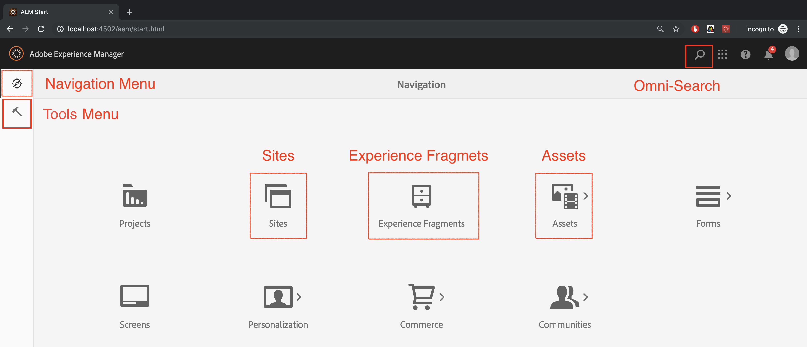

# AEM Sites integreren met Adobe Target

In deze sectie zullen we bespreken hoe we Adobe Experience Manager Sites voor verschillende scenario&#39;s kunnen instellen met Adobe Target. Gebaseerd op uw scenario en organisatorische vereisten.

* **Adobe Target JavaScript-bibliotheek toevoegen (vereist voor alle scenario&#39;s)**
Voor sites die worden gehost op AEM, kunt u doelbibliotheken aan uw site toevoegen met: [Starten](https://experienceleague.adobe.com/docs/experience-platform/tags/home.html). De lancering verstrekt een eenvoudige manier om alle markeringen noodzakelijk om relevante klantenervaringen op te stellen en te beheren.
* **Voeg de Adobe Target-Cloud Servicen toe (vereist voor het scenario Experience Fragments)**
Voor AEM klanten, die de aanbiedingen van het Fragment van de Ervaring willen gebruiken om een activiteit binnen Adobe Target tot stand te brengen, zult u Adobe Target met AEM moeten integreren gebruikend de Verouderde Cloud Servicen. Deze integratie is vereist om Experience Fragments van AEM naar Target te duwen als HTML/JSON aanbiedingen en om de aanbiedingen gelijk te houden met AEM. *Deze integratie is vereist voor de uitvoering van scenario 1.*

## Vereisten

* **Adobe Experience Manager (AEM){#aem}**
   * AEM 6.5 (*Het nieuwste Service Pack wordt aanbevolen*)
   * Download AEM WKND-referentiesite-pakketten
      * [aem-guides-wknd.ui.apps-0.0.1-SNAPSHOT.zip](https://github.com/adobe/aem-guides-wknd/releases/download/archetype-18.1/aem-guides-wknd.ui.apps-0.0.1-SNAPSHOT.zip)
      * [aem-guides-wknd.ui.content-0.0.1-SNAPSHOT.zip](https://github.com/adobe/aem-guides-wknd/releases/download/archetype-18.1/aem-guides-wknd.ui.content-0.0.1-SNAPSHOT.zip)
      * [Kernonderdelen](https://github.com/adobe/aem-core-wcm-components/releases/download/core.wcm.components.reactor-2.5.0/core.wcm.components.all-2.5.0.zip)
      * [Digitale gegevenslaag](assets/implementation/digital-data-layer.zip)

* **Experience Cloud**
   * Toegang tot uw organisaties Adobe Experience Cloud - `https://<yourcompany>.experiencecloud.adobe.com`
   * Experience Cloud voorzien van de volgende oplossingen
      * [Adobe Experience Platform Launch](https://experiencecloud.adobe.com)
      * [Adobe Target](https://experiencecloud.adobe.com)
      * [Adobe I/O-console](https://console.adobe.io)

* **Omgeving**
   * Java 1.8 of Java 11 (alleen AEM 6.5+)
   * Apache Maven (3.3.9 of hoger)
   * Chroom

>[!NOTE]
>
> De klant moet van Experience Platform Launch en Adobe I/O van worden voorzien [Ondersteuning voor Adoben](https://helpx.adobe.com/nl/contact/enterprise-support.ec.html) of reik uit uw systeembeheerder

### AEM instellen{#set-up-aem}

AEM auteur- en publicatieexemplaar is nodig om deze zelfstudie te voltooien. Er wordt een auteurinstantie uitgevoerd op `http://localhost:4502` en publiceer instantie die wordt uitgevoerd `http://localhost:4503`. Zie voor meer informatie: [Een lokale AEM ontwikkelomgeving instellen](https://helpx.adobe.com/experience-manager/kt/platform-repository/using/local-aem-dev-environment-article-setup.html).

#### Instellen AEM auteur- en publicatie-instanties

1. Hiermee wordt een kopie van het dialoogvenster [AEM Quickstart Jar en een licentie.](https://helpx.adobe.com/experience-manager/6-5/sites/deploying/using/deploy.html#GettingtheSoftware)
2. Maak als volgt een mapstructuur op uw computer:
   
3. De naam van de QuickStart-jar wijzigen in `aem-author-p4502.jar` en plaatst deze onder de `/author` directory. Voeg de `license.properties` bestand onder het `/author` directory.
   
4. Maak een kopie van de QuickStart-jar, wijzig de naam ervan in `aem-publish-p4503.jar` en plaatst deze onder de `/publish` directory. Een kopie van het dialoogvenster toevoegen `license.properties` bestand onder het `/publish` directory.
   
5. Dubbelklik op de knop `aem-author-p4502.jar` bestand om de instantie Auteur te installeren. Hierdoor wordt de instantie van de auteur gestart en wordt poort 4502 op de lokale computer uitgevoerd.
6. Meld u aan met de onderstaande referenties. Wanneer de aanmelding met succes is voltooid, gaat u naar het scherm AEM startpagina.
username : **admin**
password : **admin**
   
7. Dubbelklik op de knop `aem-publish-p4503.jar` bestand om een publicatie-instantie te installeren. U kunt een nieuw lusje zien open in uw browser voor uw publicatieinstantie, die op haven 4503 loopt en de WebRetail homepage toont. Wij gebruiken de WKND verwijzingsplaats voor dit leerprogramma en laten de pakketten op auteursinstantie installeren.
8. Ga naar AEM auteur in uw webbrowser op `http://localhost:4502`. Navigeer in het scherm AEM Start naar *[Extra > Implementatie > Pakketten](http://localhost:4502/crx/packmgr/index.jsp)*.
9. Download en upload de pakketten voor AEM (zie hierboven onder) *[Vereisten > AEM](#aem)*)
   * [aem-guides-wknd.ui.apps-0.0.1-SNAPSHOT.zip](https://github.com/adobe/aem-guides-wknd/releases/download/archetype-18.1/aem-guides-wknd.ui.apps-0.0.1-SNAPSHOT.zip)
   * [aem-guides-wknd.ui.content-0.0.1-SNAPSHOT.zip](https://github.com/adobe/aem-guides-wknd/releases/download/archetype-18.1/aem-guides-wknd.ui.content-0.0.1-SNAPSHOT.zip)
   * [core.wcm.components.all-2.5.0.zip](https://github.com/adobe/aem-core-wcm-components/releases/download/core.wcm.components.reactor-2.5.0/core.wcm.components.all-2.5.0.zip)
   * [digital-data-layer.zip](assets/implementation/digital-data-layer.zip)

   >[!VIDEO](https://video.tv.adobe.com/v/28377?quality=12&learn=on)
10. Nadat u de pakketten op AEM Auteur hebt geïnstalleerd, selecteert u elk geüpload pakket in AEM Package Manager en selecteert u **Meer > Repliceren** om ervoor te zorgen dat de pakketten worden geïmplementeerd om te AEM publiceren.
11. U hebt nu de WKND-referentiesite en alle aanvullende pakketten die vereist zijn voor deze zelfstudie geïnstalleerd.

[VOLGENDE HOOFDSTUK](./using-launch-adobe-io.md): In het volgende hoofdstuk integreert u Starten met AEM.
