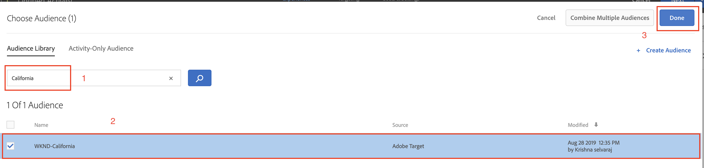

# Personalization gebruikt AEM Experience Fragments en Adobe Target

Met de mogelijkheid om AEM Experience Fragments naar Adobe Target te exporteren als HTML-aanbiedingen, kunt u het gebruiksgemak en de kracht van AEM combineren met krachtige mogelijkheden voor Automated Intelligence (AI) en Machine Learning (ML) in Target om ervaringen op schaal te testen en te personaliseren.

AEM brengt al uw inhoud en middelen in een centrale plaats samen om uw verpersoonlijkingsstrategie te voeden. Met AEM kunt u eenvoudig inhoud voor desktops, tablets en mobiele apparaten op één locatie maken zonder dat u code hoeft te schrijven. Het is niet nodig om pagina&#39;s te maken voor elk apparaat. AEM past automatisch elke ervaring aan met uw inhoud.

Met Doel kunt u gepersonaliseerde ervaringen op schaal bieden op basis van een combinatie van op regels gebaseerde en op AI gebaseerde methoden voor het leren van machines die gedrags-, context- en offlinevariabelen bevatten.  Met Doel kunt u eenvoudig A/B- en MVT-activiteiten (Multivariate) instellen en uitvoeren om de beste aanbiedingen, inhoud en ervaringen te bepalen.

De fragmenten van de ervaring vertegenwoordigen een enorme stap voorwaarts om inhoudmakers met verkopers te verbinden die bedrijfsresultaten drijven gebruikend Doel.

## Overzicht van scenario

De plaats van WKND is van plan om a **SkateFest Uitdaging** over Amerika door hun website aan te kondigen en zou hun plaatsgebruikers willen hebben omhoog voor de audio ondertekenen die in elke staat wordt geleid. Als teller, bent u de taak toegewezen om een campagne op de WKND homepage van de plaats in werking te stellen, met banners berichten relevant voor de plaats van de gebruikers en een verbinding aan de pagina van gebeurtenisdetails. Laten we de homepage van de WKND-site verkennen en leren hoe we een persoonlijke ervaring voor een gebruiker kunnen maken en leveren op basis van zijn/haar huidige locatie.

### Betrokken gebruikers

Voor deze oefening, moeten de volgende gebruikers worden betrokken en om sommige taken uit te voeren u administratieve toegang zou kunnen vereisen.

* **de Producent van de Inhoud/de Redacteur van de Inhoud** (Adobe Experience Manager)
* **Marketer** (het Team van Adobe Target / van de Optimalisering)

### Vereisten

* **AEM**
   * [&#x200B; AEM auteur en publiceer instantie &#x200B;](./implementation.md#getting-aem) lopend op localhost 4502 en 4503.
* **Experience Cloud**
   * Toegang tot uw organisaties Adobe Experience Cloud - `https://<yourcompany>.experiencecloud.adobe.com`
   * Experience Cloud voorzien van de volgende oplossingen
      * [&#x200B; Adobe Target &#x200B;](https://experiencecloud.adobe.com)

### Startpagina WKND-site

1. Marketer initieert de WKND SkateFest campagnegatie met AEM Content Editor en geeft details over de vereisten.
   * ***Vereiste***: Bevestig de campagne van WKND SkateFest op WKND plaats homepage met gepersonaliseerde inhoud voor bezoekers van elke staat in de Verenigde Staten. Voeg een nieuw inhoudsblok onder de carrousel van de Homepagina toe met een achtergrondafbeelding, tekst en een knop.
      * **Achtergrondbeeld**: Het beeld zou voor de staat relevant moeten zijn waarvan de gebruiker de pagina van de Plaats WKND bezoekt.
      * **Tekst**: &quot;Teken omhoog voor de Auditions&quot;
      * **Knoop**: &quot;De Details van de Gebeurtenis&quot;richtend aan de Pagina van WKND SkateFest
      * **WKND SkateFest Pagina**: een nieuwe pagina met gebeurtenisdetails, met inbegrip van de auditieplaats, datum, en tijd.
1. Op basis van de vereisten maakt AEM Content Editor een Experience Fragment voor het inhoudsblok en exporteert het als een voorstel naar Adobe Target. Om gepersonaliseerde inhoud voor alle staten in de Verenigde Staten te dienen, kan de inhoudontwerper één hoofdvariatie van het Fragment van de Ervaring tot stand brengen en dan 50 andere variaties, één voor elke staat creëren. Inhoud voor elke statusvariatie met relevante afbeeldingen en tekst kan vervolgens handmatig worden bewerkt. Bij het ontwerpen van een Experience Fragment hebben inhoudseditors via de optie Asset Finder snel toegang tot alle elementen die in AEM Assets beschikbaar zijn. Wanneer een Experience Fragment naar Adobe Target wordt geëxporteerd, worden alle variaties ook als aanbiedingen naar Adobe Target verschoven.

1. Nadat het Fragment van de Ervaring van AEM naar Adobe Target als Voorstellen, kunnen de marketers tot Activiteiten in Doel leiden gebruikend deze Voorstellen. Op basis van de WKND-campagne SkateFest-site moet de marketeter een persoonlijke ervaring maken en leveren aan bezoekers van de WKND-site vanuit elke staat. Om een Ervaring tot stand te brengen richtend activiteit, moet de marktmeter het publiek identificeren. Voor onze WKND SkateFest-campagne moeten we 50 verschillende soorten publiek maken, gebaseerd op hun locatie waar ze de WKND-website bezoeken.
   * [&#x200B; Soorten publiek &#x200B;](https://experienceleague.adobe.com/docs/target/using/introduction/target-key-concepts.html?lang=nl-NL#section_3F32DA46BDF947878DD79DBB97040D01) bepaalt het doel voor uw activiteit en gebruikt overal waar het richten beschikbaar is. Doelpubliek is een gedefinieerde set bezoekerscriteria. Aanbiedingen kunnen worden gericht op specifieke doelgroepen (of segmenten). Alleen bezoekers die bij dat publiek horen, zien de ervaring die voor hen is bedoeld.  U kunt bijvoorbeeld een aanbieding doen aan een publiek dat is samengesteld uit bezoekers die een bepaalde browser gebruiken of van een specifieke geo-locatie.
   * Een [&#x200B; Aanbieding &#x200B;](https://experienceleague.adobe.com/docs/target/using/introduction/target-key-concepts.html?lang=nl-NL#section_973D4CC4CEB44711BBB9A21BF74B89E9) is de inhoud die op uw webpagina&#39;s tijdens campagnes of activiteiten wordt getoond. Wanneer u uw webpagina&#39;s test, meet u het succes van elke ervaring met verschillende aanbiedingen op uw locaties. Een voorstel kan verschillende typen inhoud bevatten, zoals:
      * Afbeelding
      * Tekst
      * **HTML**
         * *de Aanbiedingen van de HTML worden gebruikt voor de Activiteit van dit scenario*
      * Koppeling
      * Knop

## Activiteiten van de inhoudseditor

>[!VIDEO](https://video.tv.adobe.com/v/28596?quality=12&learn=on)

>[!NOTE]
>
>Publish het Experience Fragment voordat u het exporteert naar Adobe Target.

## Marktactiviteiten

### Een publiek maken met geo-gerichte {#marketer-audience}

1. Ga aan uw organisaties [&#x200B; Adobe Experience Cloud &#x200B;](https://experiencecloud.adobe.com/) (`<https://<yourcompany>.experiencecloud.adobe.com`)
1. Meld u aan met uw Adobe ID en zorg ervoor dat u zich in de juiste organisatie bevindt.
1. Van de oplossingsschakelaar, klik op **Doel** en dan **lanceer** Adobe Target.

   

1. Navigeer aan de **Aanbiedingen** tabel en onderzoek naar &quot;WKND&quot;aanbiedingen. U moet de lijst met Experience Fragments-variaties kunnen bekijken, geëxporteerd van AEM als HTML-aanbiedingen. Elke aanbieding komt overeen met een status. Bijvoorbeeld, *WKND SkateFest Californië* is de aanbieding die aan een bezoeker van de Plaats WKND van Californië wordt gediend.

   

1. Van de belangrijkste navigatie, klik op **Soorten publiek**.

   Een Marketer moet 50 verschillende soorten publiek creëren voor bezoekers van de WKND-site die uit elk land in de Verenigde Staten van Amerika komen.

1. Om een publiek tot stand te brengen, klik op **creeer de knoop van het Publiek**, en verstrek een naam voor uw publiek.

   **het formaat van de Naam van het publiek: WKND - \&lt; *staat* \>**

   

1. Klik **toevoegen Regel > Geo**.
1. Klik **Uitgezocht**, dan selecteer één van de volgende opties:
   * Land
   * **Staat** *(Uitgezochte Staat voor de Campagne van SkateFest van de Plaats WKND)*
   * Plaats
   * Postcode
   * Breedte
   * Lengtegraad
   * DMA
   * Mobiele vervoerder

   **Geo** - Gebruik publiek aan doelgebruikers die op hun geografische plaats, met inbegrip van hun land, staat/provincie, stad, postcode, DMA, of mobiele drager worden gebaseerd. Met Geolocation-parameters kunt u activiteiten en ervaringen richten op basis van de geografie van uw bezoekers. Dit gegeven wordt verzonden met elk verzoek van het Doel en is gebaseerd op het IP van de bezoeker adres. Selecteer deze parameters net als alle doelwaarden.

   >[!NOTE]
   >IP van een bezoeker adres wordt overgegaan met een brievenbusverzoek, eens per bezoek (zitting), om geo richtende parameters voor die bezoeker op te lossen.

1. Selecteer de exploitant als **gelijken**, een aangewezen waarde (bijvoorbeeld: Californië) verstrekken en **sparen** uw veranderingen. Geef in ons geval de naam van het frame op.

   

   >[!NOTE]
   >U kunt veelvoudige regels hebben die aan een publiek worden toegewezen.

1. Herhaal stap 6-9 om een publiek voor de andere staten te maken.

   

Op dit moment hebben we met succes een publiek gemaakt voor alle bezoekers van de WKND-site in verschillende staten in de Verenigde Staten van Amerika en hebben we ook het overeenkomstige aanbod van HTML voor elke staat. Laten we nu een Experience Targeting-activiteit maken om het publiek te richten op een overeenkomstige aanbieding voor de startpagina van de WKND-site.

### Een activiteit maken met Geo-gerichte

1. Van uw venster van Adobe Target, navigeer aan **Activiteiten** tabel.
1. Klik **creeer Activiteit** en selecteer de **Ervaring richtend** activiteitstype.
1. Selecteer het **kanaal van het 0&rbrace; Web &lbrace;en kies** Visuele Composer van de Ervaring **.**
1. Ga **Activiteit URL** in en klik **daarna** om de Visuele Composer van de Ervaring te openen.

   WKND-startpagina Publish-URL: http://localhost:4503/content/wknd/en.html

   

1. Voor **Visuele Composer van de Ervaring** om te laden, laat **toe Lading Onveilige manuscripten** op uw browser en herlaad uw pagina.

   

1. Merk op de WKND homepage van de Plaats open in de redacteur van Composer van de Visuele Ervaring.

   

1. Om een publiek aan uw VEC toe te voegen, klik op **Toevoeging Ervaring richtend** onder Soorten publiek, en selecteer het publiek WKND-Californië en klik **daarna**.

   

1. Klik op de WKND plaatspagina binnen VEC, selecteer het element van de HTML om de aanbieding voor publiek WKND-Californië toe te voegen, en kies **Vervangen met** optie en dan de **Aanbieding van de HTML** selecteren.

   

1. Selecteer de **WKND SkateFest Californië** aanbieding van de HTML voor het **WKND-Californië** publiek van de aanbieding uitgezochte UI en klik **Gedaan**.
1. U zou nu de **WKND SkateFest Californië** HTML die aanbieding moeten kunnen zien aan uw WKND pagina van de Plaats voor het publiek WKND-Californië wordt toegevoegd.
1. Herhaal stap 7-10 om de Ervaring toe te voegen die voor de andere staten richt en de overeenkomstige Aanbieding van de HTML te kiezen.
1. Klik **daarna** om verder te gaan, en u kunt een afbeelding voor Soorten publiek aan Ervaringen zien.
1. Klik **daarna** om aan Doelen en Montages te bewegen.
1. Kies uw rapporteringsbron en identificeer een primair doel voor uw activiteit. Voor ons Scenario, laten wij de Rapporterende Source als **Adobe Target** selecteren, die activiteit als **Omzetting** meten, actie zoals bekeken een pagina, en URL die aan de pagina van de Details WKND SkateFest richten.

   

   >[!NOTE]
   >U kunt ook Adobe Analytics kiezen als rapportagebron.

1. Beweeg over de huidige activiteitennaam, en u kunt het anders noemen aan **WKND SkateFest - V.S.**, en dan **sparen en sluit** uw veranderingen.
1. Van het scherm van de Details van de Activiteit, zorg ervoor **activeer** uw activiteit.

   

1. Uw WKND SkateFest-campagne is nu live voor alle bezoekers van de WKND-site.
1. Navigeer aan de [&#x200B; WebND Pagina van het Huis van de Plaats &#x200B;](http://localhost:4503/content/wknd/en.html), en u zou de WKND die Aanbieding moeten kunnen zien SkateFest van uw geo-plaats wordt gebaseerd (*staat: Californië*).

   

### Doelactiviteit QA

1. Onder **Details van de Activiteit > het Overzicht** lusje, klik op de **QA van de Activiteit** knoop, en u kunt de directe verbinding QA aan al uw ervaringen krijgen.

   

1. Navigeer aan de [&#x200B; WebND Pagina van het Huis van de Plaats &#x200B;](http://localhost:4503/content/wknd/en.html), en u zou de WKND die Aanbieding moeten kunnen zien SkateFest van uw geo-plaats (staat) wordt gebaseerd.
1. Bekijk de onderstaande video om te begrijpen hoe een aanbieding op uw pagina wordt geleverd, hoe u de reactietkens kunt aanpassen en hoe u een kwaliteitscontrole kunt uitvoeren.

>[!VIDEO](https://video.tv.adobe.com/v/28658?quality=12&learn=on)

## Samenvatting

In dit hoofdstuk, kon een inhoudsredacteur al inhoud tot stand brengen om de campagne WKND SkateFest binnen Adobe Experience Manager te steunen en het naar Adobe Target als Aanbiedingen van de HTML uit te voeren, voor het creëren van de Gerichte Ervaring, die van gebruikers wordt gebaseerd.
