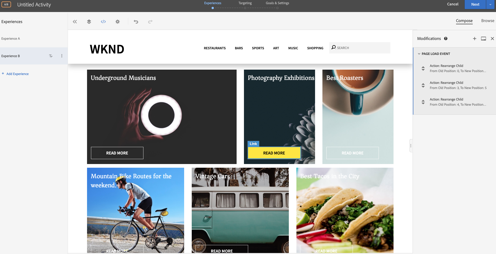

# Personalisatie met behulp van Visual Experience Composer

In dit hoofdstuk, zullen wij het creëren van ervaringen gebruikend **Visual Experience Composer** door te slepen en te laten vallen, de lay-out en de inhoud van een Web-pagina van binnen Doel te ruilen.

## Overzicht van scenario

De WKND-homepage geeft lokale activiteiten weer of het beste wat je kunt doen rond een stad in de vorm van kaartlay-outs. Als markator, bent u de taak toegewezen om de homepage te wijzigen, door de kaartlay-outs te herschikken om te zien hoe het gebruikersbetrokkenheid beïnvloedt en omzetting drijft.

### Betrokken gebruikers

Voor deze oefening, moeten de volgende gebruikers worden betrokken en om sommige taken uit te voeren u administratieve toegang zou kunnen vereisen.

* **Content Producer/Content Editor**  (Adobe Experience Manager)
* **Marketer**  (Adobe Target/Optimization Team)

### Startpagina WKND-site


### Vereisten

* **AEM**
   * [AEM publiceer ](./implementation.md#getting-aem) instormsessies op 4503
   * [AEM geïntegreerd met Adobe Target met Adobe Experience Platform Launch](./using-launch-adobe-io.md#aem-target-using-launch-by-adobe)
* **Experience Cloud**
   * Toegang tot uw organisaties Adobe Experience Cloud - <https://>`<yourcompany>`.ExperienceCloud.adobe.com
   * Experience Cloud voorzien van [Adobe Target](https://experiencecloud.adobe.com)

## Marktactiviteiten

1. De Marketer maakt een A/B-doelactiviteit in Adobe Target.
   1. Navigeer vanuit uw Adobe Target-venster naar **Activiteiten** tabblad.
   2. Klik op **Activiteit maken** en selecteer het type activiteit als **A/B Test**

      
   3. Selecteer het **Web** kanaal en kies **Visual Experience Composer**.
   4. Voer de **Activiteit-URL** in en klik **Volgende** om de Visual Experience Composer te openen.
      
   5. Als u **Visual Experience Composer** wilt laden, schakelt u **Onveilige scripts laden** op uw browser toestaan in en laadt u de pagina opnieuw.
      
   6. Merk op de WKND homepage van de Plaats open in de redacteur van Composer van de Visuele Ervaring.
      
   7. **De ervaring** verstrekt de standaardWKND Homepage, en laten wij de inhoudslay-out voor  **Ervaring B** uitgeven.
      
   8. Klik op een van de kaartlay-outcontainers (*Beste roasters*) en selecteer **Herschikken** optie.
      
   9. Klik op de container die u opnieuw wilt rangschikken en sleep deze naar de gewenste locatie. Laten wij de *Beste container Roasters* van 1e rij 1st kolom aan 1e rij 3de kolom opnieuw rangschikken. De *Best Roasters*-container komt nu naast de container *Photography Exhiisions*.
      

      **Na omwisselen**
      
   10. Op dezelfde manier wijzigt u de rangschikking van posities voor de andere kaartcontainers.
      
   11. Voeg ook een koptekst toe onder de carrouselcomponent en boven de kaartlay-out.
   12. Klik op de carrouselcontainer en selecteer de optie **Inzet na > HTML** om HTML toe te voegen.
      

      ```html
      <h1 style="text-align:center">Check Out the Hot Spots in Town</h1>
      ```

      
   13. Klik **Volgende** om door te gaan met uw activiteit.
   14. Selecteer **Verkeerstoewijzingsmethode** als handmatige methode en wijs 100% verkeer toe aan **Experience B**.
      
   15. Klik op **Next**.
   16. Verstrek **Goal Metrics** voor uw Activiteit en sparen en sluit uw Test A/B.
      
   17. Geef een naam (**WKND-startpagina vernieuwen**) op voor uw activiteit en sla uw wijzigingen op.
   18. Van het scherm van de Details van de Activiteit, zorg ervoor om **uw activiteit te activeren**.
      
   19. Navigeer naar de startpagina van WKND (http://localhost:4503/content/wknd/en.html) en u merkt de wijzigingen die we hebben toegevoegd aan de testactiviteit A/B van de WKND-startpagina vernieuwen.
      
   20. Open uw browser console, en inspecteer het netwerklusje om doelreactie voor de Pagina van het Huis te zoeken WKND verfrist A/B de activiteit van de Test van de Pagina A/B.
      

## Samenvatting

In dit hoofdstuk, kon een teller een ervaring tot stand brengen gebruikend Visual Experience Composer door te slepen en neer te zetten, de lay-out en de inhoud van een Web-pagina te ruilen zonder enige code te veranderen om een test in werking te stellen.
