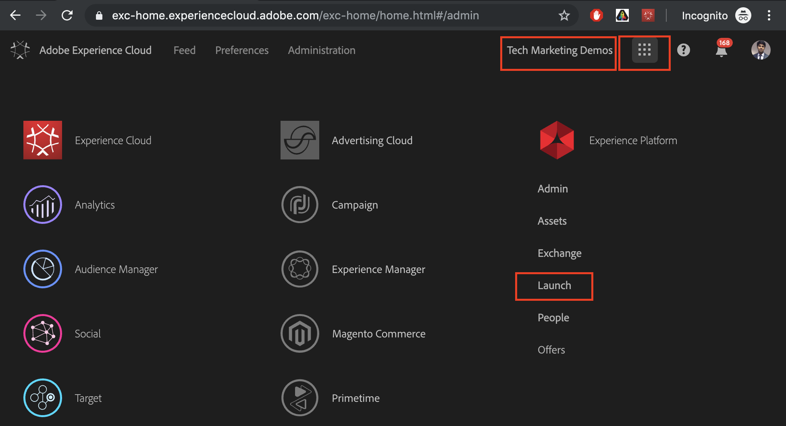
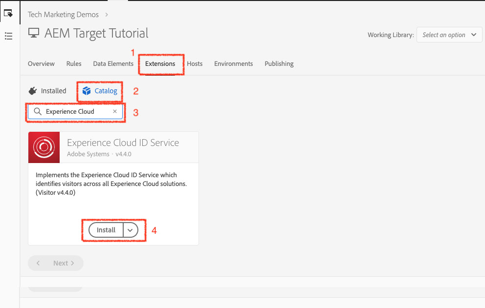

# Adobe Experience Platform Launch gebruiken via Adobe Developer Console

## Vereisten

* [AEM auteur- en publicatieexemplaar](./implementation.md#set-up-aem) uitvoeren op respectievelijk localhost-poort 4502 en 4503
* **Experience Cloud**
   * Toegang tot uw organisaties Adobe Experience Cloud - `https://<yourcompany>.experiencecloud.adobe.com`
   * Experience Cloud met de volgende oplossingen
      * [Adobe Experience Platform Launch](https://experiencecloud.adobe.com)
      * [Adobe Target](https://experiencecloud.adobe.com)
      * [Adobe Developer Console](https://developer.adobe.com/console/)

     >[!NOTE]
     >U moet over de juiste machtigingen beschikken om in Launch omgevingen te ontwikkelen, goed te keuren, te publiceren, te beheren en te beheren. Als u geen van deze stappen kunt uitvoeren omdat de gebruikersinterfaceopties niet beschikbaar zijn, vraagt u de beheerder van het Experience Cloud om toegang. Voor meer informatie over de toestemmingen van de Lancering, [zie de documentatie](https://experienceleague.adobe.com/docs/experience-platform/tags/admin/user-permissions.html).

* **Browserplug-ins**
   * Adobe Experience Cloud Debugger ([Chroom](https://chrome.google.com/webstore/detail/adobe-experience-platform/bfnnokhpnncpkdmbokanobigaccjkpob))
   * Starten en DTM-switch ([Chroom](https://chrome.google.com/webstore/detail/launch-and-dtm-switch/nlgdemkdapolikbjimjajpmonpbpmipk))

## Betrokken gebruikers

Voor deze integratie, moet het volgende publiek worden betrokken, en om sommige taken uit te voeren, zou u administratieve toegang kunnen nodig hebben.

* Developer
* AEM
* Beheerder Experience Cloud

## Inleiding

AEM biedt een out of the box integratie met Experience Platform Launch. Deze integratie staat AEM beheerders toe om Experience Platform Launch via een makkelijk te gebruiken interface gemakkelijk te vormen, daardoor verminderend het niveau van inspanning en aantal fouten, wanneer het vormen van deze twee hulpmiddelen. En door Adobe Target-extensie toe te voegen aan Experience Platform Launch, kunnen we alle functies van Adobe Target op de AEM webpagina(&#39;s) gebruiken.

In deze sectie zouden de volgende integratiestappen worden behandeld:

* Starten
   * Een opstarteigenschap maken
   * Doelextensie toevoegen
   * Een gegevenselement maken
   * Een paginalijn maken
   * Installatieomgevingen
   * Samenstellen en publiceren
* AEM
   * Een Cloud Service maken
   * Maken

### Starten

#### Een opstarteigenschap maken

Een eigenschap is een container die u vult met extensies, regels, gegevenselementen en bibliotheken wanneer u tags op uw site implementeert.

1. Ga naar uw organisaties [Adobe Experience Cloud](https://experiencecloud.adobe.com/) (`https://<yourcompany>.experiencecloud.adobe.com`)
2. Meld u aan met uw Adobe ID en zorg ervoor dat u zich in de juiste organisatie bevindt.
3. Klik vanuit de oplossingsschakelaar op **Starten** en selecteert u vervolgens de **Ga naar starten** knop.

   

4. Zorg ervoor u in de juiste organisatie bent en ga dan met het creëren van een bezit van de Lancering te werk.
   

   *Zie voor meer informatie over het maken van eigenschappen [Een eigenschap maken](https://experienceleague.adobe.com/docs/experience-platform/tags/admin/companies-and-properties.html?lang=en#create-or-configure-a-property) in de productdocumentatie.*
5. Klik op de knop **Nieuwe eigenschap** knop
6. Geef een naam op voor uw eigenschap (bijvoorbeeld *Zelfstudie AEM*)
7. Als domein voert u *localhost.com* aangezien dit het domein is waar de WKND demo plaats loopt. Hoewel de &#39;*Domein*&#39; wordt vereist, werkt het bezit van de Lancering aan om het even welk domein waar het wordt uitgevoerd. Het primaire doel van dit gebied is menuopties in de Bouwer van de Regel vooraf in te vullen.
8. Klik op de knop **Opslaan** knop.

   

9. Open de eigenschap die u zojuist hebt gemaakt en klik op het tabblad Extensies.

#### Doelextensie toevoegen

De Adobe Target-extensie ondersteunt client-side implementaties met Target JavaScript SDK voor het moderne web. `at.js`. Klanten die nog steeds gebruikmaken van de oudere bibliotheek van Target, `mbox.js`, [moet worden bijgewerkt naar at.js](https://experienceleague.adobe.com/docs/target-dev/developer/client-side/at-js-implementation/upgrading-from-atjs-1x-to-atjs-20.html) om Launch te gebruiken.

De doelextensie bestaat uit twee hoofdonderdelen:

* De extensieconfiguratie die de kernbibliotheekinstellingen beheert
* Handelingen van de regel om het volgende te doen:
   * Doel laden (at.js)
   * Params toevoegen aan alle vakken
   * Params toevoegen aan Global Mbox
   * Globale standaardmap

1. Onder **Extensies** kunt u de lijst met extensies zien die al zijn geïnstalleerd voor de eigenschap Launch. ([Experience Platform Launch Core-uitbreiding](https://exchange.adobe.com/apps/ec/100223/adobe-launch-core-extension) is standaard geïnstalleerd)
2. Klik op de knop **Extensiecatalogus** en zoek naar Doel in het filter.
3. Selecteer de nieuwste versie van Adobe Target om.js en klik op **Installeren** -optie.
   

4. Klikken op **Configureren** en u ziet het configuratievenster met de ingevoerde referenties van uw Target-account en de versie at.js voor deze extensie.
   

   Wanneer Doel wordt geïmplementeerd via asynchrone insluitcodes voor Starten, moet u een voorverborgen fragment op uw pagina&#39;s vóór de insluitcodes voor Starten hard coderen om het flikkeren van de inhoud te beheren. We zullen later meer leren over de voorverborgen snipper. U kunt het voorverborgen fragment downloaden [hier](assets/using-launch-adobe-io/prehiding.js)

5. Klikken **Opslaan** om het toevoegen van de uitbreiding van het Doel aan uw bezit van de Lancering te voltooien, en u zou nu de uitbreiding moeten kunnen zien van het Doel onder **Geïnstalleerd** lijst met extensies.

6. Herhaal bovenstaande stappen om te zoeken naar de extensie &quot;Experience Cloud-id-service&quot; en installeer deze.
   

#### Installatieomgevingen

1. Klik op de knop **Omgeving** voor uw site-eigenschap en u kunt de lijst met omgevingen zien die voor uw site-eigenschap worden gemaakt. Standaard hebben we elk één instantie gemaakt voor ontwikkeling, staging en productie.

#### Samenstellen en publiceren

1. Klik op de knop **Publiceren** tabblad voor uw site-eigenschap. Laten we een bibliotheek maken om onze wijzigingen (gegevenselementen, regels) op te bouwen en in te voeren in een ontwikkelomgeving.
   >[!VIDEO](https://video.tv.adobe.com/v/28412?quality=12&learn=on)
2. Publiceer uw veranderingen van de Ontwikkeling aan een het Opvoeren milieu.
   >[!VIDEO](https://video.tv.adobe.com/v/28419?quality=12&learn=on)
3. Voer de **Optie Samenstellen voor stapelen**.
4. Zodra de bouwstijl volledig is, looppas **Goedkeuren voor publicatie**, die uw wijzigingen verplaatst van een testomgeving naar een productieomgeving.
   
5. Als laatste voert u de **Samenstellen en publiceren voor productie** om uw wijzigingen in de productie door te voeren.
   

### Adobe Experience Manager

>[!VIDEO](https://video.tv.adobe.com/v/28416?quality=12&learn=on)

>[!NOTE]
>
> De Adobe Developer-integratie toegang geven tot geselecteerde werkruimten met de juiste [rol om een centraal team toe te staan API-gedreven veranderingen in slechts een paar werkruimten aan te brengen](https://experienceleague.adobe.com/docs/target/using/administer/manage-users/enterprise/configure-adobe-io-integration.html).

1. Maak IMS-integratie in AEM met behulp van referenties van Adobe Developer. (01:12 t/m 03:55)
2. Maak in Experience Platform Launch een eigenschap. (gedekt [boven](#create-launch-property))
3. Gebruikend de integratie IMS van Stap 1, creeer Experience Platform Launch integratie om uw bezit van de Lancering in te voeren.
4. Wijs in AEM de integratie van het Experience Platform Launch aan een plaats toe gebruikend browser configuratie. (05:28 t/m 06:14)
5. Integratie handmatig valideren. (06:15 t/m 06:33)
6. Insteekmodule starten/DTM-browser gebruiken. (06:34 t/m 06:50)
7. Adobe Experience Cloud Debugger-browserplug-in gebruiken. (06:51 t/m 07:22)

U hebt nu de [AEM met Adobe Target met Adobe Experience Platform Launch](./using-aem-cloud-services.md#integrating-aem-target-options) zoals beschreven in Optie 1.

Voor het gebruiken van AEM de aanbiedingen van het Fragment van de Ervaring om u verpersoonlijkingsactiviteiten te drijven, laat aan het volgende hoofdstuk verdergaan, en AEM met Adobe Target integreren gebruikend de erfeniswolkendiensten.
