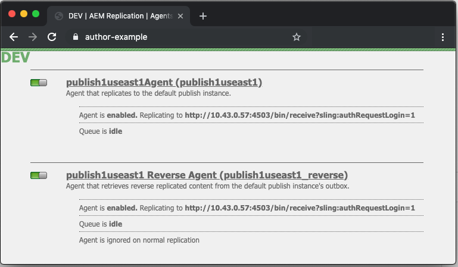
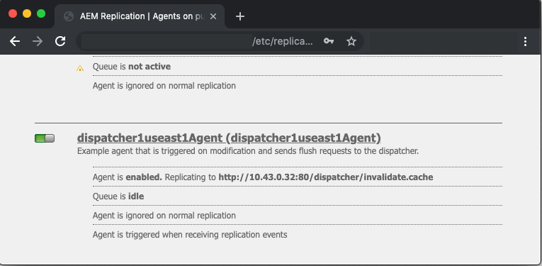
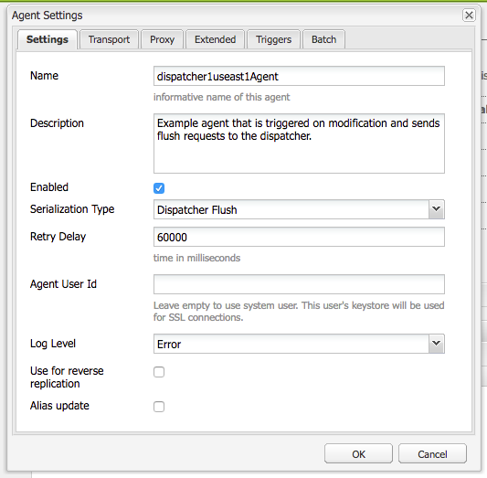
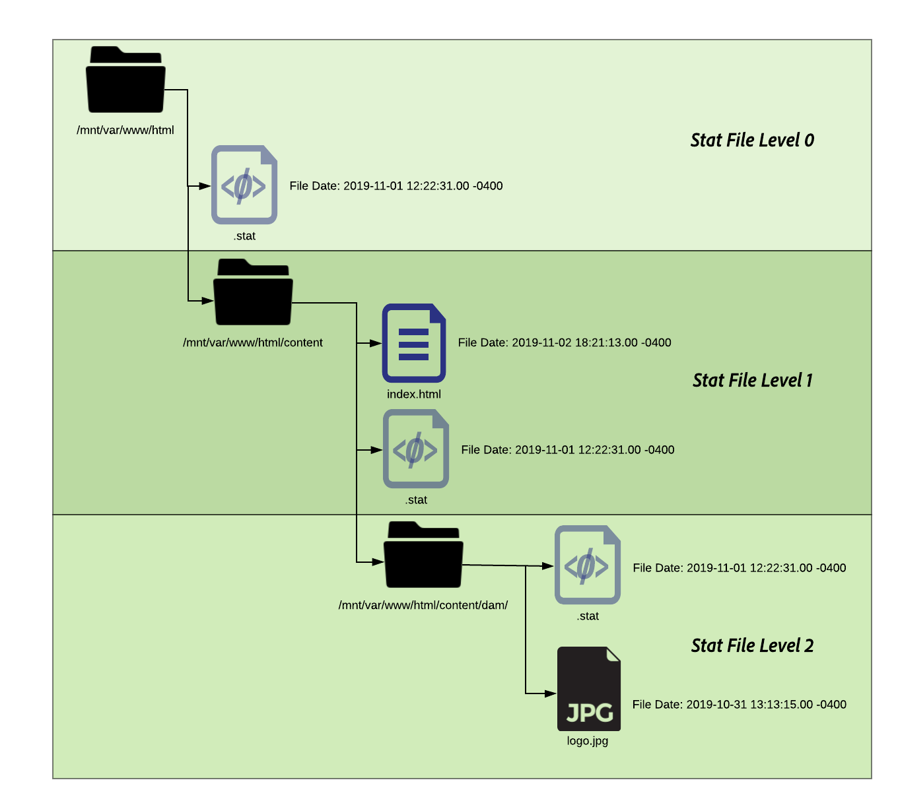

# URL&#39;s van waarheidsgetrouwheid van afzender

[Inhoudsopgave](./overview.md)

[&lt;- Vorige: Variabelen gebruiken en begrijpen](./variables.md)

In dit document wordt uitgelegd hoe flushing optreedt en wordt uitgelegd hoe het leegmaken en de ongeldigmaking van de cache worden uitgevoerd.


## Hoe werkt het

### Bewerkingsvolgorde

De typische werkstroom wordt het best beschreven wanneer de inhoudsauteurs een pagina zullen activeren, wanneer de uitgever de nieuwe inhoud ontvangt het een spoelverzoek aan de Dispatcher zoals aangetoond in het volgende diagram teweegbrengt:

Deze ketting van gebeurtenissen, benadrukt dat wij slechts punten spoelen wanneer zij nieuw of veranderd zijn.  Dit zorgt ervoor dat de inhoud door de uitgever vóór het ontruimen van het geheime voorgeheugen is ontvangen om rasvoorwaarden te vermijden waar het bloeden kon voorkomen alvorens de veranderingen van uitgever kunnen worden opgepikt.

## Replication Agents

Op auteur is er een replicatieagent die wordt gevormd om bij de uitgever te wijzen dat wanneer iets wordt geactiveerd het teweegbrengt om het dossier en alle gebiedsdelen van het naar de uitgever te verzenden.

Wanneer de uitgever het dossier ontvangt heeft het een replicatieagent die wordt gevormd om bij de Dispatcher te richten die op de gebeurtenis tereceive teweegbrengt.  Vervolgens serialiseert het programma een aanvraag om het leegmaken en plaatst het dit op de Dispatcher.

### AUTEURREPLICATIE-AGENT

Hier zijn sommige voorbeeldschermafbeeldingen van een gevormde standaardreplicatieagent


Er zijn typisch 1 of 2 replicatieagenten die op de auteur voor elke uitgever worden gevormd zij inhoud aan repliceren.

Eerst is de standaard replicatieagent die inhoudsactivering aan duwt.

Ten tweede is de reverse agent.  Dit is optioneel en is ingesteld om elke uitgever te controleren om na te gaan of er nieuwe inhoud is die in de auteur kan worden opgenomen als een omgekeerde replicatieactiviteit

### REPLICATIE-AGENT VOOR PUBLICATIE

Hier is een voorbeeld screenshots van een gevormde standaard flush replicatieagent


### VERZENDT FLUSH-REPLICATIE DIE VIRTUELE HOST ONTVANGT

De module van de Verzender zoekt bijzondere kopballen om te weten wanneer een verzoek van de POST iets is om tot AEM over te gaan teruggeeft of als het als een spoelverzoek in series wordt vervaardigd en door de manager van de Verzender zelf moet worden behandeld.

Hier is een schermafbeelding van de configuratiepagina met deze waarden:


De standaardinstellingspagina toont de `Serialization Type` als `Dispatcher Flush` en stelt het foutniveau in


Op de `Transport` die u kunt zien `URI` die worden geplaatst om het IP adres van de Dispatcher te richten die de spoelverzoeken zal ontvangen.  Het pad `/dispatcher/invalidate.cache` is niet hoe de module bepaalt als het een flush is het slechts een duidelijk eindpunt is u in het toegangslogboek kunt zien om het te weten een flush verzoek was.  Op de `Extended` -tabblad gaan we door de dingen die er zijn om te kwalificeren dat dit een aanvraag is om de Dispatcher-module leeg te maken.


De `HTTP Method` voor spoelverzoeken is slechts een `GET` aanvraag met enkele speciale aanvraagheaders:
- CQ-actie
   - Dit gebruikt een AEM variabele die op het verzoek wordt gebaseerd en de waarde is typisch *activeren of verwijderen*
- CQ-handler
   - Dit gebruikt een AEM variabele die op het verzoek wordt gebaseerd en de waarde is typisch de volledige weg aan het punt dat bijvoorbeeld wordt gespoeld `/content/dam/logo.jpg`
- CQ-pad
   - Dit gebruikt een AEM variabele die op het verzoek wordt gebaseerd en de waarde is typisch de volledige weg aan het punt dat wordt gespoeld bijvoorbeeld `/content/dam`
- Host
   - Dit is waar de `Host` Koptekst krijgt spoofd om een specifiek item als doel in te stellen `VirtualHost` die is geconfigureerd op de Apache-webserver van de verzender (`/etc/httpd/conf.d/enabled_vhosts/aem_flush.vhost`).  Het is een harde gecodeerde waarde die overeenkomt met een item in het dialoogvenster `aem_flush.vhost` bestand `ServerName` of `ServerAlias`


Op de `Triggers` tab nemen we nota van de schakelbare triggers die we gebruiken en wat ze zijn

- `Ignore default`
   - Dit wordt toegelaten zodat wordt de replicatieagent niet teweeggebracht op een paginaactivering.  Dit is iets dat wanneer een auteursinstantie een verandering in een pagina zou aanbrengen een flush zou teweegbrengen.  Omdat dit een uitgever is die wij niet van dat type van gebeurtenis willen teweegbrengen.
- `On Receive`
   - Wanneer een nieuw bestand wordt ontvangen, willen we een uitlijneffect activeren.  Dus wanneer de auteur ons een bijgewerkt bestand stuurt, wordt een aanvraag voor uitspoelen geactiveerd en verzonden naar Dispatcher.
- `No Versioning`
   - We controleren dit om te voorkomen dat de uitgever nieuwe versies genereert omdat er een nieuw bestand is ontvangen.  We vervangen gewoon het bestand dat we hebben en vertrouwen erop dat de auteur de versies bijhoudt in plaats van de uitgever.

Als we nu bekijken hoe een typisch uitlijningsverzoek eruit ziet in de vorm van een `curl` command

```
$ curl \ 
-H "CQ-Action: Activate" \ 
-H "CQ-Handle: /content/dam/logo.jpg" \ 
-H "CQ-Path: /content/dam/" \ 
-H "Content-Length: 0" \  
-H "Content-Type: application/octect-stream" \ 
-H "Host: flush" \ 
http://10.43.0.32:80/dispatcher/invalidate.cache
```

Met dit uitlijnvoorbeeld wordt het `/content/dam` pad door het bijwerken `.stat` in die map.

## De `.stat` file

Het spoelmechanisme is eenvoudig van aard en wij willen het belang van het `.stat` bestanden die worden gegenereerd in de hoofdmap van het document waar de cachebestanden worden gemaakt.

Binnen de `.vhost` en `_farm.any` bestanden die we configureren, geven een basisinstructie voor het document op waar de cache zich bevindt en waar de bestanden moeten worden opgeslagen / opgeslagen wanneer een aanvraag van een eindgebruiker wordt ontvangen.

Als u het volgende bevel op uw server van de Verzender in werking zou stellen zou u beginnen vinden `.stat` bestanden

```
$ find /mnt/var/www/html/ -type f -name ".stat"
```

Hier is een diagram van hoe deze dossierstructuur eruit zal zien wanneer u punten in het geheime voorgeheugen hebt en een spoelverzoek hebben die door de module van de Verzender wordt verzonden en wordt verwerkt



### BESTANDSNIVEAU STATEN

In elke map was er een `.stat` bestand aanwezig.  Dit is een indicator die een spoeling heeft plaatsgevonden.  In het voorbeeld boven het `statfilelevel` instellen op `3` binnen het overeenkomstige dossier van de landbouwbedrijfconfiguratie.

De `statfilelevel` instellen geeft aan hoeveel mappen de module kan doorlopen en bijwerken `.stat` bestand.  Het .stat-bestand is leeg en is alleen een bestandsnaam met een datestamp en kan zelfs handmatig worden gemaakt, maar met de aanraakopdracht op de opdrachtregel van de Dispatcher-server.

Als de instelling voor het eerste bestandsniveau te hoog is, doorloopt elke aanvraag voor uitspoelen de mapstructuur die de statusbestanden aanraakt.  Dit kan een grote prestatiesklap op grote geheim voorgeheugenbomen worden en kan de algemene prestaties van uw Dispatcher beïnvloeden.

Als u dit bestandsniveau te laag instelt, kan een aanvraag voor uitspoelen ertoe leiden dat er meer wordt gewist dan u had bedoeld.  Wat beurtelings het geheime voorgeheugen zou veroorzaken vaker met minder verzoeken worden gediend van geheim voorgeheugen en kan prestatieskwesties veroorzaken.

>[!BEGINSHADEBOX &quot;Opmerking&quot;]

Stel de `statfilelevel` op een redelijk niveau. Bekijk de mapstructuur en zorg ervoor dat deze zo is ingesteld dat beknopte opmaakelementen mogelijk zijn zonder dat u te veel mappen hoeft te doorlopen. Test het en zorg ervoor het aan uw behoeften tijdens een prestatietest van het systeem past.

Een goed voorbeeld is een site die talen ondersteunt. De typische inhoudsboom zou de volgende folders hebben:

`/content/brand1/en/us/`

In dit voorbeeld wordt een instelling 4 voor het basisbestandsniveau gebruikt. Dit zorgt ervoor dat je inhoud die onder de **`us`** map die er niet toe leidt dat de taalmappen ook leeggemaakt worden.

>[!ENDSHADEBOX]

### TIJDSTEMPEL VAN BESTAND STAAN

Wanneer een verzoek om inhoud in de zelfde routine komt gebeurt

1. Tijdstempel van de `.stat` bestand wordt vergeleken met de tijdstempel van het gevraagde bestand
2. Als de `.stat` is nieuwer dan het gewenste bestand. Hierdoor wordt de inhoud in de cache verwijderd en wordt een nieuw bestand opgehaald uit AEM en caches.  Vervolgens wordt de inhoud weergegeven
3. Als de `.stat` Het bestand is ouder dan het gewenste bestand. Het weet dan dat het bestand vers is en de inhoud kan leveren.

### CACHE HANDSHAKE - VOORBEELD 1

In het bovenstaande voorbeeld wordt een aanvraag voor de inhoud weergegeven `/content/index.html`

De tijd van de `index.html` bestand is 2019-11-01 @ 6:21PM

De tijd van het dichtstbijzijnde `.stat` bestand is 2019-11-01 @ 12:22PM

Als u begrijpt wat we hierboven hebben gelezen, ziet u dat het indexbestand nieuwer is dan het `.stat` en het bestand wordt vanuit de cache verzonden naar de eindgebruiker die het heeft aangevraagd

### CACHE HANDSHAKE - VOORBEELD 2

In het bovenstaande voorbeeld wordt een aanvraag voor de inhoud weergegeven `/content/dam/logo.jpg`

De tijd van de `logo.jpg` bestand is 2019-10-31 @ 1:13PM

De tijd van het dichtstbijzijnde `.stat` bestand is 2019-11-01 @ 12:22PM

Zoals u in dit voorbeeld kunt zien, is het bestand ouder dan de `.stat` en wordt verwijderd en er wordt een vers bestand uit AEM gehaald om het in de cache te vervangen voordat het wordt aangeboden aan de eindgebruiker die het heeft aangevraagd.

## Farm File Settings

De documentatie is allen hier voor de volledige reeks configuratieopties: [https://docs.adobe.com/content/help/en/experience-manager-dispatcher/using/configuring/dispatcher-configuration.html#configuring-dispatcher_configuring-the-dispatcher-cache-cache](https://experienceleague.adobe.com/docs/experience-manager-dispatcher/using/configuring/dispatcher-configuration.html?lang=en)

We willen er een paar benadrukken die betrekking hebben op het leegmaken van de cache

### Flush-armen

Er zijn twee sleutels `document root` mappen die bestanden van auteur- en uitgeversverkeer in cache plaatsen.  Als u deze mappen up-to-date wilt houden met nieuwe inhoud, moet u de cache leegmaken.  Die flush verzoeken willen niet verwikkeld raken met uw normale configuraties van het klantenverkeer die het verzoek zouden kunnen verwerpen of iets ongewenst doen.  In plaats daarvan bieden we twee uitlijningsboerderijen voor deze taak:

- `/etc/httpd.conf.d/available_farms/001_ams_author_flush_farm.any`
- `/etc/httpd.conf.d/available_farms/001_ams_publish_flush_farm.any`

Deze landbouwbedrijfdossiers doen niets behalve de folders van de documentwortel.

```
/publishflushfarm {  
    /virtualhosts {
        "flush"
    }
    /cache {
        /docroot "${PUBLISH_DOCROOT}"
        /statfileslevel "${DEFAULT_STAT_LEVEL}"
        /rules {
            $include "/etc/httpd/conf.dispatcher.d/cache/ams_publish_cache.any"
        }
        /invalidate {
            /0000 {
                /glob "*"
                /type "allow"
            }
        }
        /allowedClients {
            /0000 {
                /glob "*.*.*.*"
                /type "deny"
            }
            $include "/etc/httpd/conf.dispatcher.d/cache/ams_publish_invalidate_allowed.any"
        }
    }
}
```

### Hoofddocument

Deze configuratieingang leeft in de volgende sectie van het landbouwbedrijfdossier:

```
/myfarm { 
    /cache { 
        /docroot
```

U specificeert de folder waarin u de Dispatcher wilt bevolken en als geheim voorgeheugenfolder leiden.

>[!NOTE]
>
>Deze map moet overeenkomen met de hoofdinstelling van het Apache-document voor het domein waarvoor uw webserver is geconfigureerd.
>
>Het is om vele redenen niet erg om per bedrijf een geneste docroot-map te hebben die een submap van de hoofdmap van het Apache-document bevat.

### Bestandsniveau starten

Deze configuratieingang leeft in de volgende sectie van het landbouwbedrijfdossier:

```
/myfarm { 
    /cache { 
        /statfileslevel
```

Deze instelling geeft de mate van diepte weer `.stat` bestanden moeten worden gegenereerd wanneer er een aanvraag voor leegmaken wordt ontvangen.

`/statfileslevel` ingesteld op het volgende nummer met de hoofdmap van het document `/var/www/html/` zou de volgende resultaten hebben bij flushing `/content/dam/brand1/en/us/logo.jpg`

- 0 - De volgende statusbestanden worden gemaakt
   - `/var/www/html/.stat`
- 1 - De volgende statusbestanden worden gemaakt
   - `/var/www/html/.stat`
   - `/var/www/html/content/.stat`
- 2 - De volgende statusbestanden worden gemaakt
   - `/var/www/html/.stat`
   - `/var/www/html/content/.stat`
   - `/var/www/html/content/dam/.stat`
- 3 - De volgende statusbestanden worden gemaakt
   - `/var/www/html/.stat`
   - `/var/www/html/content/.stat`
   - `/var/www/html/content/dam/.stat`
   - `/var/www/html/content/dam/brand1/.stat`
- 4 - De volgende statusbestanden worden gemaakt
   - `/var/www/html/.stat`
   - `/var/www/html/content/.stat`
   - `/var/www/html/content/dam/.stat`
   - `/var/www/html/content/dam/brand1/.stat`
   - `/var/www/html/content/dam/brand1/en/.stat`
- 5 - De volgende statusbestanden worden gemaakt
   - `/var/www/html/.stat`
   - `/var/www/html/content/.stat`
   - `/var/www/html/content/dam/.stat`
   - `/var/www/html/content/dam/brand1/.stat`
   - `/var/www/html/content/damn/brand1/en/.stat`
   - `/var/www/html/content/damn/brand1/en/us/.stat`

>[!NOTE]
>
>Houd er rekening mee dat wanneer de tijdstempelhandshake plaatsvindt, deze de dichtstbijzijnde handdruk zoekt `.stat` bestand.
>
>Met een `.stat` bestandsniveau 0 en een statusbestand alleen op `/var/www/html/.stat` betekent dat inhoud die onder `/var/www/html/content/dam/brand1/en/us/` zoekt naar de dichtstbijzijnde `.stat` bestand en 5 mappen naar boven verplaatsen om de enige map te vinden `.stat` bestand op niveau 0 en datum met dat bestand vergelijken. Betekent dat één spoeling bij dat hoge niveau van een niveau eigenlijk alle punten in het cachegeheugen ongeldig zou maken.

### Ongeldige validatie toegestaan

Deze configuratieingang leeft in de volgende sectie van het landbouwbedrijfdossier:

```
/myfarm { 
    /cache { 
        /allowedClients {
```

Binnen deze configuratie is waar u een lijst van IP adressen zet die worden toegestaan om flush verzoeken te verzenden.  Als een uitlijningsverzoek in Dispatcher komt moet het van vertrouwde IP komen.  Als u dit misconfigured hebt of een flush verzoek van een niet vertrouwd IP adres verzendt zult u de volgende fout in het logboekdossier zien:

```
[Mon Nov 11 22:43:05 2019] [W] [pid 3079 (tid 139859875088128)] Flushing rejected from 10.43.0.57
```

### Invalidatieregels

Deze configuratieingang leeft in de volgende sectie van het landbouwbedrijfdossier:

```
/myfarm { 
    /cache { 
        /invalidate {
```

Deze regels geven meestal aan welke bestanden ongeldig mogen worden gemaakt met een aanvraag om de bestandsextensie te verwijderen.

Als u wilt voorkomen dat belangrijke bestanden ongeldig worden gemaakt met activering van een pagina, kunt u spelregels invoeren die aangeven welke bestanden ongeldig moeten worden gemaakt en welke bestanden handmatig ongeldig moeten worden gemaakt.  Hier volgt een voorbeeldset van configuraties waarmee alleen HTML-bestanden ongeldig kunnen worden gemaakt:

```
/invalidate { 
   /0000 { /glob "*" /type "deny" } 
   /0001 { /glob "*.html" /type "allow" } 
}
```

## Testen/problemen oplossen

Wanneer u een pagina activeert en het groene licht krijgt dat de pagina-activering is gelukt, moet u ook verwachten dat de inhoud die u hebt geactiveerd, uit de cache wordt verwijderd.

Je vernieuwt je pagina en ziet het oude spul! wat ? er was een groen licht ?!

Laten we een paar handmatige stappen door het spoelproces volgen om ons inzicht te geven in wat verkeerd zou kunnen zijn.  Voer vanuit de uitgevers-shell het volgende uitlijningsverzoek met behulp van krullen uit:

```
$ curl -H "CQ-Action: Activate" \ 
-H "CQ-Handle: /content/<PATH TO ITEM TO FLUSH>" \ 
-H "CQ-Path: /content/<PATH TO ITEM TO FLUSH>" \ 
-H "Content-Length: 0" -H "Content-Type: application/octet-stream" \ 
-H "Host: flush" \ 
http://<DISPATCHER IP ADDRESS>/dispatcher/invalidate.cache
```

Voorbeeld van een flush-aanvraag

```
$ curl -H "CQ-Action: Activate" \ 
-H "CQ-Handle: /content/customer/en-us" \ 
-H "CQ-Path: /content/customer/en-us" \ 
-H "Content-Length: 0" -H "Content-Type: application/octet-stream" \ 
-H "Host: flush" \ 
http://169.254.196.222/dispatcher/invalidate.cache
```

Zodra u van het verzoekbevel aan Dispatcher hebt in brand gestoken zult u willen zien wat het in de logboeken en wat het met wordt gedaan `.stat files`.  Tik op het logbestand en u moet de volgende vermeldingen zien om te bevestigen dat de aanvraag voor uitspoelen de module Dispatcher aanslaat

```
[Wed Nov 13 16:54:12 2019] [I] [pid 19173:tid 140542721578752] Activation detected: action=Activate [/content/dam/logo.jpg] 
[Wed Nov 13 16:54:12 2019] [I] [pid 19173:tid 140542721578752] Touched /mnt/var/www/html/.stat 
[Wed Nov 13 16:54:12 2019] [I] [pid 19173:tid 140542721578752] Touched /mnt/var/www/html/content/.stat 
[Wed Nov 13 16:54:12 2019] [I] [pid 19173:tid 140542721578752] Touched /mnt/var/www/html/content/dam/.stat 
[Wed Nov 13 16:54:12 2019] [I] [pid 19173:tid 140542721578752] "GET /dispatcher/invalidate.cache" 200 purge [publishfarm/-] 0ms
```

Nu we de module zien oppikken en het verzoek om uitspoeling erkennen, moeten we zien hoe het de `.stat` bestanden.  Voer de volgende opdracht uit en bekijk de tijdstempels wanneer u een andere keer leegt:

```
$ watch -n 3 "find /mnt/var/www/html/ -type f -name ".stat" | xargs ls -la $1"
```

Zoals u kunt zien in de opdrachtuitvoer, worden de tijdstempels van het huidige `.stat` bestanden

```
-rw-r--r--. 1 apache apache 0 Nov 13 16:54 /mnt/var/www/html/content/dam/.stat 
-rw-r--r--. 1 apache apache 0 Nov 13 16:54 /mnt/var/www/html/content/.stat 
-rw-r--r--. 1 apache apache 0 Nov 13 16:54 /mnt/var/www/html/.stat
```

Als we de flush opnieuw uitvoeren, ziet u de tijdstempels bijwerken

```
-rw-r--r--. 1 apache apache 0 Nov 13 17:17 /mnt/var/www/html/content/dam/.stat 
-rw-r--r--. 1 apache apache 0 Nov 13 17:17 /mnt/var/www/html/content/.stat 
-rw-r--r--. 1 apache apache 0 Nov 13 17:17 /mnt/var/www/html/.stat
```

Laten we onze tijdstempels voor inhoud vergelijken met onze `.stat` bestanden, tijdstempels

```
$ stat /mnt/var/www/html/content/customer/en-us/.stat 
  File: `.stat' 
  Size: 0           Blocks: 0          IO Block: 4096   regular empty file 
Device: ca90h/51856d    Inode: 17154125    Links: 1 
Access: (0644/-rw-r--r--)  Uid: (   48/  apache)   Gid: (   48/  apache) 
Access: 2019-11-13 16:22:31.000000000 -0400 
Modify: 2019-11-13 16:22:31.000000000 -0400 
Change: 2019-11-13 16:22:31.000000000 -0400 
 
$ stat /mnt/var/www/html/content/customer/en-us/logo.jpg 
File: `logo.jpg' 
  Size: 15856           Blocks: 32          IO Block: 4096   regular file 
Device: ca90h/51856d    Inode: 9175290    Links: 1 
Access: (0644/-rw-r--r--)  Uid: (   48/  apache)   Gid: (   48/  apache) 
Access: 2019-11-11 22:41:59.642450601 +0000 
Modify: 2019-11-11 22:41:59.642450601 +0000 
Change: 2019-11-11 22:41:59.642450601 +0000
```

Als u naar tijdstempels kijkt, ziet u dat de inhoud een nieuwere tijd heeft dan de tijdstempels `.stat` bestand dat de module vertelt het bestand te leveren vanuit de cache omdat het nieuwer is dan het `.stat` bestand.

Plaats duidelijk iets bijgewerkt de tijdstempels van dit dossier die niet het om &quot;worden &quot;leeggemaakt&quot;of worden vervangen kwalificeren.

[Volgende -> Vanity URL&#39;s](./disp-vanity-url.md)
