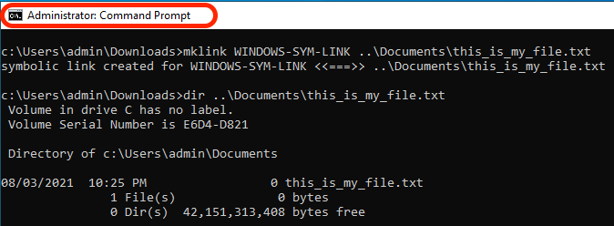

# Symlinks toevoegen aan GIT

[Inhoudsopgave](./overview.md)

[&lt;- Vorige: health check van Dispatcher](./health-check.md)

In AMS krijgt u een vooraf ingevulde GIT-opslagplaats die de broncode van uw verzender bevat en die klaar is voor u om de ontwikkeling en aanpassing te starten.

Nadat u de eerste `.vhost` bestand of hoofdniveau `farm.any` moet u een symbolische koppeling maken vanuit het `available_*` aan de `enabled_*` directory. Het gebruiken van het juiste verbindingstype zal zeer belangrijk aan een succesvolle plaatsing door de pijpleiding van de Manager van de Wolk zijn. Deze pagina helpt u te weten hoe u dit kunt doen.

## Dispatcher Archetype

De AEM ontwikkelaar begint hun project typisch van [AEM](https://github.com/adobe/aem-project-archetype)

Hier volgt een voorbeeld van het gebied van de broncode waar u de gebruikte symlinks kunt zien:

```
$ tree dispatcher
dispatcher
└── src
   ├── conf.d
.....SNIP.....
    │   └── available_vhosts
    │   │   ├── 000_unhealthy_author.vhost
    │   │   ├── 000_unhealthy_publish.vhost
    │   │   ├── aem_author.vhost
    │   │   ├── aem_flush.vhost
    │   │   ├── aem_health.vhost
    │   │   ├── aem_lc.vhost
    │   │   └── aem_publish.vhost
    └── dispatcher_vhost.conf
    │   └── enabled_vhosts
    │   │   ├── aem_author.vhost -> ../available_vhosts/aem_author.vhost
    │   │   ├── aem_flush.vhost -> ../available_vhosts/aem_flush.vhost
    │   │   ├── aem_health.vhost -> ../available_vhosts/aem_health.vhost
    │   │   └── aem_publish.vhost -> ../available_vhosts/aem_publish.vhost
.....SNIP.....
    └── conf.dispatcher.d
    │   ├── available_farms
    │   │   ├── 000_ams_author_farm.any
    │   │   ├── 001_ams_lc_farm.any
    │   │   └── 002_ams_publish_farm.any
.....SNIP.....
    │   └── enabled_farms
    │   │   ├── 000_ams_author_farm.any -> ../available_farms/000_ams_author_farm.any
    │   │   └── 002_ams_publish_farm.any -> ../available_farms/002_ams_publish_farm.any
.....SNIP.....
17 directories, 60 files
```

Als voorbeeld `/etc/httpd/conf.d/available_vhosts/` map bevat het gefaseerde potentieel `.vhost` bestanden die we kunnen gebruiken in onze actieve configuratie.

Ingeschakeld `.vhost` bestanden worden weergegeven als relatieve paden `symlinks` in de `/etc/httpd/conf.d/enabled_vhosts/` directory.

## Een symlink maken

We gebruiken symbolische koppelingen naar het bestand, zodat het doelbestand op de Apache-webserver als hetzelfde bestand wordt behandeld.  We willen het bestand niet in beide mappen dupliceren.  In plaats daarvan hoeft u alleen maar een sneltoets te gebruiken van de ene map (symbolische koppeling) naar de andere.

Erken dat uw geïmplementeerde configuraties zich richten op een Linux-host.  Het creëren van een symlink die niet compatibel met het doelsysteem is zal mislukkingen en ongewenste resultaten veroorzaken.

Als uw werkstation geen Linux-computer is, vraagt u zich waarschijnlijk af met welke opdrachten deze koppelingen op de juiste wijze kunnen worden gemaakt, zodat ze zich kunnen vastleggen op GIT.

> `TIP:` Het is belangrijk relatieve koppelingen te gebruiken, omdat de koppelingen nog steeds werken als u een lokale kopie van Apache Webserver hebt geïnstalleerd en een andere installatiebasis hebt.  Als u een absoluut pad gebruikt, moeten uw werkstation of andere systemen precies overeenkomen met dezelfde mapstructuur.

### OSX/Linux

Symbolen zijn native voor deze besturingssystemen en hier zijn enkele voorbeelden van hoe u deze koppelingen kunt maken.  Open uw favoriete eindtoepassing en gebruik de volgende voorbeeldbevelen om de verbinding tot stand te brengen:

```
$ cd <LOCATION OF CLONED GIT REPO>\src\conf.d\enabled_vhosts
$ ln -s ../available_vhosts/<Destination File Name> <Target File Name>
```

Hier volgt een voorbeeld van een gevulde opdracht ter referentie:

```
$ git clone https://github.com/adobe/aem-project-archetype.git
$ cd aem-project-archetype/src/main/archetype/dispatcher.ams/src/conf.d/enabled_vhosts/
$ ln -s ../available_vhosts/aem_flush.vhost aem_flush.vhost
```

Hier is een voorbeeld van de koppeling die u nu gebruikt als u het bestand opsomt met de opdracht `ls` opdracht:

```
ls -l
total 0
lrwxrwxrwx. 1 root root 35 Oct 13 21:38 aem_flush.vhost -> ../available_vhosts/aem_flush.vhost
```

### Windows

> `Note:` Het blijkt dat MS Windows (beter, NTFS) symbolische verbindingen steunt aangezien.. Windows Vista!


> `Warning:` voor de mklink-opdracht voor het maken van symlinks zijn beheerdersrechten vereist om correct te kunnen worden uitgevoerd. Zelfs als Admin-account, moet u de opdrachtprompt &quot;Als beheerder&quot; uitvoeren, tenzij de ontwikkelaarsmodus is ingeschakeld
> <br/>Onjuiste machtigingen:
> 
> <br/>Juiste machtigingen:
> 

Hier volgt de opdracht(en) om de koppeling te maken:

```
C:\<PATH TO SRC>\enabled_vhosts> mklink <Target File Name> ..\available_vhosts\<Destination File Name>
```


Hier volgt een voorbeeld van een gevulde opdracht ter referentie:

```
C:\> git clone https://github.com/adobe/aem-project-archetype.git
C:\> cd aem-project-archetype\src\main\archetype\dispatcher.ams\src\conf.d\enabled_vhosts\
C:\aem-project-archetype\src\main\archetype\dispatcher.ams\src\conf.d\enabled_vhosts> mklink aem_flush.vhost ..\available_vhost\aem_flush.vhost
symbolic link created for aem_flush.vhost <<===>> ..\available_vhosts\aem_flush.vhost
```

#### Modus Ontwikkelaar (Windows 10)

Wanneer deze [Modus voor ontwikkelaars](https://docs.microsoft.com/en-us/windows/apps/get-started/enable-your-device-for-development)Met Windows 10 kunt u toepassingen die u ontwikkelt gemakkelijker testen, de Ubuntu Bash-shell-omgeving gebruiken, verschillende ontwikkelaarsinstellingen wijzigen en dergelijke handelingen uitvoeren.

Microsoft lijkt eigenschappen aan de Wijze van de Ontwikkelaar te blijven toevoegen, of sommige van die eigenschappen toe te laten door gebrek zodra zij een meer wijdverspreide goedkeuring bereiken en als stabiel (bijvoorbeeld met de Update van Scheppers, vereist het milieu van Ubuntu Bash Shell niet meer de Wijze van de Ontwikkelaar) worden beschouwd.

Hoe zit het met symlinks? Met INGESCHAKELDE Wijze van de Ontwikkelaar, is er geen behoefte om een bevelherinnering met opgeheven voorrechten in werking te stellen om tot symlinks te kunnen leiden. Daarom kunnen gebruikers, zodra de Wijze van de Ontwikkelaar wordt toegelaten, symlinks tot stand brengen.

> Na het toelaten van de Wijze van de Ontwikkelaar, zouden de gebruikers moeten logoff/opening van een sessie voor de veranderingen van kracht worden.

Nu kunt u zonder als Beheerder te lopen zien het bevel werkt


#### Alternatieve/programmatische aanpak

Er is een specifiek beleid waarmee bepaalde gebruikers symbolische koppelingen kunnen maken → [Symbolische koppelingen maken (Windows 10) - Windows-beveiliging | Microsoft Docs](https://docs.microsoft.com/en-us/windows/security/threat-protection/security-policy-settings/create-symbolic-links)

PRO&#39;s:
- Dit zou door klanten kunnen worden leveraged om symbolische verbindingen verwezenlijking aan alle ontwikkelaars binnen hun (d.w.z. Actieve Folder) programmatically toe te staan zonder het moeten de Wijze van de Ontwikkelaar op elk apparaat manueel toelaten.
- Bovendien, zou dit beleid in vroegere versies van MS Windows beschikbaar moeten zijn die de Wijze van de Ontwikkelaar niet aanbieden.

CON&#39;s:
- Dit beleid lijkt geen effect te hebben op gebruikers die tot de groep van Beheerders behoren. De beheerders zouden nog de herinnering van het Bevel met opgeheven voorrechten moeten in werking stellen. Vreemd.

> De gebruiker logoff/opening van een sessie zal worden vereist voor de veranderingen in het lokale/groepsbeleid om van kracht te worden.

Uitvoeren `gpedit.msc`, voegt u gebruikers toe of wijzigt u deze. Beheerders zijn er standaard


#### Symbolen inschakelen in GIT

De handvatten van de it volgens de core.symlinks optie

Bron: [Git - git-config Documentatie](https://git-scm.com/docs/git-config#Documentation/git-config.txt-coresymlinks)

*Als core.symlinks false is, worden symbolische koppelingen uitgecheckt als kleine normale bestanden die de koppelingstekst bevatten. `git-update-index[1]` en `git-add[1]` wijzigt het opgenomen type niet in een normaal bestand. Nuttig op bestandssystemen zoals FAT die geen ondersteuning bieden voor symbolische koppelingen.
De standaardwaarde is true, behalve `git-clone[1]` of `git-init[1] will probe and set core.symlinks false if appropriate when the repository is created.` In de meeste gevallen, zal Git veronderstellen Vensters niet goed voor symlinks is en zal dit aan vals plaatsen.*

Het gedrag van Git op Vensters wordt duidelijk hier: Symbolische Verbindingen ・ git-for-windows/git Wiki ・ GitHub

> `Info`: De veronderstellingen die worden vermeld in de documentatie verbonden hierboven lijken O.K. met een mogelijke opstelling van AEM Ontwikkelaar op Vensters, met name NTFS en het feit dat wij slechts dossiersymlinks vs. de symlinks van de Folder hebben

Hier is het goede nieuws, want [Git voor Windows versie 2.10.2](https://github.com/git-for-windows/git/releases/tag/v2.10.2.windows.1) de installateur heeft een [expliciete optie om ondersteuning voor symbolische koppelingen in te schakelen.](https://github.com/git-for-windows/git/issues/921)

> `Warning`: De optie core.symlink kan bij uitvoering worden opgegeven terwijl de opslagplaats wordt gekloond, of kan anders als een globale config worden opgeslagen.


Git voor Windows slaat algemene voorkeuren op in `"C:\Program Files\Git\etc\gitconfig"` . Deze instellingen worden mogelijk niet in aanmerking genomen door andere Git-bureaubladclient-apps.
Hier is vangst, niet zullen alle ontwikkelaars de inheemse cliënt van het Git (d.w.z. Cmd van het Git, Bash) gebruiken, en sommige van de Apps van de Desktop van het Git (b.v. Desktop GitHub, Atlassian Bronree) kunnen verschillende montages/gebreken hebben om Systeem of een ingebedde Git te gebruiken

Hier is een voorbeeld van wat er in de `gitconfig` file

```
[diff "astextplain"]
    textconv = astextplain
[filter "lfs"]
    clean = git-lfs clean -- %f
    smudge = git-lfs smudge -- %f
    process = git-lfs filter-process
    required = true
[http]
    sslBackend = openssl
    sslCAInfo = C:/Program Files/Git/mingw64/ssl/certs/ca-bundle.crt
[core]
    autocrlf = true
    fscache = true
    symlinks = true
[pull]
    rebase = false
[credential]
    helper = manager-core
[credential "https://dev.azure.com"]
    useHttpPath = true
[init]
    defaultBranch = master
```

#### Tips voor opdrachtregel voor it

Er kunnen scenario&#39;s zijn waar u nieuwe symbolische verbindingen (b.v. het toevoegen van een nieuwe gastheer of een nieuw landbouwbedrijf) moet tot stand brengen.

In de bovenstaande documentatie hebben we gezien dat Windows de opdracht &quot;mklink&quot; biedt om symbolische koppelingen te maken.

Als u in een Git Bash-omgeving werkt, kunt u in plaats daarvan de opdracht Standaard `ln -s` maar het moet worden voorafgegaan door een speciale instructie zoals het voorbeeld hier :

```
MSYS=winsymlinks:nativestrict ln -s test_vhost_symlink ../dispatcher/src/conf.d/available_vhosts/default.vhost
```

#### Samenvatting

Als u de symlinks voor de verwerking van de it correct wilt hebben (ten minste voor het bereik van de huidige AEM Dispatcher Configuration-basislijn) op een Microsoft Windows-besturingssysteem, hebt u het volgende nodig:

| Item | Minimale versie / configuratie | Aanbevolen versie / configuratie |
|------|---------------------------------|-------------------------------------|
| Besturingssysteem | Windows Vista of hoger | Windows 10 Creator-update of nieuwer |
| Bestandssysteem | NTFS | NTFS |
| Mogelijkheid om symlinks voor de Windows-gebruiker af te handelen | `"Create symbolic links"` groep/lokaal beleid `under "Group Computer Configuration\Windows Settings\Security Settings\Local Policies\User Rights Assignment"` | Windows 10 Developer Mode ingeschakeld |
| GIT | Systeemeigen clientversie 1.5.3 | Systeemeigen clientversie 2.10.2 of hoger |
| Git Config | `--core.symlinks=true` optie bij het maken van een kloon van de opdrachtregel | Globale configuratie ophalen<br/>`[core]`<br/>    symlinks = true <br/> Systeemeigen configuratiepad client: `C:\Program Files\Git\etc\gitconfig` <br/>Standaardlocatie voor Git Desktop-clients: `%HOMEPATH%\.gitconfig` |

> `Note:` Als u al een lokale opslagplaats hebt, moet u een nieuwe kloon maken van de oorsprong. U kunt klonen naar een nieuwe locatie en uw niet-vastgelegde/niet-gestarte lokale wijzigingen handmatig samenvoegen in de nieuw gekloonde opslagplaats.
