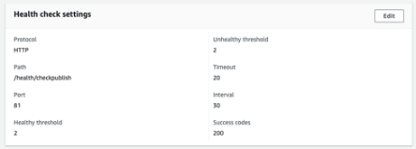

# AMS Dispatcher Health Check

[Inhoudsopgave](./overview.md)

[&lt;- Vorige: alleen-lezen bestanden](./immutable-files.md)

Wanneer u een AMS-basislijnverzendingsprogramma hebt geïnstalleerd, wordt deze geleverd met een paar freebies.  Een van deze functies is een set scripts voor health check.
Met deze scripts kan het taakverdelingsmechanisme waarmee de AEM-stapel wordt voorafgegaan, weten welke poten gezond zijn en in bedrijf blijven.


## Standaard taakverdelingscontrole

Wanneer het klantenverkeer door Internet komt om uw instantie van AEM te bereiken zullen zij door een ladingsverdelingsmechanisme gaan

 te noemen

Elke aanvraag die via het taakverdelingsmechanisme wordt ontvangen, leidt elke aanvraag tot een verwijzing.  Het taakverdelingsmechanisme beschikt over een mechanisme voor gezondheidscontrole dat is ingebouwd om ervoor te zorgen dat het verkeer naar een gezonde host stuurt.

De standaardcontrole is typisch een havencontrole om te zien of luisteren de servers die in het taakverdelingsmechanisme worden gericht op het havenverkeer binnen komt (d.w.z. TCP 80 en 443)

> `Note:` Hoewel dit werkt, wordt niet echt ingeschat of AEM gezond is.  Het test alleen of de Dispatcher (Apache-webserver) actief is.

## AMS Health Check

Om te voorkomen dat verkeer naar een gezonde verzender wordt gestuurd die een ongezonde AEM-instantie voorgaat, heeft AMS een paar extra&#39;s gemaakt die de gezondheid van de poot evalueren en niet alleen van de Dispatcher.

 te werken

De gezondheidscontrole bestaat uit de volgende stukken:
- 1 `Load balancer`
- 1 `Apache web server`
- 3 `Apache *VirtualHost* config files`
- 5 `CGI-Bin scripts`
- 1 `AEM instance`
- 1 `AEM package`

Wij zullen behandelen wat elk stuk aan opstelling en hun belang is

### AEM-pakket

Als u wilt aangeven of AEM werkt, hebt u het nodig om een basispagina-compilatie uit te voeren en de pagina te bedienen.  Adobe Managed Services heeft een basispakket gemaakt dat de testpagina bevat.  De pagina test dat de bewaarplaats omhoog is en dat de middelen en paginasjabloon kunnen teruggeven.


Hier is de pagina.  De opslagplaats-id van de installatie wordt weergegeven


> `Note:` We zorgen ervoor dat de pagina niet in cache kan worden opgeslagen.  Het zou niet de daadwerkelijke status controleren als het elke keer enkel een caching pagina terugkwam!

Dit is het lichtgewichteindpunt dat we kunnen testen om te zien dat AEM in gebruik is.

### Configuratie taakverdelingsmechanisme

Wij vormen de ladingsbalansen om aan een CGI-BIN eindpunt in plaats van het gebruiken van een havencontrole te richten.




### Virtuele hosts voor Apache Health Check

#### Virtuele CGI-BIN-host `(/etc/httpd/conf.d/available_vhosts/ams_health.vhost)`

Dit is het `<VirtualHost>` Apache-configuratiebestand waarmee de CGI-Bin-bestanden kunnen worden uitgevoerd.

```
Listen 81
<VirtualHost *:81>
    ServerName "health"
    ...SNIP...
    ScriptAlias /health/ "/var/www/cgi-bin/health/"
</VirtualHost>
```

> `Note:` cgi-bin-bestanden zijn scripts die kunnen worden uitgevoerd.  Dit kan een kwetsbare aanvalsvector zijn en deze manuscripten die AMS gebruikt zijn niet openbaar toegankelijk slechts beschikbaar aan het taakverdelingsmechanisme om tegen te testen.


#### Virtuele hosts voor ongezond onderhoud

- `/etc/httpd/conf.d/available_vhosts/000_unhealthy_author.vhost`
- `/etc/httpd/conf.d/available_vhosts/000_unhealthy_publish.vhost`

Deze bestanden krijgen de naam `000_` als voorvoegsel.  Het is opzettelijk gevormd om de zelfde domeinnaam te gebruiken zoals de levende plaats.  Het is de bedoeling dat dit bestand wordt ingeschakeld wanneer de health check vaststelt dat er een probleem is met een van de AEM-achtergronden.  Geef vervolgens een foutpagina op in plaats van alleen een 503 HTTP-antwoordcode zonder pagina.  Verkeer wordt uit het normale `.vhost` -bestand gestolen, omdat het voor dat `.vhost` -bestand is geladen en tegelijkertijd hetzelfde bestand `ServerName` of `ServerAlias` deelt.  Resulterend in pagina&#39;s die voor een bepaald domein worden bestemd om naar de ongezonde gastheer in plaats van het gebrek te gaan het normale verkeersstromen door is.

Wanneer de scripts voor de health check worden uitgevoerd, melden ze hun huidige gezondheidsstatus af.  Eenmaal per minuut wordt er een concronjob uitgevoerd op de server die zoekt naar ongezonde items in het logbestand.  Als het ontdekt dat de auteurAEM instantie niet gezond is zal het dan de symlink toelaten:

Logbestandvermelding:

```
# grep "ERROR\|publish" /var/log/lb/health_check.log
E, [2022-11-23T20:13:54.984379 #26794] ERROR -- : AUTHOR -- Exception caught: Connection refused - connect(2)
I, [2022-11-23T20:13:54.984403 #26794]  INFO -- : [checkpublish]-author:0-publish:1-[checkpublish]
```

Snijden bij het ophalen van de fout en reageren:

```
# grep symlink /var/log/lb/health_check_reload.log
I, [2022-11-23T20:34:19.213179 #2275]  INFO -- : ADDING VHOST symlink /etc/httpd/conf.d/available_vhosts/000_unhealthy_author.vhost => /etc/httpd/conf.d/enabled_vhosts/000_unhealthy_author.vhost
```

U kunt bepalen of de auteur of de gepubliceerde plaatsen deze foutenpagina kunnen hebben door het herladen wijzeplaatsen te vormen in `/var/www/cgi-bin/health_check.conf`

```
# grep RELOAD_MODE /var/www/cgi-bin/health_check.conf
RELOAD_MODE='author'
```

Geldige opties:

- auteur
   - Dit is de standaardoptie.
   - Hiermee wordt een onderhoudspagina voor de auteur geplaatst als deze ongezond is
- publish
   - Met deze optie wordt een onderhoudspagina voor de uitgever geplaatst als deze ongezond is
- alles
   - Met deze optie wordt een onderhoudspagina voor auteur of uitgever of beide weergegeven als deze ongezond worden
- none
   - Deze optie slaat dit onderdeel van de health check over

Wanneer u de instelling `VirtualHost` voor deze instellingen bekijkt, ziet u dat ze hetzelfde document laden als een foutpagina voor elke aanvraag die wordt uitgevoerd wanneer deze is ingeschakeld:

```
<VirtualHost *:80>
    ServerName    unhealthyauthor
    ServerAlias    ${AUTHOR_DEFAULT_HOSTNAME}
    ErrorDocument    503 /error.html
    DocumentRoot    /mnt/var/www/default
    <Directory />
        Options FollowSymLinks
        AllowOverride None
    </Directory>
    <Directory "/mnt/var/www/default">
        AllowOverride None
        Require all granted
    </Directory>
    <IfModule mod_headers.c>
        Header always add X-Dispatcher ${DISP_ID}
        Header always add X-Vhost "unhealthy-author"
    </IfModule>
    <IfModule mod_rewrite.c>
        ReWriteEngine   on
        RewriteCond %{REQUEST_URI} !^/error.html$
        RewriteRule ^/* /error.html [R=503,L,NC]
    </IfModule>
</VirtualHost>
```

De antwoordcode is nog steeds een `HTTP 503`

```
# curl -I https://we-retail.com/
HTTP/1.1 503 Service Unavailable
X-Dispatcher: dispatcher1useast1
X-Vhost: unhealthy-author
```

In plaats van een lege pagina krijgen ze deze pagina.


### CGI-Bin-scripts

Er zijn vijf verschillende scripts die door uw CSE in de taakverdelingsinstellingen kunnen worden geconfigureerd. Deze kunnen het gedrag of de criteria wijzigen wanneer een Dispatcher uit het taakverdelingsmechanisme wordt gehaald.

#### /bin/checkauteur

Dit script wanneer het wordt gebruikt, controleert en registreert alle instanties die worden voorafgegaan, maar retourneert alleen een fout als de AEM-instantie van `author` ongezond is

> `Note:` Houd er rekening mee dat als de publicatie-AEM-instantie ongezond was, de verzender in service zou blijven zodat het verkeer naar de auteur-AEM-instantie kan gaan.

#### /bin/checkpublish (standaardwaarde)

Dit script wanneer het wordt gebruikt, controleert en registreert alle instanties die worden voorafgegaan, maar retourneert alleen een fout als de AEM-instantie van `publish` ongezond is

> `Note:` Houd er rekening mee dat als de auteur AEM-instantie ongezond was, de verzender in service zou blijven zodat het verkeer naar de publicatie AEM-instantie kan gaan.

#### /bin/checkeeither

Dit script wanneer het wordt gebruikt, controleert en registreert alle instanties die worden voorafgegaan, maar retourneert alleen een fout als de `author` - of `publisher` AEM-instantie ongezond is

> `Note:` Houd er rekening mee dat als het exemplaar van de publiceer-AEM of het exemplaar van de auteur-AEM ongezond was, de verzender zich uit de service zou terugtrekken.  Betekenis dat als een van hen gezond zou zijn, het ook geen verkeer zou krijgen

#### /bin/checkboth

Dit script wanneer het wordt gebruikt, controleert en registreert alle instanties die worden voorafgegaan, maar retourneert alleen een fout als de instantie `author` en `publisher` AEM ongezond zijn

> `Note:` Houd er rekening mee dat als het exemplaar van de publiceer-AEM of de auteur-AEM ongezond was, de verzender de service niet zou verlaten.  Betekenis dat als één van hen ongezond was, het verkeer zou blijven ontvangen en fouten zou geven aan mensen die om middelen vragen.

#### /bin/normal

Dit script wanneer het wordt gebruikt, controleert en registreert alle instanties die worden voorafgegaan, maar retourneert alleen gezond, ongeacht of AEM een fout retourneert of niet.

> `Note:` Dit script wordt gebruikt wanneer de health check niet naar wens functioneert en een overschrijving wordt toegestaan om AEM-instanties in het taakverdelingsmechanisme te houden.

[Volgende -> GIT-symmetrieën](./git-symlinks.md)
