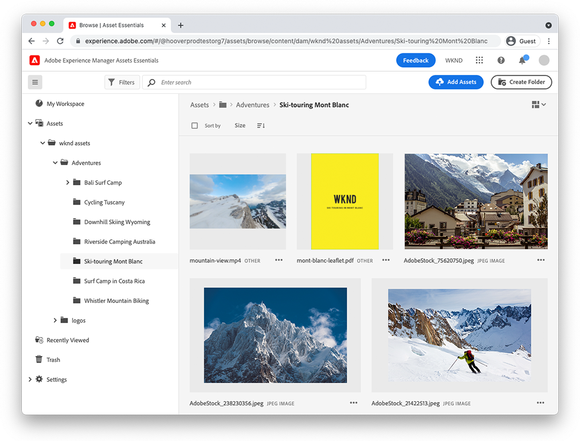

# Video&#39;s Assets Essentials

Experience Manager Assets Essentials biedt een gestroomlijnde gebruikersinterface voor eenvoudig beheer van bedrijfsmiddelen en samenwerking.

Bekijk deze video&#39;s over hoe u Assets Essentials kunt gebruiken om uw middelen te beheren en hoe u deze kunt integreren met Adobe Workfront en Adobe Journey Orchestrator!

## Meer informatie over Assets Essentials

<table>
<td>
   
   

      <a href="./basics/managing.md">
      <strong> Begonnen het worden met Assets Essentials </strong>
      </a>
   

   

      <em> leer de grondbeginselen van Assets Essentials!</em>
   

</td>
<td>
   
   

      <a href="https://experienceleague.adobe.com/docs/experience-manager-assets-essentials/help/introduction.html">
      <strong> documentatie van Assets Essentials </strong>
      </a>
   

   

      <em> Controle uit de het productdocumentatie van Assets Essentials!</em>
   

</td>
<td>
   
   

      <a href="https://experienceleague.adobe.com/docs/journey-optimizer-learn/tutorials/create-messages/create-email-content-with-the-message-editor.html">
      <strong> de integratie van Adobe Journey Optimizer </strong>
      </a>
   

   

      <em> leer hoe de Assets Essentials met Adobe Journey Optimizer integreren!</em>
   

</td>
</table>
