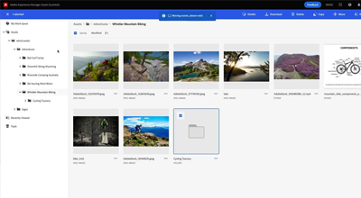

# AEM Assets Essentials

Experience Manager Assets Essentials biedt een gestroomlijnde gebruikersinterface voor lichtgewicht middelenbeheer en samenwerking.

Bekijk onze video&#39;s over hoe u Assets Essentials kunt gebruiken om uw middelen te beheren en hoe u deze kunt integreren met de Adobe Journey Orchestrator!

<table>
<td>
   
   

      <a href="./basics/managing.md">
      <strong>Aan de slag met Assets Essentials</strong>
      </a>
   

   

      <em>Leer de basisbeginselen van Assets Essentials!</em>
   

</td>
<!--
<td>
   
   

      <a href="./provisioning/getting-access.md">
      <strong>Creative Cloud and Assets Essentials</strong>
      </a>
   

   

      <em>Learn how Assets Essentials can integrate with your Creative Cloud Enterprise Libraries!</em>
   

</td>
-->
<td>
   
   

      <a href="https://experienceleague.adobe.com/docs/journey-optimizer/using/create-messages/assets-essentials.html">
      <strong>Adobe Journey Optimizer</strong>
      </a>
   

   

      <em>Leer hoe Assets Essentials zich integreert met Adobe Journey Optimizer!</em>
   

</td>
</table>
