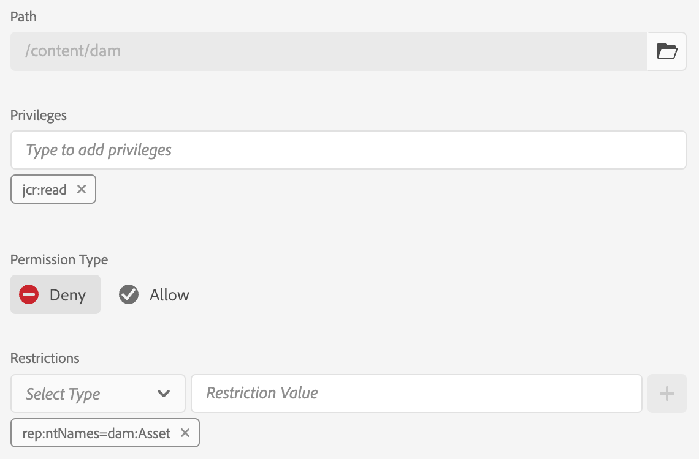

# Machtigingen met metagegevens{#metadata-driven-permissions}

Machtigingen met metagegevens zijn een functie waarmee toegangsbeheerbeslissingen van AEM Assets Author kunnen worden gebaseerd op eigenschappen van metagegevens van elementen in plaats van op mapstructuur. Met dit vermogen, kunt u toegangsbeheerbeleid bepalen dat attributen zoals activa status, type, of om het even welk bezit van douanemetagegevens evalueert u bepaalt.

Laten we een voorbeeld zien. Creatieve gebruikers kunnen hun werk naar AEM Assets uploaden naar de map met betrekking tot de campagne. Dit is mogelijk een werk in uitvoering dat niet is goedgekeurd voor gebruik. We willen ervoor zorgen dat de marketeers alleen goedgekeurde middelen voor deze campagne zien. Met de eigenschap metadata kunnen we aangeven dat een element is goedgekeurd en kan worden gebruikt door de marketeers.

## Hoe het werkt

Als u Metagegevens-gestuurde machtigingen inschakelt, moet u bepalen welke metagegevenseigenschappen van elementen toegangsbeperkingen bepalen, zoals &quot;status&quot; of &quot;merk&quot;. Deze eigenschappen kunnen dan worden gebruikt om toegangsbeheeringangen tot stand te brengen die specificeren welke gebruikersgroepen toegang tot activa met specifieke bezitswaarden hebben.

## Vereisten

Toegang tot een AEM as a Cloud Service omgeving die is bijgewerkt naar de nieuwste versie is vereist voor het instellen van machtigingen voor metagegevens.


## Ontwikkelingsstappen

Metagegevens gestuurde machtigingen implementeren:

1. Bepaal welke eigenschappen van elementmetagegevens worden gebruikt voor toegangsbeheer. In ons geval wordt het een eigenschap met de naam `status`.
1. Een OSGi-configuratie maken `com.adobe.cq.dam.assetmetadatarestrictionprovider.impl.DefaultRestrictionProviderConfiguration.cfg.json` in uw project.
1. Plak de volgende JSON in het gemaakte bestand

   ```json
   {
     "restrictionPropertyNames":[
       "status"
     ],
     "restrictionPaths":[
       "/content/dam"
     ]
   }
   ```

1. Vervang de namen van eigenschappen en restrictiepaden door de vereiste waarden.


Alvorens op beperking-gebaseerde Ingangen van het Toegangsbeheer toe te voegen, zou een nieuwe top-level ingang moeten worden toegevoegd om gelezen toegang tot alle groepen eerst te ontkennen die aan toestemmingsevaluatie voor Activa (b.v. &quot;contribuanten&quot;of gelijkaardig) onderworpen zijn:

1. Navigeer naar het scherm Tools → Security → Permissions
1. Selecteer de groep Medewerkers (of een andere aangepaste groep waartoe alle gebruikersgroepen behoren)
1. Klik op ACE toevoegen rechtsboven in het scherm
1. Selecteer /content/dam voor pad
1. jcr invoeren:lezen voor rechten
1. Selecteer Weigeren voor machtigingstype
1. Selecteer onder Beperkingen de optie rep:notNames en voer de dam:Asset in als de Restrictiewaarde
1. Klik op Opslaan



Toegangsbeheeritems kunnen nu worden toegevoegd om leestoegang te verlenen aan gebruikersgroepen op basis van eigenschapswaarden voor metagegevens van middelen.

1. Navigeer naar het scherm Tools → Security → Permissions
1. Selecteer de gewenste groep
1. Klik op ACE toevoegen rechtsboven in het scherm
1. Selecteer /content/dam (of een submap) voor pad
1. jcr invoeren:lezen voor rechten
1. Selecteer Toestaan voor machtigingstype
1. Onder Beperkingen, selecteer één van de gevormde namen van het de meta-gegevensbezit van Activa (de eigenschappen die in de configuratie worden bepaald OSGi zullen hier worden omvat)
1. Voer de vereiste waarde van de metagegevenseigenschap in het veld Restrictiewaarde in
1. Klik op het pictogram &quot;+&quot; om de beperking toe te voegen aan het toegangsbeheeritem
1. Klik op Opslaan


De voorbeeldmap bevat een aantal elementen.


Zodra u toestemmingen vormt en de eigenschappen van activa meta-gegevens dienovereenkomstig plaatst zullen de gebruikers (Gebruiker van de Marktspeler in ons geval) slechts goedgekeurde activa zien.


## Voordelen en overwegingen

De voordelen van metagegevensgestuurde machtigingen zijn onder meer:

- Fijne controle over toegang tot elementen op basis van specifieke kenmerken.
- Ontkoppeling van toegangsbeheerbeleid van omslagstructuur, die voor flexibelere middelenorganisatie toestaat.
- Mogelijkheid om complexe toegangsbeheerregels te definiëren die zijn gebaseerd op meerdere metagegevenseigenschappen.

>[!NOTE]
>
> Het is belangrijk om op te merken:
> 
> - Eigenschappen van metagegevens worden getoetst aan de beperkingen die gebruikmaken van gelijkheid van tekenreeks (andere gegevenstypen die nog niet worden ondersteund, bijvoorbeeld datum)
> - Om veelvoudige waarden voor een beperkingsbezit toe te staan, kunnen de extra beperkingen aan de Ingang van het Toegangsbeheer worden toegevoegd door het zelfde bezit van de &quot;Uitgezochte Type&quot;drop-down te selecteren en een nieuwe Waarde van de Beperking in te gaan (b.v. `status=approved`, `status=wip`) en klikken op &quot;+&quot; om de beperking aan de vermelding toe te voegen
> 
> - Meerdere beperkingen in één toegangsbeheeritem met verschillende eigenschapsnamen (bijvoorbeeld `status=approved`, `brand=Adobe`) wordt beoordeeld als een AND-voorwaarde, d.w.z. de geselecteerde gebruikersgroep krijgt leestoegang tot elementen met `status=approved AND brand=Adobe`
> 
> - Als u een nieuw toegangsbeheeritem toevoegt met een eigenschapbeperking voor metagegevens, wordt een OR-voorwaarde voor de items ingesteld, bijvoorbeeld één item met beperking `status=approved` en één item met `brand=Adobe` wordt beoordeeld als `status=approved OR brand=Adobe`
> 
