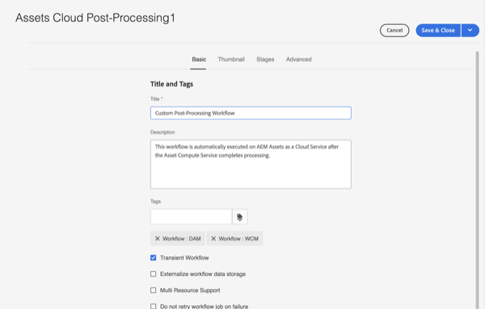

# Workflows automatisch starten

Workflows voor automatisch opstarten breiden de verwerking van bedrijfsmiddelen in AEM as a Cloud Service uit door automatisch een aangepaste workflow aan te roepen bij het uploaden of opnieuw verwerken zodra de verwerking van bedrijfsmiddelen is voltooid.

>[!VIDEO](https://video.tv.adobe.com/v/37323?quality=12&learn=on)

>[!NOTE]
>
>Gebruik Workflows automatisch starten voor het aanpassen van elementen na verwerking in plaats van Workflowopstartsters te gebruiken. Auto-begin werkschema&#39;s worden _slechts_ aangehaald zodra een activa volledige verwerking in plaats van draagraketten is die veelvoudige tijden tijdens activaverwerking kunnen worden aangehaald.

## De naverwerkingsworkflow aanpassen

Om het nabewerkingswerkschema aan te passen, kopieer het standaardAssets Cloud naverwerkings [&#x200B; werkschemamodel &#x200B;](../../foundation/workflow/use-the-workflow-editor.md).

1. Begin bij het scherm van de Modellen van het Werkschema door aan _Hulpmiddelen_ te navigeren > _Werkschema_ > _Modellen_
2. Vind en selecteer _Assets Cloud na-Verwerking_ werkschemamodel  
   
3. Selecteer de _knoop van het Exemplaar_ om uw douanewerkschema te creëren
4. Selecteer uw nu werkschemamodel (dat _Assets Cloud na-Processing1_ zal worden genoemd) en klik _uitgeven_ knoop om het werkschema uit te geven
5. Van de Eigenschappen van het Werkschema, geef uw douane het werkschema na-Verwerking een betekenisvolle naam  
   
6. Voeg de stappen toe om aan uw bedrijfsvereisten te voldoen. Voeg in dit geval een taak toe wanneer de activa volledige verwerking zijn. Zorg ervoor dat de laatste stap van het werkschema altijd de _Volledige 1&rbrace; stap van het Werkschema   is_
    toe

   >[!NOTE]
   >
   >Auto-begin werkschema&#39;s die met elk activa worden in werking gesteld uploaden of herverwerken zo zorgvuldig de het schrapen implicatie van werkschemastappen, vooral voor bulkverrichtingen zoals [&#x200B; BulkInvoer &#x200B;](../../cloud-service/migration/bulk-import.md) of migraties overwegen.

7. Selecteer de _knoop van de Synchronisatie_ om uw veranderingen te bewaren en het model van het Werkschema te synchroniseren

## Een aangepaste naverwerkingsworkflow gebruiken

Aangepaste naverwerking wordt geconfigureerd in mappen. Een aangepaste naverwerkingsworkflow voor een map configureren:

1. Selecteer de map waarvoor u de workflow wilt configureren en bewerk de eigenschappen van de map
2. Schakelaar aan het _Verwerking van Activa_ lusje
3. Selecteer uw werkschema van de Douane na-Verwerking in het _auto-begin Werkschema_ selectievak  
   
4. Uw wijzigingen opslaan

De aangepaste naverwerkingsworkflow wordt nu uitgevoerd voor alle elementen die in die map zijn geüpload of opnieuw verwerkt.
