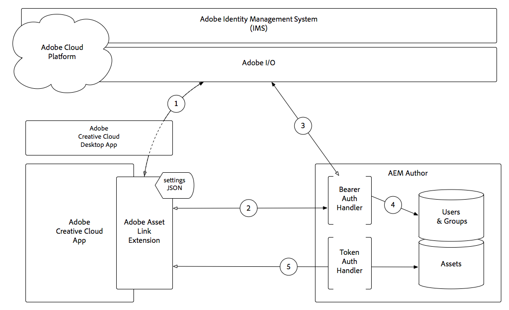

# Adobe-itemkoppeling 3.0

Adobe Experience Manager-middelen kunnen door ontwerpers en creatieve gebruikers worden gebruikt in hun favoriete Adobe Creative Cloud-bureaubladtoepassingen.

De uitbreiding van de Verbinding van Activa van de Adobe voor Adobe Creative Cloud for enterprise breidt het vermogen uit om te doorzoeken en te doorbladeren, te sorteren, voorproef, activa te uploaden, uit te checken, te wijzigen, controle en meningsmeta-gegevens van AEM activa binnen de toepassingen van het Creative Cloud.

>[!TIP]
>
> Leer meer over hoe het [ Premium van Adobe XD Opleiding Programma ](https://helpx.adobe.com/support/xd.html) u kan helpen de Verbinding van Activa met uw werkschema van Adobe Experience Manager integreren.

## Adobe Asset Link en AEM creatieve workflows

De volgende video illustreert een algemene workflow die wordt gebruikt door ontwerpers die in Adobe Creative Cloud-toepassingen werken en die rechtstreeks met AEM integreren via Adobe Asset Link.

>[!VIDEO](https://video.tv.adobe.com/v/335927?quality=12&learn=on)

## Mogelijkheden voor Adobe Asset Link

+ Adobe Asset Link kan worden geïntegreerd met AEM Assets en Assets Essentials.
+ Adobe Asset Link configureert automatisch verbinding met cloudgebaseerde AEM (AEM Assets as a Cloud Service en Assets Essentials)
+ Adobe Asset Link is een extensie die werkt binnen Adobe Creative Cloud-toepassingen:

   + Adobe XD
   + Adobe Photoshop
   + Adobe Illustrator
   + Adobe InDesign

+ Automatische verificatie voor AEM met behulp van de Enterprise ID of Federated ID van de Adobe
+ Zoeken naar digitale middelen in AEM
+ De dossierdetails van de toegang voor activa die in AEM van met het paneel verblijven:
   + Miniatuur
   + Standaardmetagegevens
   + Versies
+ Elementen plaatsen, downloaden of slepen en neerzetten in hun layout
+ Elementen wijzigen door ze uit te checken van AEM en eraan te werken (WIP) binnen hun Assets-account voor Creative Cloud
+ Activeer een element weer in AEM nadat ze klaar zijn met het wijzigen ervan en de nieuwe versie wordt weerspiegeld in AEM
+ Middelen zoeken in AEM vanuit het deelvenster Koppeling in Adobe-elementen
+ Bladeren door AEM Assets-verzamelingen en slimme verzamelingen rechtstreeks vanuit het deelvenster Asset Link
+ Nieuw gemaakte elementen rechtstreeks vanuit het deelvenster AEM toevoegen
+ Elementen rechtstreeks naar InDesigns kaders slepen

## Elementen in InDesign plaatsen

Adobe Asset Link biedt ondersteuning voor het direct koppelen van InDesigns tussen Adobe Asset Link en AEM. Met InDesign direct die steun verbinden, kunt u (__Gekoppelde Plaats__ of __Exemplaar van de Plaats__) plaatsen of belemmering-n-daling digitale activa in InDesign van AEM via het paneel van de Verbinding van Activa van de Adobe slepen. Introduceert ook de uitvoering *For Placement Only+ (FPO).

>[!VIDEO](https://video.tv.adobe.com/v/28988?quality=12&learn=on)

>[!NOTE]
>
>Gebruik alleen de Adobe Creative Cloud-Enterprise ID of -Federated ID. Zorg ervoor u [ AEM voor de Verbinding van Activa van de Adobe ](https://helpx.adobe.com/enterprise/using/adobe-asset-link.html) vormt.

U kunt een element op een van de volgende manieren in de lay-out InDesign plaatsen:

+ **het Exemplaar van de Plaats** - het Inbedden van een activa (die de optie van het Exemplaar van de Plaats gebruiken) plaatst een exemplaar van het originele element in uw lay-out van het InDesign na het downloaden van de binaire bestanden aan uw lokaal systeem. De Adobe van de Verbinding van Activa handhaaft geen verbinding tussen het ingebedde exemplaar en het originele element. Als het oorspronkelijke element in AEM wordt gewijzigd, moet u het ingesloten element uit het bestand InDesign verwijderen en het element opnieuw uit AEM insluiten.

+ **Geminkt van de Plaats** - wanneer het werken met de documenten van het InDesign, hebt u de optie om de activa van AEM naast direct het inbedden van de activa (gebruikend de optie van het Exemplaar van de Plaats in het contextmenu) van verwijzingen te voorzien. Door naar elementen te verwijzen, kunt u samenwerken met andere gebruikers en eventuele updates van het oorspronkelijke element in AEM opnemen. Als u vanuit AEM wilt verwijzen naar een element, gebruikt u de optie Gekoppelde plaatsen in het contextmenu.

### Alleen voor plaatsingsafbeeldingen

Wanneer grote activadossiers in de Documenten van het InDesign van AEM gebruikend de Verbinding van Activa van de Adobe worden geplaatst, moeten de creatieve gebruikers op een paar seconden wachten na het in werking stellen van de plaatsverrichting. Dit beïnvloedt de algemene gebruikerservaring. Met de Verbinding van Activa van de Adobe kunt u tijdelijk een laag resolutiebeeld van het originele middel van AEM plaatsen, daardoor verminderend de tijd die aan plaats een beeld wordt genomen. Tegelijkertijd vergroot het de algemene gebruikerservaring en productiviteit. De afbeelding met een lagere resolutie wordt tijdelijk geplaatst en wanneer de uiteindelijke uitvoer vereist is voor afdrukken of publiceren, moet u de FPO-uitvoeringen vervangen door de originelen. Als u veelvoudige beelden FPO met respectieve originele beelden wilt vervangen, navigeer aan **_Vensters > het paneel van Verbindingen_** en download dan de originele activa. Nadat de oorspronkelijke afbeeldingen zijn gedownload, kiest u Alle FPO&#39;s vervangen door originelen.

FPO-uitvoeringen zijn lichte vervangingen van de oorspronkelijke activa. Ze hebben dezelfde hoogte-breedteverhouding, maar ze zijn kleiner dan de oorspronkelijke afbeeldingen. InDesign ondersteunt momenteel alleen het importeren van FPO-uitvoeringen voor de volgende afbeeldingstypen:

+ JPEG
+ GIF
+ PNG
+ TIFF
+ PSD
+ BMP

Als een FPO-uitvoering niet beschikbaar is voor een specifiek middel in AEM, wordt in plaats daarvan verwezen naar het oorspronkelijke middel met hoge resolutie. Voor FPO-afbeeldingen wordt de status FPO weergegeven in het deelvenster Koppelingen InDesign.

## Adobe Asset Link-verificatie met AEM Assets

Hoe de authentificatie van de Verbinding van Activa van de Adobe in de context van de Adobe Identity Management Services (IMS) en de Auteur van Adobe Experience Manager werkt.

1. De uitbreiding van de Verbinding van Activa van de Adobe doet een vergunningsverzoek, via de Desktop van Adobe Creative Cloud, aan de Dienst van het Beheer van de Identiteit van de Adobe (IMS), en ontvangt wanneer het succes, een teken van de Drager.
1. De uitbreiding van de Verbinding van de Activa van de Adobe verbindt met AEM Auteur over HTTP(S), met inbegrip van het token dat van de Drager in **wordt verkregen Stap 1**, gebruikend de regeling (HTTP/HTTPS), gastheer en haven die in de montages JSON van de uitbreiding wordt verstrekt.
1. Wanneer u de functie Teller-verificatie AEM, wordt het token Betoonder uit de aanvraag geëxtraheerd en gevalideerd met Adobe IMS.
1. Nadat Adobe IMS de token heeft gevalideerd, wordt een gebruiker in AEM gemaakt (als deze nog niet bestaat) en worden profiel- en groep- en lidmaatschapsgegevens van Adobe IMS gesynchroniseerd. De AEM gebruiker krijgt een standaard AEM aanmeldingstoken, dat als cookie wordt teruggestuurd naar de Adobe Asset Link-extensie in de HTTP(S)-reactie.
1. Volgende interacties (dat wil zeggen zoeken, zoeken, in- en uitchecken, enz.) met de uitbreiding Asset Link van de Adobe resulteert in HTTP(S) verzoeken aan AEM Auteur die gebruikend het AEM login teken, gebruikend de standaard AEM Symbolische Handler van de Authentificatie worden bevestigd.

>[!NOTE]
>
>Op afloop van login teken, **Stappen 1-5** automatisch zullen aanhalen, voor authentiek verklaren de uitbreiding van de Verbinding van Activa van de Adobe gebruikend het teken van de Drager, en een nieuw, geldig login teken opnieuw uitgeven.

## Aanvullende bronnen

+ [ website van de Verbinding van Activa van de Adobe ](https://www.adobe.com/creativecloud/business/enterprise/adobe-asset-link.html)
