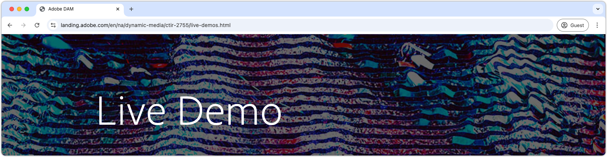

# Dynamische media gebruiken met AEM Assets {#understanding-aem-dynamic-media}

Deze videoreeks met meerdere delen geeft u een overzicht van hoe media-inhoud wordt beheerd en geopend met behulp van Adobe Experience Manager Dynamic Media als een service voor inhoud. Met Dynamic Media kunt u dynamische digitale ervaringen beheren en publiceren. Dit is een unieke functie van Experience Manager Assets. Met ons framework en onze reeks componenten kunnen marketers interactieve multimedia-ervaringen op alle apparaten aanpassen en leveren.

## Live demo over dynamische media

Verken de mogelijkheden van de Dynamische Media van Adobe met onze [**Levende Demo** ](https://landing.adobe.com/en/na/dynamic-media/ctir-2755/live-demos.html), waar de meest geavanceerde oplossingen aan het leven komen. Leer hoe [**Dynamische Assets** ](https://landing.adobe.com/en/na/dynamic-media/ctir-2755/dynamic-assets.html) werkschema&#39;s stroomlijnt en inhoudsbeheer opheft, en [**Interactieve Ervaringen** ](https://landing.adobe.com/en/na/dynamic-media/ctir-2755/interactive-experiences.html) ontdekt die publiek over elk kanaal fascineren. [ zie hoe de Dynamische Media uw inhoudsstrategie ](https://landing.adobe.com/en/na/dynamic-media/ctir-2755/live-demos.html) kunnen omzetten.

## Dynamisch mediaoverzicht

>[!VIDEO](https://video.tv.adobe.com/v/27144?quality=12&learn=on)

>[!NOTE]
>
>De functionaliteit die hier wordt getoond is beschikbaar met Dynamische Media DMS7 loopwijze, onze momenteel gesteunde looppas wijze, niet noodzakelijk DMHybrid looppas wijze, die DMS7 heeft vervangen.

In deze video wordt beschreven hoe media-inhoud wordt beheerd en geopend met behulp van Adobe Experience Manager Dynamic Media als een service voor inhoud. Dynamic Media werkt op basis van één methodiek voor Master Asset, waarbij u een afbeeldingselement of video-element uploadt die kan worden aangevraagd om te voldoen aan een onbeperkt aantal benodigde verbruiksvariaties of afgeleide uitvoeringen. Inbegrepen:

* Single Master-element naar URL-product leverbaar, uitgelegd
* Opties voor afbeeldingsverwerking
* Opties voor de inhoudviewer
* URL&#39;s kopiëren naar afbeeldingen en responsieve viewers
* Variaties voor slim uitsnijden in URL&#39;s

## Gebruiken met AEM Sites

>[!VIDEO](https://video.tv.adobe.com/v/27145?quality=12&learn=on)

>[!NOTE]
>
>De functionaliteit die hier wordt getoond is beschikbaar met Dynamische Media DMS7 loopwijze, onze momenteel gesteunde looppas wijze, niet noodzakelijk DMHybrid looppas wijze, die DMS7 heeft vervangen. Deze videoverwijzingsconcepten die in Deel 1 video (Dynamisch Overzicht van Media) worden beschreven.

In deze video wordt beschreven hoe media-inhoud wordt beheerd in Adobe Experience Manager Dynamic Media en eenvoudig kan worden gebruikt in AEM Sites, met een component, voor eenvoudige en automatisch bijgesneden optimalisatie op basis van responsieve paginabreedte. Maak eenvoudig een interactieve afbeeldingsbanner en genereer een kopie-URL die u kunt gebruiken in een systeem voor inhoudsbeheer.

* Flexibiliteit AEM Sites Dynamic Media-component
* Lokaal downloaden met voorinstellingen voor afbeeldingen
* Interactieve banner maken en publiceren

## Een gemengde mediaverzameling maken

>[!VIDEO](https://video.tv.adobe.com/v/27146?quality=12&learn=on)

>[!NOTE]
>
>De functionaliteit die hier wordt getoond is beschikbaar met Dynamische Media DMS7 loopwijze, onze momenteel gesteunde looppas wijze, niet noodzakelijk DMHybrid looppas wijze, die DMS7 heeft vervangen. Deze videoverwijzingsconcepten die in Deel 1 video (Dynamisch Overzicht van Media) worden beschreven.

In deze video wordt het eenvoudige proces beschreven voor het maken van een collectie media-elementen in een gemengde mediascherm, zoals een reeks scènes, video en verzameling van productafbeeldingen. Voeg inhoud toe aan de gemengde mediaset en maak een aangepaste viewer waaruit u kunt kiezen in de uiteindelijke kopie van de URL of de AEM Sites-component.

* Spin-set maken van de juiste productfoto&#39;s
* Matervideo uploaden en coderen voor Dynamic Media Video
* Gemengde mediaset maken op basis van de reeks Draaien, video en foto&#39;s
* Aangepaste viewer voor gemengde media bewerken en gebruiken

## Voorinstellingen afbeelding

>[!VIDEO](https://video.tv.adobe.com/v/27320?quality=12&learn=on)

In deze video wordt beschreven hoe Voorinstellingen afbeelding worden gemaakt en wat een voorinstelling voor een afbeelding is. Deze video bevat een URL die korter is voor een reeks argumenten van de afbeeldingsserver die op een afbeelding worden toegepast wanneer een URL hierom vraagt. Leer kostbare technieken voor het uitbreiden en bewerken van voorinstellingen voor afbeeldingen.

* Kortere weg verbergen voor voorinstelling afbeelding verzameling van expliciete opdrachten voor afbeeldingsserver
* Gebruik slechts één pixelafmeting (breedte OF hoogte) om nieuwe vergroot- of verkleingedeelde afbeeldingen zonder opvulling te gebruiken
* Altijd verscherpen gebruiken
* URL Modifier-veld om extra opdrachten toe te voegen voor het wijzigen van het formaat van de voorinstelling Afbeelding

## Geavanceerde URL-opties

>[!VIDEO](https://video.tv.adobe.com/v/27319?quality=12&learn=on)

In deze video wordt beschreven hoe u afbeeldingen kunt vergroten of verkleinen om gebruik te maken van functies van het bronbestand zelf, zoals achtergrondtransparantie, ingebouwde uitknippaden en uitsnijdpaden en tekst als variabelen, met de URL-opties van Dynamic Media.

* URL-wijzigingstoetsen gebruiken in het veld Dynamische mediawijziging
* Achtergrondkleur wijzigen voor afbeeldingen met transparantie
* Uitknippen naar een afbeeldingspad
* Uitsnijden naar een afbeeldingspad
* Een tekstsjabloon maken van een Photoshop-bestand

## JPEG-bestandsgroottebeheer

>[!VIDEO](https://video.tv.adobe.com/v/27404?quality=12&learn=on)

>[!NOTE]
>
>De kwaliteit van de afbeelding wordt gemeten in percentages van omgekeerde compressie, waarbij de kwaliteit van 100% het minst wordt gecomprimeerd, wat resulteert in afbeeldingen van hoge kwaliteit maar relatief grote bestanden. JPEG-compressie is een compressieschema met verlies waarbij compressie-instellingen de afbeeldingskwaliteit en de bestandsgrootte bepalen.

Vergelijk de kwaliteit van de JPEG-afbeelding met de resulterende bestandsgrootte (in kilobytes) om de snelheid van het laden van de pagina te verhogen met behulp van twee opdrachten om de instellingen voor JPEG-compressie aan te passen. QLT definieert de afbeeldingskwaliteit door de kwaliteitsinstellingen voor JPEG-compressie aan te passen. Met de opdracht JPEG Size kunt u aangeven welke bestandsgrootte moet worden bereikt met compressie.

## Ondertiteling

>[!VIDEO](https://video.tv.adobe.com/v/28074?quality=12&learn=on)

U kunt eenvoudig Closed Captioning toevoegen aan dynamische media-video door de URL van Kopiëren toe te voegen om te wijzen naar een extra Closed Captioning-bestandsdocument, een secundair bestand web.VTT dat de CC-informatie voor elke video bevat.

## Afbeelding verscherpen

In deze video wordt uitgelegd waarom het verscherpen van een afbeelding van essentieel belang is voor het behouden van de beeldkwaliteit en voor het gebruik van geavanceerde instellingen voor het maken van het perfecte beeld.

>[!VIDEO](https://demos-pub.assetsadobe.com/etc/dam/viewers/s7viewers/html5/VideoViewer.html?asset=%2Fcontent%2Fdam%2Fdm-public-facing-upgrade-portal-video%2F04_DynamicImagery_AdvancedSettings_071917_BH.mp4&amp;config=/etc/dam/presets/viewer/Video_social&amp;serverUrl=https%3A%2F%2Fadobedemo62-h.assetsadobe.com%2Fis%2Fimage%2F&amp;contenturl=%2F&amp;config2=/etc/dam/presets/analytics&amp;videoserverurl=https://gateway-na.assetsadobe.com/DMGateway/public/demoCo&amp;posterimage=/content/dam/dm-public-facing-upgrade-portal-video/04_DynamicImagery_AdvancedSettings_071917_BH.mp4)
