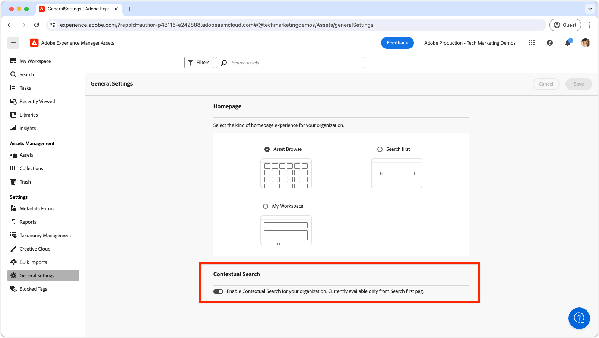

# Contextuele zoekopdracht

Leer hoe u Contextual Search in Adobe Experience Manager Assets kunt gebruiken om op efficiënte wijze middelen te zoeken met zoekopdrachten in natuurlijke talen.

>[!VIDEO](https://video.tv.adobe.com/v/3428667/?learn=on)

## Contextafhankelijke zoekopdracht in-/uitschakelen

Om contextafhankelijke onderzoek voor alle gebruikers toe te laten of onbruikbaar te maken, kunnen de beheerders van AEM dit doen door aan de __Algemene Montages__ te navigeren en de __Contextuele schakelaar van het Onderzoek__ van een knevel te voorzien schakelaar aan het gewenste plaatsen.

Contextafhankelijke zoekopdrachten zijn standaard ingeschakeld voor alle gebruikers.

 toe