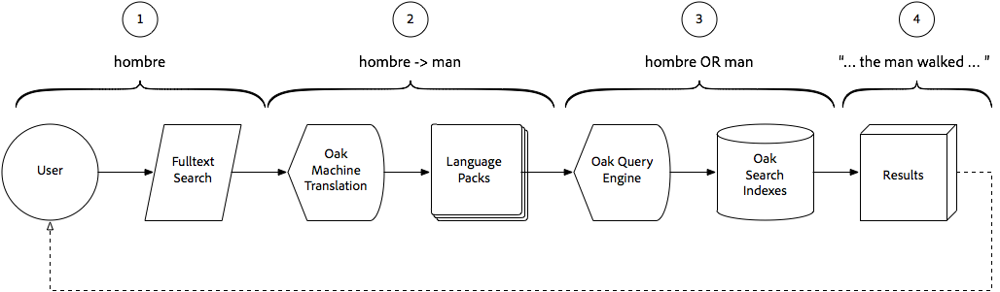

# Smart Translation Search gebruiken met AEM Assets{#using-smart-translation-search-with-aem-assets}

Met Smart Translation Search kunt u automatisch zoeken en zoeken in verschillende talen via AEM inhoud, zowel Middelen als Pagina&#39;s, waardoor meer dan 50 talen worden ondersteund en de behoefte aan handmatig vertalen van inhoud wordt verminderd.

>[!VIDEO](https://video.tv.adobe.com/v/21297/?quality=9&learn=on)

Met AEM Smart Translation Search kunnen gebruikers zoeken naar inhoud in AEM met niet-Engelse termen, zodat deze overeenkomen met de elementen in AEM met vergelijkbare Engelse termen.

Smart Translation Search is een perfecte aanvulling op AEM Slimme tags die worden toegepast op middelen in het Engels.

In deze video wordt ervan uitgegaan dat [AEM Smart Translation Search](smart-translation-search-technical-video-setup.md) is ingesteld.

## Hoe Smart Translation Search werkt {#how-smart-translation-search-works}

1. AEM gebruiker voert een full-text onderzoek uit, die een gelokaliseerde onderzoekstermijn (bijv. verstrekt. de Spaanse term &quot;man&quot;, &quot;hombre&quot;).
2. De Smart Translation Search, die wordt geleverd door de Apache Oak Machine Translation OSGi-bundel, is betrokken en evalueert of de aangeboden zoektermen kunnen worden vertaald met de geregistreerde taalpakketten.
3. Alle vertaalde termijnen van Stap #2 worden verzameld, en de vraag wordt intern uitgebreid om hen als onderzoekstermijnen te omvatten. Deze uitgebreide reeks zoektermen wordt standaard geëvalueerd aan de hand van AEM zoekindexen die relevante overeenkomsten zoeken.
4. De zoekresultaten die overeenkomen met de oorspronkelijke term (&#39;hombre&#39;) of de vertaalde term (&#39;man&#39;) worden verzameld en geretourneerd als zoekresultaten.

## Aanvullende bronnen{#additional-resources}

* [Smart Translation Search instellen met AEM Assets](smart-translation-search-technical-video-setup.md)
* [Apache Joshua Language Packs](https://cwiki.apache.org/confluence/display/JOSHUA/Language+Packs)