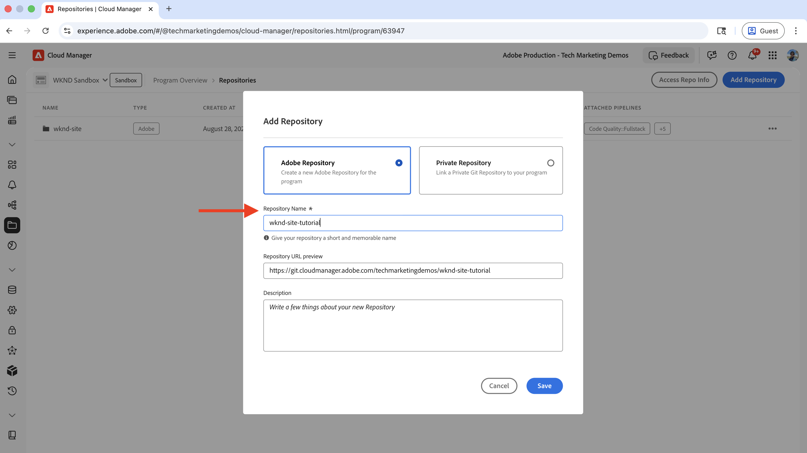
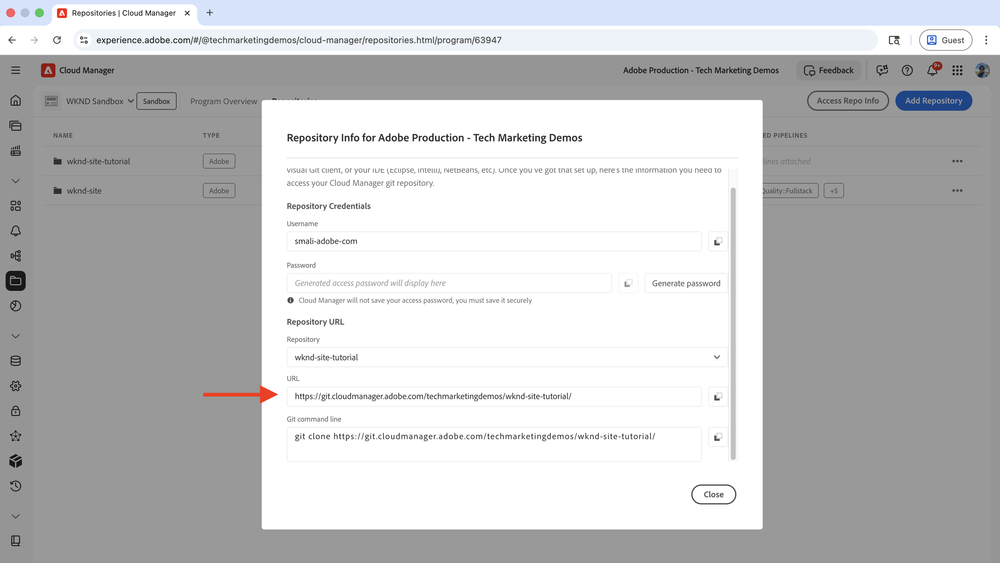
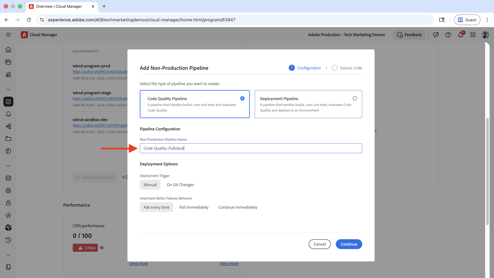
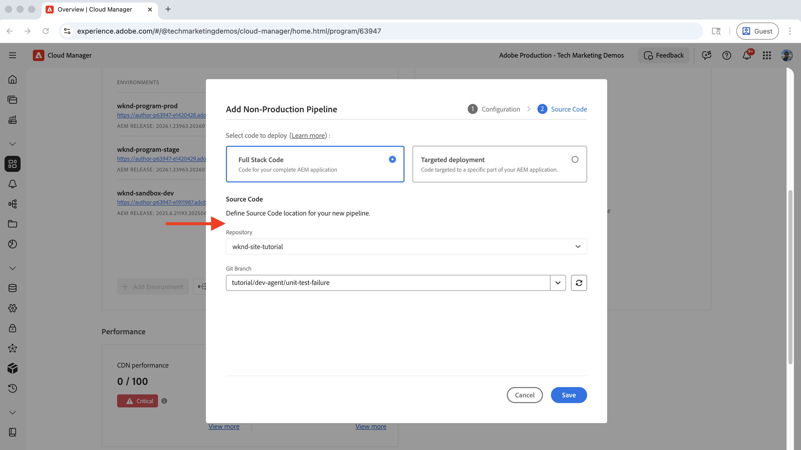
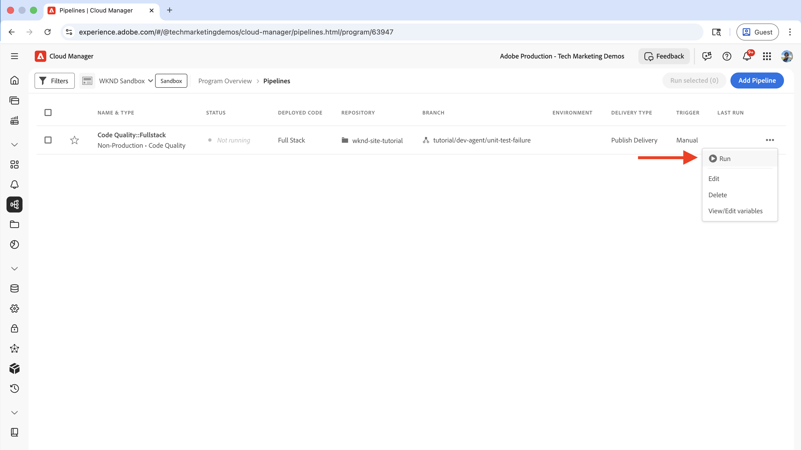
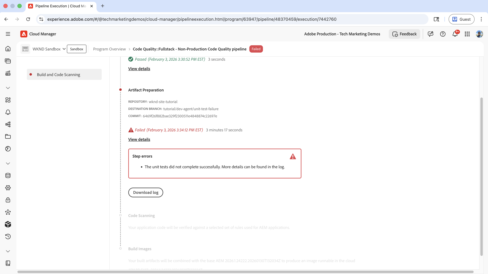
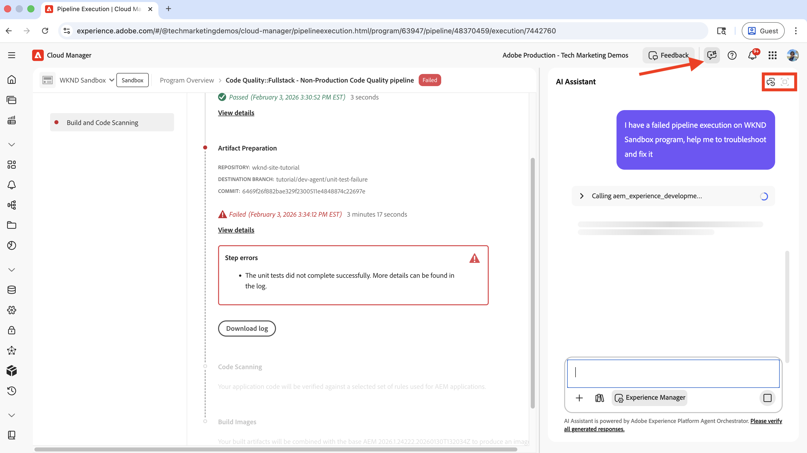
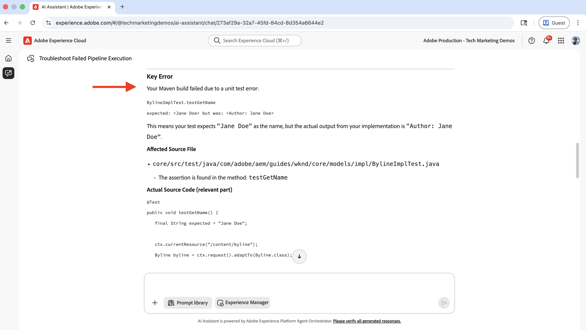
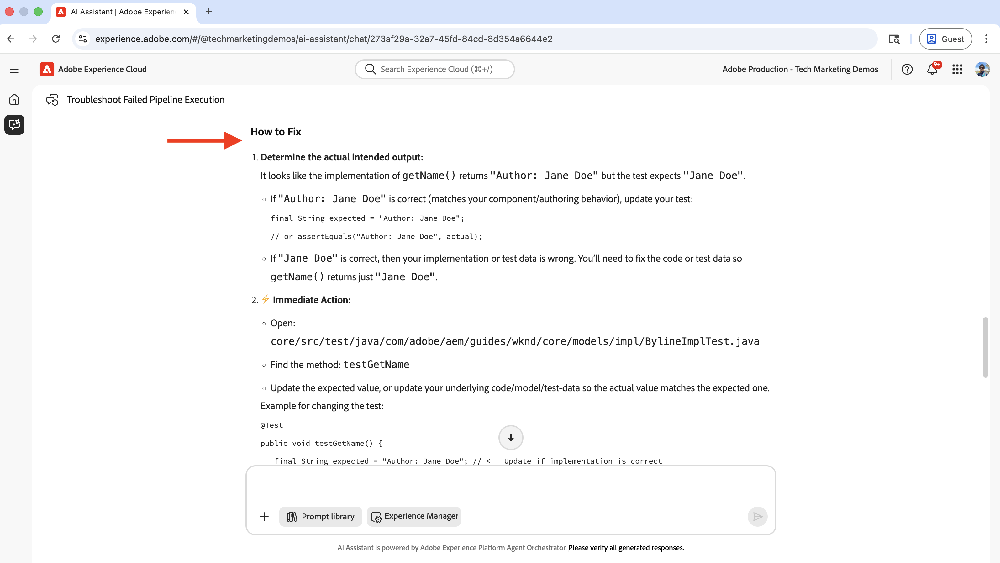
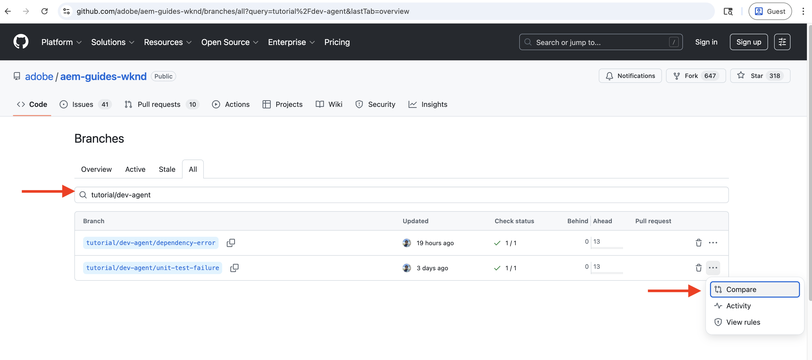

# Los CI/CD Pijpleiding problemen op gebruikend de Agent van de Ontwikkeling van AEM

Leer hoe te om een ontbroken pijpleiding problemen op te lossen CI/CD gebruikend de Agent van de Ontwikkeling van AEM.

De agent van de Ontwikkeling van AEM helpt technische teams, met inbegrip van ontwikkelaars, ingenieurs DevOps, en beheerders om hun werkschema&#39;s **te versnellen door** AI-Vervaardigde begeleiding en acties _te verstrekken._

>[!TIP]
>
> Zie ook [&#x200B; Overzicht van Agenten in AEM &#x200B;](https://experienceleague.adobe.com/nl/docs/experience-manager-cloud-service/content/ai-in-aem/agents/overview) voor een volledige lijst van beschikbare Agenten in AEM as a Cloud Service, hun functionaliteit, en hoe u toegang tot hen kunt krijgen.


## Overzicht

De AEM Development Agent biedt verscheidene mogelijkheden, met inbegrip van de capaciteit aan lijst, problemen op te lossen, en ontbroken pijpleidingen CI/CD te bevestigen. U kunt de AEM Development Agent via de AI Assistant aanroepen om uw specifieke gebruiksgevallen aan te pakken.

Dit leerprogramma gebruikt het [&#x200B; Project van Plaatsen WKND &#x200B;](https://github.com/adobe/aem-guides-wknd) om aan te tonen hoe te om een ontbroken pijpleiding problemen op te lossen CI/CD gebruikend de Agent van de Ontwikkeling van AEM te bevestigen en te bevestigen. Dezelfde beginselen gelden voor elk AEM-project.

Voor de eenvoud introduceert deze zelfstudie een fout met een eenheidstest in het `BylineImpl.java` -bestand om de mogelijkheden van de AEM Development Agent voor het oplossen van problemen met pijpleidingen te tonen.

## Vereisten

Voor het volgen van deze zelfstudie hebt u het volgende nodig:

- AI Assistant en Agents in AEM ingeschakeld. Zie [&#x200B; Opstelling AI in AEM &#x200B;](../setup.md) voor details, en merk op dat playareas die in dat artikel worden vermeld geen mogelijkheden van de Agent van de Ontwikkeling van AEM zullen hebben.
- De toegang tot Adobe [&#x200B; Cloud Manager &#x200B;](https://my.cloudmanager.adobe.com/) met een rol van de Manager van de Ontwikkelaar of van de Manager van het Programma. Zie [&#x200B; roldefinities &#x200B;](https://experienceleague.adobe.com/nl/docs/experience-manager-cloud-manager/content/requirements/users-and-roles#role-definitions) voor meer informatie.
- Een AEM as a Cloud Service-omgeving
- Toegang tot Agenten in AEM via het [&#x200B; programma van Beta &#x200B;](https://experienceleague.adobe.com/nl/docs/experience-manager-cloud-service/content/release-notes/release-notes/release-notes-current#aem-beta-programs)
- Het [&#x200B; WKND Project van Plaatsen &#x200B;](https://github.com/adobe/aem-guides-wknd) gekloond aan uw lokale machine

### Huidige mogelijkheden van AEM Development Agent

Voordat u in de zelfstudie gaat duiken, controleren we de huidige mogelijkheden van de AEM Development Agent:

- Lijst van CI/CD-pijpleidingen en hun status
- Los en los ontbroken **volledig-stapel** pijpleidingen, met inbegrip van zowel _Kwaliteit van de Code_ en _de types van Plaatsing_ problemen op.
- _bouwt_ (aanvulling van de code om een plaatsbaar artefact te veroorzaken) en _Kwaliteit van de Code_ (statische codeanalyse via regels SonarQube) stappen van de **volledig-stapel** pijpleidingen worden gesteund.

De capaciteiten van de AEM Development Agent worden voortdurend uitgebreid en regelmatig bijgewerkt. Voor terugkoppelen en suggesties, e-mail [&#x200B; aem-devagent@adobe.com &#x200B;](mailto:aem-devagent@adobe.com).

## Instellen

Voer de volgende stappen op hoog niveau uit om deze zelfstudie te voltooien:

1. Kloon het [&#x200B; Project van Plaatsen WKND &#x200B;](https://github.com/adobe/aem-guides-wknd) en duw het aan uw bewaarplaats van de Git van Cloud Manager
2. Creeer en vorm een pijpleiding van de Kwaliteit van de Code
3. De pijpleiding in werking stellen en de ontbroken uitvoering waarnemen
4. Gebruik de Agent van de Ontwikkeling van AEM om de ontbroken pijpleiding problemen op te lossen en te bevestigen

Laten we elke stap in detail doorlopen.

### WKND-siteproject gebruiken als een demoproject

In deze zelfstudie wordt de vertakking `tutorial/dev-agent/unit-test-failure` van het WKND-siteproject gebruikt om te tonen hoe u de AEM Development Agent kunt gebruiken. Dezelfde beginselen kunnen worden toegepast op elk AEM-project.

- Het bestand `BylineImpl.java` bevat als volgt een evaluatiefout voor de eenheid. Als u uw eigen AEM-project gebruikt, kunt u een vergelijkbare fout met de eenheidstest introduceren.

  ```java
  ...
  @Override
  public String getName() {
      if (name != null) {
          return "Author: " + name; // This line is intentionally incorrect to introduce a unit test failure.
      }
      return name;
  }
  ...
  ```

- Kloon het [&#x200B; Project van Plaatsen WKND &#x200B;](https://github.com/adobe/aem-guides-wknd) aan uw lokale machine, navigeer aan de projectfolder, en schakelaar aan de `tutorial/dev-agent/unit-test-failure` tak.

  ```shell
  git clone https://github.com/adobe/aem-guides-wknd.git
  cd aem-guides-wknd
  git checkout tutorial/dev-agent/unit-test-failure
  ```

- Maak een nieuwe Cloud Manager Git-opslagplaats voor het WKND Sites Project en voeg deze als een externe opslagplaats toe aan uw lokale Git-opslagplaats:

   - Navigeer aan Adobe [&#x200B; Cloud Manager &#x200B;](https://my.cloudmanager.adobe.com/) en selecteer uw programma.
   - Klik **Bewaarplaatsen** in linkerzijbalk.
   - Klik **toevoegen Bewaarplaats** in de hoogste juiste hoek.
   - Ga de Naam van de a **Bewaarplaats** (bijvoorbeeld, &quot;wknd-plaats-leerprogramma&quot;) in en klik **sparen**. Wacht tot de opslagplaats is gemaakt.

      toe

   - Klik **Info van de Reactie van de Toegang** in de hoogste juiste hoek en kopieer de bewaarplaats URL.

     

   - Voeg de nieuwe Cloud Manager Git-opslagplaats als een externe opslagplaats toe aan uw lokale Git-opslagplaats:

     ```shell
     git remote add adobe https://git.cloudmanager.adobe.com/<your-adobe-organization>/wknd-site-tutorial/
     ```

- Push your local Git repository to the Cloud Manager Git repository:

  ```shell
  git push adobe
  ```

  Wanneer ertoe aangezet voor geloofsbrieven, verstrek het **Gebruikersnaam** en **Wachtwoord** van de Informatie van de Bewaarplaats van Cloud Manager **&#x200B;**&#x200B;modaal.

### Creeer en vorm een Pijpleiding van de Kwaliteit van de Code

Dit leerprogramma gebruikt een pijpleiding van de Kwaliteit van de Code (niet-productie) om de pijpleidingsmislukking voor het oplossen van problemen teweeg te brengen. Zie [&#x200B; Inleiding aan CI/CD pijpleidingen &#x200B;](https://experienceleague.adobe.com/nl/docs/experience-manager-cloud-service/content/implementing/using-cloud-manager/cicd-pipelines/introduction-ci-cd-pipelines#introduction) voor meer informatie over de pijpleidingen van de Kwaliteit van de Code.

- In Cloud Manager, navigeer aan de **sectie van de Pijpleidingen** en selecteer **&#x200B;**&#x200B;toevoegen > **toevoegen niet-Productiepijpleiding**.
- In **voeg de dialoog van de Pijpleiding van de Niet-Productie** toe, vorm het volgende:

   - **de stap van de Configuratie**:
      - Houd de standaardwaarden als **Type van Pijpleiding** als `Code Quality Pipeline` en **Trigger van de Plaatsing** als `Manual`.
      - Voor **niet-Productie de Naam van de Pijpleiding**, ga `Code Quality::Fullstack` in

      toe

   - **de Code van Source** stap:
      - Selecteer **Volledige Code van de Stapel**
      - Voor **Bewaarplaats**, selecteer de pas gecreëerde Opslagplaats van de Git van Cloud Manager
      - Voor **Tak van de Git**, uitgezochte `tutorial/dev-agent/unit-test-failure`
      - Klik **sparen**

      toe

- Stel de onlangs gecreeerde pijpleiding van de Kwaliteit van de Code in werking door **Looppas** in het drie-punt menu van de pijpleidingsingang te klikken.

  


>[!IMPORTANT]
>
> De pijpleiding van de Plaatsing is niet behandeld in deze zelfstudie. Nochtans, kunt u de zelfde principes volgen om een ontbroken Pijpleiding van de Plaatsing problemen op te lossen en te bevestigen.


### Bekijk de Mislukte Uitvoering van de Pijpleiding

De pijpleiding van de Kwaliteit van de Code ontbreekt in de **stap van de Voorbereiding van Artefact 0&rbrace; met een fout:**



Zonder de AEM Development Agent, vereist deze pijpleidingsmislukking handmatige het oplossen van problemen. Een ontwikkelaar zou de logboeken moeten controleren en code-een vervelend en tijdrovend proces herzien.

Daarna, ziet u hoe de Agent AI de ontbroken pijpleidingsuitvoering kan problemen oplossen en bevestigen.

## AEM Development Agent gebruiken om problemen op te lossen en de mislukte pijplijn te herstellen

U kunt de AEM Development Agent aanroepen met behulp van de AI Assistant in AEM door de fout in de pijpleiding in de natuurlijke taal te beschrijven.

- Klik het **AI Medewerker** pictogram in de hoogste juiste hoek.

- Ga de details van de pijpleidingsmislukking in natuurlijke taal alias **Vragen** in. Bijvoorbeeld:

  ```text
  I have a failed pipeline execution on %PROGRAM-NAME% program, help me to troubleshoot and fix it.
  ```

   aan

  De **Agent van de Ontwikkeling van AEM** wordt aangehaald om de ontbroken pijpleidingsuitvoering problemen op te lossen en te bevestigen.

  >[!NOTE]
  >
  > Als de ingevoerde herinnering niet duidelijk is, vraagt de AI Medewerker om verduidelijking en verstrekt informatie om u te helpen de herinnering verfijnen.

- Zodra het redeneren volledig is, klik **Open in volledig scherm** pictogram om het gedetailleerde het oplossen van problemenproces te bekijken.

  

  De resultaten bevatten waardevolle inzichten met inbegrip van foutendetails, het brondossier, lijnaantal, en a **hoe te 1&rbrace; sectie met duidelijke stappen bevestigen om de kwestie op te lossen.**

- In dit geval, stelde de agent correct of veranderend de implementatie (`getName()` methode) of het bijwerken van de eenheidstest (`getNameTest()` methode) voor om de kwestie te bevestigen. Het vermeden hallucinatie en gebruikte een mens-in-de-lusbenadering terwijl het verstrekken van actionable codeveranderingen voor de ontwikkelaar.

  

- Werk het `BylineImpl.java` -bestand bij met de voorgestelde codewijzigingen en wijs de wijzigingen vervolgens toe aan de Cloud Manager Git-opslagplaats en duw deze door.

  ```java
  ...
  @Override
  public String getName() {
      return name;
  }
  ...
  ```

- Voer de pijplijn opnieuw uit en bekijk de succesvolle uitvoering.

## Aanvullende voorbeelden

Het project van Plaatsen WKND omvat extra voorbeelden van gebroken code en configuratiekwesties, zoals ontbrekende gebiedsdelen en onjuiste configuratie. U kunt deze voorbeelden onderzoeken door de [&#x200B; takken uit te checken die met `tutorial/dev-agent/` &#x200B;](https://github.com/adobe/aem-guides-wknd/branches/all?query=tutorial%2Fdev-agent&lastTab=overview) beginnen. Om de het breken veranderingen te zien, kunt u de `tutorial/dev-agent/unit-test-failure` tak met de `main` tak vergelijken door **te klikken vergelijk** knoop. Dan zoek het _veranderde dossier_ sectie.

 vergelijken

Zie ook de [&#x200B; herinneringen van de Steekproef &#x200B;](https://experienceleague.adobe.com/nl/docs/experience-manager-cloud-service/content/ai-in-aem/agents/development/overview#sample-prompts) om meer ideeën op te krijgen hoe te om de Agent van de Ontwikkeling van AEM te gebruiken.

## Samenvatting

In dit leerprogramma, leerde u hoe te om de Agent van de Ontwikkeling van AEM te gebruiken om een ontbroken pijpleiding problemen op te lossen en te bevestigen CI/CD gebruikend de Medewerker AI. U hebt ook geleerd hoe de technische workflows worden versneld door middel van actioneerbare inzichten en wijzigingen in de code.

Begin gebruikend de Agent van de Ontwikkeling van AEM en andere Agenten in AEM om uw werkschema&#39;s te versnellen, zie [&#x200B; Overzicht van Agenten in AEM &#x200B;](https://experienceleague.adobe.com/nl/docs/experience-manager-cloud-service/content/ai-in-aem/agents/overview) voor meer informatie.

## Aanvullende bronnen

- [AI in Experience Manager](../overview.md)
- [&#x200B; Overzicht van Agenten in AEM &#x200B;](https://experienceleague.adobe.com/nl/docs/experience-manager-cloud-service/content/ai-in-aem/agents/overview)
- [&#x200B; Overzicht van de Agent van de Ontwikkeling &#x200B;](https://experienceleague.adobe.com/nl/docs/experience-manager-cloud-service/content/ai-in-aem/agents/development/overview)
- [&#x200B; Overzicht van Agenten in AEM &#x200B;](https://experienceleague.adobe.com/nl/docs/experience-manager-cloud-service/content/ai-in-aem/agents/overview)
