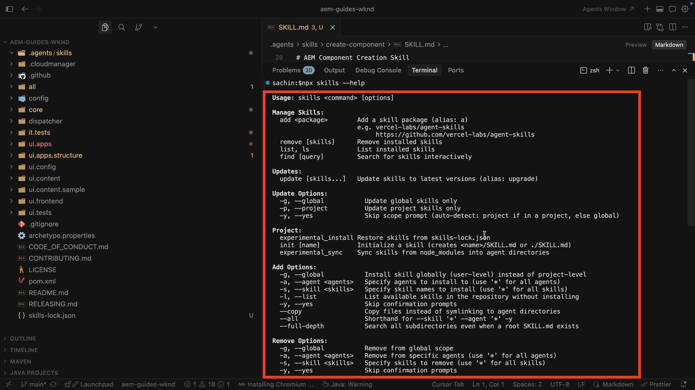

# AEM Agent-vaardigheden instellen

Leer hoe u AEM Agent Skills instelt voor AI-ondersteunde ontwikkeling.

Wanneer u een coderingsagent door een op AI-Gebaseerde winde vraagt om aan de ontwikkelingstaken van AEM te werken, kan het **procedurebegeleiding van de Vaardigheden van de Agent van 0&rbrace; AEM van Adobe gebruiken in plaats van zich alleen op generische modelopleiding te baseren of wat het van uw bewaarplaats alleen kan afleiden.**

Adobe verstrekt de Vaardigheden van de Agent van AEM via [&#x200B; Adobe Skills &#x200B;](https://github.com/adobe/skills) bewaarplaats. Zie ook de [&#x200B; AI-Gesteunde ontwikkeling &#x200B;](../overview.md) voor hoe Adobe met AI-Gesteunde ontwikkeling helpt.

In dit leerprogramma, installeert u de vaardigheden op een lokale kloon van het [&#x200B; Project van Plaatsen WKND &#x200B;](https://github.com/adobe/aem-guides-wknd). U kunt dezelfde stappen gebruiken voor uw eigen AEM as a Cloud Service-project.

## Vereisten

Voor het volgen van deze zelfstudie hebt u het volgende nodig:

- Een lokale kloon van het [&#x200B; Project van de Plaatsen WKND &#x200B;](https://github.com/adobe/aem-guides-wknd) of uw eigen project van AEM as a Cloud Service.
- Een IDE van AI-Aangedreven zoals Cursor, of Code van Visual Studio met Kopilot GitHub.

## AEM Agent-vaardigheden installeren

Installeer de Vaardigheden van de Agent van AEM met het `npx` bevel (vereist [&#x200B; Node.js &#x200B;](https://nodejs.org/) zodat `npx` beschikbaar is). Voor andere installeer opties, bijvoorbeeld, de stoppen van de Code van Claude of de uitbreiding GitHub CLI, zie de [&#x200B; sectie van de Installatie &#x200B;](https://github.com/adobe/skills/tree/main#installation) in de bewaarplaats van de Vaardigheden van Adobe.

1. Kloon het [&#x200B; Project van Plaatsen WKND &#x200B;](https://github.com/adobe/aem-guides-wknd) plaatselijk:

   ```shell
   $ git clone https://github.com/adobe/aem-guides-wknd.git
   ```

1. Open het gekloonde project in uw op AI-Gebaseerde winde (bijvoorbeeld, Cursor) en open de geïntegreerde terminal.
   

1. Voer het volgende bevel in werking om de Vaardigheden van de Agent van AEM voor Cursor toe te voegen:

   ```shell
   $ npx skills add https://github.com/adobe/skills/tree/main/plugins/aem/cloud-service --agent cursor
   ```

   Voor andere agententypes, zie de [&#x200B; sectie van de Installatie &#x200B;](https://github.com/adobe/skills/tree/main#installation) in de bewaarplaats van de Vaardigheden van Adobe.

1. Kies bij de aanwijzing welke AEM Agent Skills u wilt installeren.
    te installeren

   Selecteer de **verzekeren-agenten-md** vaardigheid zodat kan het installatieprogramma **AGENTS.md** en **CLAUDE.md** dossiers bij de bewaarplaatshouder tot stand brengen. Die bootstrap vaardigheid inspecteert uw project, bijvoorbeeld, de wortel `pom.xml` en modules, en produceert op maat gemaakte agentenbegeleiding.

   Als **AGENTS.md** reeds bestaat, wordt het **niet** beschreven.

1. Kies het installatiebereik. Voor deze analyse, is het **1&rbrace; werkingsgebied van het Project &lbrace;typisch zo vaardigheidsdossiers in de repo leven.**
   

1. Bevestig de installatie onder `.agents/skills` . U zou **SKILLS.md** en verwante verwijzing en activaomslagen moeten zien.
   

1. Wanneer Adobe vaardigheden toevoegt of bijwerkt, gebruik CLI om, hen toe te voegen bij te werken, te verwijderen of te vermelden. Alle opdrachten weergeven:

   ```shell
   $ npx skills --help
   ```

   

## Gevallen gebruiken

<!-- 
CARDS
{target = _self}

* ../use-cases/component-development.md    
    {title = Create AEM Component with AI-assisted development}
    {description = Learn how to use AI-assisted development to develop AEM components.}
    {image = ../assets/component-development/review-generated-code.png}
    {cta = Create AEM Component}
-->
<!-- START CARDS HTML - DO NOT MODIFY BY HAND -->
<div class="columns">
    <div class="column is-half-tablet is-half-desktop is-one-third-widescreen" aria-label="Create AEM Component with AI-assisted development">
        <div class="card" style="height: 100%; display: flex; flex-direction: column; height: 100%;">
            <div class="card-image">
                <figure class="image x-is-16by9">
                    <a href="../use-cases/component-development.md" title="AEM-component maken met ondersteuning voor AI" target="_self" rel="referrer">
                        
                    </a>
                </figure>
            </div>
            <div class="card-content is-padded-small" style="display: flex; flex-direction: column; flex-grow: 1; justify-content: space-between;">
                <div class="top-card-content">
                    <p class="headline is-size-6 has-text-weight-bold">
                        <a href="../use-cases/component-development.md" target="_self" rel="referrer" title="AEM-component maken met ondersteuning voor AI"> creeer de Component van AEM met AI-bijgewoonde ontwikkeling </a>
                    </p>
                    <p class="is-size-6">Leer hoe u AEM-componenten kunt ontwikkelen met behulp van AIR-ondersteunde ontwikkeling.</p>
                </div>
                <a href="../use-cases/component-development.md" target="_self" rel="referrer" class="spectrum-Button spectrum-Button--outline spectrum-Button--primary spectrum-Button--sizeM" style="align-self: flex-start; margin-top: 1rem;">
                    <span class="spectrum-Button-label has-no-wrap has-text-weight-bold"> creeer de Component van AEM </span>
                </a>
            </div>
        </div>
    </div>
</div>
<!-- END CARDS HTML - DO NOT MODIFY BY HAND -->

## Aanvullende bronnen

- [Lokale ontwikkeling met AI-tools](https://experienceleague.adobe.com/en/docs/experience-manager-cloud-service/content/ai-in-aem/local-development-with-ai-tools)

- [Adobe Skills voor AI-coderingsagents](https://github.com/adobe/skills)

- [AGENTS.md](https://agents.md/)

- [Agent Skills](https://agentskills.io/home)
