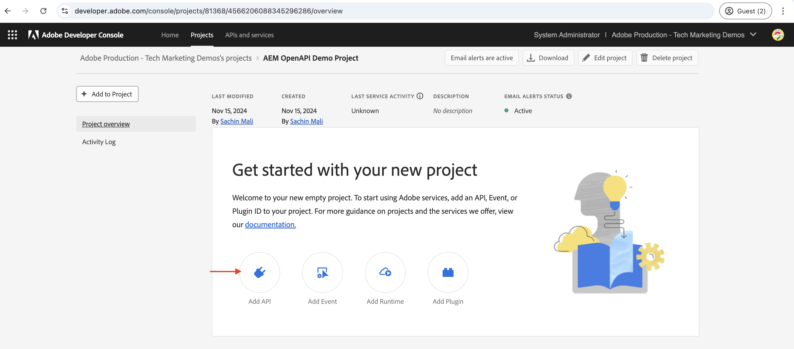

# API&#39;s voor OpenAPI&#39;s AEM{#invoke-openapi-based-aem-apis}

Leer hoe u op OpenAPI gebaseerde API&#39;s voor AEM op AEM as a Cloud Service kunt aanroepen vanuit aangepaste toepassingen.

>[!AVAILABILITY]
>
>API&#39;s die zijn gebaseerd op OpenAPI zijn beschikbaar als onderdeel van een programma voor vroege toegang. Als u in de toegang tot van hen geinteresseerd bent, moedigen wij u aan om [ aem-apis@adobe.com ](mailto:aem-apis@adobe.com) met een beschrijving van uw gebruiksgeval te e-mailen.

In deze zelfstudie leert u hoe u:

- Schakel op OpenAPI gebaseerde AEM API&#39;s toegang voor uw AEM as a Cloud Service-omgeving in.
- Creeer en vorm een project van Adobe Developer Console (ADC) om tot AEM APIs toegang te hebben gebruikend Server-aan-Server authentificatie OAuth.
- Ontwikkelen van een voorbeeldtoepassing NodeJS die de Assets-auteur-API aanroept om metagegevens voor een bepaald element op te halen.

Alvorens u begint, zorg ervoor u de [ Toegang tot Adobe APIs en verwante concepten ](overview.md#accessing-adobe-apis-and-related-concepts) sectie herzien.

## Vereisten

U hebt het volgende nodig om deze zelfstudie te voltooien:

- Modernisering van de AEM as a Cloud Service-omgeving met het volgende:
   - AEM Release `2024.10.18459.20241031T210302Z` of hoger.
   - Nieuwe stijlproductprofielen (als de omgeving vóór november 2024 is gemaakt)

- Het steekproef [ WKND ](https://github.com/adobe/aem-guides-wknd?#aem-wknd-sites-project) project van Plaatsen moet op het worden opgesteld.

- Toegang tot [ Adobe Developer Console ](https://developer.adobe.com/developer-console/docs/guides/getting-started/).

- Installeer [ Node.js ](https://nodejs.org/en/) op uw lokale machine om de toepassing van steekproefNodeJS in werking te stellen.

## Ontwikkelingsstappen

De ontwikkelingsstappen op hoog niveau zijn:

1. Modernisering van de AEM as a Cloud Service-omgeving.
1. Toegang tot AEM API&#39;s inschakelen.
1. Maak een Adobe Developer Console-project (ADC).
1. ADC-project configureren
   1. Voeg gewenste AEM-API&#39;s toe
   1. De verificatie configureren
   1. Productprofiel koppelen aan de verificatieconfiguratie
1. Vorm de AEM instantie om de mededeling van het Project van ADC toe te laten
1. Een voorbeeld van een NodeJS-toepassing ontwikkelen
1. Verifieer de stroom van begin tot eind

## Modernisering van de AEM as a Cloud Service-omgeving

Laten we beginnen met het moderniseren van de AEM as a Cloud Service-omgeving. Deze stap is alleen nodig als het milieu niet wordt gemoderniseerd.

De modernisering van de AEM as a Cloud Service-omgeving is een proces in twee stappen,

- Bijwerken naar de nieuwste versie AEM release
- Voeg nieuwe productprofielen toe.

### AEM bijwerken

Om de AEM instantie bij te werken, in de Adobe [ Cloud Manager _de sectie van Milieu&#39;s_, selecteert het _ellips_ pictogram naast de milieunaam en selecteert **Update** optie.](https://my.cloudmanager.adobe.com/)


Dan klik **voorleggen** knoop en stel de voorgestelde FullstackPipeline in werking.


In mijn geval, is de naam van Pijpleiding Fullstack _Dev:: Fullstack-Deploy_ en de AEM milieunaam is _wknd-programma-dev_ het kan in uw geval variëren.

### Nieuwe productprofielen toevoegen

Om nieuwe Profielen van het Product aan de AEM instantie toe te voegen, in de 2} sectie van de Milieu&#39;s ](https://my.cloudmanager.adobe.com/) van de Adobe [ Cloud Manager _, selecteer het_ ellips _pictogram naast de milieunaam en selecteer **toevoegen de optie van de Profielen van het Product**._

 toe

U kunt de onlangs toegevoegde Profielen van het Product herzien door op het _ellips_ pictogram naast de milieunaam te klikken en **te selecteren beheert Toegang** > **Profielen van de Auteur**.

Het _venster van de Admin Console_ toont de onlangs toegevoegde Profielen van het Product.


Met de bovenstaande stappen wordt de modernisering van de AEM as a Cloud Service-omgeving voltooid.

## Toegang tot AEM API&#39;s inschakelen

Met nieuwe productprofielen hebt u toegang tot de API (OpenAPI) op basis van AEM.

De onlangs toegevoegde Profielen van het Product worden geassocieerd met de _Diensten_ die AEM gebruikersgroepen met vooraf bepaalde Lijsten van het Toegangsbeheer (ACLs) vertegenwoordigen. De _Diensten_ worden gebruikt om het niveau van toegang tot AEM APIs te controleren.

U kunt de _Diensten_ ook selecteren of schrappen verbonden aan het Profiel van het Product om het niveau van toegang te verminderen of te verhogen.

Herzie de vereniging door op het _pictogram van de Details van de Mening_ naast de naam van het Profiel van het Product te klikken.

{de diensten van het 0} Overzicht verbonden aan het Profiel van het Product ](assets/review-services-associated-with-product-profile.png)![

Door gebrek, wordt de **AEM Assets API Gebruikers** Dienst niet geassocieerd met om het even welk Profiel van het Product. Laat ons het met de onlangs toegevoegde **AEM Beheerders - auteur - Programma XXX - Milieu XXX** Profiel van het Product associëren. Na deze vereniging, kan de 20} ActivaAuteur API van het Project ADC _de Server-aan-Server authentificatie van OAuth plaatsen en de authentificatierekening met het Profiel van het Product associëren._


Het is belangrijk om op te merken dat vóór de modernisering, in AEM instantie van de Auteur, twee Profielen van het Product beschikbaar waren, **AEM beheerders-XXX** en **AEM gebruikers-XXX**. Het is ook mogelijk om deze bestaande Profielen van het Product met de nieuwe Diensten te associëren.

## Adobe Developer Console-project (ADC) maken

Maak vervolgens een ADC-project voor toegang tot AEM API&#39;s.

1. Login aan [ Adobe Developer Console ](https://developer.adobe.com/console) gebruikend uw Adobe ID.

   

1. Van de _Snelle sectie van het Begin_, klik op **creeer nieuwe project** knoop.

   

1. Het leidt tot een nieuw project met de standaardnaam.

   

1. Bewerk de projectnaam door **te klikken uitgeeft project** knoop in de hoogste juiste hoek. Verstrek een betekenisvolle naam en klik **sparen**.

    uit

## ADC-project configureren

Vervolgens configureert u het ADC-project om AEM API&#39;s toe te voegen, de verificatie ervan te configureren en het productprofiel te koppelen.

1. Om AEM APIs toe te voegen, klik op **API** knoop toevoegen.

    toe

1. In _voeg API_ dialoog toe, filter door _Experience Cloud_ en selecteer **de Auteur API van AEM Assets** kaart en klik **daarna**.

    toe

1. Daarna, in _vorm API_ dialoog, selecteer de **server-aan-server** authentificatieoptie en klik **daarna**. De server-aan-server authentificatie is ideaal voor de backenddiensten die API toegang zonder gebruikersinteractie vereisen.

   

1. Wijzig de naam van de referentie voor gemakkelijkere identificatie (indien nodig) en klik **daarna**. Voor demo-doeleinden wordt de standaardnaam gebruikt.

    anders

1. Selecteer de **AEM Beheerders - auteur - Programma XXX - Milieu XXX** Profiel van het Product en klik **sparen**. Zoals u ziet, is alleen het productprofiel dat is gekoppeld aan de AEM Assets API-gebruikersservice beschikbaar voor selectie.

   

1. Controleer de AEM API- en verificatieconfiguratie.

   

   


## AEM instantie configureren om ADC-projectcommunicatie in te schakelen

Om OAuth server-aan-Server van het Project van ADC toe te laten credential ClientID aan communicatie met de AEM instantie, moet u de AEM instantie vormen.

Hiervoor definieert u de configuratie in het `config.yaml` -bestand in het AEM Project. Implementeer vervolgens het `config.yaml` -bestand met behulp van de Config Pipeline in de Cloud Manager.

1. Zoek in AEM Project het `config.yaml` -bestand in de map `config` of maak dit.

   

1. Voeg de volgende configuratie toe aan het `config.yaml` dossier.

   ```yaml
   kind: "API"
   version: "1.0"
   metadata: 
       envTypes: ["dev", "stage", "prod"]
   data:
       allowedClientIDs:
           author:
           - "<ADC Project's OAuth Server-to-Server credential ClientID>"
   ```

   Vervang `<ADC Project's OAuth Server-to-Server credential ClientID>` door werkelijke ClientID van de OAuth Server-to-Server referentie van het ADC-project. Het API eindpunt dat in dit leerprogramma wordt gebruikt is beschikbaar slechts op de auteurslaag, maar voor andere APIs, kan yaml config ook a _hebben publiceren_ of _voorproef_ knoop.

1. Leg de configuratiewijzigingen vast in de Git-opslagplaats en duw op de wijzigingen in de externe opslagplaats.

1. Implementeer de bovenstaande wijzigingen met behulp van de configuratiegids in de Cloud Manager. Het `config.yaml` -bestand kan ook worden geïnstalleerd in een RDE met behulp van opdrachtregelprogramma&#39;s.

    op

## Een voorbeeld van een NodeJS-toepassing ontwikkelen

Laten we een voorbeeld-NodeJS-toepassing ontwikkelen die de Assets-auteur-API aanroept.

U kunt andere programmeertalen zoals Java, Python, enz. gebruiken om de toepassing te ontwikkelen.

Voor testende doeleinden, kunt u [ Postman ](https://www.postman.com/) gebruiken, [ krullen ](https://curl.se/), of een andere cliënt van de WEERSTING om AEM APIs aan te halen.

### De API controleren

Alvorens de toepassing te ontwikkelen, laten wij overzicht [ leveren het gespecificeerde meta-gegevens van activa ](https://developer.adobe.com/experience-cloud/experience-manager-apis/api/experimental/assets/author/#operation/getAssetMetadata) eindpunt van de _Auteur API van Assets_. De API-syntaxis is:

```http
GET https://{bucket}.adobeaemcloud.com/adobe/assets/{assetId}/metadata
```

Als u de metagegevens van een specifiek element wilt ophalen, hebt u de waarden `bucket` en `assetId` nodig. `bucket` is de AEM instantienaam zonder de Adobe domeinnaam (.adobeaemcloud.com), bijvoorbeeld `author-p63947-e1420428`.

De `assetId` is de JCR-UUID van het element met het voorvoegsel `urn:aaid:aem:` , bijvoorbeeld `urn:aaid:aem:a200faf1-6d12-4abc-bc16-1b9a21f870da` . Er zijn meerdere manieren om de `assetId` op te halen:

- Voeg de extensie AEM elementpad `.json` toe om de metagegevens van het element op te halen. Bijvoorbeeld `https://author-p63947-e1420429.adobeaemcloud.com/content/dam/wknd-shared/en/adventures/cycling-southern-utah/adobestock-221043703.jpg.json` en zoek naar de eigenschap `jcr:uuid` .

- U kunt de `assetId` ook ophalen door het element te inspecteren in de elementencontrole van de browser. Zoek het kenmerk `data-id="urn:aaid:aem:..."` .

  

### De API aanroepen met de browser

Alvorens de toepassing te ontwikkelen, laten wij API gebruiken aanhalen gebruikend **het** eigenschap in de [ API documentatie ](https://developer.adobe.com/experience-cloud/experience-manager-apis/api/experimental/assets/author/#operation/getAssetMetadata) uitproberen.

1. Open de [ documentatie van de AuteurAPI van Assets ](https://developer.adobe.com/experience-cloud/experience-manager-apis/api/experimental/assets/author) in browser.

1. Vouw de _sectie van Meta-gegevens_ uit en klik op **levert de gespecificeerde meta-gegevens van activa** optie.

1. In de juiste ruit, klik op **probeer het** knoop.
   

1. Voer de volgende waarden in:
   1. De `bucket` -waarde is de AEM instantienaam zonder de Adobe domeinnaam (.adobeaemcloud.com), bijvoorbeeld `author-p63947-e1420428` .

   1. De **Verwante sectie van de Veiligheid** `Bearer Token` en `X-Api-Key` waarden worden verkregen uit de Server-aan-Server referentie van het Project van ADC. Klik **produceer toegangstoken** om de `Bearer Token` waarde te krijgen en de `ClientID` waarde als `X-Api-Key` te gebruiken.
      

   1. De **Verwante** sectie van Parameters `assetId` waarde is het unieke herkenningsteken voor de activa in AEM. De waarde `X-Adobe-Accept-Experimental` is ingesteld op 1.

      

1. Klik **verzenden** om API aan te halen.

1. Herzie het **lusje van de Reactie** om de API reactie te zien.

   

De bovenstaande stappen bevestigen de modernisering van de AEM as a Cloud Service-omgeving, waardoor AEM API&#39;s toegang krijgen. Het bevestigt ook de succesvolle configuratie van het Project ADC, en de Server-aan-Server communicatie van OAuth ClientID met de AEM auteursinstantie.

### Sample NodeJS-toepassing

Laten we een voorbeeld-NodeJS-toepassing ontwikkelen.

Om de toepassing te ontwikkelen, kunt u of de _in werking stellen-steekproef-toepassing_ of de _Stap-door-stap-ontwikkeling_ instructies gebruiken.


>[!BEGINTABS]

>[!TAB  looppas-de-steekproef-toepassing ]

1. Download het steekproef [ demo-nodejs-app-to-invoke-aem-openapi ](assets/demo-nodejs-app-to-invoke-aem-openapi.zip) toepassingsZIP dossier en haal het uit.

1. Navigeer naar de uitgepakte map en installeer de afhankelijkheden.

   ```bash
   $ npm install
   ```

1. Vervang de placeholders in het `.env` dossier met de daadwerkelijke waarden van OAuth van het Project van ADC Server-aan-Server referentie.

1. Vervang de waarden `<BUCKETNAME>` en `<ASSETID>` in het `src/index.js` -bestand door de werkelijke waarden.

1. Voer de NodeJS-toepassing uit.

   ```bash
   $ node src/index.js
   ```

>[!TAB  geleidelijke-ontwikkeling ]

1. Maak een nieuw NodeJS-project.

   ```bash
   $ mkdir demo-nodejs-app-to-invoke-aem-openapi
   $ cd demo-nodejs-app-to-invoke-aem-openapi
   $ npm init -y
   ```

1. Installeer _haal_ en _dotenv_ bibliotheek om de verzoeken van HTTP te maken en de milieuvariabelen te lezen respectievelijk.

   ```bash
   $ npm install node-fetch
   $ npm install dotenv
   ```

1. Open het project in uw favoriete code-editor en werk het `package.json` -bestand bij om het `type` aan `module` toe te voegen.

   ```json
   {
       ...
       "version": "1.0.0",
       "type": "module",
       "main": "index.js",
       ...
   }
   ```

1. Maak een `.env` -bestand en voeg de volgende configuratie toe. Vervang placeholders met de daadwerkelijke waarden van OAuth van het Project van ADC Server-aan-Server referentie.

   ```properties
   CLIENT_ID=<ADC Project OAuth Server-to-Server credential ClientID>
   CLIENT_SECRET=<ADC Project OAuth Server-to-Server credential Client Secret>
   SCOPES=<ADC Project OAuth Server-to-Server credential Scopes>
   ```

1. Maak een `src/index.js` -bestand, voeg de volgende code toe en vervang de waarden `<BUCKETNAME>` en `<ASSETID>` door de werkelijke waarden.

   ```javascript
   // Import the dotenv configuration to load environment variables from the .env file
   import "dotenv/config";
   
   // Import the fetch function to make HTTP requests
   import fetch from "node-fetch";
   
   // REPLACE THE FOLLOWING VALUES WITH YOUR OWN
   const bucket = "<BUCKETNAME>"; // Bucket name is the AEM instance name (e.g. author-p63947-e1420428)
   const assetId = "<ASSETID>"; // Asset ID is the unique identifier for the asset in AEM (e.g. urn:aaid:aem:a200faf1-6d12-4abc-bc16-1b9a21f870da). You can get it by inspecting the asset in browser's element inspector, look for data-id="urn:aaid:aem:..."
   
   // Load environment variables for authentication
   const clientId = process.env.CLIENT_ID; // Adobe IMS client ID
   const clientSecret = process.env.CLIENT_SECRET; // Adobe IMS client secret
   const scopes = process.env.SCOPES; // Scope for the API access
   
   // Adobe IMS endpoint for obtaining an access token
   const adobeIMSV3TokenEndpointURL =
   "https://ims-na1.adobelogin.com/ims/token/v3";
   
   // Function to obtain an access token from Adobe IMS
   const getAccessToken = async () => {
       console.log("Getting access token from IMS"); // Log process initiation
       //console.log("Client ID: " + clientId); // Display client ID for debugging purposes
   
       // Configure the HTTP POST request to fetch the access token
       const options = {
           method: "POST",
           headers: {
           "Content-Type": "application/x-www-form-urlencoded", // Specify form data content type
           },
           // Send client ID, client secret, and scopes as the request body
           body: `grant_type=client_credentials&client_id=${clientId}&client_secret=${clientSecret}&scope=${scopes}`,
       };
   
       // Make the HTTP request to fetch the access token
       const response = await fetch(adobeIMSV3TokenEndpointURL, options);
   
       //console.log("Response status: " + response.status); // Log the HTTP status for debugging
   
       const responseJSON = await response.json(); // Parse the JSON response
   
       console.log("Access token received"); // Log success message
   
       // Return the access token
       return responseJSON.access_token;
   };
   
   // Function to retrieve metadata for a specific asset from AEM
   const getAssetMetadat = async () => {
       // Fetch the access token using the getAccessToken function
       const accessToken = await getAccessToken();
   
       console.log("Getting asset metadata from AEM");
   
       // Invoke the Assets Author API to retrieve metadata for a specific asset
       const resp = await fetch(
           `https://${bucket}.adobeaemcloud.com/adobe/assets/${assetId}/metadata`, // Construct the URL with bucket and asset ID
           {
           method: "GET",
           headers: {
               "If-None-Match": "string", // Header to handle caching (not critical for this tutorial)
               "X-Adobe-Accept-Experimental": "1", // Header to enable experimental Adobe API features
               Authorization: "Bearer " + accessToken, // Provide the access token for authorization
               "X-Api-Key": clientId, // Include the OAuth S2S ClientId for identification
           },
           }
       );
   
       const data = await resp.json(); // Parse the JSON response
   
       console.log("Asset metadata received"); // Log success message
       console.log(data); // Display the retrieved metadata
   };
   
   // Call the getAssets function to start the process
   getAssetMetadat();
   ```

1. Voer de NodeJS-toepassing uit.

   ```bash
   $ node src/index.js
   ```

>[!ENDTABS]

### API-reactie

Als de API-reactie met succes is uitgevoerd, wordt deze weergegeven in de console. De reactie bevat de metagegevens van het opgegeven element.

```json
{
  "assetId": "urn:aaid:aem:9c09ff70-9ee8-4b14-a5fa-ec37baa0d1b3",
  "assetMetadata": {    
    ...
    "dc:title": "A Young Mountain Biking Couple Takes A Minute To Take In The Scenery",
    "xmp:CreatorTool": "Adobe Photoshop Lightroom Classic 7.5 (Macintosh)",
    ...
  },
  "repositoryMetadata": {
    ...
    "repo:name": "adobestock-221043703.jpg",
    "repo:path": "/content/dam/wknd-shared/en/adventures/cycling-southern-utah/adobestock-221043703.jpg",
    "repo:state": "ACTIVE",
    ...
  }
}
```

Gefeliciteerd! U hebt met succes de op OpenAPI gebaseerde AEM APIs van uw douanetoepassing opgeroepen gebruikend Server-aan-Server authentificatie.

### De toepassingscode controleren

De belangrijkste callouts van de code van de steekproeftoepassing NodeJS zijn:

1. **IMS Authentificatie**: Krijgt een toegangstoken gebruikend OAuth server-aan-Server geloofsbrieven opstelling in het Project ADC.

   ```javascript
   // Function to obtain an access token from Adobe IMS
   const getAccessToken = async () => {
   
       // Configure the HTTP POST request to fetch the access token
       const options = {
           method: "POST",
           headers: {
           "Content-Type": "application/x-www-form-urlencoded", // Specify form data content type
           },
           // Send client ID, client secret, and scopes as the request body
           body: `grant_type=client_credentials&client_id=${clientId}&client_secret=${clientSecret}&scope=${scopes}`,
       };
   
       // Make the HTTP request to fetch the access token from Adobe IMS token endpoint https://ims-na1.adobelogin.com/ims/token/v3
       const response = await fetch(adobeIMSV3TokenEndpointURL, options);
   
       const responseJSON = await response.json(); // Parse the JSON response
   
       // Return the access token
       return responseJSON.access_token;
   };
   ...
   ```

1. **API Oproepen**: Roept de auteur API van Assets aan om meta-gegevens voor een specifiek middel terug te winnen door het toegangstoken voor vergunning te verstrekken.

   ```javascript
   // Function to retrieve metadata for a specific asset from AEM
   const getAssetMetadat = async () => {
       // Fetch the access token using the getAccessToken function
       const accessToken = await getAccessToken();
   
       console.log("Getting asset metadata from AEM");
   
       // Invoke the Assets Author API to retrieve metadata for a specific asset
       const resp = await fetch(
           `https://${bucket}.adobeaemcloud.com/adobe/assets/${assetId}/metadata`, // Construct the URL with bucket and asset ID
           {
           method: "GET",
           headers: {
               "If-None-Match": "string", // Header to handle caching (not critical for this tutorial)
               "X-Adobe-Accept-Experimental": "1", // Header to enable experimental Adobe API features
               Authorization: "Bearer " + accessToken, // Provide the access token for authorization
               "X-Api-Key": clientId, // Include the OAuth S2S ClientId for identification
           },
           }
       );
   
       const data = await resp.json(); // Parse the JSON response
   
       console.log("Asset metadata received"); // Log success message
       console.log(data); // Display the retrieved metadata
   };
   ...
   ```

## Samenvatting

In deze zelfstudie hebt u geleerd hoe u op OpenAPI gebaseerde AEM-API&#39;s kunt aanroepen vanuit aangepaste toepassingen. U hebt AEM APIs-toegang ingeschakeld en een Adobe Developer Console-project (ADC) gemaakt en geconfigureerd.
In het ADC-project hebt u de AEM-API&#39;s toegevoegd, het verificatietype geconfigureerd en het productprofiel gekoppeld. U vormde ook de AEM instantie om de communicatie van het Project van ADC toe te laten en ontwikkelde een toepassing van de steekproef NodeJS die de Auteur API van Assets roept.

