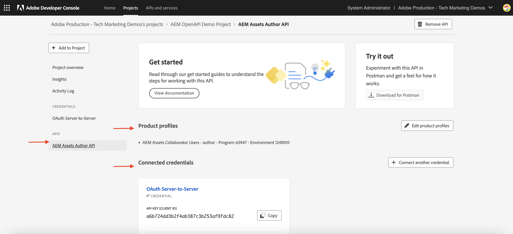

# API-referenties en productprofielbeheer

Leer hoe te om _Geloofsbrieven en het Profiel van het Product_ voor op OpenAPI-Gebaseerde AEM APIs te beheren.

In deze zelfstudie leert u hoe u inhoud kunt toevoegen of verwijderen:

- _Geloofsbrieven_: Verstrek authentificatie voor een AEM API.
- _Profielen van het Product_: Verstrek toestemmingen (of vergunning) voor geloofsbrieven om tot de middelen van AEM toegang te hebben.

## Achtergrond

Wanneer u AEM API gebruikt, moet u de _Geloofsbrieven_ en _Profiel van het Product_ in het project van Adobe Developer Console (of ADC) bepalen. In het volgende screenshot, kunt u _Geloofsbrieven_ en _Profiel van het Product_ voor een Auteur API van AEM Assets zien:

De _Geloofsbrieven_ verstrekken het authentificatiemechanisme voor API. Het _Profiel van het Product_ verleent _toestemmingen (of vergunning)_ aan de geloofsbrieven, die toegang verlenen de middelen van AEM. De API-aanvraag kan namens een toepassing of een gebruiker worden ingediend.

Een Profiel van het Product wordt geassocieerd met één of meerdere _Diensten_. In AEM as a Cloud Service, vertegenwoordigt de a _Dienst_ gebruikersgroepen met vooraf bepaalde Lijsten van het Toegangsbeheer (ACLs) voor gegevensopslagplaatsen, die korrelig toestemmingsbeheer toestaan.

Na succesvolle API-aanroeping wordt een gebruiker die de referentie van het ADC-project vertegenwoordigt, in de AEM Auteur-service gemaakt, samen met de gebruikersgroepen die overeenkomen met de configuratie Productprofiel en Services.

In het bovenstaande scenario wordt de gebruiker `1323d2...` gemaakt in de AEM Author-service en is deze een lid van de gebruikersgroepen `AEM Assets Collaborator Users - Service` en `AEM Assets Collaborator Users - author - Program XXX - Environment XXX` .

## Credentials toevoegen of verwijderen

De AEM API&#39;s bieden ondersteuning voor de volgende verificatietypen:

1. **OAuth Server-aan-Server**: Ontworpen voor machine-aan-machine interactie.
1. **OAuth App van het Web**: Ontworpen voor gebruiker-gedreven interactie met een backendserver in uw cliënttoepassing.
1. **OAuth Enige Pagina App**: Ontworpen voor gebruiker-gedreven interactie zonder een backendserver in uw cliënttoepassing.

U kunt verschillende gebruikersgevallen ondersteunen met behulp van verschillende soorten referenties.

Alle geloofsbrieven worden beheerd in uw project ADC.

>[!BEGINTABS]

>[!TAB  voeg Referenties ] toe

Om geloofsbrieven voor AEM API toe te voegen, ga naar de **APIs** sectie van uw project ADC en klik **verbind een andere referentie**. Volg vervolgens de instructies voor het specifieke type referentie.

>[!TAB  verwijdert Referenties ]

Om een referentie van AEM API te verwijderen, selecteer het in de **APIs** sectie van uw project ADC, dan klik **credential van de Schrapping**.

>[!ENDTABS]

## Productprofielen toevoegen of verwijderen

Het _Profiel van het Product_ verstrekt de _toestemmingen (of vergunning)_ aan de geloofsbrieven om tot de middelen van AEM toegang te hebben. De toestemmingen die door het _Profiel van het Product_ worden verstrekt zijn gebaseerd op de _Diensten_ verbonden aan het _Profiel van het Product_. Het grootste deel van de _Diensten_ verstrekt _LEZEN_ toestemming aan de middelen van AEM, via de gebruikersgroepen in de instantie van AEM die de zelfde naam zoals de _Dienst_ hebben.

Er zijn tijden wanneer de geloofsbrieven (ook bekend als technische rekeningsgebruiker) extra toestemmingen zoals _creeer, Update, schrap_ (CUD) van de middelen van AEM nodig hebben. In dergelijke gevallen, moet u een nieuw _Profiel van het Product_ toevoegen dat met de _Diensten_ wordt geassocieerd die de vereiste toestemmingen verstrekken.

Bijvoorbeeld, wanneer de aanroeping van de Auteur van AEM Assets API [ 403 fout voor niet-GET verzoeken ](../use-cases/invoke-api-using-oauth-s2s.md#403-error-for-non-get-requests) ontvangt, kunt u **Beheerders van AEM toevoegen - auteur - Programma XXX - Milieu XXX** _Profiel van het Product_ om de kwestie op te lossen.

>[!CAUTION]
>
>De **dienst van de Beheerders van AEM 1} verleent _VOLLEDIGE_ administratieve toegang tot Experience Manager.** Alternatief, kunt u {de toestemmingen van de Diensten 0} ](./services-user-group-permission-management.md) bijwerken om slechts de vereiste toestemmingen te verstrekken.[

>[!BEGINTABS]

>[!TAB  voeg de Profielen van het Product ] toe

Om de Profielen van het Product voor een AEM API toe te voegen, klik **productprofielen** in de **APIs** sectie van het project ADC, selecteer het gewenste Profiel van het Product in **vorm API** dialoog, en sparen uw veranderingen.

    

Selecteer het gewenste Profiel van het Product (b.v., **de Beheerders van AEM - auteur - Programma XXX - Milieu XXX**) verbonden aan de vereiste diensten, dan sparen uw veranderingen.

    

Merk op dat de **Beheerders van AEM - auteur - Programma XXX - het Profiel van het Product van het Milieu XXX** met zowel de **dienst van de Beheerders van AEM** als de **gebruikers van AEM Assets API** dienst wordt geassocieerd. Zonder deze laatste optie wordt het productprofiel niet weergegeven in de lijst met beschikbare productprofielen.

    

Het **PATCH** verzoek om de activa meta-gegevens bij te werken zou nu zonder kwesties moeten werken.

    

>[!TAB  verwijder de Profielen van het Product ]

Om de Profielen van het Product voor een AEM API te verwijderen, **te klikken geef productprofielen** in de **APIs** sectie van het project ADC uit, schrap het gewenste Profiel van het Product in **API** dialoog vormen, en sparen uw veranderingen.

>[!ENDTABS]

## Samenvatting

U leerde hoe te om het authentificatiemechanisme en de toestemmingen voor AEM APIs te veranderen gebruikend _Referenties en het Profiel van het Product_ in het project van Adobe Developer Console (ADC).
