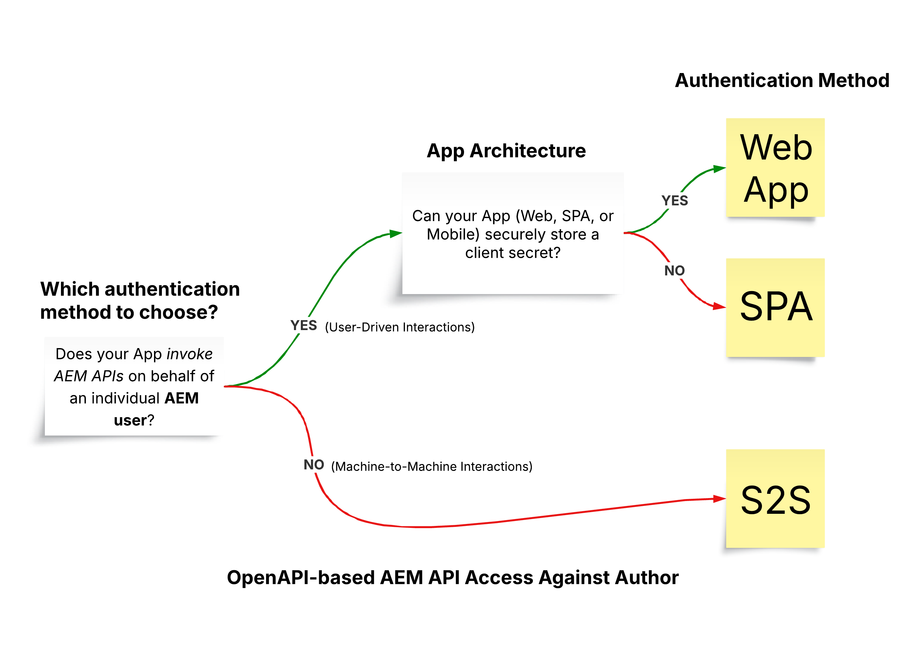

# AEM API&#39;s die zijn gebaseerd op OpenAPI

>[!IMPORTANT]
>
>De op OpenAPI gebaseerde AEM API&#39;s zijn alleen beschikbaar in AEM as a Cloud Service en zijn niet compatibel met AEM 6.X.

Leer meer over de op OpenAPI gebaseerde AEM API&#39;s, waaronder verificatieondersteuning, sleutelconcepten en toegang tot Adobe API&#39;s.

De [ Specificatie OpenAPI ](https://swagger.io/specification/) (die vroeger als Swagger wordt bekend) is een wijd gebruikte norm voor het bepalen van RESTful APIs. AEM as a Cloud Service biedt verschillende API&#39;s op basis van OpenAPI-specificaties (of gewoon AEM API&#39;s op basis van OpenAPI), waardoor het eenvoudiger wordt aangepaste toepassingen te maken die communiceren met de auteur van AEM of servicetypen publiceren. Hieronder volgen enkele voorbeelden:

**Plaatsen**

- [ Plaatsen API ](https://developer.adobe.com/experience-cloud/experience-manager-apis/api/stable/sites/): APIs voor het werken met de Fragmenten van de Inhoud.

**Assets**

- [ Mappen API ](https://developer.adobe.com/experience-cloud/experience-manager-apis/api/experimental/folders/): APIs voor het werken met omslagen zoals creeer, lijst en schrap omslagen.

- [ de Auteur API van Assets ](https://developer.adobe.com/experience-cloud/experience-manager-apis/api/experimental/assets/author/): APIs voor het werken met activa en zijn meta-gegevens.

**Forms**

- [ Communicatie APIs van Forms ](https://developer.adobe.com/experience-cloud/experience-manager-apis/api/experimental/document/): APIs voor het werken met vormen en documenten.

In toekomstige versies worden meer op OpenAPI gebaseerde AEM API&#39;s toegevoegd ter ondersteuning van extra gebruiksgevallen.

## Verificatieondersteuning{#authentication-support}

De op OpenAPI gebaseerde AEM API&#39;s ondersteunen OAuth 2.0-verificatie, inclusief de volgende typen subsidies:

- **OAuth Server-aan-Server credential**: Ideaal voor backend diensten die API toegang zonder gebruikersinteractie vereisen. Het gebruikt _client_credentials_ giftype, toelatend veilig toegangsbeheer op het serverniveau. Voor meer informatie, zie [ Server-aan-Server referentie ](https://developer.adobe.com/developer-console/docs/guides/authentication/ServerToServerAuthentication/#oauth-server-to-server-credential).

- **OAuth App credential van het Web**: Geschikt voor Webtoepassingen met front-end en _achterste_ componenten die tot AEM APIs namens gebruikers toegang hebben. Het gebruikt het _authentication_code_ subsidietype, waar de backendserver veilig geheimen en tokens beheert. Voor meer informatie, zie {de referentie van de App van 0} OAuth Web [&#128279;](https://developer.adobe.com/developer-console/docs/guides/authentication/UserAuthentication/implementation#oauth-web-app-credential).

- **Voor één enkele Pagina App credential**: Ontworpen voor SPAs die in browser lopen, die tot APIs namens een gebruiker zonder een achtergrondserver moet toegang hebben. Het gebruikt _authentication_code_ verlenen type en baseert zich op cliënt-zijveiligheidsmechanismen gebruikend PKCE (Sleutel van het Bewijs voor de Uitwisseling van de Code) om de stroom van de vergunningscode te beveiligen. Voor meer informatie, zie [ OAuth Enige de credentie van de Pagina App ](https://developer.adobe.com/developer-console/docs/guides/authentication/UserAuthentication/implementation#oauth-single-page-app-credential).

## Welke verificatiemethode moet worden gebruikt?{#auth-method-decision}

Wanneer het beslissen welke authentificatiemethode te gebruiken, overweeg het volgende:

Gebruikersverificatie (Web App of App met één pagina) moet de standaardkeuze zijn wanneer er een AEM-gebruikerscontext in het spel is. Dit zorgt ervoor dat alle handelingen in de gegevensopslagruimte correct worden toegewezen aan de geverifieerde gebruiker en dat de gebruiker beperkt is tot alleen de machtigingen waartoe hij of zij gemachtigd is.
Het gebruiken van server-aan-server (of de technische systeemrekening) om acties namens een individuele gebruiker uit te voeren overslaat het veiligheidsmodel en introduceert risico&#39;s zoals voorrechtescalatie en onnauwkeurige controle.

## Verschil tussen OAuth Server-aan-Server vs Web App vs Single Page App geloofsbrieven{#difference-between-oauth-server-to-server-vs-web-app-vs-single-page-app-credentials}

De volgende tabel geeft een overzicht van de verschillen tussen de drie OAuth-verificatiemethoden die worden ondersteund door AEM API&#39;s die zijn gebaseerd op OpenAPI:

|  | OAuth Server-to-Server | OAuth Web App | OAuth Single Page App (SPA) |
| --- | --- | --- | --- |
| **Doelstelling van de Authentificatie** | Ontworpen voor machine-aan-machine interactie. | Ontworpen voor gebruiker-gedreven interactie in een Web app met a _achterste deel_. | Ontworpen voor gebruiker-gedreven interactie in a _cliënt-kant toepassing van JavaScript_. |
| **Symbolisch Gedrag** | Geeft toegangstokens uit die de cliënttoepassing zelf vertegenwoordigen. | De toegangstokens van kwesties namens een voor authentiek verklaarde gebruiker _via een achtereind_. | De tokens van de toegang van kwesties namens een voor authentiek verklaarde gebruiker _via een voorwaarts-slechts stroom_. |
| **Gevallen van het Gebruik** | Ondersteuningsservices die API-toegang zonder gebruikersinteractie nodig hebben. | Webtoepassingen met front-end en backendcomponenten die API&#39;s benaderen namens gebruikers. | Pure front-end (JavaScript)-toepassingen die API&#39;s benaderen namens gebruikers zonder back-end. |
| **Overwegingen van de Veiligheid** | Sla gevoelige gegevens (`client_id`, `client_secret` ) veilig op in back-endsystemen. | Na gebruikersauthentificatie, worden zij verleend hun eigen _tijdelijk toegangstoken via een achterste vraag_. Sla gevoelige gegevens (`client_id`, `client_secret` ) veilig op in back-endsystemen om machtigingscode voor toegangstoken uit te wisselen. | Na gebruikersauthentificatie, worden zij verleend hun eigen _tijdelijk toegangstoken via een frontend vraag_. Hierbij wordt `client_secret` niet gebruikt, omdat het onveilig is om deze in frontend-apps op te slaan. Verantwoordt op PKCE om vergunningscode voor toegangstoken uit te wisselen. |
| **Type van Verlening** | _client_credentials_ | _authentication_code_ | _authentication_code_ met **PKCE** |
| **het Referentietype van Adobe Developer Console** | OAuth Server-to-Server | OAuth Web App | OAuth-app met één pagina |
| **Leerprogramma** | [ Oproep API gebruikend Server-aan-Server authentificatie ](./use-cases/invoke-api-using-oauth-s2s.md) | [ Oproep API gebruikend de authentificatie van de App van het Web ](./use-cases/invoke-api-using-oauth-web-app.md) | [ Oproep API gebruikend de Enige authentificatie van de Toepassing van de Pagina ](./use-cases/invoke-api-using-oauth-single-page-app.md) |

## Toegang tot Adobe API&#39;s en verwante concepten{#accessing-adobe-apis-and-related-concepts}

Voordat u Adobe API&#39;s opent, is het van essentieel belang dat u de volgende belangrijke elementen begrijpt:

- **[Adobe Developer Console ](https://developer.adobe.com/)**: De ontwikkelaarshub voor de toegang tot van Adobe APIs, SDKs, gebeurtenissen in real time, serverless functies, en meer. Merk op dat het van _AEM_ Developer Console verschillend is, die voor het zuiveren van de toepassingen van AEM wordt gebruikt.

- **[Project van Adobe Developer Console ](https://developer.adobe.com/developer-console/docs/guides/projects/)**: Centrale plaats voor het beheren van API integratie, gebeurtenissen, en runtime functies. Hier, vormt u APIs, plaatst authentificatie, en produceert vereiste geloofsbrieven.

- **[Profielen van het Product ](https://helpx.adobe.com/nl/enterprise/using/manage-product-profiles.html)**: De Profielen van het product verstrekken een toestemmingsvooraf ingesteld die u toestaat om gebruiker of toepassingstoegang tot de producten van Adobe zoals AEM, Adobe Target, Adobe Analytics, en anderen te controleren. Elk Adobe-product heeft vooraf gedefinieerde productprofielen.

- **de Diensten**: De diensten bepalen de daadwerkelijke toestemmingen en worden geassocieerd met het Profiel van het Product. Als u de voorinstelling voor machtigingen wilt beperken of vergroten, kunt u de services die aan het productprofiel zijn gekoppeld, deselecteren of selecteren. Zo kunt u het toegangsniveau voor het product en de bijbehorende API&#39;s bepalen. In AEM as a Cloud Service, vertegenwoordigen de diensten gebruikersgroepen met vooraf bepaalde Lijsten van het Toegangsbeheer (ACLs) voor bewaargegevensopslagknopen, die korrelig toestemmingsbeheer toestaan.

## Aan de slag

Leer hoe u uw AEM as a Cloud Service-omgeving instelt en een Adobe Developer Console-project om toegang tot de op OpenAPI gebaseerde AEM API&#39;s mogelijk te maken. Toegang ook tot de AEM API via de browser om de installatie te controleren en de aanvraag en het antwoord te bekijken.

<!-- CARDS
{target = _self}

* ./setup.md
  {title = Set up OpenAPI-based AEM APIs}
  {description = Learn how to set up your AEM as a Cloud Service environment to enable access to the OpenAPI-based AEM APIs.}
  {image = ./assets/setup/OpenAPI-Setup.png}
-->
<!-- START CARDS HTML - DO NOT MODIFY BY HAND -->

    

        

            

                <figure class="image x-is-16by9">
                    
                </figure>
            

            

                

                    

                        <a href="./setup.md" target="_self" rel="referrer" title="AEM API&apos;s instellen die zijn gebaseerd op OpenAPI"> opstelling op OpenAPI-Gebaseerde AEM APIs </a>
                    

                    
Leer hoe u uw AEM as a Cloud Service-omgeving instelt om toegang tot de op OpenAPI gebaseerde AEM API's mogelijk te maken.

                

                <a href="./setup.md" target="_self" rel="referrer" class="spectrum-Button spectrum-Button--outline spectrum-Button--primary spectrum-Button--sizeM" style="align-self: flex-start; margin-top: 1rem;">
                     Leer meer 
                </a>
            

        

    

<!-- END CARDS HTML - DO NOT MODIFY BY HAND -->

## API-zelfstudies

Leer hoe u de op OpenAPI gebaseerde AEM API&#39;s gebruikt met verschillende OAuth-verificatiemethoden:

<!-- CARDS
{target = _self}

* ./use-cases/invoke-api-using-oauth-s2s.md
  {title = Invoke API using Server-to-Server authentication}
  {description = Learn how to invoke OpenAPI-based AEM APIs from a custom NodeJS application using OAuth Server-to-Server authentication.}
  {image = ./assets/s2s/OAuth-S2S.png}
* ./use-cases/invoke-api-using-oauth-web-app.md
  {title = Invoke API using Web App authentication}
  {description = Learn how to invoke OpenAPI-based AEM APIs from a custom web application using OAuth Web App authentication.}
  {image = ./assets/web-app/OAuth-WebApp.png}
* ./use-cases/invoke-api-using-oauth-single-page-app.md
  {title = Invoke API using Single Page App authentication}
  {description = Learn how to invoke OpenAPI-based AEM APIs from a custom Single Page App (SPA) using OAuth Single Page App authentication.}
  {image = ./assets/spa/OAuth-SPA.png}  
-->
<!-- START CARDS HTML - DO NOT MODIFY BY HAND -->

    

        

            

                <figure class="image x-is-16by9">
                    
                </figure>
            

            

                

                    

                        <a href="./use-cases/invoke-api-using-oauth-s2s.md" target="_self" rel="referrer" title="API aanroepen met Server-naar-server verificatie"> Oproep API gebruikend Server-aan-Server authentificatie </a>
                    

                    
Leer hoe u op OpenAPI gebaseerde AEM API's aanroept vanuit een aangepaste NodeJS-toepassing met OAuth Server-to-Server-verificatie.

                

                <a href="./use-cases/invoke-api-using-oauth-s2s.md" target="_self" rel="referrer" class="spectrum-Button spectrum-Button--outline spectrum-Button--primary spectrum-Button--sizeM" style="align-self: flex-start; margin-top: 1rem;">
                     Leer meer 
                </a>
            

        

    

    

        

            

                <figure class="image x-is-16by9">
                    
                </figure>
            

            

                

                    

                        <a href="./use-cases/invoke-api-using-oauth-web-app.md" target="_self" rel="referrer" title="API aanroepen met webtoepassingsverificatie"> Oproep API gebruikend de authentificatie van de App van het Web </a>
                    

                    
Leer hoe u op OpenAPI gebaseerde AEM API's aanroept vanuit een aangepaste webtoepassing met OAuth Web App-verificatie.

                

                <a href="./use-cases/invoke-api-using-oauth-web-app.md" target="_self" rel="referrer" class="spectrum-Button spectrum-Button--outline spectrum-Button--primary spectrum-Button--sizeM" style="align-self: flex-start; margin-top: 1rem;">
                     Leer meer 
                </a>
            

        

    

    

        

            

                <figure class="image x-is-16by9">
                    
                </figure>
            

            

                

                    

                        <a href="./use-cases/invoke-api-using-oauth-single-page-app.md" target="_self" rel="referrer" title="API aanroepen met App-verificatie met één pagina"> Oproep API gebruikend de Enige authentificatie van de Toepassing van de Pagina </a>
                    

                    
Leer hoe u op OpenAPI gebaseerde AEM API's aanroept vanuit een aangepaste Single Page App (SPA) met OAuth App-verificatie voor één pagina.

                

                <a href="./use-cases/invoke-api-using-oauth-single-page-app.md" target="_self" rel="referrer" class="spectrum-Button spectrum-Button--outline spectrum-Button--primary spectrum-Button--sizeM" style="align-self: flex-start; margin-top: 1rem;">
                     Leer meer 
                </a>
            

        

    

<!-- END CARDS HTML - DO NOT MODIFY BY HAND -->
