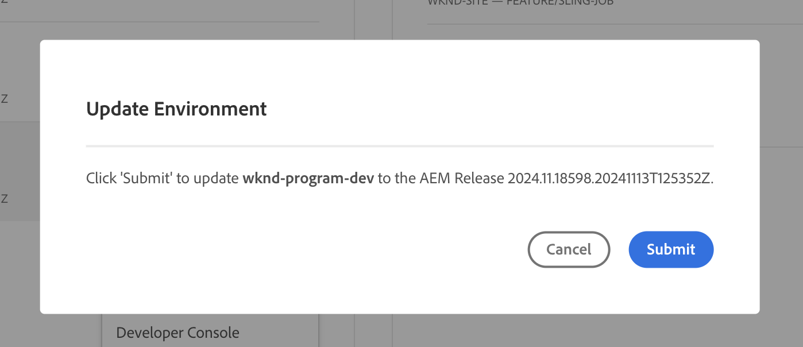
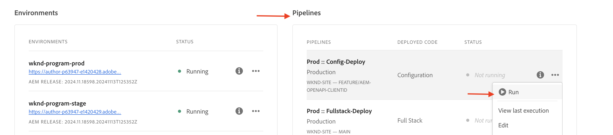

# AEM API&#39;s instellen die zijn gebaseerd op OpenAPI

Leer hoe u uw AEM as a Cloud Service-omgeving instelt om toegang tot de op OpenAPI gebaseerde AEM API&#39;s mogelijk te maken.

>[!AVAILABILITY]
>
>AEM API&#39;s die zijn gebaseerd op OpenAPI zijn beschikbaar als onderdeel van een vroegtijdig toegangsprogramma. Als u in de toegang tot van hen geinteresseerd bent, moedigen wij u aan om [ aem-apis@adobe.com ](mailto:aem-apis@adobe.com) met een beschrijving van uw gebruiksgeval te e-mailen.

Het installatieproces op hoog niveau omvat de volgende stappen:

1. Modernisering van de AEM as a Cloud Service-omgeving.
1. Toegang tot AEM API&#39;s inschakelen.
1. Maak een Adobe Developer Console-project (ADC).
1. ADC-project configureren
1. Vorm de instantie van AEM om de mededeling van het Project van ADC toe te laten.

## Modernisering van de AEM as a Cloud Service-omgeving

De modernisering van het milieu van AEM as a Cloud Service is een eenmalige milieuactiviteit die de volgende stappen omvat:

- Update aan de Versie van AEM **2024.10.18459.20241031T210302Z** of later.
- Voeg er nieuwe productprofielen aan toe als de omgeving is gemaakt vóór de release 2024.10.18459.20241031T210302Z.

### AEM-instantie bijwerken

Om de instantie van AEM bij te werken, in de Adobe [ Cloud Manager _van de Milieu_ sectie van 1} {, selecteer het _ellips_ pictogram naast de milieunaam en selecteer **optie van de Update**.](https://my.cloudmanager.adobe.com/)


Dan klik **voorleggen** knoop en stel _gesuggereerde_ FullstackPipeline in werking.



In mijn geval, wordt de FullstackPipeline genoemd **Dev:: Fullstack-Deploy**, en het milieu van AEM wordt genoemd **wknd-programma-dev**. Uw namen kunnen verschillen.

### Nieuwe productprofielen toevoegen

Om nieuwe Profielen van het Product aan de instantie van AEM toe te voegen, in de 2} sectie van de Milieu&#39;s ](https://my.cloudmanager.adobe.com/) van Adobe __, selecteer het _ellips_ pictogram naast de milieunaam en selecteer **toevoegen de optie van de Profielen van het Product**.[

 toe

U kunt de onlangs toegevoegde Profielen van het Product herzien door op het _ellips_ pictogram naast de milieunaam te klikken en **te selecteren beheert Toegang** > **Profielen van de Auteur**.

Het _Admin Console_ venster toont de onlangs toegevoegde Profielen van het Product.


Met de bovenstaande stappen wordt de modernisering van de AEM as a Cloud Service-omgeving voltooid.

## Toegang tot AEM API&#39;s inschakelen{#enable-aem-apis-access}

De aanwezigheid van de _nieuwe Profielen van het Product_ laat op OpenAPI-Gebaseerde toegang van AEM API in Adobe Developer Console (ADC) toe. Rappel dat [ Adobe Developer Console (ADC) ](./overview.md#accessing-adobe-apis-and-related-concepts) de ontwikkelaarshub voor de toegang tot van Adobe APIs, SDKs, gebeurtenissen in real time, serverless functies, en meer is.

De onlangs toegevoegde Profielen van het Product worden geassocieerd met de _Diensten_ die _gebruikersgroepen van AEM met vooraf bepaalde Lijsten van het Toegangsbeheer (ACLs)_ vertegenwoordigen. De _Diensten_ worden gebruikt om het niveau van toegang tot AEM APIs te controleren.

U kunt de _Diensten_ ook selecteren of schrappen verbonden aan het Profiel van het Product om het niveau van toegang te verminderen of te verhogen.

Herzie de vereniging door op het _pictogram van de Details van de Mening_ naast de naam van het Profiel van het Product te klikken.

{de diensten van het 0} Overzicht verbonden aan het Profiel van het Product ](./assets/setup/review-services-associated-with-product-profile.png)![

Door gebrek, wordt de **AEM Assets API Gebruikers** Dienst niet geassocieerd met om het even welk Profiel van het Product. Laat ons het met de onlangs toegevoegde **Gebruikers van de Medewerker van AEM Assets associëren - auteur - Programma XXX - Milieu XXX** Profiel van het Product. Na deze vereniging, kan de 20} ActivaAuteur API van het Project ADC _opstelling de gewenste Server-aan-Server authentificatie en de authentificatierekening van het project associëren ADC (die in volgende stap) met het Profiel van het Product wordt gecreeerd._


>[!IMPORTANT]
>
>De bovenstaande stap is van essentieel belang om de Server-to-Server-verificatie voor de AEM Assets API in te schakelen. Zonder deze koppeling kan de AEM Assets API niet worden gebruikt met de Server-to-Server verificatiemethode.

## Adobe Developer Console-project (ADC) maken

Het ADC-project wordt gebruikt om de gewenste API&#39;s toe te voegen, de verificatie ervan in te stellen en de verificatieaccount aan het productprofiel te koppelen.

Een ADC-project maken:

1. Login aan [ Adobe Developer Console ](https://developer.adobe.com/console) gebruikend uw Adobe ID.

   

1. Van de _Snelle sectie van het Begin_, klik op **creeer nieuwe project** knoop.

   

1. Het leidt tot een nieuw project met de standaardnaam.

   

1. Bewerk de projectnaam door **te klikken uitgeeft project** knoop in de hoogste juiste hoek. Verstrek een betekenisvolle naam en klik **sparen**.

    uit

## ADC-project configureren

Nadat u het ADC-project hebt gemaakt, moet u de gewenste AEM API&#39;s toevoegen, de verificatie ervan instellen en de verificatieaccount aan het productprofiel koppelen.

1. Om AEM APIs toe te voegen, klik op **voeg API** knoop toe.

    toe

1. In _voeg API_ dialoog toe, filter door _Experience Cloud_ en selecteer gewenste AEM API. Bijvoorbeeld, in dit geval, wordt _Auteur API van Activa_ geselecteerd.

    toe

1. Daarna, in _vorm API_ dialoog, selecteer de gewenste authentificatieoptie. Bijvoorbeeld, in dit geval, wordt de **server-aan-Server** authentificatieoptie geselecteerd.

   

   De server-aan-server authentificatie is ideaal voor de backenddiensten die API toegang zonder gebruikersinteractie vereisen. De opties Web App en Single Page App voor verificatie zijn geschikt voor toepassingen die API-toegang nodig hebben namens gebruikers. Zie [ Verschil tussen Server-aan-Server van OAuth vs Web App vs Één enkele geloofsbrieven van de Toepassing van de Pagina ](./overview.md#difference-between-oauth-server-to-server-vs-web-app-vs-single-page-app-credentials) voor meer informatie.

1. Indien nodig kunt u de naam van de API wijzigen om deze gemakkelijker te kunnen identificeren. Voor demo-doeleinden wordt de standaardnaam gebruikt.

    anders

1. In dit geval, is de authentificatiemethode **OAuth Server-aan-Server** zodat moet u de authentificatierekening met het Profiel van het Product associëren. Selecteer de **Gebruikers van de Medewerker van AEM Assets - auteur - Programma XXX - het Profiel van het Product van Milieu XXX** en klik **sparen**.

   

1. Controleer de AEM API- en verificatieconfiguratie.

   

   

Als u **of** OAuth App **authentificatiemethode van de Toepassing van de Toepassing van de enig-Pagina** kiest, wordt de vereniging van het Profiel van het Product niet veroorzaakt maar de toepassing richt URI wordt vereist. De URI voor omleiding van de toepassing wordt gebruikt om de gebruiker na verificatie met een machtigingscode om te leiden naar de toepassing. In de relevante zelfstudies voor gebruiksgevallen worden dergelijke configuraties beschreven die specifiek zijn voor verificatie.

## De AEM-instantie configureren om ADC-projectcommunicatie in te schakelen

Om de ClientID van het Project van ADC aan communicatie met de instantie van AEM toe te laten, moet u de instantie van AEM vormen.

Hiervoor definieert u de API-configuratie in het `config.yaml` -bestand van
het AEM-project en de implementatie ervan met behulp van de Config Pipeline in de Cloud Manager.

1. Zoek in AEM Project het `config.yaml` -bestand in de map `config` of maak dit.

   

1. Voeg de volgende configuratie toe aan het `config.yaml` dossier.

   ```yaml
   kind: "API"
   version: "1.0"
   metadata: 
       envTypes: ["dev", "stage", "prod"]
   data:
       allowedClientIDs:
           author:
           - "<ADC Project's Credentials ClientID>"
   ```

   Vervang `<ADC Project's Credentials ClientID>` door de werkelijke ClientID van de Credentials-waarde van het ADC-project. Het API eindpunt dat in dit leerprogramma wordt gebruikt is beschikbaar slechts op de auteurslaag, maar voor andere APIs, kan yaml config ook a _hebben publiceren_ of _voorproef_ knoop.

   >[!CAUTION]
   >
   > Voor demo-doeleinden wordt dezelfde ClientID gebruikt voor alle omgevingen. Het wordt aanbevolen afzonderlijke ClientID per omgeving (dev, stage, prod) te gebruiken voor betere beveiliging en controle.

1. Leg de configuratiewijzigingen vast en duw de wijzigingen naar de externe Git-opslagplaats waar de Cloud Manager-pijplijn op is aangesloten.

1. Implementeer de bovenstaande wijzigingen met behulp van de configuratiegids in de Cloud Manager. Het `config.yaml` -bestand kan ook worden geïnstalleerd in een RDE met behulp van opdrachtregelprogramma&#39;s.

    op

## Volgende stappen

Zodra de AEM-instantie is geconfigureerd om ADC-projectcommunicatie in te schakelen, kunt u beginnen met het gebruik van de op OpenAPI gebaseerde AEM API&#39;s. Leer hoe u de op OpenAPI gebaseerde AEM API&#39;s gebruikt met verschillende OAuth-verificatiemethoden:

<!-- CARDS
{target = _self}

* ./use-cases/invoke-api-using-oauth-s2s.md
  {title = Invoke API using Server-to-Server authentication}
  {description = Learn how to invoke OpenAPI-based AEM APIs from a custom NodeJS application using OAuth Server-to-Server authentication.}
  {image = ./assets/s2s/OAuth-S2S.png}
* ./use-cases/invoke-api-using-oauth-web-app.md
  {title = Invoke API using Web App authentication}
  {description = Learn how to invoke OpenAPI-based AEM APIs from a custom web application using OAuth Web App authentication.}
  {image = ./assets/web-app/OAuth-WebApp.png}
* ./use-cases/invoke-api-using-oauth-single-page-app.md
  {title = Invoke API using Single Page App authentication}
  {description = Learn how to invoke OpenAPI-based AEM APIs from a custom Single Page App (SPA) using OAuth 2.0 PKCE flow.}
  {image = ./assets/spa/OAuth-SPA.png}  
-->
<!-- START CARDS HTML - DO NOT MODIFY BY HAND -->
<div class="columns">
    <div class="column is-half-tablet is-half-desktop is-one-third-widescreen" aria-label="Invoke API using Server-to-Server authentication">
        <div class="card" style="height: 100%; display: flex; flex-direction: column; height: 100%;">
            <div class="card-image">
                <figure class="image x-is-16by9">
                    <a href="./use-cases/invoke-api-using-oauth-s2s.md" title="API aanroepen met Server-naar-server verificatie" target="_self" rel="referrer">
                        
                    </a>
                </figure>
            </div>
            <div class="card-content is-padded-small" style="display: flex; flex-direction: column; flex-grow: 1; justify-content: space-between;">
                <div class="top-card-content">
                    <p class="headline is-size-6 has-text-weight-bold">
                        <a href="./use-cases/invoke-api-using-oauth-s2s.md" target="_self" rel="referrer" title="API aanroepen met Server-naar-server verificatie"> Oproep API gebruikend Server-aan-Server authentificatie </a>
                    </p>
                    <p class="is-size-6">Leer hoe u op OpenAPI gebaseerde AEM API's aanroept vanuit een aangepaste NodeJS-toepassing met OAuth Server-to-Server-verificatie.</p>
                </div>
                <a href="./use-cases/invoke-api-using-oauth-s2s.md" target="_self" rel="referrer" class="spectrum-Button spectrum-Button--outline spectrum-Button--primary spectrum-Button--sizeM" style="align-self: flex-start; margin-top: 1rem;">
                    <span class="spectrum-Button-label has-no-wrap has-text-weight-bold"> Leer meer </span>
                </a>
            </div>
        </div>
    </div>
    <div class="column is-half-tablet is-half-desktop is-one-third-widescreen" aria-label="Invoke API using Web App authentication">
        <div class="card" style="height: 100%; display: flex; flex-direction: column; height: 100%;">
            <div class="card-image">
                <figure class="image x-is-16by9">
                    <a href="./use-cases/invoke-api-using-oauth-web-app.md" title="API aanroepen met webtoepassingsverificatie" target="_self" rel="referrer">
                        
                    </a>
                </figure>
            </div>
            <div class="card-content is-padded-small" style="display: flex; flex-direction: column; flex-grow: 1; justify-content: space-between;">
                <div class="top-card-content">
                    <p class="headline is-size-6 has-text-weight-bold">
                        <a href="./use-cases/invoke-api-using-oauth-web-app.md" target="_self" rel="referrer" title="API aanroepen met webtoepassingsverificatie"> Oproep API gebruikend de authentificatie van de App van het Web </a>
                    </p>
                    <p class="is-size-6">Leer hoe u op OpenAPI gebaseerde AEM API's aanroept vanuit een aangepaste webtoepassing met OAuth Web App-verificatie.</p>
                </div>
                <a href="./use-cases/invoke-api-using-oauth-web-app.md" target="_self" rel="referrer" class="spectrum-Button spectrum-Button--outline spectrum-Button--primary spectrum-Button--sizeM" style="align-self: flex-start; margin-top: 1rem;">
                    <span class="spectrum-Button-label has-no-wrap has-text-weight-bold"> Leer meer </span>
                </a>
            </div>
        </div>
    </div>
    <div class="column is-half-tablet is-half-desktop is-one-third-widescreen" aria-label="Invoke API using Single Page App authentication">
        <div class="card" style="height: 100%; display: flex; flex-direction: column; height: 100%;">
            <div class="card-image">
                <figure class="image x-is-16by9">
                    <a href="./use-cases/invoke-api-using-oauth-single-page-app.md" title="API aanroepen met App-verificatie met één pagina" target="_self" rel="referrer">
                        
                    </a>
                </figure>
            </div>
            <div class="card-content is-padded-small" style="display: flex; flex-direction: column; flex-grow: 1; justify-content: space-between;">
                <div class="top-card-content">
                    <p class="headline is-size-6 has-text-weight-bold">
                        <a href="./use-cases/invoke-api-using-oauth-single-page-app.md" target="_self" rel="referrer" title="API aanroepen met App-verificatie met één pagina"> Oproep API gebruikend de Enige authentificatie van de Toepassing van de Pagina </a>
                    </p>
                    <p class="is-size-6">Leer hoe u op OpenAPI gebaseerde AEM API's aanroept vanuit een aangepaste Single Page App (SPA) met OAuth 2.0 PKCE-stroom.</p>
                </div>
                <a href="./use-cases/invoke-api-using-oauth-single-page-app.md" target="_self" rel="referrer" class="spectrum-Button spectrum-Button--outline spectrum-Button--primary spectrum-Button--sizeM" style="align-self: flex-start; margin-top: 1rem;">
                    <span class="spectrum-Button-label has-no-wrap has-text-weight-bold"> Leer meer </span>
                </a>
            </div>
        </div>
    </div>
</div>
<!-- END CARDS HTML - DO NOT MODIFY BY HAND -->
