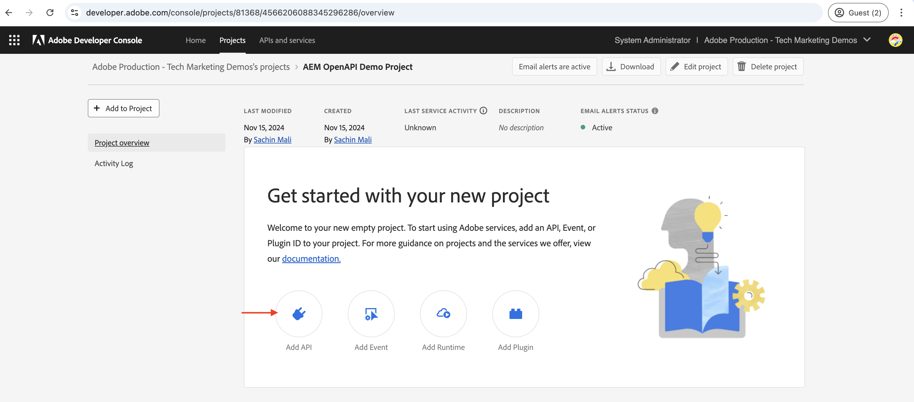
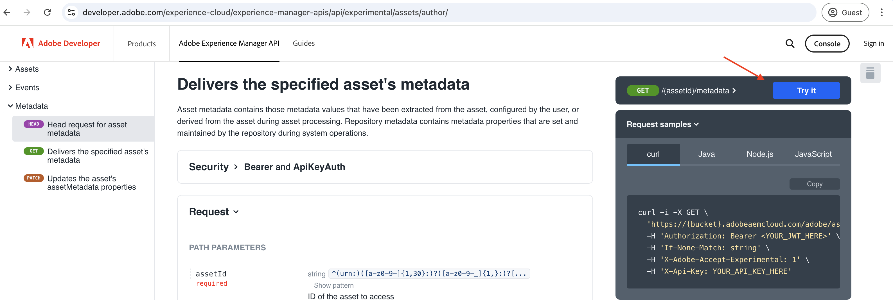
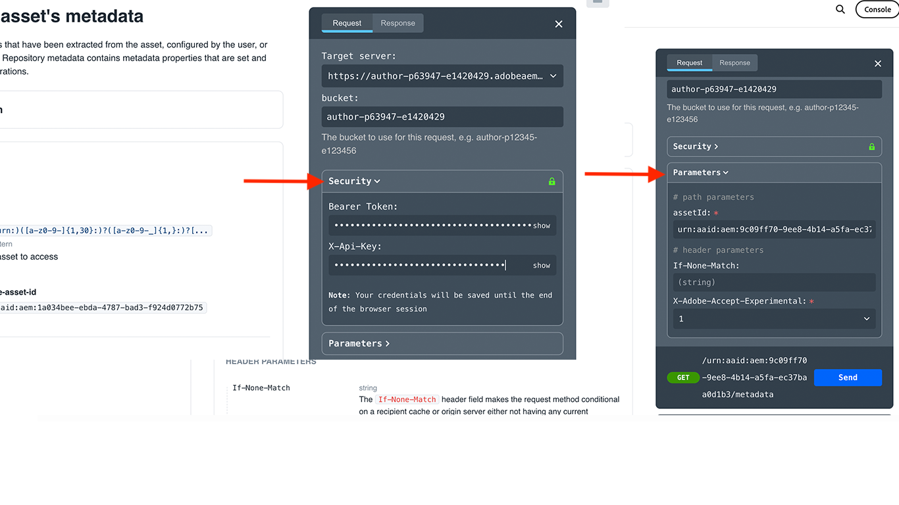

# AEM API&#39;s op basis van OpenAPI aanroepen met OAuth Server-to-Server-verificatie

Leer hoe te om op OpenAPI-Gebaseerde AEM APIs op AEM as a Cloud Service van douanetoepassingen aan te halen gebruikend _Server-aan-Server_ authentificatie.

De verificatie van server-naar-server OAuth is ideaal voor back-endservices die API-toegang zonder gebruikersinteractie nodig hebben. Het gebruikt OAuth 2.0 _client_credentials_ giftype om de cliënttoepassing voor authentiek te verklaren.

## Wat u leert{#what-you-learn}

In deze zelfstudie leert u hoe u:

- Vorm een project van Adobe Developer Console (ADC) om tot de Auteur API van Assets toegang te hebben gebruikend _Server-aan-Server authentificatie_.

- Ontwikkelen van een voorbeeldtoepassing NodeJS die de Assets-auteur-API aanroept om metagegevens voor een bepaald element op te halen.

Controleer voordat u begint het volgende:

- [ Toegang hebbend tot Adobe APIs en verwante concepten ](../overview.md#accessing-adobe-apis-and-related-concepts) sectie.
- ](../setup.md) artikel van opstellingsOpenAPI-Gebaseerde AEM APIs.[

## Vereisten

U hebt het volgende nodig om deze zelfstudie te voltooien:

- Modernisering van de AEM as a Cloud Service-omgeving met het volgende:
   - AEM Release `2024.10.18459.20241031T210302Z` of hoger.
   - Nieuwe stijlproductprofielen (als de omgeving vóór november 2024 is gemaakt)

  Zie [ opstelling op OpenAPI-Gebaseerde AEM APIs ](../setup.md) artikel voor meer details.

- Het steekproef [ WKND ](https://github.com/adobe/aem-guides-wknd?#aem-wknd-sites-project) project van Plaatsen moet op het worden opgesteld.

- Toegang tot [ Adobe Developer Console ](https://developer.adobe.com/developer-console/docs/guides/getting-started).

- Installeer [ Node.js ](https://nodejs.org/en/) op uw lokale machine om de toepassing van steekproefNodeJS in werking te stellen.

## Ontwikkelingsstappen

De ontwikkelingsstappen op hoog niveau zijn:

1. ADC-project configureren
   1. De Assets-auteur-API toevoegen
   1. Vorm zijn authentificatiemethode als Server-aan-Server OAuth
   1. Productprofiel koppelen aan de verificatieconfiguratie
1. De AEM-instantie configureren om ADC-projectcommunicatie in te schakelen
1. Een voorbeeld van een NodeJS-toepassing ontwikkelen
1. Verifieer de stroom van begin tot eind

## ADC-project configureren

Vorm ADC de stap van het Project wordt _herhaald_ van [ OpenAPI-Gebaseerde AEM APIs van de Opstelling ](../setup.md). De methode wordt herhaald om de Assets-auteur-API toe te voegen en de verificatiemethode te configureren als OAuth Server-to-Server.

>[!TIP]
>
>Zorg ervoor u **de toegang van AEM APIs** stap van de [ op OpenAPI-Gebaseerde AEM APIs van de Opstelling ](../setup.md#enable-aem-apis-access) hebt voltooid. Zonder deze optie is de optie Server-naar-server verificatie niet beschikbaar.


1. Van [ Adobe Developer Console ](https://developer.adobe.com/console/projects), open het gewenste project.

1. Om AEM APIs toe te voegen, klik op **voeg API** knoop toe.

    toe

1. In _voeg API_ dialoog toe, filter door _Experience Cloud_ en selecteer **de Auteur API van AEM Assets** kaart en klik **daarna**.

    toe

1. Daarna, in _vorm API_ dialoog, selecteer de **server-aan-server** authentificatieoptie en klik **daarna**. De server-aan-server authentificatie is ideaal voor de backenddiensten die API toegang zonder gebruikersinteractie vereisen.

   

1. Wijzig de naam van de referentie voor gemakkelijkere identificatie (indien nodig) en klik **daarna**. Voor demo-doeleinden wordt de standaardnaam gebruikt.

    anders

1. Selecteer de **Gebruikers van de Medewerker van AEM Assets - auteur - Programma XXX - het Profiel van het Product van Milieu XXX** en klik **sparen**. Zoals u ziet, is alleen het productprofiel dat is gekoppeld aan de AEM Assets API-gebruikersservice beschikbaar voor selectie.

   

1. Controleer de AEM API- en verificatieconfiguratie.

   

   

## AEM-instantie configureren om ADC-projectcommunicatie in te schakelen

Volg de instructies van het [ op OpenAPI-Gebaseerde artikel van AEM APIs van de Opstelling ](../setup.md#configure-the-aem-instance-to-enable-adc-project-communication) om de instantie van AEM te vormen om de mededeling van het Project van ADC toe te laten.

## Een voorbeeld van een NodeJS-toepassing ontwikkelen

Laten we een voorbeeld-NodeJS-toepassing ontwikkelen die de Assets-auteur-API aanroept.

U kunt andere programmeertalen zoals Java, Python, enz. gebruiken om de toepassing te ontwikkelen.

Voor testende doeleinden, kunt u [ Postman ](https://www.postman.com/) gebruiken, [ krullen ](https://curl.se/), of een andere cliënt van de WEERSTING om AEM APIs aan te halen.

### De API controleren

Alvorens de toepassing te ontwikkelen, laten wij overzicht [ leveren het gespecificeerde meta-gegevens van activa ](https://developer.adobe.com/experience-cloud/experience-manager-apis/api/experimental/assets/author/#operation/getAssetMetadata) eindpunt van de _Auteur API van Assets_. De API-syntaxis is:

```http
GET https://{bucket}.adobeaemcloud.com/adobe/../assets/{assetId}/metadata
```

Als u de metagegevens van een specifiek element wilt ophalen, hebt u de waarden `bucket` en `assetId` nodig. `bucket` is de AEM-instantienaam zonder de Adobe-domeinnaam (.adobeaemcloud.com), bijvoorbeeld `author-p63947-e1420428` .

De `assetId` is de JCR-UUID van het element met het voorvoegsel `urn:aaid:aem:` , bijvoorbeeld `urn:aaid:aem:a200faf1-6d12-4abc-bc16-1b9a21f870da` . Er zijn meerdere manieren om de `assetId` op te halen:

- Voeg de extensie AEM-elementpad `.json` toe voor de metagegevens van het element. Bijvoorbeeld `https://author-p63947-e1420429.adobeaemcloud.com/content/dam/wknd-shared/en/adventures/cycling-southern-utah/adobestock-221043703.jpg.json` en zoek naar de eigenschap `jcr:uuid` .

- U kunt de `assetId` ook ophalen door het element te inspecteren in de elementencontrole van de browser. Zoek het kenmerk `data-id="urn:aaid:aem:..."` .

  

### De API aanroepen met de browser

Alvorens de toepassing te ontwikkelen, laten wij API gebruiken aanhalen gebruikend **het** eigenschap in de [ API documentatie ](https://developer.adobe.com/experience-cloud/experience-manager-apis/api/experimental/assets/author/) uitproberen.

1. Open de [ documentatie van de AuteurAPI van Assets ](https://developer.adobe.com/experience-cloud/experience-manager-apis/api/experimental/assets/author/) in browser.

1. Vouw de _sectie van Meta-gegevens_ uit en klik op **levert de gespecificeerde meta-gegevens van activa** optie.

1. In de juiste ruit, klik op **probeer het** knoop.
   

1. Voer de volgende waarden in:

   | Sectie | Parameter | Waarde |
   | --- | --- | --- |
   |  | emmer | De AEM-instantienaam zonder de Adobe-domeinnaam (.adobeaemcloud.com), bijvoorbeeld `author-p63947-e1420428` . |
   | **Veiligheid** | Dragertoken | Gebruik het toegangstoken van de Server-aan-Server referentie van het Project ADC. |
   | **Veiligheid** | x-api-toets | Gebruik de `ClientID` waarde van de Server-aan-Server referentie van het Project van ADC. |
   | **Parameters** | assetId | De unieke id voor het element in AEM, bijvoorbeeld `urn:aaid:aem:a200faf1-6d12-4abc-bc16-1b9a21f870da` |
   | **Parameters** | X-Adobe-Accept-Experimental | 1 |

   

   

1. Klik **verzenden** om API aan te halen, en de reactie in de **Reactie** tabel te herzien.

   

De bovenstaande stappen bevestigen de modernisering van de AEM as a Cloud Service-omgeving, waardoor AEM API&#39;s toegang hebben. Het bevestigt ook de succesvolle configuratie van het Project ADC, en de server-aan-server communicatie van OAuth ClientID met de instantie van de Auteur van AEM.

### Sample NodeJS-toepassing

Laten we een voorbeeld-NodeJS-toepassing ontwikkelen.

Om de toepassing te ontwikkelen, kunt u of de _in werking stellen-steekproef-toepassing_ of de _Stap-door-stap-ontwikkeling_ instructies gebruiken.

>[!BEGINTABS]

>[!TAB  looppas-de-steekproef-toepassing ]

1. Download het steekproef [ demo-nodejs-app-to-invoke-aem-openapi ](../assets/s2s/demo-nodejs-app-to-invoke-aem-openapi.zip) toepassingsZIP dossier en haal het uit.

1. Navigeer naar de uitgepakte map en installeer de afhankelijkheden.

   ```bash
   $ npm install
   ```

1. Vervang de placeholders in het `.env` dossier met de daadwerkelijke waarden van OAuth van het Project van ADC Server-aan-Server referentie.

1. Vervang de waarden `<BUCKETNAME>` en `<ASSETID>` in het `src/index.js` -bestand door de werkelijke waarden.

1. Voer de NodeJS-toepassing uit.

   ```bash
   $ node src/index.js
   ```

>[!TAB  geleidelijke-ontwikkeling ]

1. Maak een nieuw NodeJS-project.

   ```bash
   $ mkdir demo-nodejs-app-to-invoke-aem-openapi
   $ cd demo-nodejs-app-to-invoke-aem-openapi
   $ npm init -y
   ```

1. Installeer _haal_ en _dotenv_ bibliotheek om de verzoeken van HTTP te maken en de milieuvariabelen te lezen respectievelijk.

   ```bash
   $ npm install node-fetch
   $ npm install dotenv
   ```

1. Open het project in uw favoriete code-editor en werk het `package.json` -bestand bij om het `type` aan `module` toe te voegen.

   ```json
   {
       ...
       "version": "1.0.0",
       "type": "module",
       "main": "index.js",
       ...
   }
   ```

1. Maak een `.env` -bestand en voeg de volgende configuratie toe. Vervang placeholders met de daadwerkelijke waarden van OAuth van het Project van ADC Server-aan-Server referentie.

   ```properties
   CLIENT_ID=<ADC Project OAuth Server-to-Server credential ClientID>
   CLIENT_SECRET=<ADC Project OAuth Server-to-Server credential Client Secret>
   SCOPES=<ADC Project OAuth Server-to-Server credential Scopes>
   ```

1. Maak een `src/index.js` -bestand, voeg de volgende code toe en vervang de waarden `<BUCKETNAME>` en `<ASSETID>` door de werkelijke waarden.

   ```javascript
   // Import the dotenv configuration to load environment variables from the .env file
   import "dotenv/config";
   
   // Import the fetch function to make HTTP requests
   import fetch from "node-fetch";
   
   // REPLACE THE FOLLOWING VALUES WITH YOUR OWN
   const bucket = "<BUCKETNAME>"; // Bucket name is the AEM instance name (e.g. author-p63947-e1420428)
   const assetId = "<ASSETID>"; // Asset ID is the unique identifier for the asset in AEM (e.g. urn:aaid:aem:a200faf1-6d12-4abc-bc16-1b9a21f870da). You can get it by inspecting the asset in browser's element inspector, look for data-id="urn:aaid:aem:..."
   
   // Load environment variables for authentication
   const clientId = process.env.CLIENT_ID; // Adobe IMS client ID
   const clientSecret = process.env.CLIENT_SECRET; // Adobe IMS client secret
   const scopes = process.env.SCOPES; // Scope for the API access
   
   // Adobe IMS endpoint for obtaining an access token
   const adobeIMSV3TokenEndpointURL =
   "https://ims-na1.adobelogin.com/ims/token/v3";
   
   // Function to obtain an access token from Adobe IMS
   const getAccessToken = async () => {
       console.log("Getting access token from IMS"); // Log process initiation
       //console.log("Client ID: " + clientId); // Display client ID for debugging purposes
   
       // Configure the HTTP POST request to fetch the access token
       const options = {
           method: "POST",
           headers: {
           "Content-Type": "application/x-www-form-urlencoded", // Specify form data content type
           },
           // Send client ID, client secret, and scopes as the request body
           body: `grant_type=client_credentials&client_id=${clientId}&client_secret=${clientSecret}&scope=${scopes}`,
       };
   
       // Make the HTTP request to fetch the access token
       const response = await fetch(adobeIMSV3TokenEndpointURL, options);
   
       //console.log("Response status: " + response.status); // Log the HTTP status for debugging
   
       const responseJSON = await response.json(); // Parse the JSON response
   
       console.log("Access token received"); // Log success message
   
       // Return the access token
       return responseJSON.access_token;
   };
   
   // Function to retrieve metadata for a specific asset from AEM
   const getAssetMetadat = async () => {
       // Fetch the access token using the getAccessToken function
       const accessToken = await getAccessToken();
   
       console.log("Getting asset metadata from AEM");
   
       // Invoke the Assets Author API to retrieve metadata for a specific asset
       const resp = await fetch(
           `https://${bucket}.adobeaemcloud.com/adobe/../assets/${assetId}/metadata`, // Construct the URL with bucket and asset ID
           {
           method: "GET",
           headers: {
               "If-None-Match": "string", // Header to handle caching (not critical for this tutorial)
               "X-Adobe-Accept-Experimental": "1", // Header to enable experimental Adobe API features
               Authorization: "Bearer " + accessToken, // Provide the access token for authorization
               "X-Api-Key": clientId, // Include the OAuth S2S ClientId for identification
           },
           }
       );
   
       const data = await resp.json(); // Parse the JSON response
   
       console.log("Asset metadata received"); // Log success message
       console.log(data); // Display the retrieved metadata
   };
   
   // Call the getAssets function to start the process
   getAssetMetadat();
   ```

1. Voer de NodeJS-toepassing uit.

   ```bash
   $ node src/index.js
   ```

>[!ENDTABS]

### API-reactie

Als de API-reactie met succes is uitgevoerd, wordt deze weergegeven in de console. De reactie bevat de metagegevens van het opgegeven element.

```json
{
  "assetId": "urn:aaid:aem:9c09ff70-9ee8-4b14-a5fa-ec37baa0d1b3",
  "assetMetadata": {    
    ...
    "dc:title": "A Young Mountain Biking Couple Takes A Minute To Take In The Scenery",
    "xmp:CreatorTool": "Adobe Photoshop Lightroom Classic 7.5 (Macintosh)",
    ...
  },
  "repositoryMetadata": {
    ...
    "repo:name": "adobestock-221043703.jpg",
    "repo:path": "/content/dam/wknd-shared/en/adventures/cycling-southern-utah/adobestock-221043703.jpg",
    "repo:state": "ACTIVE",
    ...
  }
}
```

Gefeliciteerd! U hebt met succes de op OpenAPI gebaseerde AEM APIs van uw douanetoepassing opgeroepen gebruikend Server-aan-Server authentificatie.

### De toepassingscode controleren

De belangrijkste callouts van de code van de steekproeftoepassing NodeJS zijn:

1. **IMS Authentificatie**: Krijgt een toegangstoken gebruikend OAuth server-aan-Server geloofsbrieven opstelling in het Project ADC.

   ```javascript
   // Function to obtain an access token from Adobe IMS
   const getAccessToken = async () => {
   
       // Configure the HTTP POST request to fetch the access token
       const options = {
           method: "POST",
           headers: {
           "Content-Type": "application/x-www-form-urlencoded", // Specify form data content type
           },
           // Send client ID, client secret, and scopes as the request body
           body: `grant_type=client_credentials&client_id=${clientId}&client_secret=${clientSecret}&scope=${scopes}`,
       };
   
       // Make the HTTP request to fetch the access token from Adobe IMS token endpoint https://ims-na1.adobelogin.com/ims/token/v3
       const response = await fetch(adobeIMSV3TokenEndpointURL, options);
   
       const responseJSON = await response.json(); // Parse the JSON response
   
       // Return the access token
       return responseJSON.access_token;
   };
   ...
   ```

1. **API Oproepen**: Roept de auteur API van Assets aan om meta-gegevens voor een specifiek middel terug te winnen door het toegangstoken voor vergunning te verstrekken.

   ```javascript
   // Function to retrieve metadata for a specific asset from AEM
   const getAssetMetadat = async () => {
       // Fetch the access token using the getAccessToken function
       const accessToken = await getAccessToken();
   
       console.log("Getting asset metadata from AEM");
   
       // Invoke the Assets Author API to retrieve metadata for a specific asset
       const resp = await fetch(
           `https://${bucket}.adobeaemcloud.com/adobe/../assets/${assetId}/metadata`, // Construct the URL with bucket and asset ID
           {
           method: "GET",
           headers: {
               "If-None-Match": "string", // Header to handle caching (not critical for this tutorial)
               "X-Adobe-Accept-Experimental": "1", // Header to enable experimental Adobe API features
               Authorization: "Bearer " + accessToken, // Provide the access token for authorization
               "X-Api-Key": clientId, // Include the OAuth S2S ClientId for identification
           },
           }
       );
   
       const data = await resp.json(); // Parse the JSON response
   
       console.log("Asset metadata received"); // Log success message
       console.log(data); // Display the retrieved metadata
   };
   ...
   ```

## Onder de kap

Na succesvolle API-aanroeping wordt een gebruiker die de OAuth Server-to-Server-referentie van het ADC-project vertegenwoordigt, in de AEM Auteur-service gemaakt, samen met de gebruikersgroepen die overeenkomen met de configuratie Productprofiel en Services. De _technische rekeningsgebruiker_ wordt geassocieerd met het Profiel van het Product en _de gebruikersgroep van de Diensten_, die de noodzakelijke toestemmingen heeft __ de activa meta-gegevens LEZEN.

Voer de volgende stappen uit om te controleren of de technische gebruiker en gebruikersgroep zijn aangemaakt:

- In het Project ADC, navigeer aan de **Server-aan-Server** credentiële configuratie. Noteer de **Technische waarde van E-mail van de Rekening**.

  

- In de dienst van de Auteur van AEM, navigeer aan **Hulpmiddelen** > **Veiligheid** > **Gebruikers** en onderzoek naar de **Technische waarde van de Rekening E-mail**.

  

- Klik op de technische rekeningsgebruiker om de gebruikersdetails, als **Groepen** lidmaatschap te bekijken. Zoals hieronder getoond, wordt de technische rekeningsgebruiker geassocieerd met de **Gebruikers van de Medewerker van AEM Assets - auteur - Programma XXX - Milieu XXX** en **Gebruikers van de Medewerker van AEM Assets - de gebruikersgroepen van de Dienst**.

  

- Merk op dat de technische rekeningsgebruiker met de **Gebruikers van de Medewerker van AEM Assets - auteur - Programma XXX - Milieu XXX** Profiel van het Product wordt geassocieerd. Het Profiel van het Product wordt geassocieerd met de **gebruikers van AEM Assets API** en **de Gebruikers van de Medewerker van AEM Assets** Diensten.

  

- De gebruikersvereniging van het Profiel van het Product en de technische rekening kunnen in de **Profiles van het Product** worden geverifieerd **API geloofsbrieven** tabel.

  {de geloofsbrieven van API van het Profiel van 0} Product ](../assets/s2s/product-profile-api-credentials.png)![

## 403-fout voor niet-GET-aanvragen

_LEZEN_ de activa meta-gegevens, heeft de technische rekeningsgebruiker die voor de referentie van Server-aan-Server OAuth wordt gecreeerd de noodzakelijke toestemmingen via de gebruikersgroep van de Diensten (bijvoorbeeld, de Gebruikers van de Medewerker van AEM Assets - Dienst).

Nochtans, om _te creëren, bij te werken, schrapt_ (CUD) de activa meta-gegevens, vereist de technische rekeningsgebruiker extra toestemmingen. U kunt dit controleren door de API aan te roepen met een niet-GET-aanvraag (bijvoorbeeld PATCH, DELETE) en de 403-foutreactie te bekijken.

Laten wij het _PATCH_ verzoek aanhalen om de activa meta-gegevens bij te werken en de 403 foutenreactie waar te nemen.

- Open de [ documentatie van de AuteurAPI van Assets ](https://developer.adobe.com/experience-cloud/experience-manager-apis/api/experimental/assets/author/) in browser.

- Voer de volgende waarden in:

  | Sectie | Parameter | Waarde |
  | --- | --- | --- |
  | **Emmertje** |  | De AEM-instantienaam zonder de Adobe-domeinnaam (.adobeaemcloud.com), bijvoorbeeld `author-p63947-e1420428` . |
  | **Veiligheid** | Dragertoken | Gebruik het toegangstoken van de Server-aan-Server referentie van het Project ADC. |
  | **Veiligheid** | x-api-toets | Gebruik de `ClientID` waarde van de Server-aan-Server referentie van het Project van ADC. |
  | **Lichaam** |  | `[{ "op": "add", "path": "foo","value": "bar"}]` |
  | **Parameters** | assetId | De unieke id voor het element in AEM, bijvoorbeeld `urn:aaid:aem:a200faf1-6d12-4abc-bc16-1b9a21f870da` |
  | **Parameters** | X-Adobe-Accept-Experimental | * |
  | **Parameters** | X-Adobe-Accept-Experimental | 1 |

- Klik **verzenden** om het _PATCH_ verzoek aan te halen en de 403 foutenreactie waar te nemen.

  

U kunt de fout van 403 op twee manieren corrigeren:

- In het Project van ADC, werk het Server-aan-Server bijbehorende Profiel van het Product van OAuth Server-aan-Server met een aangewezen Profiel van het Product bij dat de noodzakelijke toestemmingen heeft om _tot stand te brengen, bij te werken, schrapt_ (CUD) de activa meta-gegevens, bijvoorbeeld, **de Beheerders van AEM - auteur - Programma XXX - Milieu XXX**. Voor meer informatie, zie [ hoe te - API verbonden geloofsbrieven en het het beheersartikel van het Profiel van het Product ](../how-to/credentials-and-product-profile-management.md).

- Gebruikend het Project van AEM, werk de bijbehorende de gebruikersgroep van de Dienst van AEM (bijvoorbeeld, de Gebruikers van de Medewerker van AEM Assets - de Dienst) toestemmingen in de Auteur van AEM bij om _toe te staan creeer, Update, schrap_ (CUD) van de activa meta-gegevens. Voor meer informatie, zie [ hoe te - het artikel van het de toestemmingsbeheer van de gebruikersgroep van de Dienst van AEM ](../how-to/services-user-group-permission-management.md).

## Samenvatting

In deze zelfstudie hebt u geleerd hoe u op OpenAPI gebaseerde AEM API&#39;s kunt aanroepen vanuit aangepaste toepassingen. U hebt toegang tot AEM API&#39;s ingeschakeld, een Adobe Developer Console-project (ADC) gemaakt en geconfigureerd.
In het ADC-project hebt u de AEM API&#39;s toegevoegd, het verificatietype van de API geconfigureerd en het productprofiel gekoppeld. U hebt de AEM-instantie ook geconfigureerd om ADC-projectcommunicatie in te schakelen en een voorbeeld-NodeJS-toepassing ontwikkeld die de Assets Author API aanroept.

## Aanvullende bronnen

- [ OAuth Server-aan-Server de gids van de credentieimplementatie ](https://developer.adobe.com/developer-console/docs/guides/authentication/ServerToServerAuthentication/implementation)
