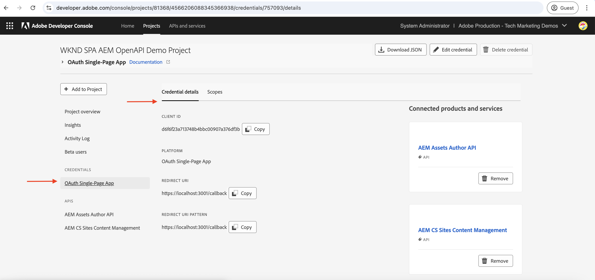

# AEM-API&#39;s op basis van OpenAPI aanroepen met OAuth-app met één pagina

Leer hoe te om op OpenAPI-Gebaseerde AEM APIs op AEM as a Cloud Service aan te halen gebruikend **OAuth de authentificatie van de Toepassing van de Enige Pagina**. Het volgt de stroom van OAuth 2.0 PKCE (de Sleutel van het Bewijs voor de Uitwisseling van de Code) voor op gebruiker-gebaseerde authentificatie in Één enkele Toepassing van de Pagina (SPA).

App-verificatie met één pagina is ideaal voor JavaScript-toepassingen die in de browser worden uitgevoerd. Of ze nu geen back-endserver hebben of toegangstokens moeten ophalen om namens een gebruiker te kunnen communiceren met AEM API&#39;s.

De stroom PKCE breidt OAuth 2.0 _verlenen type van autorisatie_code uit, verbeterend veiligheid door de interceptie van de vergunningscode te verhinderen._ Voor meer informatie, zie het [ Verschil tussen Server-aan-Server vs Web App vs Één enkele sectie van de Toepassing van de Pagina ](../overview.md#difference-between-oauth-server-to-server-vs-web-app-vs-single-page-app-credentials).

## Wat u leert{#what-you-learn}

In deze zelfstudie leert u hoe u:

- Vorm een project van Adobe Developer Console (ADC) om tot OpenAPI-Gebaseerde AEM APIs toegang te hebben gebruikend _OAuth Enige de authentificatie van de Toepassing van de Pagina_ of algemeen gekend als _OAuth 2.0 stroom PKCE_.

- Implementeer de OAuth Single Page App authentificatiestroom in een douaneSPA.
   - IMS-gebruikersverificatie en -toepassingsautorisatie.
   - De symbolische herwinning van de toegang gebruikend OAuth 2.0 stroom PKCE.
   - Gebruik het toegangstoken om op OpenAPI gebaseerde AEM API&#39;s aan te roepen.

Controleer voordat u begint het volgende:

- [ Toegang hebbend tot Adobe APIs en verwante concepten ](../overview.md#accessing-adobe-apis-and-related-concepts) sectie.
- ](../setup.md) artikel van opstellingsOpenAPI-Gebaseerde AEM APIs.[

## WKND SPA-overzicht en functionele stroom{#wknd-spa-overview-and-functional-flow}

Laten we onderzoeken wat de WKND SPA is, hoe het is gebouwd, en hoe het functioneert.

Het KND KUUROORD is a **React-based Enige Toepassing van de Pagina** die aantoont hoe te om een gebruiker-specifiek toegangstoken veilig te verkrijgen en met AEM APIs direct van de cliëntkant in wisselwerking te staan. Het implementeert de OAuth 2.0 PKCE-verificatiestroom via Adobe IMS en integreert met twee belangrijke AEM API&#39;s:

1. **Plaatsen API**: Voor de toegang tot van de modellen van het Fragment van de Inhoud
1. **Assets API**: Voor het beheren van omslagen DAM

Het project van Adobe Developer Console (ADC) wordt gevormd om de authentificatie van de App van de Enige Pagina toe te laten, die vereiste **client_id** verstrekt om de stroom van OAuth 2.0 PKCE in werking te stellen.

>[!IMPORTANT]
>
>Het project ADC verstrekt niet a _client_geheime_. In plaats daarvan, produceert het KUUROORD a _code_verifier_ en _code_challenge_ om de vergunningscode voor een _toegangstoken_ veilig uit te wisselen. Het elimineert de behoefte om een cliëntgeheim op de cliëntkant op te slaan, die veiligheid verbetert.


>[!VIDEO](https://video.tv.adobe.com/v/3456964?quality=12&learn=on)


Het volgende diagram illustreert de functionele stroom van het KND KUUROORD _die gebruikerspecifieke toegangstoken krijgt om op OpenAPI-Gebaseerde AEM APIs_ aan te halen:


1. Het KUUROORD stelt de authentificatiestroom in werking door de gebruiker aan het Systeem van Adobe Identity Management (IMS) via een vergunningsverzoek te leiden.
1. Als deel van het vergunningsverzoek, verzendt het KUUUROORD _client_id,_ redirect_uri _, en_ code_challenge _naar IMS, na de stroom van OAuth 2.0 PKCE._ Het KUUROORD produceert een willekeurige _code_verifier_, hakt het gebruikend SHA-256, en Base64 codeert het resultaat om _code_challenge_ tot stand te brengen.
1. IMS verklaart de gebruiker voor authentiek en, op succesvolle authentificatie, geeft een _authentication_code_ uit, die terug naar het KUUROORD via _redirect_uri_ wordt verzonden.
1. Het KUUROORD ruilt _authentication_code_ voor een _toegangstoken_ door een POST- verzoek naar het IMS symbolische eindpunt te verzenden. Het omvat _code_verifier_ in het verzoek om _code_challenge_ te bevestigen vroeger verzonden. Dit zorgt ervoor dat het vergunningsverzoek (Stap 2) en het symbolische verzoek (Stap 4) met de zelfde authentificatiestroom worden verbonden, die interceptieaanvallen verhinderen.
1. IMS bevestigt _code_verifier_ en keert het user-specific _toegangstoken_ terug.
1. Het KUUROORD omvat het _toegangstoken_ in API verzoeken aan AEM om gebruiker-specifieke inhoud voor authentiek te verklaren en terug te winnen.

Het KND KUUROORD is a [ React ](https://react.dev/) - gebaseerde toepassing en het gebruikt [ Reageer Context ](https://react.dev/reference/react/createContext) voor het beheer van de authentificatiestatus, [ Reageer Router ](https://reactrouter.com/home) voor navigatie.

Andere kaders van het KUUROORD zoals Angular, Vue, of vanilla JavaScript kunnen worden gebruikt om KUUROORD tot stand te brengen die met Adobe APIs gebruikend de benaderingen integreren die in dit leerprogramma worden geïllustreerd.

## Deze zelfstudie gebruiken{#how-to-use-this-tutorial}

U kunt deze zelfstudie op twee manieren benaderen:

- [ de zeer belangrijke codefragmenten van het Overzicht SPA ](#review-spa-key-code-snippets): Begrijp de OAuth Enige de authentificatiestroom van de Toepassing van de Pagina en onderzoek de zeer belangrijke API vraagimplementaties in het KND SPA.
- [ Opstelling en stel het KUUROORD ](#setup-and-run-the-spa) in werking: Volg geleidelijke instructies om het KND KUUROORD op uw lokale machine te vormen en in werking te stellen.

Kies het pad dat het beste bij uw behoeften past.

## SPA-sleutelcodefragmenten controleren{#review-spa-key-code-snippets}

Laten wij in de zeer belangrijke codefragmenten van het KND SPA duiken die aantonen hoe te:

- Verkrijg een gebruiker-specifiek toegangstoken gebruikend de OAuth de authentificatiestroom van de Enige Pagina App.

- Roep AEM API&#39;s die zijn gebaseerd op OpenAPI rechtstreeks aan vanaf de clientzijde.

Deze fragmenten helpen u het authentificatieproces en API interactie binnen het KUUROORD begrijpen.

### De SPA-code downloaden{#download-the-spa-code}

1. Download het [ KND SPA &amp; AEM APIs - de Gids van de Toepassing van de Demo ](../assets/spa/wknd-spa-with-aemapis-demo.zip) zip dossier en haalt het uit.

1. Navigeer naar de uitgepakte map en open het bestand `.env.example` in uw favoriete code-editor. Controleer de vereiste configuratieparameters.

   ```plaintext
   ########################################################################
   # Adobe IMS, Adobe Developer Console (ADC), and AEM as a Cloud Service Information
   ########################################################################
   # Adobe IMS OAuth endpoints
   REACT_APP_ADOBE_IMS_AUTHORIZATION_ENDPOINT=https://ims-na1.adobelogin.com/ims/authorize/v2
   REACT_APP_ADOBE_IMS_TOKEN_ENDPOINT=https://ims-na1.adobelogin.com/ims/token/v3
   
   # Adobe Developer Console (ADC) Project's OAuth Single-Page App credential
   REACT_APP_ADC_CLIENT_ID=<ADC Project OAuth Single-Page App credential ClientID>
   REACT_APP_ADC_SCOPES=<ADC Project OAuth Single-Page App credential Scopes>
   
   # AEM Assets Information
   REACT_APP_AEM_ASSET_HOSTNAME=<AEMCS Hostname, e.g., https://author-p63947-e1502138.adobeaemcloud.com/>
   
   ################################################
   # Single Page Application Information
   ################################################
   
   # Enable HTTPS for local development
   HTTPS=true
   PORT=3001
   
   # SSL Certificate and Key for local development 
   SSL_CRT_FILE=./ssl/server.crt
   SSL_KEY_FILE=./ssl/server.key
   
   # The URL to which the user will be redirected after the OAuth flow is complete
   REACT_APP_REDIRECT_URI=https://localhost:3000/callback
   ```

   U moet de plaatsaanduidingen vervangen door de werkelijke waarden uit het Adobe Developer Console-project (ADC) en het AEM as a Cloud Service Assets-exemplaar.

### IMS-gebruikersverificatie en SPA-autorisatie{#ims-user-authentication-and-spa-authorization}

Onderzoek de code die IMS gebruikersauthentificatie en de vergunning van het KUUROORD behandelt. Om modellen van inhoudsfragmenten en omslagen terug te winnen DAM, moet de gebruiker met Adobe IMS voor authentiek verklaren en WKND SPA toestemming verlenen om tot AEM APIs namens hen toegang te hebben.

Tijdens aanvankelijke login, wordt de gebruiker ertoe aangezet om toestemming te verstrekken, toestaand het KND SPA om tot de vereiste middelen veilig toegang te hebben.


1. In het bestand `src/context/IMSAuthContext.js` start de functie `login` de gebruikersverificatie en de autorisatiestroom van de IMS-toepassing. Het genereert een willekeurige `code_verifier` en `code_challenge` om de `code` voor een toegangstoken veilig uit te wisselen. `code_verifier` wordt opgeslagen in de lokale opslag voor later gebruik. Zoals eerder vermeld, slaat de SPA de `client_secret` niet op of gebruikt deze, genereert deze er een ter plekke en gebruikt deze in twee stappen: `authorize` en `token` -verzoeken.

   ```javascript
   ...
   const login = async () => {
       try {
           const codeVerifier = generateCodeVerifier();
           const codeChallenge = generateCodeChallenge(codeVerifier);
   
           localStorage.setItem(STORAGE_KEYS.CODE_VERIFIER, codeVerifier);
   
           const params = new URLSearchParams(
               getAuthParams(AUTH_METHODS.S256, codeChallenge, codeVerifier)
           );
   
           window.location.href = `${
               APP_CONFIG.adobe.ims.authorizationEndpoint //https://ims-na1.adobelogin.com/ims/authorize/v2
           }?${params.toString()}`;
       } catch (error) {
           console.error("Login initialization failed:", error);
           throw error;
       }
   };
   ...
   
   // Generate a random code verifier
   export function generateCodeVerifier() {
       const array = new Uint8Array(32);
       window.crypto.getRandomValues(array);
       const wordArray = CryptoJS.lib.WordArray.create(array);
       return base64URLEncode(wordArray);
   }
   
   // Generate code challenge using SHA-256
   export function generateCodeChallenge(codeVerifier) {
       const hash = CryptoJS.SHA256(codeVerifier);
       return base64URLEncode(hash);
   }
   
   // Get authorization URL parameters
   const getAuthParams = useCallback((method, codeChallenge, codeVerifier) => {
       const baseParams = {
           client_id: APP_CONFIG.adobe.adc.clientId, // ADC Project OAuth Single-Page App credential ClientID
           scope: APP_CONFIG.adobe.adc.scopes, // ADC Project OAuth Single-Page App credential Scopes
           response_type: "code",
           redirect_uri: APP_CONFIG.adobe.spa.redirectUri, // SPA redirect URI https://localhost:3000/callback
           code_challenge_method: method, // S256 or plain
       };
   
       return {
           ...baseParams,
           code_challenge:
               method === AUTH_METHODS.S256 ? codeChallenge : codeVerifier,
           };
   }, []);    
   ...
   ```

   Als de gebruiker niet op basis van de Adobe IMS is geverifieerd, wordt de Adobe ID-aanmeldingspagina weergegeven met het verzoek om verificatie.

   Als reeds voor authentiek verklaard, wordt de gebruiker opnieuw gericht terug naar gespecificeerde _redirect_uri_ van het KND KUUROORD met een _authentication_code_.

### Toegang tokenherwinning die OAuth 2.0 stroom PKCE gebruikt{#access-token-retrieval-using-oauth-20-pkce-flow}

Het KND SPA ruilt veilig _authentication_code_ met Adobe IMS voor een user-specific toegangstoken gebruikend _client_id_ en _code_verifier_.

1. In het `src/context/IMSAuthContext.js` dossier, ruilt de `exchangeCodeForToken` functie _authentication_code_ voor een user-specific toegangstoken.

   ```javascript
   ...
   // Handle the callback from the Adobe IMS authorization endpoint
   const handleCallback = async (code) => {
       if (authState.isProcessingCallback) return;
   
       try {
           updateAuthState({ isProcessingCallback: true });
   
           const data = await exchangeCodeForToken(code);
   
           if (data.access_token) {
               handleStorageToken(data.access_token);
               localStorage.removeItem(STORAGE_KEYS.CODE_VERIFIER);
           }
       } catch (error) {
           console.error("Error exchanging code for token:", error);
           throw error;
       } finally {
           updateAuthState({ isProcessingCallback: false });
       }
   };
   
   ...
   // Exchange the authorization code for an access token
   const exchangeCodeForToken = useCallback(async (code) => {
       const codeVerifier = localStorage.getItem(STORAGE_KEYS.CODE_VERIFIER);
   
       if (!codeVerifier) {
           throw new Error("No code verifier found");
       }
   
       //https://ims-na1.adobelogin.com/ims/token/v3
       const response = await fetch(APP_CONFIG.adobe.ims.tokenEndpoint, {
           method: "POST",
           headers: { "Content-Type": "application/x-www-form-urlencoded" },
           body: new URLSearchParams({
               grant_type: "authorization_code",
               client_id: APP_CONFIG.adobe.adc.clientId, // ADC Project OAuth Single-Page App credential ClientID
               code_verifier: codeVerifier, // Code verifier generated during login
               code, // Authorization code received from the IMS
               redirect_uri: `${window.location.origin}/callback`,
           }),
       });
   
       if (!response.ok) {
           throw new Error("Token request failed");
       }
   
       return response.json();
   }, []);
   
   const handleStorageToken = useCallback(
       (token) => {
           if (token) {
               localStorage.setItem(STORAGE_KEYS.ACCESS_TOKEN, token);
               updateAuthState({ isLoggedIn: true, accessToken: token });
           }
       },
       [updateAuthState]
   );
   ...
   ```

   Het toegangstoken wordt opgeslagen in de lokale opslag van de browser en gebruikt in de volgende API-aanroepen naar de AEM API&#39;s.

### Toegang krijgen tot AEM API&#39;s die zijn gebaseerd op OpenAPI met behulp van het toegangstoken{#accessing-openapi-based-aem-apis-using-the-access-token}

Het KND SPA gebruikt het gebruiker-specifieke toegangstoken om de modellen van het inhoudsfragment en de omslagenAPI eindpunten aan te halen DAM.

In het bestand `src/components/InvokeAemApis.js` toont de functie `fetchContentFragmentModels` hoe u het toegangstoken gebruikt om de op OpenAPI gebaseerde AEM API&#39;s aan te roepen vanaf de clientzijde.

```javascript
    ...
  // Fetch Content Fragment Models
  const fetchContentFragmentModels = useCallback(async () => {
    try {
      updateState({ isLoading: true, error: null });
      const data = await makeApiRequest({
        endpoint: `${API_PATHS.CF_MODELS}?cursor=0&limit=10&projection=summary`,
      });
      updateState({ cfModels: data.items });
    } catch (err) {
      updateState({ error: err.message });
      console.error("Error fetching CF models:", err);
    } finally {
      updateState({ isLoading: false });
    }
  }, [makeApiRequest, updateState]);

  // Common API request helper
  const makeApiRequest = useCallback(
    async ({ endpoint, method = "GET", passAPIKey = false, body = null }) => {
    
      // Get the access token from the local storage
      const token = localStorage.getItem("adobe_ims_access_token");
      if (!token) {
        throw new Error("No access token available. Please login again.");
      }

      const headers = {
        Authorization: `Bearer ${token}`,
        "Content-Type": "application/json",
        ...(passAPIKey && { "x-api-key": APP_CONFIG.adobe.adc.clientId }),
      };

      const response = await fetch(
        `${APP_CONFIG.adobe.aem.hostname}${endpoint}`,
        {
          method,
          headers,
          ...(body && { body: JSON.stringify(body) }),
        }
      );

      if (!response.ok) {
        throw new Error(`API request failed: ${response.statusText}`);
      }

      return method === "DELETE" ? null : response.json();
    },
    []
  );
  ...
```

## Opstelling en stel SPA in werking{#setup-and-run-the-spa}

Laten wij vormen en het KND SPA op uw lokale machine in werking stellen om de de authentificatiestroom van de App van de Enige Pagina en API vraag te begrijpen OAuth.

### Vereisten{#prerequisites}

U hebt het volgende nodig om deze zelfstudie te voltooien:

- Modernisering van de AEM as a Cloud Service-omgeving met het volgende:
   - AEM Release `2024.10.18459.20241031T210302Z` of hoger.
   - Nieuwe stijlproductprofielen (als de omgeving vóór november 2024 is gemaakt)

  Zie [ op open API-Gebaseerde AEM APIs van de Opstelling ](../setup.md) artikel voor meer details.

- Het steekproef [ WKND ](https://github.com/adobe/aem-guides-wknd?#aem-wknd-sites-project) project van Plaatsen moet op het worden opgesteld.

- Toegang tot [ Adobe Developer Console ](https://developer.adobe.com/developer-console/docs/guides/getting-started/).

- Installeer [ Node.js ](https://nodejs.org/en/) op uw lokale machine om de toepassing van steekproefNodeJS in werking te stellen.

### Ontwikkelingsstappen{#development-steps}

De ontwikkelingsstappen op hoog niveau zijn:

1. ADC-project configureren
   1. Voeg de API&#39;s voor Assets en Sites toe.
   1. Configureer OAuth Single Page App-referenties.
1. De AEM-instantie configureren
   1. ADC-projectcommunicatie inschakelen
   1. Om het KUUROORD toe te staan om tot AEM APIs toegang te hebben door de montages CORS te vormen.
1. Vorm en stel het KND SPA op uw lokale machine in werking
1. Verifieer de stroom van begin tot eind

### ADC-project configureren{#configure-adc-project}

Vorm ADC de stap van het Project wordt _herhaald_ van [ OpenAPI-Gebaseerde AEM APIs van de Opstelling ](../setup.md). De methode wordt herhaald om de Assets, de Sites-API toe te voegen en de verificatiemethode te configureren als OAuth Single Page App.

1. Van [ Adobe Developer Console ](https://developer.adobe.com/console/projects), open het gewenste project.

1. Om AEM APIs toe te voegen, klik op **voeg API** knoop toe.

    toe

1. In _voeg API_ dialoog toe, filter door _Experience Cloud_ en selecteer de **kaart van het Beheer van de Inhoud van de Plaatsen van AEM CS** en klik **daarna**.

    toe

1. Daarna, in _vorm API_ dialoog, selecteer de **3} authentificatieoptie van de Authentificatie van de Gebruiker {en klik** daarna **.**

   

1. In volgende _vorm API_ dialoog, selecteer de **OAuth enig-Pagina App** authentificatieoptie en klik **daarna**.

   

1. In _vorm OAuth enig-Pagina App_ dialoog, ga de volgende details in en klik **daarna**.
   - Standaard omleidings-URI: `https://localhost:3001/callback`
   - URI-patroon omleiden: `https://localhost:3001/callback`

   

1. Herzie het beschikbare werkingsgebied en klik **sparen gevormde API**.

   

1. Herhaal de bovengenoemde stappen om **de Auteur API van AEM Assets toe te voegen**.

1. Controleer de AEM API- en verificatieconfiguratie.

   

   

### AEM-instantie configureren om ADC-projectcommunicatie in te schakelen{#configure-aem-instance-to-enable-adc-project-communication}

Volg de instructies van het [ op OpenAPI-Gebaseerde artikel van AEM APIs van de Opstelling ](../setup.md#configure-the-aem-instance-to-enable-adc-project-communication) om de instantie van AEM te vormen om de mededeling van het Project van ADC toe te laten.

### AEM CORS-configuratie{#aem-cors-configuration}

AEM as a Cloud Service Cross-Origin Resource Sharing (CORS) maakt het delen van niet-AEM-webeigenschappen mogelijk om op browser gebaseerde client-side aanroepen te maken naar AEM API&#39;s.

1. Zoek in AEM Project het `com.adobe.granite.cors.impl.CORSPolicyImpl~wknd-graphql.cfg.json` -bestand in de map `/ui.config/src/main/content/jcr_root/apps/wknd/osgiconfig/config.author/` of maak dit.

   

1. Voeg de volgende configuratie aan het dossier toe.

   ```json
   {
       "alloworigin":[
         ""
       ],
       "alloworiginregexp":[
         "https://localhost:.*",
         "http://localhost:.*"
       ],
       "allowedpaths": [
         "/adobe/sites/.*",
         "/graphql/execute.json.*",
         "/content/_cq_graphql/wknd-shared/endpoint.json",
         "/content/experience-fragments/.*"
       ],
       "supportedheaders": [
         "Origin",
         "Accept",
         "X-Requested-With",
         "Content-Type",
         "Access-Control-Request-Method",
         "Access-Control-Request-Headers",
         "Authorization"
       ],
       "supportedmethods":[
         "GET",
         "HEAD",
         "POST"
       ],
       "maxage:Integer": 1800,
       "supportscredentials": true,
       "exposedheaders":[ "" ]
   }
   ```

1. Leg de configuratiewijzigingen vast en duw de wijzigingen naar de externe Git-opslagplaats waar de Cloud Manager-pijplijn op is aangesloten.

1. Implementeer de bovenstaande wijzigingen met de FullStack Pipeline in de Cloud Manager.

### Vorm en stel SPA in werking{#configure-and-run-the-spa}

1. Download het [ KND SPA &amp; AEM APIs - de Gids van de Toepassing van de Demo ](../assets/spa/wknd-spa-with-aemapis-demo.zip) zip dossier en haalt het uit.

1. Navigeer naar de uitgepakte map en kopieer het `.env.example` -bestand naar `.env` .

1. Werk het `.env` -bestand bij met de vereiste configuratieparameters uit de Adobe Developer Console (ADC)-omgeving voor projecten en AEM as a Cloud Service. Bijvoorbeeld:

   ```plaintext
   ########################################################################
   # Adobe IMS, Adobe Developer Console (ADC), and AEM as a Cloud Service Information
   ########################################################################
   # Adobe IMS OAuth endpoints
   REACT_APP_ADOBE_IMS_AUTHORIZATION_ENDPOINT=https://ims-na1.adobelogin.com/ims/authorize/v2
   REACT_APP_ADOBE_IMS_TOKEN_ENDPOINT=https://ims-na1.adobelogin.com/ims/token/v3
   REACT_APP_ADOBE_IMS_USERINFO_ENDPOINT=https://ims-na1.adobelogin.com/ims/userinfo/v2
   
   # Adobe Developer Console (ADC) Project's OAuth Single-Page App credential
   REACT_APP_ADC_CLIENT_ID=ddsfs455a4a440c48c7474687c96945d
   REACT_APP_ADC_SCOPES=AdobeID,openid,aem.folders,aem.assets.author,aem.fragments.management
   
   # AEM Assets Information
   REACT_APP_AEM_ASSET_HOSTNAME=https://author-p69647-e1453424.adobeaemcloud.com/
   
   ################################################
   # Single Page Application Information
   ################################################
   
   # Enable HTTPS for local development
   HTTPS=true
   PORT=3001
   
   # SSL Certificate and Key for local development 
   SSL_CRT_FILE=./ssl/server.crt
   SSL_KEY_FILE=./ssl/server.key
   
   # The URL to which the user will be redirected after the OAuth flow is complete
   REACT_APP_REDIRECT_URI=https://localhost:3000/callback
   ```

1. Open een terminal en navigeer naar de uitgepakte map. Installeer de vereiste gebiedsdelen en begin het KND SPA gebruikend het volgende bevel.

   ```bash
   $ npm install
   $ npm start
   ```

### Verifieer de stroom van begin tot eind{#verify-the-end-to-end-flow}

1. Open browser en navigeer aan `https://localhost:3001` om tot het KND SPA toegang te hebben. Accepteer de zelfondertekende certificaatwaarschuwing.

   

1. Klik de **Login van Adobe IMS** knoop om de OAuth de authentificatiestroom van de App van de Enige Pagina in werking te stellen.

1. Verifieer tegen Adobe IMS en verstrek de toestemming om het KND SPA toe te staan om tot de middelen namens u toegang te hebben.

1. Op succesvolle authentificatie, wordt u opnieuw gericht terug naar de route WKND SPA `/invoke-aem-apis` en het toegangstoken wordt opgeslagen in de lokale opslag van browser.

    aan

1. Van de `https://localhost:3001/invoke-aem-apis` route, klik de **Modellen van het Fragment van de Inhoud van de Vetch** knoop om de Modellen API van het Fragment van de Inhoud aan te halen. Het KUUROORD toont de lijst van de modellen van het inhoudsfragment.

   

1. Eveneens, in **Assets - de Omslagen API** tabel, kunt u van DAM omslagen een lijst maken en schrappen.

   

1. In de ontwikkelaarshulpmiddelen van browser, kunt u de netwerkverzoeken en de reacties inspecteren om de API vraag te begrijpen.

   

>[!IMPORTANT]
>
>Als de geverifieerde gebruiker niet beschikt over de benodigde machtigingen om AEM-bronnen weer te geven, te maken of te verwijderen, mislukken de API-aanroepen met een fout van 403 Verboden. Het zorgt ervoor dat, zelfs als de gebruiker voor authentiek wordt verklaard en een geldig toegangstoken IMS heeft, zij tot de middelen van AEM zonder de vereiste toestemmingen niet kunnen toegang hebben.

### De SPA-code controleren{#review-the-spa-code}

Laten we de codestructuur op hoog niveau en de belangrijkste ingangspunten van de WKND SPA evalueren. Het KUUROORD wordt gebouwd gebruikend het React kader en gebruikt React Context API voor authentificatie en staatsbeheer.

1. Het `src/App.js` dossier is het belangrijkste ingangspunt van het KND SPA. De component App verpakt de volledige toepassing en initialiseert de `IMSAuthProvider` context.

1. `src/context/IMSAuthContext.js` leidt tot Adobe IMSAuthContext om de authentificatiestatus aan de kindcomponenten te verstrekken. Het omvat login, logout, en handleCallback functies om de OAuth de authentificatiestroom van de App van de Enige Pagina in werking te stellen.

1. De map `src/components` bevat verschillende componenten om de API-aanroepen naar de AEM API&#39;s te demonstreren. De component `InvokeAemApis.js` laat zien hoe u het toegangstoken kunt gebruiken om de AEM API&#39;s aan te roepen.

1. Het bestand `src/config/config.js` laadt de omgevingsvariabelen uit het bestand `.env` en exporteert deze voor gebruik in de toepassing.

1. Het bestand `src/utils/auth.js` bevat hulpprogrammafuncties om de code-verificateur en de code-uitdaging voor de OAuth 2.0 PKCE-stroom te genereren.

1. De map `ssl` bevat de zelfondertekende certificaat- en sleutelbestanden voor het uitvoeren van de lokale SSL HTTP-proxy.

U kunt bestaande SPA met Adobe APIs ontwikkelen of integreren gebruikend de benaderingen die in dit leerprogramma worden geïllustreerd.

## Samenvatting{#summary}

In deze zelfstudie hebt u geleerd hoe u op OpenAPI gebaseerde AEM API&#39;s op AEM as a Cloud Service kunt aanroepen met gebruikersgebaseerde verificatie van een Single Page App (SPA) via OAuth 2.0 PKCE-stroom.

## Aanvullende bronnen{#additional-resources}

- [ Adobe Experience Manager as a Cloud Service APIs ](https://developer.adobe.com/experience-cloud/experience-manager-apis/)
- [ Gids van de Implementatie van de Authentificatie van de Gebruiker ](https://developer.adobe.com/developer-console/docs/guides/authentication/UserAuthentication/implementation/)
- [ machtigt Verzoek ](https://developer.adobe.com/developer-console/docs/guides/authentication/UserAuthentication/IMS/#authorize-request)
- [ het Ophalen tokens van de Toegang ](https://developer.adobe.com/developer-console/docs/guides/authentication/UserAuthentication/IMS/#fetching-access-tokens)
