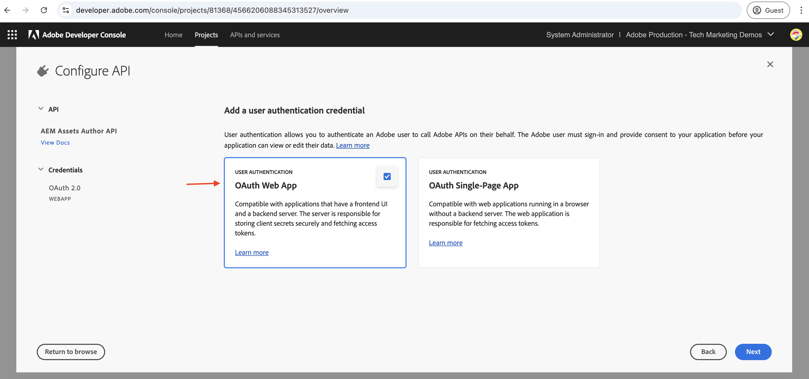
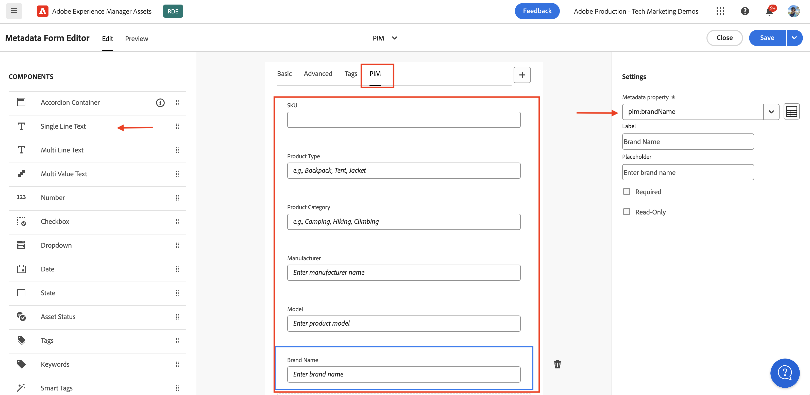

# AEM API&#39;s op basis van OpenAPI aanroepen met OAuth Web App-verificatie

Leer hoe u op OpenAPI gebaseerde AEM API&#39;s op AEM as a Cloud Service oproept met gebruikersgebaseerde verificatie van een aangepaste webapp die gebruikmaakt van OAuth Web App.

De authentificatie van de Toepassing van het Web OAuth is ideaal voor Webtoepassingen met vooruitstrevende en _achterste_ componenten die **toegang moeten hebben tot AEM APIs namens een gebruiker**. Het gebruikt OAuth 2.0 _authentication_code_ verlenen type om een toegangstoken namens de gebruiker te verkrijgen om tot AEM APIs toegang te hebben. Voor meer informatie, zie [&#x200B; Verschil tussen Server-aan-Server van OAuth vs Web App geloofsbrieven van de Enige Pagina App &#x200B;](../overview.md#difference-between-oauth-server-to-server-vs-web-app-vs-single-page-app-credentials).

## Wat u leert{#what-you-learn}

In deze zelfstudie leert u hoe u:

- Vorm een project van Adobe Developer Console (ADC) om tot de Auteur API van Assets toegang te hebben gebruikend _authentificatie van de App van het Web 0&rbrace; OAuth._

- Implementeer de OAuth Web App-verificatiestroom in een aangepaste web-app.
   - IMS-gebruikersverificatie en -toepassingsautorisatie.
   - Ophalen van gebruikerspecifieke toegangstoken.
   - Toegang krijgen tot AEM API&#39;s die zijn gebaseerd op OpenAPI&#39;s met behulp van het gebruikerspecifieke toegangstoken.

Controleer voordat u begint het volgende:

- [&#x200B; Toegang hebbend tot Adobe APIs en verwante concepten &#x200B;](../overview.md#accessing-adobe-apis-and-related-concepts) sectie.
- [&#x200B; artikel van opstellingsOpenAPI-Gebaseerde AEM APIs.](../setup.md)

## Voorbeeld van een web-app: WKND-PIM-overzicht en functionele flow

Laten we de voorbeeldwebtoepassing, het WKND-productinformatiebeheer (PIM) en de functionele stroom ervan begrijpen.

De WKND PIM-app is een voorbeeldwebtoepassing die is ontworpen voor het beheer van productkenmerken en de metagegevens van bedrijfsmiddelen die in AEM as a Cloud Service zijn opgeslagen. In dit voorbeeld wordt getoond hoe webtoepassingen naadloos kunnen integreren met Adobe API&#39;s om efficiënte, gebruikersgerichte workflows te leveren.

Het Adobe Developer Console-project (ADC) is geconfigureerd voor toegang tot de Assets Author API met behulp van de OAuth Web App-verificatie. Het verstrekt noodzakelijke _client_id_ en _client_geheime_ aan het Web WKND-PIM app om de _authentication_code_ subsidiestroom in werking te stellen.

>[!VIDEO](https://video.tv.adobe.com/v/3442763?captions=dut&quality=12&learn=on)


Het volgende diagram illustreert de functionele stroom van WKND-PIM Web app _die gebruikerspecifieke toegangstokens krijgt om met de Auteur API van Assets in wisselwerking te staan_.


1. De webtoepassing start het proces door de gebruiker om te leiden naar het Adobe Identity Management System (IMS) voor verificatie.
1. Samen met redirect, gaat Web app vereiste _client_id_ en _redirect_uri_ tot IMS over.
1. IMS verklaart de gebruiker voor authentiek en verzendt hen terug naar gespecificeerde _redirect_uri_ met een _authentication_code_.
1. Het Web app ruilt _authentication_code_ met IMS voor een gebruiker-specifiek toegangstoken, gebruikend zijn _client_id_ en _client_geheime_.
1. Op succesvolle bevestiging, geeft IMS het user-specific _toegangstoken_ uit.
1. Webapp gebruikt veilig het _toegangstoken_ om met de Auteur API van Assets in wisselwerking te staan, toelatend de gebruiker om de meta-gegevens van de productactiva terug te winnen of bij te werken.

WKND-PIM Web app wordt ontwikkeld gebruikend [&#x200B; Node.js &#x200B;](https://nodejs.org/en) en [&#x200B; Uitdrukkelijke &#x200B;](https://expressjs.com/). Express handelt als de server die veilig persoonlijke geheimen en gebruikerspecifieke toegangstokens beheert.

Andere webstapels (Java, Python, .NET-gebaseerd, enz.) kunnen worden gebruikt om webtoepassingen te maken die integreren met de Adobe API&#39;s met behulp van de benaderingen die in deze zelfstudie worden geïllustreerd.

## Deze zelfstudie gebruiken{#how-to-use-this-tutorial}

U kunt of [&#x200B; het Web van het Overzicht app zeer belangrijke codefragmenten &#x200B;](#review-web-app-key-code-snippets) sectie &lbrace;om de de authentificatiestroom van de App van het Web te begrijpen OAuth en API codefragmenten roepen die in WKND-PIM Web worden gebruikt app. Of ga direct aan de [&#x200B; Opstelling te werk en Web app &#x200B;](#setup-run-web-app) sectie in werking te stellen aan opstelling en WKND-PIM Web app op uw lokale machine in werking te stellen om de OAuth de authentificatiestroom van de App en API vraag te begrijpen.

## Codefragmenten voor webapps bekijken{#review-web-app-key-code-snippets}

Laten we de belangrijkste codefragmenten bekijken die worden gebruikt in de WKND-PIM-webapp om inzicht te krijgen in de OAuth Web App-verificatiestroom en API-aanroepen.

### De WKND-PIM-webtoepassingscode downloaden

1. Download het [&#x200B; WKND-PIM Web app &#x200B;](../assets/web-app/wknd-pim-demo-web-app.zip) .zip dossier en haal het uit.

1. Navigeer naar de uitgepakte map en open het bestand `.env.example` in uw favoriete code-editor. Controleer de vereiste configuratieparameters.

   ```plaintext
   ########################################################################
   # Adobe IMS, Adobe Developer Console (ADC), and AEM Assets Information
   ########################################################################
   # Adobe IMS OAuth endpoints
   ADOBE_IMS_AUTHORIZATION_ENDPOINT=https://ims-na1.adobelogin.com/ims/authorize/v2
   ADOBE_IMS_TOKEN_ENDPOINT=https://ims-na1.adobelogin.com/ims/token/v3
   ADOBE_IMS_USERINFO_ENDPOINT=https://ims-na1.adobelogin.com/ims/userinfo/v2
   
   # Adobe Developer Console (ADC) Project's OAuth Web App credential
   ADC_CLIENT_ID=<ADC Project OAuth Web App credential ClientID>
   ADC_CLIENT_SECRET=<ADC Project OAuth Web App credential Client Secret>
   ADC_SCOPES=<ADC Project OAuth Web App credential credential Scopes>
   
   # AEM Assets Information
   AEM_ASSET_HOSTNAME=<AEM Assets Hostname, e.g., https://author-p63947-e1502138.adobeaemcloud.com/>
   AEM_ASSET_IDS=< AEM Asset IDs Comma Seperated, e.g., urn:aaid:aem:9f20a8ce-934a-4560-8720-250e529fbb17,urn:aaid:aem:6e0123cd-8a67-4d1f-b721-1b3da987d831>
   
   ################################################
   # Web App Information
   ################################################
   # The port number on which this server (web app) will run
   PORT = 3000
   
   # The URL to which the user will be redirected after the OAuth flow is complete
   REDIRECT_URI=https://localhost:3001/callback
   
   # The Express (express-session) uses this secret to encrypt and verify the authenticity of that cookie
   EXPRESS_SESSION_SECRET=<Express Session Secret>
   ```

   U moet de plaatsaanduidingen vervangen door de werkelijke waarden uit het Adobe Developer Console-project (ADC) en het AEM as a Cloud Service Assets-exemplaar.

### IMS-gebruikersverificatie en -toepassingsautorisatie

Controleer de code waarmee de IMS-gebruikersverificatie en -toepassingsautorisatie worden gestart. Als u de metagegevens van de middelen wilt bekijken of bijwerken, moet de gebruiker zich verifiëren met de Adobe IMS en de WKND-PIM-webapp machtigen om namens hem toegang te krijgen tot de Assets Author API.

Bij de allereerste aanmeldingspoging moet de gebruiker toestemming geven om de WKND-PIM-webapp namens hem toegang te geven tot de Assets Author API.


1. Het `routes/update-product-attributes.js` dossier verifieert als de 1&rbrace; Uitdrukkelijke zitting van de gebruiker [&#x200B; een toegangstoken heeft. &#x200B;](https://www.npmjs.com/package/express-session) Als dat niet het geval is, leidt het de gebruiker om naar de `/auth` route.

   ```javascript
   ...
   // The update-product-attributes route, shows the product attributes form with tabs
   router.get("/update-product-attributes", async (req, res) => {
     // Check if the user is authenticated, if not redirect to the auth route
     if (!req.session.accessToken) {
         return res.redirect("/auth");
     }
     ...
   });
   ```

1. In `routes/adobe-ims-auth.js` -bestand start de `/auth` -route de gebruikersverificatie en de autorisatiestroom van de IMS-toepassing. Noteer _client_id_, _redirect_uri_, en _response_type_ parameters die tot het de vergunningseindpunt van Adobe IMS worden overgegaan.

   ```javascript
   ...
   // Route to initiate Adobe IMS user authentication
   router.get("/auth", (req, res) => {
     // Redirect user to Adobe IMS authorization endpoint
     try {
         // Constructing the authorization URL
         const params = new URLSearchParams({
         client_id: adobeADCConfig.clientId,
         redirect_uri: redirectUri,
         response_type: "code",
         });
   
         // Append scopes if defined in configuration
         if (adobeADCConfig?.scopes) params.append("scope", adobeADCConfig.scopes);
   
         // Redirect user to Adobe IMS authorization URL
         const imsAuthorizationUrl = `${
         adobeIMSConfig.authorizationEndpoint
         }?${params.toString()}`;
   
         res.redirect(imsAuthorizationUrl);
     } catch (error) {
         console.error("Error initiating Adobe IMS authentication:", error);
         res.status(500).send("Unable to initiate authentication");
     }
   });
   ...
   ```

Als de gebruiker niet op basis van de Adobe IMS is geverifieerd, wordt de Adobe ID-aanmeldingspagina weergegeven met het verzoek om verificatie.

Als reeds voor authentiek verklaard, wordt de gebruiker opnieuw gericht terug naar gespecificeerde _redirect_uri_ van het Web WKND-PIM met een _authentication_code_.

### Ophalen van toegangstoken

Het Web-app WKND-PIM ruilt veilig _authentication_code_ met Adobe IMS voor een user-specific toegangstoken gebruikend _client_id_ en _client_geheime_ van de referentie van de App van het Web van het Project ADC.

In het `routes/adobe-ims-auth.js` dossier, ruilt de `/callback` route _authentication_code_ met Adobe IMS voor een gebruiker-specifiek toegangstoken.

```javascript
...
// Callback route to exchange authorization code for access token
router.get("/callback", async (req, res) => {
  // Extracting authorization code from the query parameters
  const authorizationCode = req.query.code;

  if (!authorizationCode) {
    return res.status(400).send("Missing authorization code");
  }

  // Exchange authorization code for access token
  try {
    // Fetch access token from Adobe IMS token endpoint
    const response = await fetch(adobeIMSConfig.tokenEndpoint, {
      method: "POST",
      headers: {
        "Content-Type": "application/x-www-form-urlencoded",
        Authorization: `Basic ${Buffer.from(
          `${adobeADCConfig.clientId}:${adobeADCConfig.clientSecret}`
        ).toString("base64")}`,
      },
      body: new URLSearchParams({
        code: authorizationCode,
        grant_type: "authorization_code",
      }),
    });

    if (!response.ok) {
      console.error("Failed to fetch access token:", response.statusText);
      return res.status(500).send("Failed to fetch access token");
    }

    const data = await response.json();

    if (!data.access_token) {
      console.error("Access token missing in the response:", data);
      return res.status(500).send("Invalid response from token endpoint");
    }

    // For debugging purposes
    console.log("Access token:", data.access_token);

    // Store the access token in the session
    req.session.accessToken = data.access_token;

    // Redirect user to update product attributes
    res.redirect("/update-product-attributes");
  } catch (error) {
    console.error("Error exchanging authorization code:", error);
    res.status(500).send("Error during token exchange");
  }
});
```

Het toegangstoken wordt opgeslagen in de [&#x200B; Uitdrukkelijke zitting &#x200B;](https://www.npmjs.com/package/express-session) voor verdere verzoeken aan de Auteur API van Assets.

### Toegang krijgen tot AEM API&#39;s die zijn gebaseerd op OpenAPI met behulp van het toegangstoken

De WKND-PIM-webtoepassing gebruikt veilig het gebruikerspecifieke toegangstoken om te communiceren met de Assets Author API, waardoor de gebruiker metagegevens van productelementen kan ophalen of bijwerken.

In het `routes/invoke-aem-apis.js` -bestand roepen de `/api/getAEMAssetMetadata` - en `/api/updateAEMAssetMetadata` -routes de Assets-auteur-API&#39;s aan met behulp van het toegangstoken.

```javascript
...
// API Route: Get AEM Asset Metadata
router.get("/api/getAEMAssetMetadata", async (req, res) => {
  const assetId = req.query.assetId;
  const bucketName = getBucketName(aemAssetsConfig.hostname);

  if (!assetId || !bucketName) {
    return res.status(400).json({ error: "Missing AEM Information" });
  }

  // Get the access token from the session
  const accessToken = req.session.accessToken;

  if (!accessToken) {
    return res.status(401).json({ error: "Not Authenticated with Adobe IMS" });
  }

  try {
    const assetMetadata = await invokeGetAssetMetadataAPI(
      bucketName,
      assetId,
      accessToken
    );

    const filteredMetadata = getFilteredMetadata(JSON.parse(assetMetadata));
    res.status(200).json(filteredMetadata);
  } catch (error) {
    console.error("Error getting asset metadata:", error.message);
    res.status(500).json({ error: `Internal Server Error: ${error.message}` });
  }
});

// Helper function to invoke the AEM API to get asset metadata
async function invokeGetAssetMetadataAPI(bucketName, assetId, accessToken) {
  const apiUrl = `https://${bucketName}.adobeaemcloud.com/adobe/assets/${assetId}/metadata`;


  // For debugging purposes
  console.log("API URL:", apiUrl);
  console.log("Access Token:", accessToken);
  console.log("API Key:", adobeADCConfig.clientId);

  try {
    const response = await fetch(apiUrl, {
      method: "GET",
      headers: {
        "If-None-Match": "string",
        "X-Adobe-Accept-Experimental": "1",
        Authorization: `Bearer ${accessToken}`,
        "X-Api-Key": adobeADCConfig.clientId,
      },
    });

    console.log("Response Status:", response.status);

    if (!response.ok) {
      throw new Error(`AEM API Error: ${response.statusText}`);
    }

    return await response.text();
  } catch (error) {
    throw new Error(`Failed to fetch asset metadata: ${error.message}`);
  }
}

// Helper function to filter the metadata properties like pim: and dc:
function getFilteredMetadata(data) {
  if (!data || !data.assetMetadata) {
    throw new Error("Invalid metadata structure received from API");
  }

  const properties = data.assetMetadata;
  return Object.keys(properties).reduce((filtered, key) => {
    if (
      key.startsWith("pim:") ||
      key === "dc:title" ||
      key === "dc:description"
    ) {
      filtered[key] = properties[key];
    }
    return filtered;
  }, {});
}

// API Route: Update AEM Asset Metadata
router.post("/api/updateAEMAssetMetadata", async (req, res) => {
  const { assetId, metadata } = req.body;

  if (!assetId || !metadata || typeof metadata !== "object") {
    return res.status(400).json({ error: "Invalid or Missing Metadata" });
  }

  const bucketName = getBucketName(aemAssetsConfig.hostname);
  if (!bucketName) {
    return res.status(400).json({ error: "Missing AEM Information" });
  }

  const accessToken = req.session.accessToken;
  if (!accessToken) {
    return res.status(401).json({ error: "Not Authenticated with Adobe IMS" });
  }

  try {
    const updatedMetadata = await invokePatchAssetMetadataAPI(
      bucketName,
      assetId,
      metadata,
      accessToken
    );
    res.status(200).json(updatedMetadata);
  } catch (error) {
    console.error("Error updating asset metadata:", error.message);
    res.status(500).json({ error: `Internal Server Error: ${error.message}` });
  }
});

// Helper function to invoke the AEM API to update asset metadata
async function invokePatchAssetMetadataAPI(
  bucketName,
  assetId,
  metadata,
  accessToken
) {
  const apiUrl = `https://${bucketName}.adobeaemcloud.com/adobe/assets/${assetId}/metadata`;
  const headers = {
    "Content-Type": "application/json-patch+json",
    "If-Match": "*",
    "X-Adobe-Accept-Experimental": "1",
    Authorization: `Bearer ${accessToken}`,
    "X-Api-Key": adobeADCConfig.clientId,
  };

  try {
    const response = await fetch(apiUrl, {
      method: "PATCH",
      headers,
      body: JSON.stringify(getTransformedMetadata(metadata)),
    });

    if (!response.ok) {
      throw new Error(`AEM API Error: ${response.statusText}`);
    }

    return await response.json();
  } catch (error) {
    throw new Error(`Failed to update asset metadata: ${error.message}`);
  }
}

// Helper function to transform metadata into JSON Patch format, e.g. [{ op: "add", path: "dc:title", value: "New Title" }]
function getTransformedMetadata(metadata) {
  return Object.keys(metadata).map((key) => ({
    op: "add",
    path: `/${key}`,
    value: metadata[key],
  }));
}
```

De op OpenAPI gebaseerde AEM API-aanroepen worden gemaakt vanaf de server-kant (Express middleware) en niet rechtstreeks vanaf de client-kant (browser) om ervoor te zorgen dat het toegangstoken veilig wordt beheerd en niet aan de client-kant wordt weergegeven.

### Het toegangstoken vernieuwen

Om het toegangstoken te verfrissen alvorens het verloopt, kunt u uitvoeren verfrist symbolische stroom. Om de zelfstudie echter eenvoudig te houden, implementeert de WKND-PIM-webapp de token-flow voor vernieuwen niet.


>[!TIP]
>
>U kunt de volgende sectie volgen om WKND-PIM Web app op uw lokale machine uit te proberen en praktijkervaring met de OAuth Web App authentificatiestroom en API vraag te krijgen.

## Webtoepassing instellen en uitvoeren

Configureer en voer de WKND-PIM-webapp op uw lokale computer uit om de OAuth Web App-verificatiestroom en API-aanroepen te begrijpen.

### Vereisten

U hebt het volgende nodig om deze zelfstudie te voltooien:

- Modernisering van de AEM as a Cloud Service-omgeving met het volgende:
   - AEM Release `2024.10.18459.20241031T210302Z` of hoger.
   - Nieuwe stijlproductprofielen (als de omgeving vóór november 2024 is gemaakt)

  Zie [&#x200B; opstelling op OpenAPI-Gebaseerde AEM APIs &#x200B;](../setup.md) artikel voor meer details.

- Het steekproef [&#x200B; WKND &#x200B;](https://github.com/adobe/aem-guides-wknd?#aem-wknd-sites-project) project van Plaatsen moet op het worden opgesteld.

- Toegang tot [&#x200B; Adobe Developer Console &#x200B;](https://developer.adobe.com/developer-console/docs/guides/getting-started).

- Installeer [&#x200B; Node.js &#x200B;](https://nodejs.org/en/) op uw lokale machine om de toepassing van steekproefNodeJS in werking te stellen.

- Installeer a [&#x200B; lokaal-ssl-volmacht &#x200B;](https://www.npmjs.com/package/local-ssl-proxy#local-ssl-proxy) op uw lokale machine om een lokale SSL HTTP- volmacht tot stand te brengen gebruikend een zelf-ondertekend certificaat.


### Ontwikkelingsstappen

De ontwikkelingsstappen op hoog niveau zijn:

1. ADC-project configureren
   1. De Assets-auteur-API toevoegen
   1. OAuth Web App-referentie configureren
1. De AEM-instantie configureren om ADC-projectcommunicatie in te schakelen
1. In AEM maakt en past u het schema voor metagegevens van elementen toe
1. De WKND-PIM-webapp configureren en uitvoeren
1. Verifieer de stroom van begin tot eind

### ADC-project configureren

Vorm ADC de stap van het Project wordt _herhaald_ van [&#x200B; OpenAPI-Gebaseerde AEM APIs van de Opstelling &#x200B;](../setup.md). De methode wordt herhaald om de Assets-auteur-API toe te voegen en de verificatiemethode te configureren als OAuth Web App.

1. Van [&#x200B; Adobe Developer Console &#x200B;](https://developer.adobe.com/console/projects), open het gewenste project.

1. Om AEM APIs toe te voegen, klik op **voeg API** knoop toe.

    toe

1. In _voeg API_ dialoog toe, filter door _Experience Cloud_ en selecteer **de Auteur API van AEM Assets** kaart en klik **daarna**.

    toe

   >[!TIP]
   >
   >Als de gewenste **AEM API kaart** wordt onbruikbaar gemaakt en _waarom is dit gehandicapt?_ de informatie toont het **Vereiste Vergunning** bericht één van de redenen zou kunnen zijn dat u uw milieu van AEM as a Cloud Service NIET hebt gemoderniseerd, zie [&#x200B; Modernisering van het milieu van AEM as a Cloud Service &#x200B;](../setup.md#modernization-of-aem-as-a-cloud-service-environment) voor meer informatie.

1. Daarna, in _vorm API_ dialoog, selecteer de **3&rbrace; authentificatieoptie van de Authentificatie van de Gebruiker &lbrace;en klik** daarna **.**

   

1. In volgende _vorm API_ dialoog, selecteer de **OAuth de authentificatieoptie van de Toepassing van het Web** en klik **daarna**.

   

1. In _vorm OAuth Web App_ dialoog, ga de volgende details in en klik **daarna**.
   - Standaard omleidings-URI: `https://localhost:3001/callback`
   - URI-patroon omleiden: `https://localhost:3001/callback`

   

1. Herzie het beschikbare werkingsgebied en klik **sparen gevormde API**.

   

1. Controleer de AEM API- en verificatieconfiguratie.

   

   

### AEM-instantie configureren om ADC-projectcommunicatie in te schakelen

Volg de instructies van het [&#x200B; op OpenAPI-Gebaseerde artikel van AEM APIs van de Opstelling &#x200B;](../setup.md#configure-the-aem-instance-to-enable-adc-project-communication) om de instantie van AEM te vormen om de mededeling van het Project van ADC toe te laten.

### Metagegevensschema voor elementen maken en toepassen

Door gebrek, heeft het project van Plaatsen WKND niet het vereiste schema van activa meta-gegevens om de productattributen te tonen. Laten we het metagegevensschema voor elementen maken en toepassen op een elementenmap in de AEM-instantie.

1. Meld u aan bij de AEM as a Cloud Service Asset-instantie. Gebruikend de [&#x200B; mening van Activa &#x200B;](https://experienceleague.adobe.com/nl/docs/experience-manager-learn/assets/authoring/switch-views) navigeert aan de `/content/dam/wknd-shared/en` omslag.

   

1. Creeer a **PIM** en binnen het leiden tot de **Camping** omslag, dan uploadt [&#x200B; steekproefbeelden &#x200B;](../assets/web-app/camping-gear-imgs.zip) in de **Camping** omslag.

   

Daarna, creeer de attributen PIM specifiek meta-gegevensschema en pas het op de **PIM** omslag toe.

1. Navigeer aan de **Montages** > **optie van Forms van Meta-gegevens** van het linkerspoor en klik **creeer** knoop.

1. In **creeer de dialoog van de Vorm van Meta-gegevens**, ga de volgende details in en klik **creeer**.
   - Naam: `PIM`
   - Bestaande formulierstructuur als sjabloon gebruiken: `Check`
   - Kiezen uit: `default`

   

1. Klik het **+** pictogram om een nieuw **PIM** lusje toe te voegen en **Enige Tekst van de Lijn** componenten aan het toe te voegen. De namen van de metagegevenseigenschappen moeten beginnen met het voorvoegsel `pim:` .

    toe

   | Label | Plaatsaanduiding | Eigenschap Metadata |
   | --- | --- | --- |
   | SKU | SKU-id invoeren | `pim:sku` |
   | Producttype | bijv. rugzak, tent, jasje | `pim:productType` |
   | Productcategorie | bijv. kamperen, wandelen, beklimmen | `pim:productCategory` |
   | Fabrikant | Naam fabrikant invoeren | `pim:manufacturer` |
   | Model | Naam model invoeren | `pim:model` |
   | Merknaam | Geef de merknaam op | `pim:brandName` |

1. Klik **sparen** en **dicht** om de meta-gegevensvorm te bewaren.

1. Tot slot pas het **PIM** meta-gegevensschema op de **PIM** omslag toe.

    toe

Met de bovengenoemde stappen, zijn de activa van de **PIM** omslag klaar om de meta-gegevens van productattributen op te slaan.

### De WKND-PIM-webapp configureren en uitvoeren

1. Download het [&#x200B; WKND-PIM Web app &#x200B;](../assets/web-app/wknd-pim-demo-web-app.zip) .zip dossier en haal het uit.

1. Navigeer naar de uitgepakte map en kopieer het `.env.example` -bestand naar `.env` .

1. Werk het `.env` -bestand bij met de vereiste configuratieparameters van het Adobe Developer Console-project (ADC) en de AEM as a Cloud Service Assets-instantie.

   ```plaintext
   ########################################################################
   # Adobe IMS, Adobe Developer Console (ADC), and AEM Assets Information
   ########################################################################
   # Adobe IMS OAuth endpoints
   ADOBE_IMS_AUTHORIZATION_ENDPOINT=https://ims-na1.adobelogin.com/ims/authorize/v2
   ADOBE_IMS_TOKEN_ENDPOINT=https://ims-na1.adobelogin.com/ims/token/v3
   ADOBE_IMS_USERINFO_ENDPOINT=https://ims-na1.adobelogin.com/ims/userinfo/v2
   
   # Adobe Developer Console (ADC) Project OAuth Web App credential
   ADC_CLIENT_ID=e1adsfsd59384320bbe4f9298f00b7ab
   ADC_CLIENT_SECRET=p8e-Mdfgfdsg43RHugVRTEOyWlmEU5m
   ADC_SCOPES=AdobeID,openid,aem.folders,aem.assets.author
   
   # AEM Assets Information
   AEM_ASSET_HOSTNAME=https://author-p3947-e1542138.adobeaemcloud.com/
   AEM_ASSET_IDS=urn:aaid:aem:aa689a9f-04da-4fbb-b460-74a5b6a69090,urn:aaid:aem:e4fdb6f6-1007-4e84-9726-a9522931786a
   
   ################################################
   # Web App Information
   ################################################
   # The port number on which this server (web app) will run
   PORT = 3000
   
   # The URL to which the user will be redirected after the OAuth flow is complete
   REDIRECT_URI=http://localhost:3000/auth/callback
   
   # The Express (express-session) uses this secret to encrypt and verify the authenticity of that cookie
   # For demonstration purposes, this is a simple secret. In production, you should use a strong secret
   EXPRESS_SESSION_SECRET=1234554321
   ```

   `AEM_ASSET_IDS` is de `jcr:uuid` bezitswaarde van de geüploade beelden in de **3&rbrace; omslag van de Camping.** Verwijs naar deze [&#x200B; sectie &#x200B;](./invoke-api-using-oauth-s2s.md#review-the-api) voor meer details.

1. Open een terminal en navigeer naar de uitgepakte map. Installeer de vereiste gebiedsdelen gebruikend het volgende bevel.

   ```bash
   $ npm install
   ```

1. Start de WKND-PIM-webtoepassing met de volgende opdracht.

   ```bash
   $ npm start
   ```

1. Voer de lokale SSL HTTP-proxy uit met de volgende opdracht.

   ```bash
   $ local-ssl-proxy --source 3001 --target 3000 --cert ./ssl/server.crt --key ./ssl/server.key
   ```

   De lokale SSL HTTP-proxy wordt gebruikt als IMS, waarbij de omleidings-URI HTTPS moet zijn.

### Verifieer de stroom van begin tot eind

1. Open een browser en navigeer naar `https://localhost:3001` om toegang te krijgen tot de WKND-PIM-webapp. Accepteer de zelfondertekende certificaatwaarschuwing.

   

1. Klik **probeert nu** om de meta-gegevens van productattributen te herzien en bij te werken. De IMS-gebruikersverificatie en de autorisatiestroom van toepassingen worden gestart.

1. Meld u aan met uw Adobe ID-referenties en geef toestemming om de WKND-PIM-webapp namens u toegang te geven tot de Assets Author API.

1. Van de `https://localhost:3001/update-product-attributes` route/pagina, klik de **Attributen van het Activum van AEM** tabel. Van **identiteitskaart van Activa** dropdown, selecteer een identiteitskaart van Activa om de activa meta-gegevens te bekijken.

   

1. Werk de activameta-gegevens bij en klik **de Attributen van het Activum van AEM** bijwerken om de activa meta-gegevens bij te werken.

   

>[!IMPORTANT]
>
>Als de geverifieerde gebruiker niet beschikt over de benodigde machtigingen om metagegevens van middelen te controleren of bij te werken, retourneren de op OpenAPI gebaseerde AEM API&#39;s een fout van 403 Verboden. Het zorgt ervoor dat, zelfs als de gebruiker voor authentiek wordt verklaard en een geldig toegangstoken IMS heeft, zij tot de middelen van AEM zonder de vereiste toestemmingen niet kunnen toegang hebben.


### De toepassingscode controleren

Laten we de codestructuur op hoog niveau en de belangrijkste entry-punten van de WKND-PIM-webapp evalueren. De toepassing wordt ontwikkeld met Node.js + Express.

1. `app.js` is het belangrijkste ingangspunt van de toepassing. Het initialiseert Uitdrukkelijke app, plaatst omhoog de zitting, en zet de routes op.

1. De map `public` bevat de statische elementen zoals CSS, JavaScript en afbeeldingen. Het `script.js` -bestand bevat de JavaScript-code aan de clientzijde voor interactie met de Express `/api/getAEMAssetMetadata` - en `/api/updateAEMAssetMetadata` -routes.

1. De map `routes` bevat de expresroutes:
   1. `index.js`: De hoofdroute die de startpagina rendert.
   1. `update-product-attributes.js`: De route die de productkenmerken van een formulier met tabs weergeeft, verifieert ook Express session voor toegangstoken.
   1. `adobe-ims-auth.js`: De route waarmee de gebruikersverificatie- en toepassingsautorisatiestroom van Adobe IMS wordt gestart.
   1. `invoke-aem-apis.js`: De route die de op OpenAPI gebaseerde AEM APIs gebruikend het user-specific toegangstoken aanhaalt.

1. De map `views` bevat de EJS-sjablonen om de HTML-pagina&#39;s te renderen.

1. De map `utils` bevat de hulpprogrammafuncties.

1. De map `ssl` bevat de zelfondertekende certificaat- en sleutelbestanden voor het uitvoeren van de lokale SSL HTTP-proxy.

U kunt de bestaande web-app ontwikkelen of integreren met de Adobe API&#39;s met behulp van andere server-side technologieën zoals Java, Python of .NET.

## Samenvatting

In deze zelfstudie hebt u geleerd hoe u op OpenAPI gebaseerde AEM API&#39;s op AEM as a Cloud Service kunt aanroepen vanuit een aangepaste webapp met OAuth Web App-verificatie. U hebt de belangrijkste codefragmenten bekeken die in WKND-PIM Web app worden gebruikt om de OAuth Web App authentificatiestroom te begrijpen.

U kunt de zelfstudie gebruiken als referentie om de op OpenAPI gebaseerde AEM API&#39;s te integreren met uw aangepaste webtoepassingen en zo efficiënte, gebruikersgerichte workflows te bieden.

## Aanvullende bronnen

- [&#x200B; Gids van de Implementatie van de Authentificatie van de Gebruiker &#x200B;](https://developer.adobe.com/developer-console/docs/guides/authentication/UserAuthentication/implementation)
- [&#x200B; machtigt Verzoek &#x200B;](https://developer.adobe.com/developer-console/docs/guides/authentication/UserAuthentication/ims#authorize-request)
- [&#x200B; het Ophalen tokens van de Toegang &#x200B;](https://developer.adobe.com/developer-console/docs/guides/authentication/UserAuthentication/ims#fetching-access-tokens)
- [&#x200B; het Verfrissen van de tokens van de Toegang &#x200B;](https://developer.adobe.com/developer-console/docs/guides/authentication/UserAuthentication/ims#refreshing-access-tokens)
