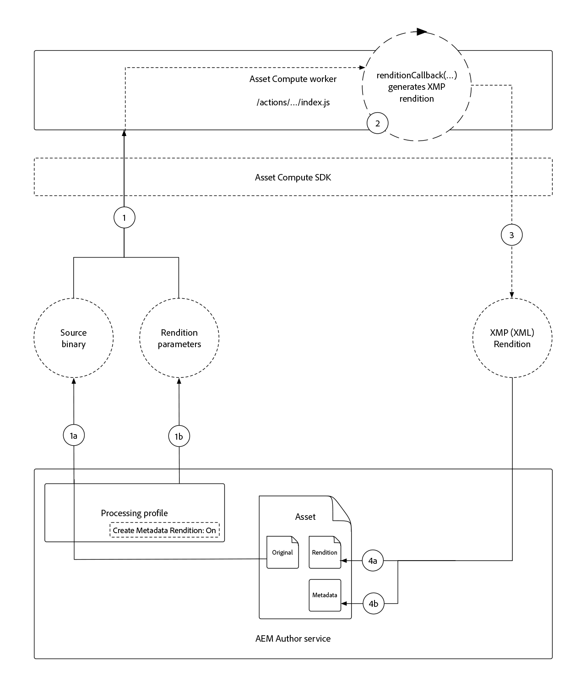

# Een Asset Compute-metagegevensworker ontwikkelen

De arbeiders van de Asset Compute van de douane kunnen XMP (XML) gegevens produceren die terug naar AEM worden verzonden en als meta-gegevens op activa worden opgeslagen.

Vaak voorkomende gevallen van gebruik zijn:

+ Integraties met systemen van derden, zoals een PIM (Product Information Management System), waar aanvullende metagegevens moeten worden opgehaald en opgeslagen op het middel
+ Integratie met Adobe-services, zoals Content en Commerce AI, om metagegevens van elementen te verfraaien met extra leerkenmerken voor computers
+ Metagegevens over het element afgeleid van de binaire waarde en opslaan als metagegevens over elementen in AEM as a Cloud Service

## Wat u gaat doen

>[!VIDEO](https://video.tv.adobe.com/v/327313?quality=12&learn=on)

In deze zelfstudie maken we een Asset Compute-worker voor metagegevens die de meest gebruikte kleuren in een afbeeldingselement afleidt, en schrijven we de namen van de kleuren terug naar de metagegevens van het element in AEM. Hoewel de worker zelf standaard is, wordt deze zelfstudie gebruikt om te verkennen hoe Asset Compute-workers kunnen worden gebruikt om metagegevens terug te schrijven naar elementen in AEM as a Cloud Service.

## Logische stroom van een aanroep van een Asset Compute-metagegevensworker

De aanroeping van de de meta-gegevensarbeiders van Asset Compute is bijna identiek aan die van [ binaire vertoning die arbeiders ](../develop/worker.md) produceert, met het primaire verschil is het terugkeertype een vertoning van XMP (XML) de waarvan waarden ook aan de meta-gegevens van de activa worden geschreven.

Asset Compute Workers implementeren het Asset Compute SDK worker API-contract in de functie `renditionCallback(...)` , wat conceptueel is:

+ __Input:__ de originele binaire parameters en van het Profiel van een AEM-element
+ __Output:__ Een XMP (XML) vertoning voortzette aan de activa van AEM als vertoning en aan de meta-gegevens van de activa



1. De dienst van de Auteur van AEM roept de de meta-gegevensarbeider van Asset Compute aan, die de activa __(1a) verstrekt__ origineel binair, en __(1b)__ om het even welke die parameters in het Profiel van de Verwerking worden bepaald.
1. Asset Compute SDK organiseert de uitvoering van de functie van de meta-gegevensarbeider van douaneAsset Compute `renditionCallback(...)`, die een vertoning van XMP (XML) afleidt, die op het binaire element __(1a)__ wordt gebaseerd en om het even welke parameters van het Profiel van de Verwerking __(1b)__.
1. De Asset Compute-worker slaat de XMP-representatie (XML) op in `rendition.path` .
1. De gegevens van XMP (XML) die aan `rendition.path` worden geschreven worden vervoerd via de SDK van Asset Compute naar de Dienst van de Auteur van AEM en stelt het als __(4a)__ een tekstvertoning en __(4b)__ voortgeduurd aan de de meta-gegevensknoop van activa bloot.

## Vorm manifest.yml{#manifest}

Alle arbeiders van Asset Compute moeten in [ manifest.yml ](../develop/manifest.md) worden geregistreerd.

Open het project `manifest.yml` en voeg een arbeidersingang toe die de nieuwe worker, in dit geval `metadata-colors` vormt.

_herinner `.yml` is gevoelig whitespace._

```
packages:
  __APP_PACKAGE__:
    license: Apache-2.0
    actions: 
      worker:
        function: actions/worker/index.js 
        web: 'yes' 
        runtime: 'nodejs:12'
        limits:
          timeout: 60000 # in ms
          memorySize: 512 # in MB
          concurrency: 10 
        annotations:
          require-adobe-auth: true
      metadata-colors:
        function: actions/metadata-colors/index.js 
        web: 'yes' 
        runtime: 'nodejs:12'
        limits:
          memorySize: 512 # in MB   
```

`function` richt aan de arbeidersimplementatie die in de [ volgende stap ](#metadata-worker) wordt gecreeerd. De arbeiders van de naam semantisch (bijvoorbeeld, zou `actions/worker/index.js` beter kunnen genoemd zijn `actions/rendition-circle/index.js`), aangezien deze in [ URL van de arbeider ](#deploy) tonen en ook de [ de naam van de de de testreeksomslag van de arbeider ](#test) bepalen.

`limits` en `require-adobe-auth` worden op discrete wijze geconfigureerd per worker. In deze worker wordt `512 MB` geheugen toegewezen terwijl de code (mogelijk) grote binaire afbeeldingsgegevens inspecteert. De andere `limits` worden verwijderd om de standaardwaarden te gebruiken.

## Een metagegevensworker ontwikkelen{#metadata-worker}

Creeer een nieuw dossier van JavaScript van de meta-gegevensarbeider in het project van Asset Compute bij de weg [ bepaalde manifest.yml voor de nieuwe worker ](#manifest), bij `/actions/metadata-colors/index.js`

### Npm-modules installeren

Installeer de extra npm modules ([@adobe/asset-compute-xmp ](https://www.npmjs.com/package/@adobe/asset-compute-xmp?activeTab=versions), [ get-image-colors ](https://www.npmjs.com/package/get-image-colors), en [ kleur-namer ](https://www.npmjs.com/package/color-namer)) die in deze worker van Asset Compute wordt gebruikt.

```
$ npm install @adobe/asset-compute-xmp
$ npm install get-image-colors
$ npm install color-namer
```

### Code metagegevensworker

Deze arbeider kijkt zeer gelijkaardig aan de [ rendition-producerende arbeider ](../develop/worker.md), het primaire verschil is het schrijft XMP (XML) gegevens aan `rendition.path` om terug naar AEM worden bewaard.


```javascript
"use strict";

const { worker, SourceCorruptError } = require("@adobe/asset-compute-sdk");
const fs = require("fs").promises;

// Require the @adobe/asset-compute-xmp module to create XMP 
const { serializeXmp } = require("@adobe/asset-compute-xmp");

// Require supporting npm modules to derive image colors from image data
const getColors = require("get-image-colors");
// Require supporting npm modules to convert image colors to color names
const namer = require("color-namer");

exports.main = worker(async (source, rendition, params) => {
  // Perform any necessary source (input) checks
  const stats = await fs.stat(source.path);
  if (stats.size === 0) {
    // Throw appropriate errors whenever an erring condition is met
    throw new SourceCorruptError("source file is empty");
  }
  const MAX_COLORS = 10;
  const DEFAULT_COLORS_FAMILY = 'basic';

  // Read the color family parameter to use to derive the color names
  let colorsFamily = rendition.instructions.colorsFamily || DEFAULT_COLORS_FAMILY;

  if (['basic', 'hex', 'html', 'ntc', 'pantone', 'roygbiv'].indexOf(colorsFamily) === -1) { 
      colorsFamily = DEFAULT_COLORS_FAMILY;
  }
  
  // Use the `get-image-colors` module to derive the most common colors from the image
  let colors = await getColors(source.path, { options: MAX_COLORS });

  // Convert the color Chroma objects to their closest names
  let colorNames = colors.map((color) => getColorName(colorsFamily, color));

  // Serialize the data to XMP metadata
  // These properties are written to the [dam:Asset]/jcr:content/metadata resource
  // This stores
  // - The list of color names is stored in a JCR property named `wknd:colors`
  // - The colors family used to derive the color names is stored in a JCR property named `wknd:colorsFamily`
  const xmp = serializeXmp({
      // Use a Set to de-duplicate color names
      "wknd:colors": [...new Set(colorNames)],
      "wknd:colorsFamily": colorsFamily
    }, {
      // Define any property namespaces used in the above property/value definition
      // These namespaces are automatically registered in AEM if they do not yet exist
      namespaces: {
        wknd: "https://wknd.site/assets/1.0/",
      },
    }
  );

  // Save the XMP metadata to be written back to the asset's metadata node
  await fs.writeFile(rendition.path, xmp, "utf-8");
});

/**
 * Helper function that derives the closest color name for the color, based on the colors family
 * 
 * @param {*} colorsFamily the colors name family to use
 * @param {*} color the color to convert to a name
 */
function getColorName(colorsFamily, color) {
    if ('hex' === colorsFamily) {  return color; }

    let names = namer(color.rgb())[colorsFamily];

    if (names.length >= 1) { return names[0].name; }
}
```

## De metagegevensworker lokaal uitvoeren{#development-tool}

Als de code van de worker is voltooid, kan deze worden uitgevoerd met het lokale Asset Compute Development Tool.

Omdat ons project van Asset Compute twee arbeiders (de vorige [ cirkelvertoning ](../develop/worker.md) en deze `metadata-colors` worker) bevat, maakt de ](../develop/development-tool.md) profieldefinitie van het Hulpmiddel van de Ontwikkeling van Asset Compute een lijst van uitvoeringsprofielen voor beide arbeiders. [ De tweede profieldefinitie verwijst naar de nieuwe `metadata-colors` worker.


1. Van de basis van het Asset Compute-project
1. Uitvoeren `aio app run` om het Asset Compute Development Tool te starten
1. In __selecteer een dossier...__ drop down, pluk a [ steekproefbeeld ](../assets/samples/sample-file.jpg) om te verwerken
1. In de tweede profieldefinitieconfiguratie, die naar de `metadata-colors` worker verwijst, werkt u `"name": "rendition.xml"` bij terwijl deze worker een XMP (XML)-uitvoering genereert. Voeg desgewenst een parameter `colorsFamily` (ondersteunde waarden `basic` , `hex` , `html` , `ntc` , `pantone` , `roygbiv` ) toe.

   ```json
   {
       "renditions": [
           {
               "worker": "...",
               "name": "rendition.xml",
               "colorsFamily": "pantone"
           }
       ]
   }
   ```

1. Tik __Looppas__ en wacht op de vertoning van XML om te produceren
   + Aangezien beide workers worden vermeld in de profieldefinitie, genereren beide uitvoeringen. Naar keuze, kan de hoogste profieldefinitie die bij de [ worker van de cirkelvertoning ](../develop/worker.md) richten worden geschrapt, vermijden uitvoerend het van het Hulpmiddel van de Ontwikkeling.
1. De __vertoningen__ sectie previews de geproduceerde vertoning. Tik op de `rendition.xml` om deze te downloaden en open deze in VS-code (of in uw favoriete XML-/teksteditor) om deze te bekijken.

## De worker testen{#test}

De arbeiders van meta-gegevens kunnen worden getest gebruikend het [ zelfde Asset Compute testende kader zoals binaire vertoningen ](../test-debug/test.md). Het enige verschil is dat het `rendition.xxx` -bestand in het testgeval de verwachte XMP (XML)-uitvoering moet zijn.

1. Maak de volgende structuur in het Asset Compute-project:

   ```
   /test/asset-compute/metadata-colors/success-pantone/
   
       file.jpg
       params.json
       rendition.xml
   ```

2. Gebruik het [ steekproefdossier ](../assets/samples/sample-file.jpg) als testcase `file.jpg`.
3. Voeg de volgende JSON toe aan de `params.json` .

   ```
   {
       "fmt": "xml",
       "colorsFamily": "pantone"
   }
   ```

   Let op: `"fmt": "xml"` is vereist om de testsuite de instructie te geven een `.xml` op tekst gebaseerde uitvoering te genereren.

4. Geef de verwachte XML op in het `rendition.xml` -bestand. Dit kan worden verkregen door:
   + Het testinvoerbestand uitvoeren via het Development Tool en de (gevalideerde) XML-uitvoering opslaan.

   ```
   <?xml version="1.0" encoding="UTF-8"?><rdf:RDF xmlns:rdf="http://www.w3.org/1999/02/22-rdf-syntax-ns#" xmlns:wknd="https://wknd.site/assets/1.0/"><rdf:Description><wknd:colors><rdf:Seq><rdf:li>Silver</rdf:li><rdf:li>Black</rdf:li><rdf:li>Outer Space</rdf:li></rdf:Seq></wknd:colors><wknd:colorsFamily>pantone</wknd:colorsFamily></rdf:Description></rdf:RDF>
   ```

5. Voer `aio app test` uit vanaf de basis van het Asset Compute-project om alle testsuites uit te voeren.

### De worker distribueren naar Adobe I/O Runtime{#deploy}

Om deze nieuwe meta-gegevensarbeider van AEM Assets aan te halen, moet het aan Adobe I/O Runtime worden opgesteld, gebruikend het bevel:

```
$ aio app deploy
```


Merk op dit alle arbeiders in het project zal opstellen. Herzie [ onverkort opstelt instructies ](../deploy/runtime.md) voor hoe te aan werkruimten van het Stadium en van de Productie op te stellen.

### Integreren met AEM-verwerkingsprofielen{#processing-profile}

Roep de worker van AEM aan door een nieuwe aangepaste verwerkingsprofielservice te maken of door een bestaande aangepaste verwerkingsprofielservice te wijzigen die deze geïmplementeerde worker activeert.


1. Login aan de dienst van de Auteur van AEM as a Cloud Service als __Beheerder van AEM__
1. Navigeer aan __Hulpmiddelen > Assets > de Profielen van de Verwerking__
1. __creeer__ nieuw, of __geef__ en bestaand uit, het Profiel van de Verwerking
1. Tik het __Eigen__ lusje, en de Tik __voeg Nieuw__ toe
1. De nieuwe service definiëren
   + __creeer de Vertoning van Meta-gegevens__: Wissel aan actief
   + __Eindpunt:__ `https://...adobeioruntime.net/api/v1/web/wkndAemAssetCompute-0.0.1/metadata-colors`
      + Dit is URL aan de worker die tijdens [ wordt verkregen stelt ](#deploy) of het gebruiken van het bevel `aio app get-url` op. Zorg ervoor dat de URL-punten zich op de juiste werkruimte bevinden, op basis van de AEM as a Cloud Service-omgeving.
   + __Parameters van de Dienst__
      + Tik __voeg Parameter__ toe
         + Sleutel: `colorFamily`
         + Waarde: `pantone`
            + Ondersteunde waarden: `basic`, `hex`, `html`, `ntc`, `pantone`, `roygbiv`
   + __MIME Types__
      + __omvat:__ `image/jpeg`, `image/png`, `image/gif`, `image/svg`
         + Dit zijn de enige MIME types die door de derde npm modules worden gesteund die worden gebruikt om de kleuren af te leiden.
      + __sluit uit:__ `Leave blank`
1. Tik __sparen__ in het hoogste recht
1. Verwerkingsprofiel toepassen op een AEM Assets-map als dit nog niet is gebeurd

### Metagegevensschema bijwerken{#metadata-schema}

Als u de metagegevens van kleuren wilt bekijken, wijst u twee nieuwe velden in het metagegevensschema van de afbeelding toe aan de nieuwe eigenschappen van de metagegevens die de worker vult.


1. In de dienst van de Auteur van AEM, navigeer aan __Hulpmiddelen > Assets > de Schema&#39;s van Meta-gegevens__
1. Navigeer in __gebrek__ en selecteer en geef __beeld__ uit en voeg read-only vormgebieden toe om de geproduceerde kleurenmeta-gegevens bloot te stellen
1. Voeg a __Enige Tekst van de Lijn__ toe
   + __Etiket van het Gebied__: `Colors Family`
   + __Kaart aan bezit__: `./jcr:content/metadata/wknd:colorsFamily`
   + __Regels > Gebied > onbruikbaar maken geeft__ uit: Gecontroleerd
1. Voeg a __Meerdere Tekst van de Waarde__ toe
   + __Etiket van het Gebied__: `Colors`
   + __Kaart aan bezit__: `./jcr:content/metadata/wknd:colors`
1. Tik __sparen__ in het hoogste recht

## Bezig met verwerken van elementen


1. In de dienst van de Auteur van AEM, navigeer aan __Assets > Dossiers__
1. Navigeer naar de map (of submap) waarop het verwerkingsprofiel is toegepast
1. Upload een nieuw beeld (JPEG, PNG, GIF of SVG) aan de omslag, of verwerk bestaande beelden opnieuw gebruikend het bijgewerkte [ Profiel van de Verwerking ](#processing-profile)
1. Wanneer de verwerking volledig is, selecteer de activa, en tik __eigenschappen__ in de hoogste actiebar om zijn meta-gegevens te tonen
1. Herzie `Colors Family` en `Colors` [ meta-gegevensgebieden ](#metadata-schema) voor de meta-gegevens die terug van de de meta-gegevensarbeider van douaneAsset Compute worden geschreven.

Met de kleurenmeta-gegevens die aan de meta-gegevens van de activa worden geschreven, op het `[dam:Asset]/jcr:content/metadata` middel, wordt deze meta-gegevens geïndexeerd verhoogde activa ontdekken-capaciteit gebruikend deze termijnen via onderzoek, en zij kunnen zelfs aan het binaire getal van de activa worden geschreven als toen __DAM het 2} werkschema van Meta-gegevens Writeback {op het wordt aangehaald.__

### Metagegevensuitvoering in AEM Assets


Het XMP-bestand dat daadwerkelijk door de Asset Compute-metagegevensworker wordt gegenereerd, wordt ook opgeslagen als een aparte uitvoering op het element. Dit bestand wordt over het algemeen niet gebruikt, maar de toegepaste waarden op het metagegevensknooppunt van het element worden gebruikt, maar de onbewerkte XML-uitvoer van de worker is beschikbaar in AEM.

## metadata-colors worker code on Github

De laatste `metadata-colors/index.js` is beschikbaar op Github op:

+ [ aem-guides-wknd-asset-compute/actions/metadata-colors/index.js](https://github.com/adobe/aem-guides-wknd-asset-compute/blob/master/actions/metadata-colors/index.js)

De laatste `test/asset-compute/metadata-colors` testsuite is beschikbaar op Github op:

+ [ aem-guides-wknd-asset-compute/test/asset-compute/metadata-colors ](https://github.com/adobe/aem-guides-wknd-asset-compute/blob/master/test/asset-compute/metadata-colors)
