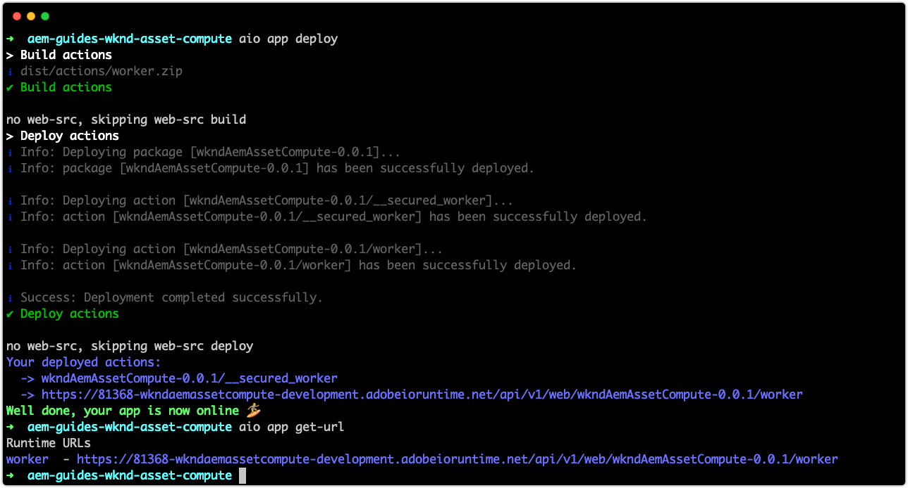
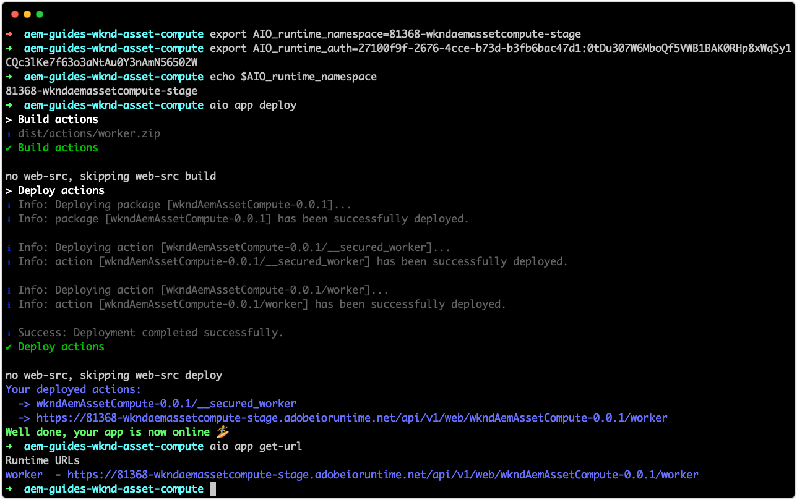

# Distribueren naar Adobe I/O Runtime

De projecten van de asset compute, en de arbeiders die zij bevatten, moeten aan Adobe I/O Runtime via Adobe I/O CLI worden opgesteld om door AEM als Cloud Service te worden gebruikt.

Wanneer het opstellen aan Adobe I/O Runtime voor gebruik door AEM als de diensten van de Auteur van de Cloud Service slechts worden twee milieuvariabelen vereist:

+ `AIO_runtime_namespace` wijst de werkruimte van het Project van de Adobe om te opstellen
+ `AIO_runtime_auth` zijn de verificatiereferenties van de Adobe Project Firefly-werkruimte

De andere standaardvariabelen die in het `.env` dossier worden bepaald worden impliciet verstrekt door AEM als Cloud Service wanneer het de Asset compute worker aanhaalt.

## Werkruimte Ontwikkeling

Omdat dit project is gegenereerd met `aio app init` in de werkruimte `Development`, wordt `AIO_runtime_namespace` automatisch ingesteld op `81368-wkndaemassetcompute-development` met de overeenkomende `AIO_runtime_auth` in ons lokale `.env`-bestand.  Als een `.env` dossier in de folder bestaat die wordt gebruikt om het opstellen bevel uit te geven, worden zijn waarden gebruikt, tenzij zij via een OS niveau veranderlijke uitvoer worden vervangen, die is hoe [werkgebied en productie](#stage-and-production) werkruimten worden gericht.



Om op werkruimte op te stellen die in het project `.env` dossier wordt bepaald:

1. Open de bevellijn in de wortel van het project van de Asset compute
1. De opdracht `aio app deploy` uitvoeren
1. Voer het bevel `aio app get-url` uit om de worker URL voor gebruik in de AEM als Profiel van de Verwerking van de Cloud Service te verkrijgen om naar deze de Asset compute van de douane te verwijzen arbeider. Als het project meerdere workers bevat, worden afzonderlijke URL&#39;s voor elke worker weergegeven.

Als de lokale ontwikkeling en AEM als milieu&#39;s van de Ontwikkeling van de Cloud Service afzonderlijke Asset compute plaatsingen gebruiken, kunnen de plaatsingen aan AEM als Cloud Service Dev op de zelfde manier zoals [Stadium en de plaatsingen van de Productie ](#stage-and-production) worden beheerd.

## Werkruimten voor werkruimten Werkgebied en Productie{#stage-and-production}

De werkruimten Werkgebied en Productie worden typisch opgesteld door uw systeem van CI/CD van keus. Het project van de Asset compute moet aan elke Werkruimte (Stadium en toen Productie) afzonderlijk worden opgesteld.

Als u werkelijke omgevingsvariabelen instelt, overschrijft u de waarden voor dezelfde variabelen in `.env`.



De algemene aanpak, die doorgaans door een CI/CD-systeem wordt geautomatiseerd, voor de implementatie in werkgebied- en productieomgevingen is:

1. Zorg ervoor dat de [Adobe I/O CLI npm-module en de Asset compute-insteekmodule](../set-up/development-environment.md#aio) zijn geïnstalleerd
1. Controle uit het project van de Asset compute om van Git op te stellen
1. De omgevingsvariabelen instellen met de waarden die overeenkomen met de doelwerkruimte (werkgebied of productie)
   + De twee vereiste variabelen zijn `AIO_runtime_namespace` en `AIO_runtime_auth` en worden verkregen per werkruimte in de Console van de Ontwikkelaar van Adobe I/O via de functie __Alle__ van de Werkruimte downloaden.


De waarden van deze toetsen kunnen worden ingesteld door exportopdrachten uit te voeren via de opdrachtregel:

```
$ export AIO_runtime_namespace=81368-wkndaemassetcompute-stage
$ export AIO_runtime_auth=27100f9f-2676-4cce-b73d-b3fb6bac47d1:0tDu307W6MboQf5VWB1BAK0RHp8xWqSy1CQc3lKe7f63o3aNtAu0Y3nAmN56502W
```

Als uw medewerkers van de Asset compute andere variabelen nodig hebben, zoals cloudopslag, moeten deze ook als omgevingsvariabelen worden geëxporteerd.

1. Zodra alle milieuvariabelen voor de doelwerkruimte worden geplaatst om op te stellen, voer het opstellen bevel uit:
   + `aio app deploy`
1. De worker-URL(&#39;s) waarnaar de AEM verwijst als een Cloud Service-verwerkingsprofiel is ook beschikbaar via:
   + `aio app get-url`.

Als de projectversie van de Asset compute verandert, veranderen de worker-URL&#39;s ook om de nieuwe versie weer te geven en moet de URL worden bijgewerkt in de verwerkingsprofielen.

## Workspace API-provisioning{#workspace-api-provisioning}

Toen [het project van Adobe Firefly in Adobe I/O {a1/> oprichtte om lokale ontwikkeling te steunen, werd een nieuwe werkruimte van de Ontwikkeling gecreeerd en __Asset compute, I/O Gebeurtenissen__ en __I/O het Beheer APIs van Gebeurtenissen__ werden toegevoegd aan het.](../set-up/firefly.md)

De API&#39;s __Asset compute, I/O Events__ en __I/O Events Management worden alleen expliciet toegevoegd aan de werkruimten die worden gebruikt voor lokale ontwikkeling.__ Voor werkruimten die (uitsluitend) met AEM als een Cloud Service-omgeving integreren, is __niet__ vereist dat deze API&#39;s expliciet worden toegevoegd omdat de API&#39;s van nature beschikbaar worden gemaakt voor AEM als Cloud Service.
