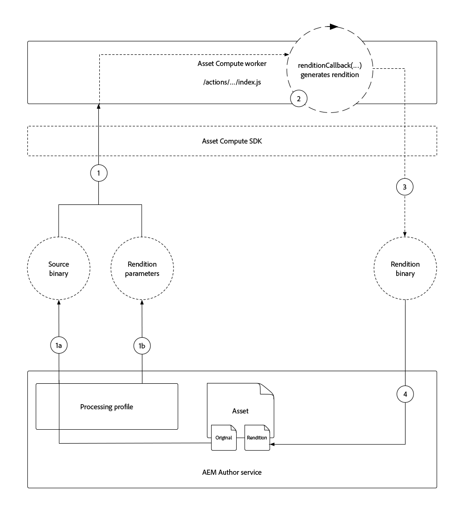
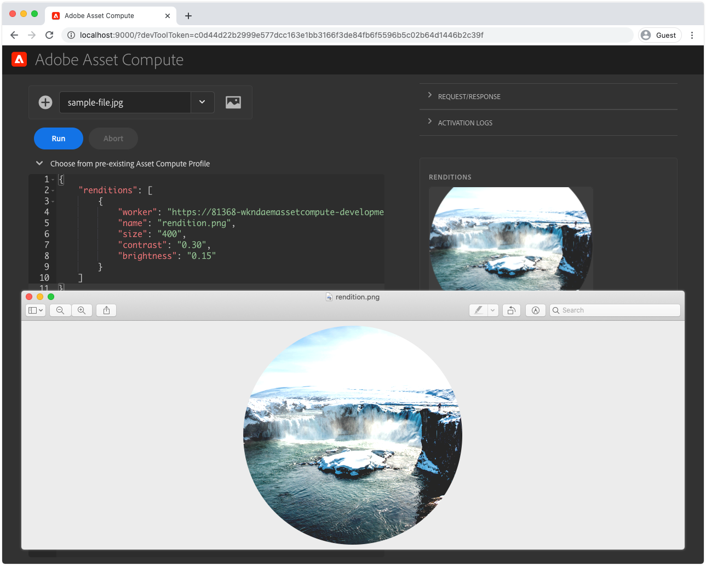

# Een Asset compute-worker ontwikkelen

De arbeiders van de asset compute zijn de kern van een project van de Asset compute zoals verstrekt douanefunctionaliteit die, of orkest, het werk uitvoert dat op activa wordt uitgevoerd om een nieuwe vertoning tot stand te brengen.

In het project Asset compute wordt automatisch een eenvoudige worker gegenereerd die het oorspronkelijke binaire getal van het element kopieert naar een benoemde uitvoering, zonder transformaties. In deze zelfstudie zullen we deze worker aanpassen om een interessantere uitvoering te maken, om de kracht van Asset compute workers te illustreren.

We maken een Asset compute-worker die een nieuwe horizontale afbeeldingsuitvoering genereert die lege ruimte links en rechts van de uitvoering van het element dekt met een vervaagde versie van het element. De breedte, hoogte en vervaging van de uiteindelijke uitvoering worden geparametereerd.

## Logische stroom van een aanroep van een Asset compute-worker

asset compute workers implementeren het Asset compute SDK worker API-contract in de functie `renditionCallback(...)`, die conceptueel is:

+ __Invoer:oorspronkelijke binaire parameters en parameters van profiel van__ een AEM
+ __Uitvoer:__ Een of meer uitvoeringen die aan het AEM moeten worden toegevoegd



1. De AEM Auteursdienst roept de Asset compute worker aan, die __(1a)__ origineel binair (`source` parameter), en __(1b)__ om het even welke die parameters verstrekt in het Profiel van de Verwerking (`rendition.instructions` parameter) worden bepaald.
1. De Asset compute SDK organiseert de uitvoering van de functie `renditionCallback(...)` van de arbeider van de meta-gegevens van de douanemetagegevens, die een nieuwe binaire vertoning produceren, op het originele binaire __(1a)__ en om het even welke parameters __(1b)__ wordt gebaseerd.

   + In dit leerprogramma wordt de vertoning &quot;in proces&quot;gecreeerd, betekenend de worker de vertoning samenstelt, nochtans kan het bronbinaire getal naar andere dienst APIs van het Web voor vertoningsgeneratie eveneens worden verzonden.

1. De Asset compute worker slaat de binaire gegevens van de nieuwe uitvoering op in `rendition.path`.
1. De binaire gegevens die naar `rendition.path` worden geschreven, worden via de Asset compute-SDK naar de AEM-auteurservice getransporteerd en als __(4a)__ een tekstreditie aangeboden en __(4b)__ aan het metagegevensknooppunt van het element blijvend.

In het bovenstaande diagram worden de problemen beschreven die de Asset compute ontwikkelaar onder ogen ziet en wordt een logische stroom weergegeven naar de aanroep van de Asset compute worker. Voor de nieuwsgierigheid zijn de [interne details van de uitvoering van de Asset compute](https://docs.adobe.com/content/help/en/asset-compute/using/extend/custom-application-internals.html) beschikbaar, maar alleen de contracten van de SDK API van de openbare Asset compute kunnen van afhangen.

## Anatomie van een worker

Alle Asset compute werknemers volgen dezelfde basisstructuur en input/output contract.

```javascript
'use strict';

// Any npm module imports used by the worker
const { worker, SourceCorruptError } = require('@adobe/asset-compute-sdk');
const fs = require('fs').promises;

/**
Exports the worker implemented by a custom rendition callback function, which parametrizes the input/output contract for the worker.
 + `source` represents the asset's original binary used as the input for the worker.
 + `rendition` represents the worker's output, which is the creation of a new asset rendition.
 + `params` are optional parameters, which map to additional key/value pairs, including a sub `auth` object that contains Adobe I/O access credentials.
**/
exports.main = worker(async (source, rendition, params) => {
    // Perform any necessary source (input) checks
    const stats = await fs.stat(source.path);
    if (stats.size === 0) {
        // Throw appropriate errors whenever an erring condition is met
        throw new SourceCorruptError('source file is empty');
    }

    // Access any custom parameters provided via the Processing Profile configuration
    let param1 = rendition.instructions.exampleParam;

    /** 
    Perform all work needed to transform the source into the rendition.
    
    The source data can be accessed:
        + In the worker via a file available at `source.path`
        + Or via a presigned GET URL at `source.url`
    **/
    if (success) {
        // A successful worker must write some data back to `renditions.path`. 
        // This example performs a trivial 1:1 copy of the source binary to the rendition
        await fs.copyFile(source.path, rendition.path);
    } else {
        // Upon failure an Asset Compute Error (exported by @adobe/asset-compute-commons) should be thrown.
        throw new GenericError("An error occurred!", "example-worker");
    }
});

/**
Optionally create helper classes or functions the worker's rendition callback function invokes to help organize code.

Code shared across workers, or to complex to be managed in a single file, can be broken out across supporting JavaScript files in the project and imported normally into the worker. 
**/
function customHelperFunctions() { ... }
```

## De worker index.js openen


1. Zorg ervoor dat het Asset compute-project is geopend in VS-code
1. Navigeer naar de map `/actions/worker`
1. Open het `index.js`-bestand

Dit is het JavaScript-bestand van de worker dat we in deze zelfstudie zullen wijzigen.

## Ondersteunende npm-modules installeren en importeren

Aangezien Node.js wordt gebaseerd, profiteren de projecten van de Asset compute van het robuuste [npm modulecosysteem](https://npmjs.com). Om npm modules te gebruiken moeten wij hen eerst in ons project van de Asset compute installeren.

In deze worker gebruiken we [jimp](https://www.npmjs.com/package/jimp) om de vertoningsafbeelding rechtstreeks in de code Node.js te maken en te bewerken.

>[!WARNING]
>
>Niet alle npm-modules voor het manipuleren van elementen worden ondersteund door Asset compute. npm-modules die afhankelijk zijn van het bestaan van toepassingen zoals ImageMagick of andere OS-afhankelijke bibliotheken, worden niet ondersteund. U kunt het gebruik van alleen JavaScript-npm-modules het beste beperken.

1. Open de bevellijn in de wortel van uw project van de Asset compute (dit kan in de Code van VS via __Terminal > Nieuwe Terminal__) worden gedaan en voer het bevel uit:

   ```
   $ npm install jimp
   ```

1. Importeer de `jimp` module in de arbeiderscode zodat deze kan worden gebruikt via het JavaScript-object `Jimp`.
Werk de `require` instructies bij boven aan `index.js` van de worker om het `Jimp`-object uit de `jimp`-module te importeren:

   ```javascript
   'use strict';
   
   const Jimp = require('jimp');
   const { worker, SourceCorruptError } = require('@adobe/asset-compute-sdk');
   const fs = require('fs').promises;
   
   exports.main = worker(async (source, rendition, params) => {
       // Check handle a corrupt input source
       const stats = await fs.stat(source.path);
       if (stats.size === 0) {
           throw new SourceCorruptError('source file is empty');
       }
   
       // Do work here
   });
   ```

## Parameters lezen

De arbeiders van de asset compute kunnen in parameters lezen die binnen via Profielen van de Verwerking kunnen worden overgegaan die in AEM als dienst van de Auteur van de Cloud Service worden bepaald. De parameters worden doorgegeven aan de worker via het object `rendition.instructions`.

Deze kunnen worden gelezen door `rendition.instructions.<parameterName>` in de arbeiderscode toegang te hebben.

Hier zullen wij in configureerbare vertoningen `SIZE`, `BRIGHTNESS` en `CONTRAST` lezen, verstrekkend standaardwaarden als niets via het Profiel van de Verwerking is verstrekt. `renditions.instructions` worden als koorden overgegaan wanneer aangehaald van AEM als Profielen van de Verwerking van de Cloud Service, zodat zij in de correcte gegevenstypes in de arbeiderscode worden omgezet.

```javascript
'use strict';

const Jimp = require('jimp');
const { worker, SourceCorruptError } = require('@adobe/asset-compute-sdk');
const fs = require('fs').promises;

exports.main = worker(async (source, rendition, params) => {
    const stats = await fs.stat(source.path);
    if (stats.size === 0) {
        throw new SourceCorruptError('source file is empty');
    }

    // Read in parameters and set defaults if parameters are provided
    // Processing Profiles pass in instructions as Strings, so make sure to parse to correct data types
    const SIZE = parseInt(rendition.instructions.size) || 800; 
    const CONTRAST = parseFloat(rendition.instructions.contrast) || 0;
    const BRIGHTNESS = parseFloat(rendition.instructions.brightness) || 0;

    // Do work here
}
```

## Fouten genereren{#errors}

asset compute workers kunnen situaties tegenkomen die tot fouten leiden. De Adobe Asset compute SDK biedt [een reeks vooraf gedefinieerde fouten](https://github.com/adobe/asset-compute-commons#asset-compute-errors) die kunnen worden gegenereerd wanneer dergelijke situaties zich voordoen. Als er geen specifiek fouttype van toepassing is, kan `GenericError` worden gebruikt of kan specifieke aangepaste `ClientErrors` worden gedefinieerd.

Voordat u begint met het verwerken van de uitvoering, moet u controleren of alle parameters geldig zijn en worden ondersteund in de context van deze worker:

+ Zorg ervoor dat de parameters voor de vertoningsinstructie voor `SIZE`, `CONTRAST` en `BRIGHTNESS` geldig zijn. Als niet, werpen een douanefout `RenditionInstructionsError`.
   + Een aangepaste `RenditionInstructionsError`-klasse die `ClientError` uitbreidt, wordt onder aan dit bestand gedefinieerd. Het gebruik van een specifieke, aangepaste fout is handig wanneer [tests](../test-debug/test.md) voor de worker wordt geschreven.

```javascript
'use strict';

const Jimp = require('jimp');
// Import the Asset Compute SDK provided `ClientError` 
const { worker, SourceCorruptError, ClientError } = require('@adobe/asset-compute-sdk');
const fs = require('fs').promises;

exports.main = worker(async (source, rendition, params) => {
    const stats = await fs.stat(source.path);
    if (stats.size === 0) {
        throw new SourceCorruptError('source file is empty');
    }

    // Read in parameters and set defaults if parameters are provided
    const SIZE = parseInt(rendition.instructions.size) || 800; 
    const CONTRAST = parseFloat(rendition.instructions.contrast) || 0;
    const BRIGHTNESS = parseFloat(rendition.instructions.brightness) || 0;

    if (SIZE <= 10 || SIZE >= 10000) {
        // Ensure size is within allowable bounds
        throw new RenditionInstructionsError("'size' must be between 10 and 1,0000");
    } else if (CONTRAST <= -1 || CONTRAST >= 1) {
        // Ensure contrast is valid value
        throw new RenditionInstructionsError("'contrast' must between -1 and 1");
    } else if (BRIGHTNESS <= -1 || BRIGHTNESS >= 1) {
        // Ensure contrast is valid value
        throw new RenditionInstructionsError("'brightness' must between -1 and 1");
    }

    // Do work here
}

// Create a new ClientError to handle invalid rendition.instructions values
class RenditionInstructionsError extends ClientError {
    constructor(message) {
        // Provide a:
        // + message: describing the nature of this erring condition
        // + name: the name of the error; usually same as class name
        // + reason: a short, searchable, unique error token that identifies this error
        super(message, "RenditionInstructionsError", "rendition_instructions_error");

        // Capture the strack trace
        Error.captureStackTrace(this, RenditionInstructionsError);
    }
}
```

## De vertoning maken

Wanneer de parameters worden gelezen, ontsmet en gevalideerd, wordt code geschreven om de uitvoering te genereren. De pseudo-code voor het genereren van de vertoning ziet er als volgt uit:

1. Maak een nieuw `renditionImage` canvas in vierkante afmetingen die zijn opgegeven met de parameter `size`.
1. Een `image`-object maken van het binaire getal van het bronelement
1. Gebruik de bibliotheek __Jimp__ om de afbeelding te transformeren:
   + De oorspronkelijke afbeelding uitsnijden naar een gecentreerd vierkant
   + Een cirkel knippen vanuit het midden van de &quot;vierkante&quot; afbeelding
   + Schalen om binnen de afmetingen te passen die door de parameterwaarde `SIZE` worden bepaald
   + Contrast aanpassen op basis van de parameterwaarde `CONTRAST`
   + Helderheid aanpassen op basis van de parameterwaarde `BRIGHTNESS`
1. Plaats de getransformeerde `image` in het midden van `renditionImage` met een transparante achtergrond
1. Schrijf de samengestelde `renditionImage` naar `rendition.path` zodat deze weer in AEM kan worden opgeslagen als een elementuitvoering.

Deze code gebruikt [Jimp APIs](https://github.com/oliver-moran/jimp#jimp) om deze beeldtransformaties uit te voeren.

Workers van asset computen moeten hun werk synchroon voltooien en de `rendition.path` moet volledig zijn teruggeschreven naar voordat de `renditionCallback` van de worker is voltooid. Dit vereist dat de asynchrone functievraag synchroon wordt gemaakt gebruikend de `await` exploitant. Als u niet bekend bent met asynchrone JavaScript-functies en hoe u deze synchroon kunt laten uitvoeren, dient u bekend te zijn met de JavaScript-operator [wait](https://developer.mozilla.org/en-US/docs/Web/JavaScript/Reference/Operators/await).

De voltooide worker `index.js` moet er als volgt uitzien:

```javascript
'use strict';

const Jimp = require('jimp');
const { worker, SourceCorruptError, ClientError } = require('@adobe/asset-compute-sdk');
const fs = require('fs').promises;

exports.main = worker(async (source, rendition, params) => {
    const stats = await fs.stat(source.path);
    if (stats.size === 0) {
        throw new SourceCorruptError('source file is empty');
    }

    // Read/parse and validate parameters
    const SIZE = parseInt(rendition.instructions.size) || 800; 
    const CONTRAST = parseFloat(rendition.instructions.contrast) || 0;
    const BRIGHTNESS = parseFloat(rendition.instructions.brightness) || 0;

    if (SIZE <= 10 || SIZE >= 10000) {
        throw new RenditionInstructionsError("'size' must be between 10 and 1,0000");
    } else if (CONTRAST <= -1 || CONTRAST >= 1) {
        throw new RenditionInstructionsError("'contrast' must between -1 and 1");
    } else if (BRIGHTNESS <= -1 || BRIGHTNESS >= 1) {
        throw new RenditionInstructionsError("'brightness' must between -1 and 1");
    }

    // Create target rendition image 
    let renditionImage =  new Jimp(SIZE, SIZE, 0x0);

    // Read and perform transformations on the source binary image
    let image = await Jimp.read(source.path);

    // Crop a circle from the source asset, and then apply contrast and brightness
    image.crop(
            image.bitmap.width < image.bitmap.height ? 0 : (image.bitmap.width - image.bitmap.height) / 2,
            image.bitmap.width < image.bitmap.height ? (image.bitmap.height - image.bitmap.width) / 2 : 0,
            image.bitmap.width < image.bitmap.height ? image.bitmap.width : image.bitmap.height,
            image.bitmap.width < image.bitmap.height ? image.bitmap.width : image.bitmap.height
        )   
        .circle()
        .scaleToFit(SIZE, SIZE)
        .contrast(CONTRAST)
        .brightness(BRIGHTNESS);

    // Place the transformed image onto the transparent renditionImage to save as PNG
    renditionImage.composite(image, 0, 0)

    // Write the final transformed image to the asset's rendition
    await renditionImage.writeAsync(rendition.path);
});

// Custom error used for renditions.instructions parameter checking
class RenditionInstructionsError extends ClientError {
    constructor(message) {
        super(message, "RenditionInstructionsError", "rendition_instructions_error");
        Error.captureStackTrace(this, RenditionInstructionsError);
    }
}
```

## De worker uitvoeren

Nu de arbeiderscode volledig is, en eerder in [manifest.yml](./manifest.md) werd geregistreerd en gevormd, kan het worden uitgevoerd gebruikend het lokale Hulpmiddel van de Ontwikkeling van de Asset compute om de resultaten te zien.

1. Van de wortel van het project van de Asset compute
1. Uitvoeren `aio app run`
1. Wacht tot het Hulpmiddel van de Ontwikkeling van de Asset compute in een nieuw venster wordt geopend
1. Selecteer een bestand in __..__ vervolgkeuzelijst: selecteer een voorbeeldafbeelding die u wilt verwerken
   + Selecteer een voorbeeldafbeeldingsbestand dat u wilt gebruiken als binair bronelement
   + Als er nog geen is, tikt u op __(+)__ naar links, uploadt u een [voorbeeldafbeelding](../assets/samples/sample-file.jpg) bestand en vernieuwt u het browservenster Ontwikkelingsgereedschappen
1. Werk `"name": "rendition.png"` bij als deze worker om een transparante PNG te genereren.
   + Merk op dat deze &quot;naam&quot;parameter slechts voor het Hulpmiddel van de Ontwikkeling wordt gebruikt, en niet op zou moeten baseren.

   ```json
   {
       "renditions": [
           {
               "worker": "...",
               "name": "rendition.png"
           }
       ]
   }
   ```

1. Tik __Run__ en wacht tot de vertoning is gegenereerd
1. In de sectie __Uitvoeringen__ wordt een voorvertoning van de gegenereerde uitvoering weergegeven. Tik op de voorvertoning van de vertoning om de volledige vertoning te downloaden

   

### De worker uitvoeren met parameters

De parameters, die via de configuraties van het Profiel van de Verwerking worden overgegaan, kunnen in de Hulpmiddelen van de Ontwikkeling van de Asset compute worden gesimuleerd door hen als sleutel/waardeparen op de vertoningsparameter JSON te verstrekken.

>[!WARNING]
>
>Tijdens lokale ontwikkeling, kunnen de waarden binnen worden overgegaan gebruikend diverse gegevenstypes, wanneer overgegaan van AEM als de Profielen van de Verwerking van de Cloud Service als koorden, zodat ervoor zorgen de correcte gegevenstypes indien nodig worden geparseerd.
> De functie `crop(width, height)` van Jimp vereist bijvoorbeeld dat de parameters `int`&#39;s zijn. Als `parseInt(rendition.instructions.size)` niet aan int wordt geparseerd, dan zal de vraag aan `jimp.crop(SIZE, SIZE)` ontbreken aangezien de parameters incompatibel type &quot;Koord&quot;zullen zijn.

Onze code accepteert parameters voor:

+ `size` Hiermee definieert u de grootte van de vertoning (hoogte en breedte als gehele getallen)
+ `contrast` definieert het contrast aanpassen, moet liggen tussen -1 en 1, als floats
+ `brightness`  definieert de lichte aanpassing, moet liggen tussen -1 en 1, als floats

Deze worden in de worker `index.js` gelezen via:

+ `const SIZE = parseInt(rendition.instructions.size) || 800`
+ `const CONTRAST = parseFloat(rendition.instructions.contrast) || 0`
+ `const BRIGHTNESS = parseFloat(rendition.instructions.brightness) || 0`

1. Werk de renderingsparameters bij om de grootte, het contrast en de helderheid aan te passen.

   ```json
   {
       "renditions": [
           {
               "worker": "...",
               "name": "rendition.png",
               "size": "450",
               "contrast": "0.30",
               "brightness": "0.15"
           }
       ]
   }
   ```

1. Tik __Uitvoeren__ opnieuw
1. Tik op de voorvertoning van de vertoning om de gegenereerde vertoning te downloaden en te bekijken. Let op de afmetingen en hoe het contrast en de helderheid zijn gewijzigd ten opzichte van de standaardweergave.

   

1. Upload andere beelden aan __Brondossier__ dropdown, en probeer lopend de worker tegen hen met verschillende parameters!

## Worker index.js op Github

De uiteindelijke `index.js` is beschikbaar op Github op:

+ [aem-guides-wknd-asset-compute/actions/worker/index.js](https://github.com/adobe/aem-guides-wknd-asset-compute/blob/master/actions/worker/index.js)

## Problemen oplossen

+ [Gedeeltelijk getekende/beschadigde vertoning geretourneerd](../troubleshooting.md#rendition-returned-partially-drawn-or-corrupt)
