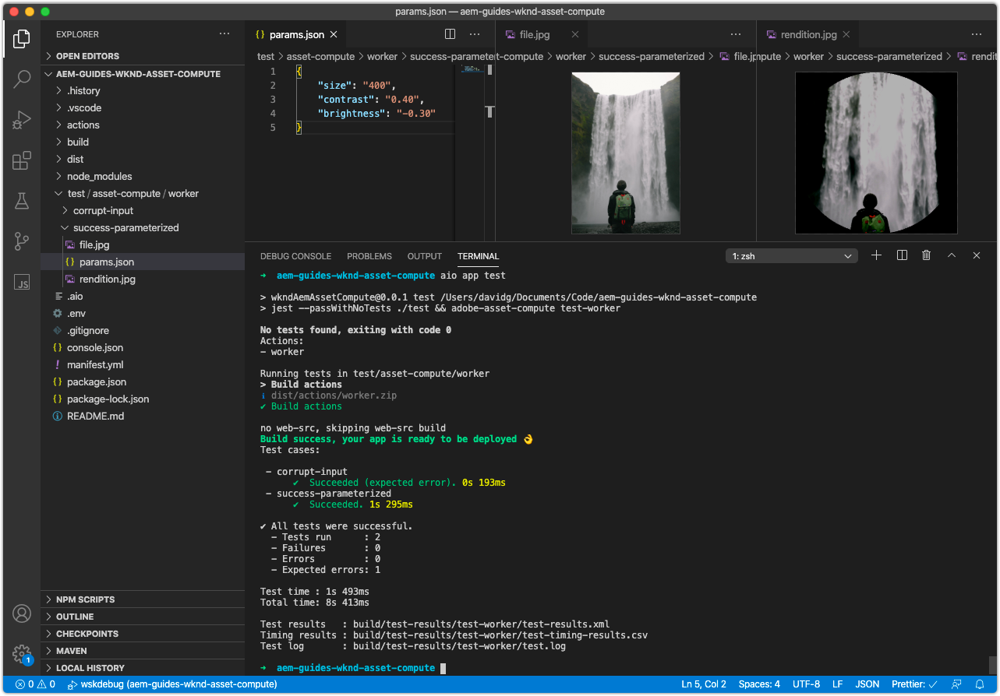
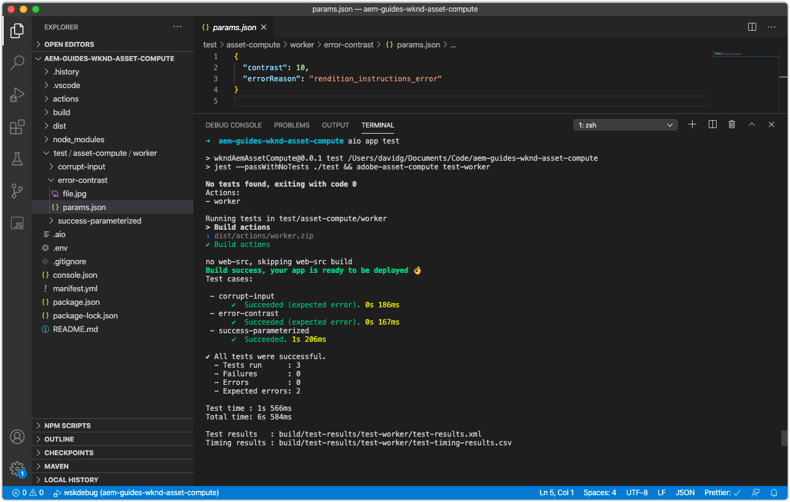

# Een Asset Compute-worker testen

Het project van Asset Compute bepaalt een patroon voor gemakkelijk het creëren van en het uitvoeren van [ tests van de arbeiders van Asset Compute ](https://experienceleague.adobe.com/docs/asset-compute/using/extend/test-custom-application.html).

## Anatomie van een arbeiderstest

Asset Compute Workers&#39; tests worden opgedeeld in testreeksen en binnen elke testreeks worden een of meer testcase uitgevoerd waarin een testvoorwaarde wordt bevestigd.

De opzet van de tests in een Asset Compute-project is als volgt:

```
/actions/<worker-name>/index.js
...
/test/
  asset-compute/
    <worker-name>/           <--- Test suite for the worker, must match the yaml key for this worker in manifest.yml
        <test-case-1>/       <--- Specific test case 
            file.jpg         <--- Input file (ie. `source.path` or `source.url`)
            params.json      <--- Parameters (ie. `rendition.instructions`)
            rendition.png    <--- Expected output file (ie. `rendition.path`)
        <test-case-2>/       <--- Another specific test case for this worker
            ...
```

Elke testgietvorm kan de volgende dossiers hebben:

+ `file.<extension>`
   + Source-bestand dat moet worden getest (extensie kan alles zijn behalve `.link` )
   + Vereist
+ `rendition.<extension>`
   + Uitvoering verwacht
   + Vereist, behalve voor fouttests
+ `params.json`
   + JSON-instructies voor één uitvoering
   + Optioneel
+ `validate`
   + Een script dat de verwachte en werkelijke paden van het weergavebestand als argumenten krijgt en afsluitcode 0 retourneert als het resultaat OK is, of een afsluitcode die niet gelijk is aan nul als de validatie of vergelijking mislukt.
   + Optioneel, wordt standaard de opdracht `diff` uitgevoerd
   + Een shellscript gebruiken dat een docker-uitvoeropdracht verpakt voor het gebruik van verschillende validatiegereedschappen
+ `mock-<host-name>.json`
   + JSON vormde de reacties van HTTP voor [ het bewegen van externe de dienstvraag ](https://www.mock-server.com/mock_server/creating_expectations.html).
   + Optioneel, alleen gebruikt als de code van de worker een eigen HTTP-aanvraag uitvoert

## Een testcase schrijven

Deze testcase stelt de parameterized input (`params.json`) voor het inputdossier (`file.jpg`) toe produceert de verwachte PNG vertoning (`rendition.png`).

1. Verwijder eerst de automatisch gegenereerde testcase van `simple-worker` op `/test/asset-compute/simple-worker` omdat deze ongeldig is, omdat onze worker de bron niet langer gewoon naar de uitvoering kopieert.
1. Maak een nieuwe testhoofdmap op `/test/asset-compute/worker/success-parameterized` om te testen of de worker die een PNG-uitvoering genereert, correct wordt uitgevoerd.
1. In de `success-parameterized` omslag, voeg het test [ inputdossier ](./assets/test/success-parameterized/file.jpg) voor dit testgeval toe en noem het `file.jpg`.
1. Voeg in de map `success-parameterized` een nieuw bestand met de naam `params.json` toe dat de invoerparameters van de worker definieert:

   ```json
   { 
       "size": "400",
       "contrast": "0.25",
       "brightness": "-0.50"
   }
   ```

   Dit zijn de zelfde sleutel/de waarden die in de [ het profieldefinitie van Asset Compute van het Hulpmiddel van de Ontwikkeling ](../develop/development-tool.md) worden overgegaan, minus de `worker` sleutel.

1. Voeg het verwachte [ vertoningsdossier ](./assets/test/success-parameterized/rendition.png) aan dit testgeval toe en noem het `rendition.png`. Dit bestand vertegenwoordigt de verwachte uitvoer van de worker voor de opgegeven invoer `file.jpg` .
1. Voer vanaf de opdrachtregel de tests van de projectbasis uit door `aio app test` uit te voeren
   + Verzeker {de Desktop van 0} Docker ](../set-up/development-environment.md#docker) en het steunen van de beelden van Docker geïnstalleerd en begonnen zijn[
   + Beëindig alle actieve instanties van het Hulpmiddel voor Ontwikkeling



## Een testcase voor foutcontrole schrijven

Met deze test wordt getest of de worker de juiste fout genereert wanneer de parameter `contrast` op een ongeldige waarde is ingesteld.

1. Maak een nieuwe testhoofdmap bij `/test/asset-compute/worker/error-contrast` om een foutieve uitvoering van de worker te testen vanwege een ongeldige `contrast` -parameterwaarde.
1. In de `error-contrast` omslag, voeg het test [ inputdossier ](./assets/test/error-contrast/file.jpg) voor dit testgeval toe en noem het `file.jpg`. De inhoud van dit bestand is niet van belang voor deze test. Het bestand moet bestaan om voorbij de controle &quot;Beschadigde bron&quot; te komen, zodat de geldigheidscontroles van `rendition.instructions` kunnen worden uitgevoerd die door deze testcase worden gevalideerd.
1. Voeg in de map `error-contrast` een nieuw bestand met de naam `params.json` toe dat de invoerparameters van de worker met de inhoud definieert:

   ```json
   {
       "contrast": "10",
       "errorReason": "rendition_instructions_error"
   }
   ```

   + Stel `contrast` -parameters in op `10` , een ongeldige waarde omdat het contrast tussen -1 en 1 moet liggen om een `RenditionInstructionsError` -element te genereren.
   + Stel dat de juiste fout wordt gegenereerd in tests door de `errorReason` -toets in te stellen op de &#39;reden&#39; die aan de verwachte fout is gekoppeld. Deze ongeldige contrastparameter werpt de [ douanefout ](../develop/worker.md#errors), `RenditionInstructionsError`, daarom plaats `errorReason` aan de reden van deze fout, of `rendition_instructions_error` om het te bevestigen wordt geworpen.

1. Aangezien er geen uitvoering moet worden gegenereerd tijdens een foutieve uitvoering, is er geen `rendition.<extension>` -bestand nodig.
1. Voer de opdracht `aio app test` uit om de testsuite uit te voeren vanuit de hoofdmap van het project
   + Verzeker {de Desktop van 0} Docker ](../set-up/development-environment.md#docker) en het steunen van de beelden van Docker geïnstalleerd en begonnen zijn[
   + Beëindig alle actieve instanties van het Hulpmiddel voor Ontwikkeling



## Testen op Github

De laatste testcase is beschikbaar op Github op:

+ [ aem-guides-wknd-asset-compute/test/asset-compute/worker ](https://github.com/adobe/aem-guides-wknd-asset-compute/tree/master/test/asset-compute/worker)

## Problemen oplossen

+ [Geen uitvoering gegenereerd tijdens de uitvoering van de test](../troubleshooting.md#test-no-rendition-generated)
+ [Test genereert onjuiste uitvoering](../troubleshooting.md#tests-generates-incorrect-rendition)
