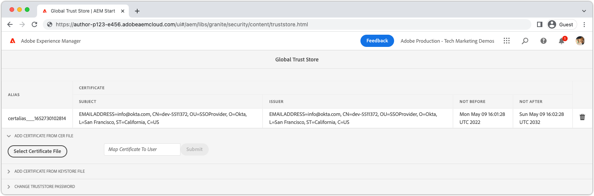

# SAML 2.0-verificatie{#saml-2-0-authentication}

Leer hoe u eindgebruikers (niet AEM auteurs) instelt en verifieert voor een compatibele IDP voor SAML 2.0 van uw keuze.

## Welke SAML voor AEM as a Cloud Service?

Dankzij SAML 2.0-integratie met AEM Publish (of Preview) kunnen eindgebruikers van een AEM webervaring verifiëren bij een niet-Adobe IDP (Identity Provider) en hebben ze toegang tot AEM als een benoemde, geautoriseerde gebruiker.

|  | AEM-auteur | AEM-publicatie |
|-----------------------|:----------:|:-----------:|
| SAML 2.0-ondersteuning | ✘ | ✔ |

+++ Begrijp SAML 2.0 stroom met AEM

De typische stroom van een integratie van SAML van de Publicatie AEM is als volgt:

1. De gebruiker doet een verzoek aan AEM publiceert het wijst op authentificatie wordt vereist.
   + De gebruiker verzoekt om een van CUGs/ACL beschermde middel.
   + De gebruiker vraagt een middel dat aan een Vereiste van de Authentificatie onderworpen is.
   + De gebruiker volgt een verbinding aan AEM login eindpunt (d.w.z. `/system/sling/login`) die uitdrukkelijk om de login actie verzoekt.
1. AEM maakt een AuthnRequest aan IDP, die IDP verzoekt om authentificatieproces te beginnen.
1. Gebruiker verifieert aan IDP.
   + De gebruiker wordt veroorzaakt door IDP voor geloofsbrieven.
   + De gebruiker is reeds voor authentiek verklaard met IDP en moet geen verdere geloofsbrieven verstrekken.
1. IDP produceert een bevestiging van SAML die de gegevens van de gebruiker bevat, en ondertekent het gebruikend het privé certificaat van IDP.
1. IDP verzendt de bevestiging van SAML via de POST van HTTP, als Webbrowser van de gebruiker, naar publiceren AEM.
1. AEM publiceert ontvangt de bevestiging van SAML, en bevestigt de integriteit en de authenticiteit van de bevestiging SAML gebruikend het openbare certificaat IDP.
1. AEM publiceert beheert het AEM gebruikersverslag dat op de configuratie van SAML 2.0 OSGi, en de inhoud van de Assertion van SAML wordt gebaseerd.
   + Hiermee maakt u een gebruiker
   + Gebruikerskenmerken synchroniseren
   + Updates AEM gebruikersgroeplidmaatschap
1. Met AEM-publicatie wordt de AEM ingesteld `login-token` cookie op de HTTP-respons, die wordt gebruikt voor het verifiëren van volgende aanvragen bij AEM Publish.
1. In AEM-publicatie wordt de gebruiker omgeleid naar de URL in AEM-publicatie, zoals opgegeven door de `saml_request_path` cookie.

+++

## Configuratie doorlopen

>[!VIDEO](https://video.tv.adobe.com/v/343040/?quality=12&learn=on)

Deze video doorloopt van vestiging SAML 2.0 integratie met AEM as a Cloud Service publicatiedienst, en het gebruiken van Okta als IDP.

## Vereisten

Het volgende wordt vereist wanneer vestiging SAML 2.0 authentificatie:

+ Toegang tot Cloud Manager via Deployment Manager
+ Toegang van AEM beheerder tot AEM as a Cloud Service omgeving
+ Beheerderstoegang tot de IDP
+ Naar keuze, toegang tot openbaar/privé sleutelpaar wordt gebruikt aan encryptieSAML nuttige ladingen

SAML 2.0 wordt alleen ondersteund voor het verifiëren van het gebruik van AEM-publicaties of -voorvertoningen. De verificatie van AEM-auteur beheren met behulp van en IDP, [Het IDP integreren met Adobe IMS](https://helpx.adobe.com/nl/enterprise/using/set-up-identity.html).


## Openbaar certificaat van IDP installeren op AEM

Het openbare certificaat van IDP wordt toegevoegd aan AEM Globale Opslag van het Vertrouwen, en gebruikt om de bevestiging te bevestigen SAML die door IDP wordt verzonden is geldig.

+++SAML-ondertekeningsstroom


1. Gebruiker verifieert aan IDP.
1. IDP produceert een bevestiging van SAML die de gegevens van de gebruiker bevat.
1. IDP ondertekent de bevestiging van SAML gebruikend het privé certificaat van IDP.
1. IDP stelt een client-side HTTP-POST in op het SAML-eindpunt van AEM-publicatie (`.../saml_login`) die de ondertekende SAML-bewering bevat.
1. AEM publiceert ontvangt de POST van HTTP die de ondertekende bevestiging van SAML bevat, kan de handtekening bevestigen gebruikend het IDP openbare certificaat.

+++



1. Verkrijg __public certificate__ bestand van de IDP. Dit certificaat staat AEM toe om de bevestiging te bevestigen SAML die aan AEM door IDP wordt verstrekt.

   Het certificaat heeft de PEM-indeling en moet lijken op:

   ```
   -----BEGIN CERTIFICATE-----
   MIIC4jCBAcoCCQC33wnybT5QZDANBgkqhkiG9w0BAQsFADAyMQswCQYDVQQGEwJV
   ...
   m0eo2USlSRTVl7QHRTuiuSThHpLKQQ==
   -----END CERTIFICATE-----
   ```

1. Meld u aan bij AEM-auteur als AEM beheerder.
1. Navigeren naar __Gereedschappen > Beveiliging > Betrouwbaarheidswinkel__.
1. Maak of open de Global Trust Store. Als u een Global Trust Store maakt, slaat u het wachtwoord op een veilige plaats op.
1. Uitbreiden __Certificaat toevoegen uit CER-bestand__.
1. Selecteren __Certificaatbestand selecteren__ en uploadt u het certificaatbestand dat door de IDP wordt geleverd.
1. Verlaten __Certificaat toewijzen aan gebruiker__ leeg.
1. Selecteren __Verzenden__.
1. Het zojuist toegevoegde certificaat verschijnt boven de __Certificaat toevoegen uit CRT-bestand__ sectie.
1. Noteer de __alias__, aangezien deze waarde wordt gebruikt in het dialoogvenster [SAML 2.0 de Configuratie OSGi van de Handler van de Authentificatie](#saml-2-0-authentication-handler-osgi-configuration).
1. Selecteren __Opslaan en sluiten__.

De Global Trust Store wordt geconfigureerd met het openbare certificaat van IDP voor AEM-auteur, maar aangezien SAML alleen wordt gebruikt in AEM-publicatie, moet de Global Trust Store worden gerepliceerd naar AEM-publicatie om het openbare certificaat voor IDP daar toegankelijk te maken.


1. Navigeren naar __Extra > Implementatie > Pakketten__.
1. Een pakket maken
   + Pakketnaam: `Global Trust Store`
   + Versie: `1.0.0`
   + Groeperen: `com.your.company`
1. De nieuwe versie bewerken __Global Trust Store__ pakket.
1. Selecteer __Filters__ en voegt een filter toe voor het hoofdpad `/etc/truststore`.
1. Selecteren __Gereed__ en vervolgens __Opslaan__.
1. Selecteer __Opbouwen__ knop voor de __Global Trust Store__ pakket.
1. Selecteer __Meer__ > __Repliceren__ het knooppunt Global Trust Store (`/etc/truststore`) naar AEM-publicatie.

## Paar AEM openbare/persoonlijke sleutel installeren{#install-aem-public-private-key-pair}

_De AEM openbare/persoonlijke sleutelpaar installeren is optioneel_

AEM publiceert kan worden gevormd om AuthnRequests (aan IDP) te ondertekenen, en de beweringen van SAML (aan AEM) te coderen. Dit wordt bereikt door een persoonlijke sleutel voor AEM-publicatie op te geven en deze komt overeen met de openbare sleutel voor de IDP.

+++ Begrijp de ondertekeningsstroom AuthnRequest (optioneel)

De AuthnRequest (de aanvraag aan IDP vanuit AEM Publish die het aanmeldingsproces initieert) kan worden ondertekend door AEM Publish. Hiertoe ondertekent AEM Publish het AuthnRequest gebruikend de privé sleutel, die IDP dan de handtekening gebruikend de openbare sleutel bevestigt. Dit garandeert aan de IDP dat AuthnRequest is gestart en aangevraagd door AEM Publish, en niet door een kwaadwillige derde.


1. De gebruiker doet een HTTP- verzoek aan publiceren AEM die in een de authentificatieverzoek van SAML aan IDP resulteert.
1. AEM publiceert produceert het SAML- verzoek om naar IDP te verzenden.
1. AEM Publish ondertekent het SAML- verzoek gebruikend AEM privé sleutel.
1. AEM publiceert initieert AuthnRequest, een cliënt-zijdoorverwijzing van HTTP naar IDP die het ondertekende verzoek van SAML bevat.
1. IDP ontvangt de AuthnRequest en valideert de handtekening met AEM openbare sleutel, zodat AEM Publish de AuthnRequest heeft geïnitieerd.
1. AEM publiceert dan bevestigt de gedecrypteerde integriteit en de authenticiteit van de bevestiging van SAML gebruikend het IDP openbare certificaat.

+++

+++ Begrijp de de beweringsencryptiesstroom van SAML (facultatief)

Alle HTTP-communicatie tussen IDP en AEM-publicatie moet via HTTPS plaatsvinden en moet daarom standaard worden beveiligd. Nochtans, zoals vereist, kunnen de beweringen van SAML worden gecodeerd in het geval wordt de extra vertrouwelijkheid vereist bovenop die verstrekt door HTTPS. Om dit te doen, codeert IDP de gegevens van de Bevestiging van SAML gebruikend de privé sleutel, en publiceert AEM decrypteert de bewering van SAML gebruikend de privé sleutel.


1. Gebruiker verifieert aan IDP.
1. IDP produceert een bevestiging van SAML die de gegevens van de gebruiker bevat, en ondertekent het gebruikend het privé certificaat van IDP.
1. IDP codeert dan de bewering van SAML met AEM openbare sleutel, die de AEM privé sleutel vereist om te decrypteren.
1. De gecodeerde SAML-bevestiging wordt als de webbrowser van de gebruiker naar AEM Publish verzonden.
1. AEM publiceert ontvangt de bevestiging van SAML, en decrypteert het gebruikend AEM privé sleutel.
1. Bij IDP wordt de gebruiker gevraagd om te verifiëren.

+++

Zowel AuthnRequest het ondertekenen, als de bevestiging van SAML encryptie zijn facultatief, nochtans worden zij allebei toegelaten, gebruikend [SAML 2.0 authentificatiemanager OSGi configuratiebezit `useEncryption`](#saml-20-authenticationsaml-2-0-authentication), dat wil zeggen dat beide of geen van beide kunnen worden gebruikt.


1. Verkrijg de openbare sleutel, de privé sleutel (PKCS#8 in formaat DER), en het dossier van de certificaatketting (dit kan de openbare sleutel zijn) die wordt gebruikt om AuthnRequest te ondertekenen, en de bewering van SAML te coderen. De sleutels worden typisch verstrekt door het de veiligheidsteam van de organisatie van IT.

   + Een zelfondertekend sleutelpaar kan worden geproduceerd gebruikend __openssl__:

   ```
   $ openssl req -x509 -sha256 -days 365 -newkey rsa:4096 -keyout aem-private.key -out aem-public.crt
   
   # Provide a password (keep in safe place), and other requested certificate information
   
   # Convert the keys to AEM's required format 
   $ openssl rsa -in aem-private.key -outform der -out aem-private.der
   $ openssl pkcs8 -topk8 -inform der -nocrypt -in aem-private.der -outform der -out aem-private-pkcs8.der
   ```

1. Upload de openbare sleutel aan IDP.
   + Met de `openssl` hierboven is de openbare sleutel de `aem-public.crt` bestand.
1. Meld u aan bij AEM-auteur als AEM beheerder om de persoonlijke sleutel te uploaden.
1. Navigeren naar __Gereedschappen > Beveiliging > Betrouwbaarheidswinkel__ en selecteert u __verificatie-service__ gebruiker, en selecteer __Eigenschappen__ in de bovenste actiebalk.
1. Navigeren naar __Gereedschappen > Beveiliging > Gebruikers__ en selecteert u __verificatie-service__ gebruiker, en selecteer __Eigenschappen__ in de bovenste actiebalk.
1. Selecteer __Keystore__ tab.
1. Maak of open het sleutelarchief. Houd het wachtwoord veilig als u een sleutelarchief maakt.
1. Selecteren __Persoonlijke sleutel uit DER-bestand toevoegen__ en voeg het bestand met de persoonlijke sleutel en keten toe aan AEM:
   + __Alias__: Geef een betekenisvolle naam op, vaak de naam van de IDP.
   + __Persoonlijke sleutel__: Upload het bestand met de persoonlijke sleutel (PKCS#8 in DER-indeling).
      + Met de `openssl` methode hierboven, dit is de `aem-private-pkcs8.der` file
   + __Certificaatketenbestand selecteren__: Upload het bijbehorende ketenbestand (dit kan de openbare sleutel zijn).
      + Met de `openssl` methode hierboven, dit is de `aem-public.crt` file
   + Selecteren __Verzenden__
1. Het zojuist toegevoegde certificaat verschijnt boven de __Certificaat toevoegen uit CRT-bestand__ sectie.
   + Noteer de __alias__ aangezien dit wordt gebruikt in de [SAML 2.0 de configuratie van de authentificatiemanager OSGi](#saml-20-authentication-handler-osgi-configuration)
1. Selecteren __Opslaan en sluiten__.
1. Selecteren __verificatie-service__ gebruiker, en selecteer __Activeren__ in de bovenste actiebalk.

## SAML 2.0-verificatiehandler configureren{#configure-saml-2-0-authentication-handler}

AEM SAML-configuratie wordt uitgevoerd via de __Adobe granite SAML 2.0-verificatiehandler__ OSGi-configuratie.
De configuratie is een OSGi fabrieksconfiguratie, die één enkele AEM as a Cloud Service publicatiedienst betekent kan veelvoudige SAML configuratie hebben die discrete middelenbomen van de bewaarplaats behandelen; Dit is handig voor AEM-implementaties op meerdere locaties.

+++ SAML 2.0 OSGi-configuratiegids van de Handler van de Authentificatie

### Adobe granite SAML 2.0-verificatiehandler OSGi-configuratie{#configure-saml-2-0-authentication-handler-osgi-configuration}

|  | OSGi, eigenschap | Vereist | Waarde-indeling | Standaardwaarde | Beschrijving |
|-----------------------------------|-------------------------------|:--------:|:---------------------:|---------------------------|-------------|
| Paden | `path` | ✔ | String-array | `/` | AEM paden waarvoor deze verificatiehandler wordt gebruikt. |
| IDP-URL | `idpUrl` | ✔ | Tekenreeks |  | IDP URL het de authentificatieverzoek van SAML wordt verzonden. |
| IDP-certificaatalias | `idpCertAlias` | ✔ | Tekenreeks |  | De alias van het IDP-certificaat in de AEM Global Trust Store |
| IDP HTTP-omleiding | `idpHttpRedirect` | ✘ | Boolean | `false` | Geeft aan of een HTTP-omleiding naar de IDP-URL plaatsvindt in plaats van een AuthnRequest te verzenden. Instellen op `true` voor door IDP geïnitieerde verificatie. |
| IDP-id | `idpIdentifier` | ✘ | Tekenreeks |  | Unieke IDP-id om ervoor te zorgen dat AEM gebruiker en groep uniek zijn. Indien leeg, `serviceProviderEntityId` wordt in plaats daarvan gebruikt. |
| Bevestigingsservice-URL | `assertionConsumerServiceURL` | ✘ | Tekenreeks |  | De `AssertionConsumerServiceURL` URL-kenmerk in de AuthnRequest die opgeeft waar de `<Response>` bericht moet naar AEM worden verzonden. |
| SP-entiteit-id | `serviceProviderEntityId` | ✔ | Tekenreeks |  | AEM aan de IDP op unieke wijze identificeert; meestal de AEM hostnaam. |
| SP-codering | `useEncryption` | ✘ | Boolean | `true` | Wijst erop als IDP de beweringen van SAML codeert. Vereisten `spPrivateKeyAlias` en `keyStorePassword` in te stellen. |
| SP alias van persoonlijke sleutel | `spPrivateKeyAlias` | ✘ | Tekenreeks |  | De alias van de persoonlijke sleutel in de `authentication-service` sleutelarchief van de gebruiker. Vereist indien `useEncryption` is ingesteld op `true`. |
| Wachtwoord voor opslagmap met SP-sleutel | `keyStorePassword` | ✘ | Tekenreeks |  | Het wachtwoord van de sleutelarchief van de &quot;authentificatie-dienst&quot;gebruiker. Vereist indien `useEncryption` is ingesteld op `true`. |
| Standaardomleiding | `defaultRedirectUrl` | ✘ | Tekenreeks | `/` | De standaard omleidings-URL na geslaagde verificatie. Kan relatief zijn ten opzichte van de AEM host (bijvoorbeeld `/content/wknd/us/en/html`). |
| Kenmerk Gebruikersnaam | `userIDAttribute` | ✘ | Tekenreeks | `uid` | De naam van het SAML-assertiekenmerk dat de gebruikers-id van de AEM gebruiker bevat. Leeg laten om de `Subject:NameId`. |
| AEM gebruikers automatisch maken | `createUser` | ✘ | Boolean | `true` | Hiermee geeft u aan of AEM gebruikers worden gemaakt op geslaagde verificatie. |
| Tussenpad AEM gebruiker | `userIntermediatePath` | ✘ | Tekenreeks |  | Wanneer u AEM gebruikers maakt, wordt deze waarde gebruikt als het tussenliggende pad (bijvoorbeeld `/home/users/<userIntermediatePath>/jane@wknd.com`). Vereisten `createUser` in te stellen op `true`. |
| Gebruikerskenmerken AEM | `synchronizeAttributes` | ✘ | String-array |  | Lijst met SAML-kenmerktoewijzingen voor opslag op de AEM gebruiker, in de indeling `[ "saml-attribute-name=path/relative/to/user/node" ]` (bijvoorbeeld `[ "firstName=profile/givenName" ]`). Zie de [volledige lijst van native AEM kenmerken](#aem-user-attributes). |
| Gebruiker toevoegen aan AEM groepen | `addGroupMemberships` | ✘ | Boolean | `true` | Geeft aan of een AEM gebruiker automatisch wordt toegevoegd aan AEM gebruikersgroepen nadat de verificatie is voltooid. |
| AEM kenmerk voor groepslidmaatschap | `groupMembershipAttribute` | ✘ | Tekenreeks | `groupMembership` | De naam van de de assertieattributen van SAML die een lijst van AEM gebruikersgroepen bevatten de gebruiker zou moeten worden toegevoegd aan. Vereisten `addGroupMemberships` in te stellen op `true`. |
| AEM | `defaultGroups` | ✘ | String-array |  | Er wordt altijd een lijst met AEM gebruikersgroepen met geverifieerde gebruikers toegevoegd (bijvoorbeeld `[ "wknd-user" ]`). Vereisten `addGroupMemberships` in te stellen op `true`. |
| NameIDPopolicy-indeling | `nameIdFormat` | ✘ | Tekenreeks | `urn:oasis:names:tc:SAML:2.0:nameid-format:transient` | De waarde van de NameIDPopolicy formaatparameter in het AuthnRequest bericht te verzenden. |
| SAML-respons opslaan | `storeSAMLResponse` | ✘ | Boolean | `false` | Hiermee wordt aangegeven of de `samlResponse` waarde wordt opgeslagen op de AEM `cq:User` knooppunt. |
| Afmelden handgreep | `handleLogout` | ✘ | Boolean | `false` | Wijst erop als het logout verzoek door deze de authentificatiemanager van SAML wordt behandeld. Vereisten `logoutUrl` in te stellen. |
| Afmeldings-URL | `logoutUrl` | ✘ | Tekenreeks |  | De URL van IDP waar het SAML logout verzoek wordt verzonden naar. Vereist indien `handleLogout` is ingesteld op `true`. |
| Kloktolerantie | `clockTolerance` | ✘ | Geheel getal | `60` | Bij het valideren van SAML-beweringen tekent IDP en AEM (SP) de tolerantie voor klokschuintrekken. |
| Methode Digest | `digestMethod` | ✘ | Tekenreeks | `http://www.w3.org/2001/04/xmlenc#sha256` | Het samenvattingsalgoritme dat IDP gebruikt wanneer het ondertekenen van een SAML- bericht. |
| Handtekeningmethode | `signatureMethod` | ✘ | Tekenreeks | `http://www.w3.org/2001/04/xmldsig-more#rsa-sha256` | Het handtekeningalgoritme dat IDP gebruikt bij het ondertekenen van een SAML-bericht. |
| Type identiteitssynchronisatie | `identitySyncType` | ✘ | `default` or `idp` | `default` | Niet wijzigen `from` standaard voor AEM as a Cloud Service. |
| Servicerangschikking | `service.ranking` | ✘ | Geheel getal | `5002` | Hogere rangschikkingsconfiguraties hebben de voorkeur voor dezelfde `path`. |

### Gebruikerskenmerken AEM{#aem-user-attributes}

AEM gebruikt de volgende gebruikerskenmerken, die via de `synchronizeAttributes` bezit in de Adobe Granite SAML 2.0 de configuratie OSGi van de Handler van de Authentificatie.  Om het even welke attributen IDP kunnen aan om het even welk AEM gebruikersbezit worden gesynchroniseerd, nochtans het in kaart brengen aan AEM (hieronder vermeld) eigenschappen van het gebruiksattribuut laat AEM toe om hen natuurlijk te gebruiken.

| Gebruikerskenmerk | Relatief eigenschapspad van `rep:User` node |
|--------------------------------|--------------------------|
| Titel (bijvoorbeeld `Mrs`) | `profile/title` |
| Voornaam (bijv. voornaam) | `profile/givenName` |
| Familienaam (bijv. achternaam) | `profile/familyName` |
| Functie | `profile/jobTitle` |
| E-mailadres | `profile/email` |
| Adres | `profile/street` |
| Plaats | `profile/city` |
| Postcode | `profile/postalCode` |
| Land | `profile/country` |
| Telefoonnummer | `profile/phoneNumber` |
| Over mij | `profile/aboutMe` |

+++

1. Creeer een OSGi configuratiedossier in uw project bij `/ui.config/src/main/content/jcr_root/wknd-examples/osgiconfig/config.publish/com.adobe.granite.auth.saml.SamlAuthenticationHandler~saml.cfg.json` en open in uw winde.
   + Wijzigen `/wknd-examples/` aan uw `/<project name>/`
   + De id na de `~` in filename zou deze configuratie uniek moeten identificeren, zodat kan het de naam van IDP zijn, zoals `...~okta.cfg.json`. De waarde moet alfanumeriek zijn met afbreekstreepjes.
1. Plak de volgende JSON in de `com.adobe.granite.auth.saml.SamlAuthenticationHandler~...cfg.json` en werkt de `wknd` indien nodig verwijzingen.

   ```json
   {
       "path": [ "/content/wknd", "/content/dam/wknd" ], 
       "idpCertAlias": "$[env:SAML_IDP_CERT_ALIAS;default=certalias___1652125559800]",
       "idpIdentifier": "$[env:SAML_IDP_ID;default=http://www.okta.com/exk4z55r44Jz9C6am5d7]",
       "idpUrl": "$[env:SAML_IDP_URL;default=https://dev-5511372.okta.com/app/dev-5511372_aemasacloudservice_1/exk4z55r44Jz9C6am5d7/sso/saml]",
       "serviceProviderEntityId": "$[env:SAML_AEM_ID;default=https://publish-p123-e456.adobeaemcloud.com]",
       "useEncryption": false,
       "createUser": true,
       "userIntermediatePath": "wknd/idp",
       "synchronizeAttributes":[
           "firstName=profile/givenName"
       ],
       "addGroupMemberships": true,
       "defaultGroups": [ 
           "wknd-users"
       ]
   }
   ```

1. Werk de waarden bij zoals vereist door uw project. Zie de __SAML 2.0 OSGi-configuratiegids van de Handler van de Authentificatie__ hierboven voor beschrijvingen van configuratieeigenschappen
1. Het wordt aanbevolen, maar niet vereist, om OSGi-omgevingsvariabelen en -geheimen te gebruiken, wanneer waarden niet synchroon kunnen veranderen met de releasecyclus of wanneer de waarden verschillen tussen vergelijkbare omgevingstypen/serviceniveaus. U kunt standaardwaarden instellen met de `$[env:..;default=the-default-value]"` syntaxis zoals hierboven getoond.

OSGi-configuraties per omgeving (`config.publish.dev`, `config.publish.stage`, en `config.publish.prod`) kan met specifieke attributen worden bepaald als de configuratie SAML tussen milieu&#39;s varieert.

### Codering gebruiken

Wanneer [het coderen van de bevestiging AuthnRequest en SAML](#encrypting-the-authnrequest-and-saml-assertion)zijn de volgende eigenschappen vereist: `useEncryption`, `spPrivateKeyAlias`, en `keyStorePassword`. De `keyStorePassword` bevat een wachtwoord daarom moet de waarde niet in het OSGi configuratiedossier worden opgeslagen, maar eerder worden ingespoten gebruikend [geheime configuratiewaarden](https://experienceleague.adobe.com/docs/experience-manager-cloud-service/content/implementing/deploying/configuring-osgi.html#secret-configuration-values)

+++Optioneel, werk de configuratie OSGi bij om encryptie te gebruiken

1. Openen `/ui.config/src/main/content/jcr_root/wknd-examples/osgiconfig/config.publish/com.adobe.granite.auth.saml.SamlAuthenticationHandler~saml.cfg.json` in uw IDE.
1. De drie eigenschappen toevoegen `useEncryption`, `spPrivateKeyAlias`, en `keyStorePassword` zoals hieronder weergegeven.

   ```json
   {
   "path": [ "/content/wknd", "/content/dam/wknd" ], 
   "idpCertAlias": "$[env:SAML_IDP_CERT_ALIAS;default=certalias___1234567890]",
   "idpIdentifier": "$[env:SAML_IDP_ID;default=http://www.okta.com/abcdef1235678]",
   "idpUrl": "$[env:SAML_IDP_URL;default=https://dev-5511372.okta.com/app/dev-123567890_aemasacloudservice_1/abcdef1235678/sso/saml]",
   "serviceProviderEntityId": "$[env:SAML_AEM_ID;default=https://publish-p123-e456.adobeaemcloud.com]",
   "useEncryption": true,
   "spPrivateKeyAlias": "$[env:SAML_AEM_KEYSTORE_ALIAS;default=aem-saml-encryption]",
   "keyStorePassword": "$[secret:SAML_AEM_KEYSTORE_PASSWORD]",
   "createUser": true,
   "userIntermediatePath": "wknd/idp"
   "synchronizeAttributes":[
       "firstName=profile/givenName"
   ],
   "addGroupMemberships": true,
   "defaultGroups": [ 
       "wknd-users"
   ]
   }
   ```

1. De drie OSGi configuratieeigenschappen die voor encryptie worden vereist zijn:

+ `useEncryption` instellen op `true`
+ `spPrivateKeyAlias` bevat de alias van het sleutelarchiefitem voor de persoonlijke sleutel die door de integratie van SAML wordt gebruikt.
+ `keyStorePassword` bevat een [OSGi, geheime configuratievariabele](https://experienceleague.adobe.com/docs/experience-manager-cloud-service/content/implementing/deploying/configuring-osgi.html#secret-configuration-values) met de `authentication-service` het wachtwoord van het sleutelarchief van de gebruiker.

+++

## Referentiefilter configureren

Tijdens het SAML authentificatieproces, stelt IDP een cliënt-kant POST van HTTP aan publiceren AEM in werking `.../saml_login` eindpunt. Als de publicatie van de IDP- en AEM-versie op een andere oorsprong staan, publiceert AEM __Refererfilter__ wordt gevormd via configuratie OSGi om HTTP POSTs van de oorsprong van IDP toe te staan.

1. Creeer (of geef uit) een OSGi configuratiedossier in uw project bij uit `/ui.config/src/main/content/jcr_root/wknd-examples/osgiconfig/config.publish/org.apache.sling.security.impl.ReferrerFilter.cfg.json`.
   + Wijzigen `/wknd-examples/` aan uw `/<project name>/`
1. Zorg ervoor dat de `allow.empty` waarde is ingesteld op `true`de `allow.hosts` (of indien u dat wenst, `allow.hosts.regexp`) de oorsprong van het IDP bevat, en `filter.methods` include `POST`. De OSGi-configuratie moet vergelijkbaar zijn met:

   ```json
   {
       "allow.empty": true,
       "allow.hosts.regexp": [ ],
       "allow.hosts": [ 
           "$[env:SAML_IDP_REFERRER;default=dev-123567890.okta.com]"
       ],
       "filter.methods": [
           "POST",
       ],
       "exclude.agents.regexp": [ ]
   }
   ```

AEM publiceert steunt één enkele het filterconfiguratie van de Referateur, zo fusie de configuratievereisten van SAML, met om het even welke bestaande configuraties.

OSGi-configuraties per omgeving (`config.publish.dev`, `config.publish.stage`, en `config.publish.prod`) kan met specifieke kenmerken worden gedefinieerd als `allow.hosts` (of `allow.hosts.regex`) verschilt per omgeving.

## Configureer CORS (Cross-Origin Resource Sharing)

Tijdens het SAML authentificatieproces, stelt IDP een cliënt-kant POST van HTTP aan publiceren AEM in werking `.../saml_login` eindpunt. Als de IDP- en AEM-publicatie op verschillende hosts/domeinen bestaan, publiceert AEM __CRoss-Origin Resource Sharing (CORS)__ moet worden gevormd om POSTs van HTTP van de gastheer/het domein van IDP toe te staan.

Deze HTTP-POST-aanvraag `Origin` de header heeft gewoonlijk een andere waarde dan de AEM Publish gastheer, waardoor CORS configuratie vereist is.

Bij het testen van SAML-verificatie op de lokale AEM SDK (`localhost:4503`), kan de IDP de `Origin` header naar `null`. Zo ja, voeg `"null"` aan de `alloworigin` lijst.

1. Creeer een OSGi configuratiedossier in uw project bij `/ui.config/src/main/content/jcr_root/wknd-examples/osgiconfig/config.publish/com.adobe.granite.cors.impl.CORSPolicyImpl~saml.cfg.json`
   + Wijzigen `/wknd-examples/` naar uw projectnaam
   + De id na de `~` in filename zou deze configuratie uniek moeten identificeren, zodat kan het de naam van IDP zijn, zoals `...CORSPolicyImpl~okta.cfg.json`. De waarde moet alfanumeriek zijn met afbreekstreepjes.
1. Plak de volgende JSON in de `com.adobe.granite.cors.impl.CORSPolicyImpl~...cfg.json` bestand.

```json
{
    "alloworigin": [ 
        "$[env:SAML_IDP_ORIGIN;default=https://dev-1234567890.okta.com]", 
        "null"
    ],
    "allowedpaths": [ 
        ".*/saml_login"
    ],
    "supportedmethods": [ 
        "POST"
    ]
}
```

OSGi-configuraties per omgeving (`config.publish.dev`, `config.publish.stage`, en `config.publish.prod`) kan met specifieke kenmerken worden gedefinieerd als `alloworigin` en `allowedpaths` verschilt per omgeving.

## AEM Dispatcher configureren om SAML HTTP POST&#39;s toe te staan

Na succesvolle authentificatie aan IDP, zal IDP een POST van HTTP terug naar AEM registreren `/saml_login` eindpunt (gevormd in IDP). Deze HTTP-POST naar `/saml_login` wordt geblokkeerd door gebrek bij Dispatcher, zodat moet het uitdrukkelijk worden toegestaan gebruikend de volgende regel van de Verzender:

1. Openen `dispatcher/src/conf.dispatcher.d/filters/filters.any` in uw IDE.
1. Voeg onder aan het bestand toe en sta regel voor HTTP POST&#39;s toe aan URL&#39;s die eindigen met `/saml_login`.

```
...

# Allow SAML HTTP POST to ../saml_login end points
/0190 { /type "allow" /method "POST" /url "*/saml_login" }
```

Als de URL die bij de Apache-webserver wordt herschreven, is geconfigureerd (`dispatcher/src/conf.d/rewrites/rewrite.rules`), ervoor te zorgen dat verzoeken aan de `.../saml_login` eindpunten worden niet per ongeluk beheerd.

## Gegevenssynchronisatie inschakelen

De gebruikersverslagen moeten over AEM worden gesynchroniseerd publiceren rij, zodra de de authentificatiestroom van SAML tot een gebruiker in publiceren AEM leidt. Naar [gegevenssynchronisatie inschakelen](https://experienceleague.adobe.com/docs/experience-manager-cloud-service/content/sites/authoring/personalization/user-and-group-sync-for-publish-tier.html#data-synchronization), stuurt u een verzoek naar de Adobe Klantenondersteuning (via [AdminConsole](https://adminconsole.adobe.com) > Ondersteuning) met het verzoek om deze functie in te schakelen.

## SAML-configuratie implementeren

De configuraties OSGi moeten aan Git worden geëngageerd en aan AEM as a Cloud Service worden opgesteld gebruikend de Manager van de Wolk.

```
$ git remote -v            
adobe   https://git.cloudmanager.adobe.com/myOrg/myCloudManagerGit/ (fetch)
adobe   https://git.cloudmanager.adobe.com/myOrg/myCloudManagerGit/ (push)
$ git add .
$ git commit -m "SAML 2.0 configurations"
$ git push adobe saml-auth:develop
```

Implementeer de doelvertakking Git voor Cloud Manager (in dit voorbeeld) `develop`), die een Volledige de plaatsingspijpleiding van de Stapel gebruiken.
