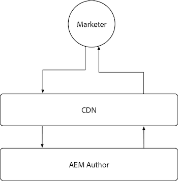

# AEM auteur

AEM Auteur heeft caching beperkt wegens de hoogst dynamische, en toestemmingsgevoelige aard van de inhoud het dient. Over het algemeen wordt het niet aanbevolen caching voor AEM auteur aan te passen en in plaats daarvan te vertrouwen op de cachemonfiguraties die door de Adobe worden geleverd om een prestatiebeleving te garanderen.

{align="center"}

Terwijl het aanpassen van caching op AEM Auteur wordt ontmoedigd, is het nuttig om te begrijpen dat AEM Auteur een Adobe-beheerde CDN heeft, maar geen AEM Dispatcher heeft. Houd er rekening mee dat alle AEM Dispatcher-configuraties op AEM Auteur worden genegeerd, omdat deze geen AEM Dispatcher hebben.

## CDN

AEM de dienst van de Auteur gebruikt CDN, nochtans is zijn doel de levering van productmiddelen te verbeteren, en zou niet uitgebreid moeten worden gevormd, in plaats daarvan latend het werken zoals het is.

{align="center"}

De CDN van de AEM Auteur bevindt zich tussen de eindgebruiker, typisch een teller of inhoudauteur, en de AEM Auteur. Het plaatst onveranderlijke dossiers, zoals statische activa die de AEM auteurservaring, en niet authored inhoud macht.

AEM CDN van de Auteur leidt verscheidene types van middelen in het voorgeheugen onder die van belang kunnen zijn, met inbegrip van a [ klantgerichte TTL op Verlengde Vragen ](https://experienceleague.adobe.com/docs/experience-manager-cloud-service/content/headless/graphql-api/persisted-queries.html?author-instances), en a [ lange TTL op de Bibliotheken van de douaneCliënt ](https://experienceleague.adobe.com/docs/experience-manager-cloud-service/content/implementing/content-delivery/caching.html#client-side-libraries).

### Standaardcache-levensduur

De volgende klant die middelen onder ogen ziet worden in het voorgeheugen ondergebracht door de AEM Auteur CDN, en hebben het volgende standaardgeheim voorgeheugenleven:

| Inhoudstype | Standaardlevensduur van CDN-cache |
|:------------ |:---------- |
| [ Blijven vragen (JSON) ](https://experienceleague.adobe.com/docs/experience-manager-cloud-service/content/headless/graphql-api/persisted-queries.html?author-instances) | 1 minuut |
| [ de bibliotheken van de Cliënt (JS/CSS) ](https://experienceleague.adobe.com/docs/experience-manager-cloud-service/content/implementing/content-delivery/caching.html#client-side-libraries) | dertig dagen |
| [ Al het andere ](https://experienceleague.adobe.com/docs/experience-manager-cloud-service/content/implementing/content-delivery/caching.html#other-content) | Niet in cache geplaatst |

## AEM Dispatcher

AEM de dienst van de Auteur omvat AEM Dispatcher niet, en gebruikt slechts [ CDN ](#cdn) voor caching.
