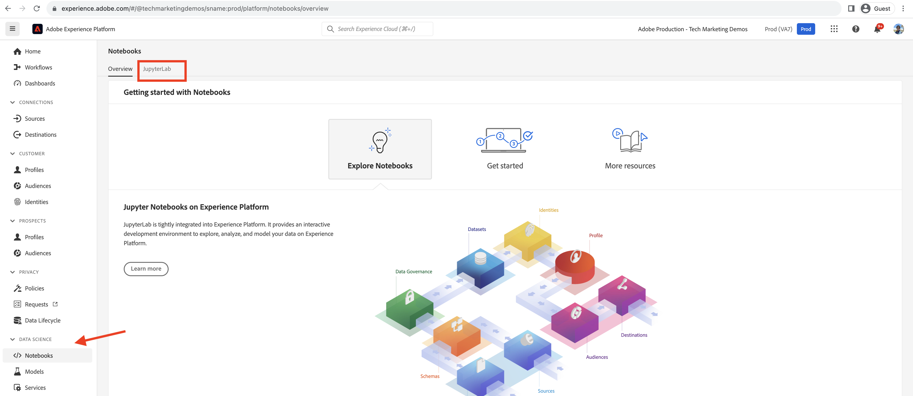

# Analyse van de CDN-cache-raakverhouding

Inhoud die in de CDN is opgeslagen, verkleint de latentie die websitegebruikers ervaren, die niet hoeven te wachten tot de aanvraag is verzonden om terug te keren naar de Apache/dispatcher of AEM te publiceren. Daarom is het nuttig om de CDN-verhouding voor cachefouten te optimaliseren om de hoeveelheid inhoud die op de CDN in cache kan worden geplaatst, te maximaliseren.

Leer hoe u de as a Cloud Service AEM analyseert **CDN-logbestanden** en meer inzicht te krijgen, zoals **cacheverhouding**, en **top-URL&#39;s van _MISS_ en _PASS_ cachetypen** voor optimalisatiedoeleinden.

De CDN-logboeken zijn beschikbaar in de JSON-indeling, die verschillende velden bevat, waaronder `url`, `cache`. Zie de klasse [CDN-logboekindeling](https://experienceleague.adobe.com/docs/experience-manager-cloud-service/content/implementing/developing/logging.html?lang=en#cdn-log:~:text=Toggle%20Text%20Wrapping-,Log%20Format,-The%20CDN%20logs). De `cache` veld bevat informatie over _status van de cache_ en de mogelijke waarden ervan zijn HIT, MISS of PASS. Laten we de details van mogelijke waarden bekijken.

| Status van cache   Mogelijke waarde | Beschrijving |
|------------------------------------|:-----------------------------------------------------:|
| HIT | De gevraagde gegevens zijn _gevonden in de CDN-cache en hoeft niet te worden opgehaald_ verzoek aan de AEM server. |
| MISS | De gevraagde gegevens zijn _niet gevonden in de CDN-cache en moet worden aangevraagd_ van de AEM server. |
| PASS | De gevraagde gegevens zijn _expliciet instellen op niet in cache plaatsen_ en altijd van de AEM server worden opgehaald. |

In deze zelfstudie wordt [AEM WKND-project](https://github.com/adobe/aem-guides-wknd) wordt ingezet in de AEM as a Cloud Service omgeving en er wordt een kleine prestatietest geactiveerd met behulp van [Apache JMeter](https://jmeter.apache.org/).

Deze zelfstudie is zodanig gestructureerd dat u het volgende proces doorloopt:

1. CDN-logbestanden downloaden via Cloud Manager
1. Door die CDN-logboeken te analyseren, kunt u deze uitvoeren met twee methoden: een lokaal geïnstalleerd dashboard of een extern geopend Splunk- of Jupityer-notebook (voor wie een licentie voor Adobe Experience Platform heeft)
1. CDN-cacheconfiguratie optimaliseren

## CDN-logbestanden downloaden

Ga als volgt te werk om de CDN-logboeken te downloaden:

1. Aanmelden bij Cloud Manager [my.cloudmanager.adobe.com](https://my.cloudmanager.adobe.com/) en selecteert u uw organisatie en programma.

1. Voor een gewenste AEMCS-omgeving selecteert u **Logbestanden downloaden** in het ovaalmenu.

   {width="500" zoomable="yes"}

1. In de **Logbestanden downloaden** selecteert u de **Publiceren** De dienst van het drop-down menu, dan klik het downloadpictogram naast **cdn** rij.

   {width="500" zoomable="yes"}

Als het gedownloade logbestand afkomstig is van _vandaag_ de bestandsextensie is `.log` anders voor oudere logbestanden is de extensie `.log.gz`.

## Gedownloade CDN-logboeken analyseren

Analyseer het gedownloade CDN-logbestand om inzicht te krijgen in bijvoorbeeld de verhouding van cachereeks en de URL&#39;s van de bovenste URL&#39;s van MISS- en PASS-cachetypen. Deze inzichten helpen om [CDN-cacheconfiguratie](https://experienceleague.adobe.com/en/docs/experience-manager-cloud-service/content/implementing/content-delivery/caching) en verbetert u de prestaties van de site.

In deze zelfstudie worden drie opties beschreven voor het analyseren van de CDN-logboeken:

1. **Elasticsearch, Logstash en Kibana (ELK)**: De [Gereedschap voor ELK-dashboard](https://github.com/adobe/AEMCS-CDN-Log-Analysis-Tooling/blob/main/ELK/README.md) kan lokaal worden geïnstalleerd.
1. **Splunk**: De [Gereedschap voor gesponnen dashboard](https://github.com/adobe/AEMCS-CDN-Log-Analysis-Tooling/blob/main/Splunk/READEME.md) vereist toegang tot Splunk en [AEMCS log-forward ingeschakeld](https://experienceleague.adobe.com/en/docs/experience-manager-cloud-service/content/implementing/developing/logging#splunk-logs) om de CDN-logboeken in te voeren.
1. [Jupyter-laptop](https://jupyter.org/): Het kan extern worden benaderd als onderdeel van [Adobe Experience Platform](https://experienceleague.adobe.com/en/docs/experience-platform/data-science-workspace/jupyterlab/analyze-your-data) zonder extra software te installeren, voor klanten die een licentie voor Adobe Experience Platform hebben verkregen.

### Optie 1: ELK-dashboard gebruiken

De [ELK-stapel](https://www.elastic.co/elastic-stack) is een reeks hulpmiddelen die een scalable oplossing verstrekken om, de gegevens te zoeken te analyseren en te visualiseren. Het bestaat uit Elasticsearch, Logstash, en Kibana.

Om de belangrijkste details te identificeren, gebruiken wij [AEMCS-CDN-Log-Analysis-Tool](https://github.com/adobe/AEMCS-CDN-Log-Analysis-Tooling) project. Dit project verstrekt een container van de Dok van de stapel van ELK en een vooraf gevormd dashboard van Kibana om de CDN- logboeken te analyseren.

1. Voer de volgende stappen uit [Hoe te opstelling de container van de Docker ELK](https://github.com/adobe/AEMCS-CDN-Log-Analysis-Tooling/blob/main/ELK/README.md#how-to-set-up-the-elk-docker-containerhow-to-setup-the-elk-docker-container) en zorg ervoor dat u de **Hoogte-breedteverhouding CDN-cache** Kibana dashboard.

1. Ga als volgt te werk om de CDN-raakverhouding in cache en URL&#39;s als bovenste URL te identificeren:

   1. Kopieer het gedownloade CDN-logbestand of de gedownloade CDN-logbestanden bijvoorbeeld in de omgevingsspecifieke logboekmap. `ELK/logs/stage`.

   1. Open de **Hoogte-breedteverhouding CDN-cache** dashboard door op de linkerbovenhoek te klikken _Navigation Menu > Analytics > Dashboard > CDN Cache Hit Ratio_.

      {width="500" zoomable="yes"}

   1. Selecteer het gewenste tijdbereik in de rechterbovenhoek.

      {width="500" zoomable="yes"}

   1. De **Hoogte-breedteverhouding CDN-cache** Het dashboard spreekt voor zich.

   1. De _Totale verzoekanalyse_ in deze sectie worden de volgende details weergegeven:
      - Cacheverhoudingen per cachetype
      - Cacheaantallen per cachetype

      {width="500" zoomable="yes"}

   1. De _Analyse op verzoek of MIME-typen_ geeft de volgende details weer:
      - Cacheverhoudingen per cachetype
      - Cacheaantallen per cachetype
      - MISS- en PASS-URL&#39;s bovenaan

      {width="500" zoomable="yes"}

#### Filteren op omgevingsnaam of programma-id

Voer de volgende stappen uit om de opgenomen logs te filteren op de naam van de omgeving:

1. Klik in het dashboard voor de hoogte-breedteverhouding van CDN-cache op de knop **Filter toevoegen** pictogram.

   {width="500" zoomable="yes"}

1. In de **Filter toevoegen** modal, selecteer `aem_env_name.keyword` in het keuzemenu, en `is` operator en gewenste omgevingsnaam voor volgende veld en klik ten slotte op _Filter toevoegen_.

   {width="500" zoomable="yes"}

#### Filteren op hostnaam

Voer de volgende stappen uit om de opgenomen logbestanden te filteren op hostnaam:

1. Klik in het dashboard voor de hoogte-breedteverhouding van CDN-cache op de knop **Filter toevoegen** pictogram.

   {width="500" zoomable="yes"}

1. In de **Filter toevoegen** modal, selecteer `host.keyword` in het keuzemenu, en `is` operator en gewenste hostnaam voor volgende veld en klik ten slotte op _Filter toevoegen_.

   {width="500" zoomable="yes"}

U kunt ook meer filters toevoegen aan het dashboard op basis van de analysevereisten.

### Optie 2: Werkset voor gesponnen dashboard gebruiken

De [Splunk](https://www.splunk.com/) is een populair hulpmiddel van de logboekanalyse dat helpt logboeken samenvoegen, analyseren, en visualisaties voor controle en het oplossen van problemendoeleinden tot stand brengen.

Om de belangrijkste details te identificeren, gebruiken wij [AEMCS-CDN-Log-Analysis-Tool](https://github.com/adobe/AEMCS-CDN-Log-Analysis-Tooling) project. Dit project verstrekt een dashboard van het Splunk om de CDN- logboeken te analyseren.

1. Voer de volgende stappen uit [Splunk dashboards voor de Analyse van het Logboek van AEMCS CDN](https://github.com/adobe/AEMCS-CDN-Log-Analysis-Tooling/blob/main/Splunk/READEME.md) en zorg ervoor dat u de **Hoogte-breedteverhouding CDN-cache** Splunk dashboard.
1. Werk indien nodig de _Index, type bron en andere_ filterwaarden in het dashboard Splunk.

   {width="500" zoomable="yes"}

### Optie 3: Jupyter-laptop gebruiken

Voor degenen die liever geen software lokaal installeren (dat wil zeggen het gereedschap voor het ELK-dashboard uit de vorige sectie), is er een andere optie, maar is een licentie voor Adobe Experience Platform vereist.

De [Jupyter-laptop](https://jupyter.org/) is een opensource webtoepassing waarmee u documenten kunt maken die code, tekst en visualisatie bevatten. Het wordt gebruikt voor gegevenstransformatie, visualisatie, en statistische modellering. Het kan extern worden geopend [als onderdeel van Adobe Experience Platform](https://experienceleague.adobe.com/en/docs/experience-platform/data-science-workspace/jupyterlab/analyze-your-data).

#### Het interactieve Python-laptopbestand downloaden

Download eerst de [AEM-as-a-CloudService - CDN Logs Analysis - Jupyter-laptop](./assets/cdn-logs-analysis/aemcs_cdn_logs_analysis.ipynb) bestand, dat helpt bij de analyse van de CDN-logbestanden. Dit dossier van de &quot;Interactive Python Notitieboekje&quot;spreekt voor zich, echter de belangrijkste hoogtepunten van elke sectie zijn:

- **Extra bibliotheken installeren**: installeert de `termcolor` en `tabulate` Pythonbibliotheken.
- **CDN-logbestanden laden**: laadt het CDN-logbestand met `log_file` variabele waarde; zorg ervoor om zijn waarde bij te werken. Het zet ook dit CDN- logboek in [Pandas DataFrame](https://pandas.pydata.org/docs/reference/frame.html).
- **Analyse uitvoeren**: het eerste codeblok is _Resultaat van de Analyse van de vertoning voor Totaal, HTML, JS/CSS en de Verzoeken van het Beeld_; het verstrekt het percentage van de geheim voorgeheugenklap, bar, en schijfgrafieken.
Het tweede codeblok is _Hoogste 5 MISS en PASS verzoek URLs voor HTML, JS/CSS, en Beeld_; URL&#39;s en hun aantallen worden in tabelindeling weergegeven.

#### De Jupyter-laptop uitvoeren

Voer vervolgens de Jupyter-laptop in Adobe Experience Platform uit door de volgende stappen uit te voeren:

1. Aanmelden bij de [Adobe Experience Cloud](https://experience.adobe.com/), op de startpagina > **Snelle toegang** sectie > klik op **Experience Platform**

   {width="500" zoomable="yes"}

1. Klik op de startpagina van Adobe Experience Platform > sectie Data Science > op de knop **Laptops** menu-item. Als u de Jupyter-laptopomgeving wilt starten, klikt u op de knop **JupyterLab** tab.

   {width="500" zoomable="yes"}

1. Gebruik in het menu JupyterLab de opdracht **Bestanden uploaden** het gedownloade CDN-logbestand uploaden en `aemcs_cdn_logs_analysis.ipynb` bestand.

   {width="500" zoomable="yes"}

1. Open de `aemcs_cdn_logs_analysis.ipynb` door te dubbelklikken.

1. In de **CDN-logbestand laden** van de laptop, werkt u de `log_file` waarde.

   {width="500" zoomable="yes"}

1. Als u de geselecteerde cel wilt uitvoeren en verder wilt gaan, klikt u op de knop **Afspelen** pictogram.

   {width="500" zoomable="yes"}

1. Nadat u het **Resultaat van de Analyse van de vertoning voor Totaal, HTML, JS/CSS, en de Verzoeken van het Beeld** codecel, toont de output het percentage van de geheim voorgeheugentreffelijkheid, bar, en cirkeldiagrammen.

   {width="500" zoomable="yes"}

1. Nadat u het **Hoogste 5 MISS en PASS verzoek URLs voor HTML, JS/CSS, en Beeld** De codecel, de output toont Hoogste 5 MISS en PASS Verzoek URLs.

   {width="500" zoomable="yes"}

U kunt het Notitieboekje van de Jupyter verbeteren om de logboeken te analyseren CDN die op uw vereisten worden gebaseerd.

## CDN-cacheconfiguratie optimaliseren

Nadat u de CDN-logboeken hebt geanalyseerd, kunt u de CDN-cacheconfiguratie optimaliseren om de siteprestaties te verbeteren. De AEM beste praktijken moeten een geheim voorgeheugenklapverhouding van 90% of hoger hebben.

Zie voor meer informatie [CDN-cacheconfiguratie optimaliseren](https://experienceleague.adobe.com/en/docs/experience-manager-cloud-service/content/implementing/content-delivery/caching).

Het AEM WKND-project heeft een referentie-CDN-configuratie, voor meer informatie, zie [CDN-configuratie](https://github.com/adobe/aem-guides-wknd/blob/main/dispatcher/src/conf.d/available_vhosts/wknd.vhost#L137-L190) van de `wknd.vhost` bestand.
