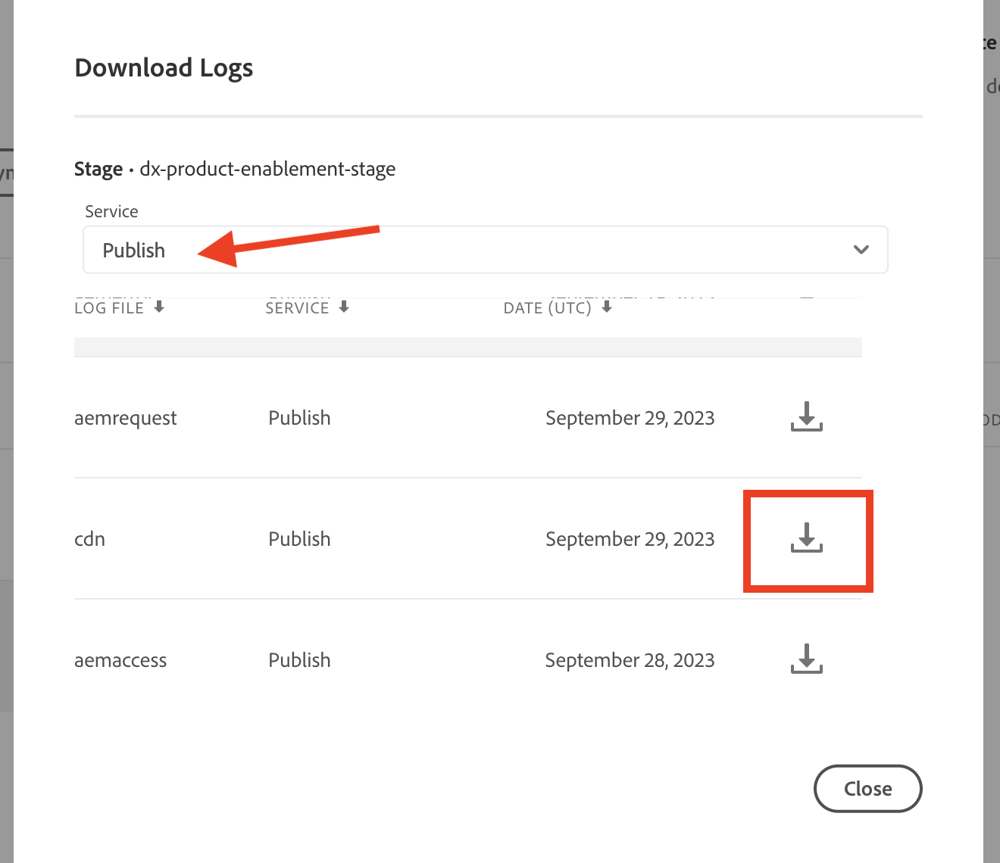
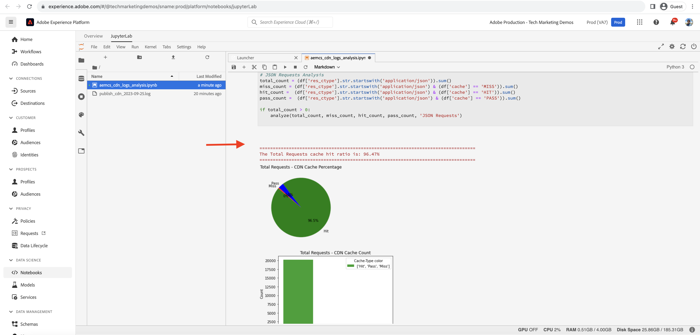

# Analyse van de CDN-cache-raakverhouding

Inhoud die in de CDN is opgeslagen, verkleint de latentie die websitegebruikers ervaren, die niet hoeven te wachten op de aanvraag om terug te keren naar de publicatie in Apache/dispatcher of AEM. Daarom is het nuttig om de CDN-verhouding voor cachefouten te optimaliseren om de hoeveelheid inhoud die op de CDN in cache kan worden geplaatst, te maximaliseren.

Leer hoe te om de AEM as a Cloud Service verstrekte **CDN logboeken** te analyseren en inzichten zoals **de verhouding van het geheim voorgeheugenhit**, en **bovenkant URLs van _MISS_ en _PASS_ geheim voorgeheugentypes**, voor optimalisatiedoeleinden.

De CDN-logbestanden zijn beschikbaar in de JSON-indeling, die verschillende velden bevat, waaronder `url` , `cache` . Voor meer informatie, zie het [&#x200B; Formaat van het Logboek CDN &#x200B;](https://experienceleague.adobe.com/docs/experience-manager-cloud-service/content/implementing/developing/logging.html?lang=en#cdn-log:~:text=Toggle%20Text%20Wrapping-,Log%20Format,-The%20CDN%20logs). Het `cache` gebied verstrekt informatie over _staat van het geheime voorgeheugen_ en zijn mogelijke waarden zijn HIT, MISS, of PASS. Laten we de details van mogelijke waarden bekijken.

| Status van cache   Mogelijke waarde | Beschrijving |
|------------------------------------|:-----------------------------------------------------:|
| HIT | Het gevraagde gegeven wordt gevonden _in het CDN geheime voorgeheugen en vereist het maken van geen 1&rbrace; verzoek van de haal &lbrace;aan de server van AEM._ |
| MISS | Het gevraagde gegeven wordt _gevonden niet in het CDN geheime voorgeheugen en moet_ van de server van AEM worden gevraagd. |
| PASS | Het gevraagde gegeven is _uitdrukkelijk plaatste om niet_ in het voorgeheugen onder te brengen en altijd van de server van AEM worden teruggewonnen. |

Voor dit leerprogramma, wordt het [&#x200B; project van AEM WKND &#x200B;](https://github.com/adobe/aem-guides-wknd) opgesteld aan het milieu van AEM as a Cloud Service en een kleine prestatietest wordt teweeggebracht gebruikend [&#x200B; Apache JMeter &#x200B;](https://jmeter.apache.org/).

Deze zelfstudie is zodanig gestructureerd dat u het volgende proces doorloopt:

1. CDN-logbestanden downloaden via Cloud Manager
1. Door die CDN-logboeken te analyseren, kunt u deze uitvoeren met twee methoden: een lokaal geïnstalleerd dashboard of een extern geopend Splunk- of Jupityer-notebook (voor wie een licentie voor Adobe Experience Platform heeft)
1. CDN-cacheconfiguratie optimaliseren

## CDN-logbestanden downloaden

Ga als volgt te werk om de CDN-logboeken te downloaden:

1. Logboek in Cloud Manager bij [&#x200B; my.cloudmanager.adobe.com &#x200B;](https://my.cloudmanager.adobe.com/) en selecteert uw organisatie en programma.

1. Voor een gewenst milieu AEMCS, uitgezochte **Logboeken van de Download** van het elliptische menu.

   {width="500" zoomable="yes"}

1. In de **Logboeken van de Download** dialoog, selecteer de **publiceren** Dienst van het drop-down menu, dan klik het downloadpictogram naast de **CDN** rij.

   {width="500" zoomable="yes"}

Als het gedownloade logboekdossier van _vandaag_ is de dossieruitbreiding `.log` anders voor vroegere logboekdossiers is de uitbreiding `.log.gz`.

## Gedownloade CDN-logboeken analyseren

Analyseer het gedownloade CDN-logbestand om inzicht te krijgen in bijvoorbeeld de verhouding van cachereeks en de URL&#39;s van de bovenste URL&#39;s van MISS- en PASS-cachetypen. Deze inzichten helpen om de [&#x200B; CDN geheim voorgeheugenconfiguratie &#x200B;](https://experienceleague.adobe.com/en/docs/experience-manager-cloud-service/content/implementing/content-delivery/caching) te optimaliseren en de plaatsprestaties te verbeteren.

In deze zelfstudie worden drie opties beschreven voor het analyseren van de CDN-logboeken:

1. **Elasticsearch, Logstash, en Kibana (ELK)**: [&#x200B; het dashboard van de ELK tooling &#x200B;](https://github.com/adobe/AEMCS-CDN-Log-Analysis-Tooling/blob/main/ELK/README.md) kan plaatselijk worden geïnstalleerd.
1. **Splunk**: Het [&#x200B; dashboard van het Splunk &#x200B;](https://github.com/adobe/AEMCS-CDN-Log-Analysis-Tooling/blob/main/Splunk/README.md) vereist toegang tot Splunk en [&#x200B; AEMCS logboek door:sturen toegelaten &#x200B;](https://experienceleague.adobe.com/en/docs/experience-manager-cloud-service/content/implementing/developing/logging#splunk-logs) om de CDN- logboeken in te nemen.
1. **Jupyter Notitieboekje**: Het kan ver als deel van [&#x200B; Adobe Experience Platform &#x200B;](https://experienceleague.adobe.com/en/docs/experience-platform/data-science-workspace/jupyterlab/analyze-your-data) worden betreden zonder extra software te installeren, voor klanten die Adobe Experience Platform in licentie hebben gegeven.

### Optie 1: ELK-dashboard gebruiken

De [&#x200B; ELK stapel &#x200B;](https://www.elastic.co/elastic-stack) is een reeks hulpmiddelen die een scalable oplossing verstrekken om, de gegevens te zoeken te analyseren en visualiseren. Het bestaat uit Elasticsearch, Logstash en Kibana.

Om de belangrijkste details te identificeren, gebruiken wij het [&#x200B; AEMCS-CDN-Logboek-Analyse-Tooling &#x200B;](https://github.com/adobe/AEMCS-CDN-Log-Analysis-Tooling) project. Dit project verstrekt een container van de Dok van de stapel van ELK en een vooraf gevormd dashboard van Kibana om de CDN- logboeken te analyseren.

1. Volg de stappen van [&#x200B; hoe te opstelling de ELK container van het Dok &#x200B;](https://github.com/adobe/AEMCS-CDN-Log-Analysis-Tooling/blob/main/ELK/README.md#how-to-set-up-the-elk-docker-containerhow-to-setup-the-elk-docker-container) en zorg ervoor om het **CDN Gehechte Verhouding van het Geheime voorgeheugen CDN** Kibana dashboard in te voeren.

1. Ga als volgt te werk om de CDN-raakverhouding in cache en URL&#39;s als bovenste URL te identificeren:

   1. Kopieer het gedownloade CDN-logbestand of de gedownloade CDN-logbestanden bijvoorbeeld naar de map met omgevingsspecifieke logbestanden `ELK/logs/stage` .

   1. Open het **dashboard van de Verhouding van het Bezit van het Geheime voorgeheugen CDN &lbrace;door het top-linker hoek** Menu van de Navigatie > Analyses > Dashboard > CDN het Verhouding van het Geheime voorgeheugen CDN _te klikken._

      {width="500" zoomable="yes"}

   1. Selecteer het gewenste tijdbereik in de rechterbovenhoek.

      {width="500" zoomable="yes"}

   1. Het **dashboard van de Verhouding van het Actief van het Geheime voorgeheugen 0&rbrace; CDN is duidelijk.**

   1. De _Totale sectie van de Analyse van het Verzoek_ toont de volgende details:
      - Cacheverhoudingen per cachetype
      - Cacheaantallen per cachetype

      {width="500" zoomable="yes"}

   1. De _Analyse door de Types van Verzoek of Mime_ toont de volgende details:
      - Cacheverhoudingen per cachetype
      - Cacheaantallen per cachetype
      - MISS- en PASS-URL&#39;s bovenaan

      {width="500" zoomable="yes"}

#### Filteren op omgevingsnaam of programma-id

Voer de volgende stappen uit om de opgenomen logs te filteren op de naam van de omgeving:

1. In het dashboard van de Verhouding van het Geheime voorgeheugen CDN, klik **voeg het pictogram van de Filter** toe.

   {width="500" zoomable="yes"}

1. In **voeg filter** modaal toe, selecteer het `aem_env_name.keyword` gebied van het drop-down menu, en `is` exploitant en gewenste omgevingsnaam voor volgend gebied en klik _filter_ ten slotte toevoegen.

   {width="500" zoomable="yes"}

#### Filteren op hostnaam

Voer de volgende stappen uit om de opgenomen logbestanden te filteren op hostnaam:

1. In het dashboard van de Verhouding van het Geheime voorgeheugen CDN, klik **voeg het pictogram van de Filter** toe.

   {width="500" zoomable="yes"}

1. In **voeg filter** modaal toe, selecteer het `host.keyword` gebied van het drop-down menu, en `is` exploitant en gewenste hostname voor volgende gebied en klik _filter_ ten slotte toevoegen.

   {width="500" zoomable="yes"}

U kunt ook meer filters toevoegen aan het dashboard op basis van de analysevereisten.

### Optie 2: Werkset voor gesponnen dashboard gebruiken

[&#x200B; Splunk &#x200B;](https://www.splunk.com/) is een populair hulpmiddel van de logboekanalyse dat de hulp aggregeert, registreert analyseert, en visualisaties voor controle en het oplossen van problemendoeleinden creeert.

Om de belangrijkste details te identificeren, gebruiken wij het [&#x200B; AEMCS-CDN-Logboek-Analyse-Tooling &#x200B;](https://github.com/adobe/AEMCS-CDN-Log-Analysis-Tooling) project. Dit project verstrekt een dashboard van het Splunk om de CDN- logboeken te analyseren.

1. Volg de stappen van [&#x200B; Splunk dashboards voor de Analyse van het Logboek van AEMCS CDN &#x200B;](https://github.com/adobe/AEMCS-CDN-Log-Analysis-Tooling/blob/main/Splunk/README.md) en zorg ervoor om het **CDN de Verhouding van het Geheime voorgeheugen CDN** Splunk dashboard in te voeren.
1. Indien nodig, werk de _Index, het Type van Source en andere_ filterwaarden in het Splunk dashboard bij.

   {width="500" zoomable="yes"}

>[!NOTE]
>
>De UI en grafieken in het splunkdashboard verschillen van het ELK dashboard, echter, zijn de belangrijkste details gelijkaardig.

### Optie 3: Jupyter-laptop gebruiken

Voor degenen die liever geen software lokaal installeren (dat wil zeggen het gereedschap voor het ELK-dashboard uit de vorige sectie), is er een andere optie, maar is een licentie voor Adobe Experience Platform vereist.

Het [&#x200B; Jupyter Notitieboekje &#x200B;](https://jupyter.org/) is een open-bronWebtoepassing die u documenten laat creëren die code, tekst, en visualisatie bevatten. Het wordt gebruikt voor gegevenstransformatie, visualisatie, en statistische modellering. Het kan ver worden betreden [&#x200B; als deel van Adobe Experience Platform &#x200B;](https://experienceleague.adobe.com/en/docs/experience-platform/data-science-workspace/jupyterlab/analyze-your-data).

#### Het interactieve Python-laptopbestand downloaden

Eerst, download [&#x200B; AEM-as-a-CloudService - de Analyse van het Logboek CDN - Jupyter van het Notitieboekje &#x200B;](./assets/cdn-logs-analysis/aemcs_cdn_logs_analysis.ipynb) dossier, dat met de CDN logboekanalyse zal helpen. Dit dossier van de &quot;Interactive Python Notitieboekje&quot;spreekt voor zich, echter de belangrijkste hoogtepunten van elke sectie zijn:

- **installeer extra bibliotheken**: installeert de `termcolor` en `tabulate` bibliotheken van de Python.
- **Logboeken van CDN van de Lading**: laadt het CDN logboekdossier gebruikend `log_file` veranderlijke waarde; zorg ervoor om zijn waarde bij te werken. Het zet ook dit CDN logboek in [&#x200B; Pandas DataFrame &#x200B;](https://pandas.pydata.org/docs/reference/frame.html) om.
- **voer analyse** uit: het eerste codeblok is het Resultaat van de Analyse van de Vertoning voor Totaal, HTML, JS/CSS en de Verzoeken van het Beeld _; het verstrekt het percentage van de geheim voorgeheugenslag, bar, en cirkelgrafieken._
Het tweede codeblok is _Hoogste 5 MISS en PASS Verzoek URLs voor HTML, JS/CSS, en Beeld_; het toont URLs en hun tellingen in lijstformaat.

#### De Jupyter-laptop uitvoeren

Voer vervolgens de Jupyter-laptop in Adobe Experience Platform uit door de volgende stappen uit te voeren:

1. Login aan [&#x200B; Adobe Experience Cloud &#x200B;](https://experience.adobe.com/), in de Homepage > **Snelle toegang** sectie > klikt **Experience Platform**

   {width="500" zoomable="yes"}

1. In de pagina van het Huis van Adobe Experience Platform > de sectie van de Wetenschap van Gegevens >, klik het **het menupunt van Notities**. Om het milieu van Notities van de Jupyter te beginnen, klik **JupyterLab** tabel.

   {width="500" zoomable="yes"}

1. In het menu JupyterLab, die **gebruiken uploadt Dossiers** pictogram, upload het gedownloade CDN logboekdossier en `aemcs_cdn_logs_analysis.ipynb` dossier.

   {width="500" zoomable="yes"}

1. Open het `aemcs_cdn_logs_analysis.ipynb` -bestand door erop te dubbelklikken.

1. In de **sectie van het Dossier van het Logboek van de Lading CDN** van de notitieboekje, werk de `log_file` waarde bij.

   {width="500" zoomable="yes"}

1. Om de geselecteerde cel in werking te stellen en vooruit te gaan, klik het **Spel** pictogram.

   {width="500" zoomable="yes"}

1. Na het in werking stellen van het **Resultaat van de Analyse van de Vertoning voor Totaal, HTML, JS/CSS, en de 1&rbrace; codecel van de Verzoeken van het Beeld, toont de output het percentage van de geheim voorgeheugenslag, bar, en cirkelgrafieken.**

   {width="500" zoomable="yes"}

1. Na het in werking stellen van **Hoogste 5 MISS en PAS Verzoek URLs voor HTML, JS/CSS, en de codecel van het Beeld**, toont de output Top 5 MISS en PASS Verzoek URLs.

   {width="500" zoomable="yes"}

U kunt het Notitieboekje van de Jupyter verbeteren om de logboeken te analyseren CDN die op uw vereisten worden gebaseerd.

## CDN-cacheconfiguratie optimaliseren

Nadat u de CDN-logboeken hebt geanalyseerd, kunt u de CDN-cacheconfiguratie optimaliseren om de siteprestaties te verbeteren. De beste manier van AEM is om een cache-raakverhouding van 90% of hoger te hebben.

Voor meer informatie, zie [&#x200B; Optimize CDN de Configuratie van het Geheime voorgeheugen &#x200B;](https://experienceleague.adobe.com/en/docs/experience-manager-cloud-service/content/implementing/content-delivery/caching).

Het project van AEM WKND heeft een verwijzingsCDN configuratie, voor meer informatie, zie [&#x200B; Configuratie 0&rbrace; CDN van het &#x200B;](https://github.com/adobe/aem-guides-wknd/blob/main/dispatcher/src/conf.d/available_vhosts/wknd.vhost#L137-L190) dossier.`wknd.vhost`
