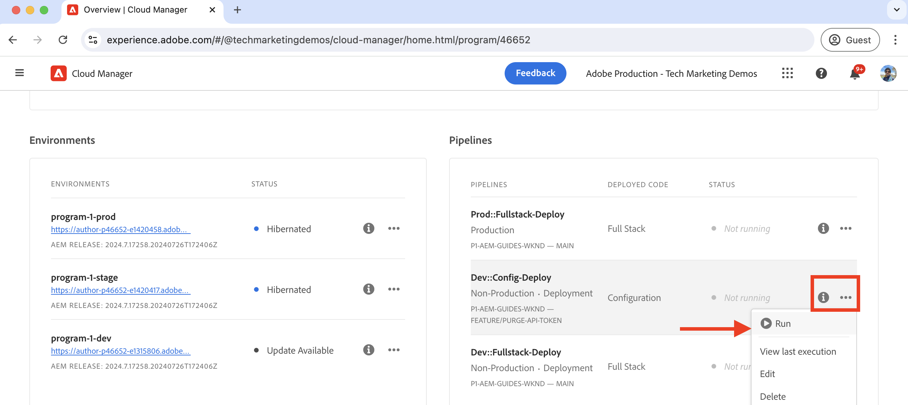

# De CDN-cache leegmaken

Leer hoe u de HTTP-respons in de cache kunt leegmaken of verwijderen uit de AEM as a Cloud Service CDN. Gebruikend de zelfbediening eigenschap genoemd **zuiveren API Token**, kunt u het geheime voorgeheugen voor een specifiek middel, een groep middelen, en het volledige geheime voorgeheugen ontruimen.

In dit leerprogramma, leert u hoe te opstelling en de Schrapping API Token te gebruiken om het CDN geheime voorgeheugen van de steekproef [ AEM WKND ](https://github.com/adobe/aem-guides-wknd) plaats te zuiveren gebruikend de zelfbediening eigenschap.

>[!VIDEO](https://video.tv.adobe.com/v/3432948?quality=12&learn=on)

## Invalidatie van cache versus expliciete verwijdering

Er zijn twee manieren om de caching middelen uit CDN te verwijderen:

1. **de ongeldigverklaring van het Geheime voorgeheugen:** Het is het proces om de caching middelen van CDN te verwijderen die op de geheim voorgeheugenkopballen zoals `Cache-Control`, `Surrogate-Control`, of `Expires` worden gebaseerd. De `max-age` attribuutwaarde van het attribuut van de cachtheader wordt gebruikt om het geheim voorgeheugenleven van de middelen te bepalen, die ook als geheime voorgeheugen TTL (Tijd aan Levende) wordt bekend. Wanneer het geheim voorgeheugenleven verloopt, worden de caching middelen automatisch verwijderd uit het geheime voorgeheugen CDN.

1. **Expliciete zuivering:** Het is het proces om de caching middelen van het CDN geheime voorgeheugen manueel te verwijderen alvorens TTL verloopt. De expliciete zuivering is nuttig wanneer u de caching middelen onmiddellijk wilt verwijderen. Nochtans, verhoogt het het verkeer aan de oorsprongsserver.

Wanneer de caching middelen uit het CDN geheime voorgeheugen worden verwijderd, haalt het volgende verzoek om het zelfde middel de recentste versie van de oorsprongserver.

## Het token voor de lege API instellen

Leer hoe u het token voor de zuiverings-API instelt voor het leegmaken van de CDN-cache.

### De CDN-regel configureren

Het token van de zuiverings-API wordt gemaakt door de CDN-regel in uw AEM-projectcode te configureren.

1. Open het bestand `cdn.yaml` vanuit de hoofdmap van uw AEM-project van `config` . Bijvoorbeeld, het {[&#128279;](https://github.com/adobe/aem-guides-wknd/blob/main/config/cdn.yaml) dossier 1} van cdn.yaml van het 0&rbrace; WKND-project.

1. Voeg de volgende CDN-regel toe aan het `cdn.yaml` -bestand:

```yaml
kind: "CDN"
version: "1"
metadata:
  envTypes: ["dev", "stage", "prod"]
data:  
  authentication: # The main authentication configuration
    authenticators: # The list of authenticators
       - name: purge-auth # The name of the authenticator
         type: purge  # The type of the authenticator, must be purge
         purgeKey1: ${{CDN_PURGEKEY_081324}} # The first purge key, must be referenced by the Cloud Manager secret-type environment variable name ${{CDN_EDGEKEY_073124}}
         purgeKey2: ${{CDN_PURGEKEY_111324}} # The second purge key, must be referenced by the Cloud Manager secret-type environment variable name ${{CDN_EDGEKEY_111324}}. It is used for the rotation of secrets without any interruptions.
    rules: # The list of authentication rules
       - name: purge-auth-rule # The name of the rule
         when: { reqProperty: tier, equals: "publish" } # The condition when the rule should be applied
         action: # The action to be taken when the rule is applied
           type: authenticate # The type of the action, must be authenticate
           authenticator: purge-auth # The name of the authenticator to be used, must match the name from the above authenticators list               
```

In de bovenstaande regel worden zowel `purgeKey1` als `purgeKey2` vanaf het begin toegevoegd ter ondersteuning van de rotatie van geheimen zonder onderbrekingen. U kunt echter alleen met `purgeKey1` beginnen en `purgeKey2` later toevoegen wanneer u de geheimen roteert.

1. Sla de wijzigingen op, wijs deze toe en duw ze door naar de Adobe upstream-opslagplaats.

### Cloud Manager-omgevingsvariabele maken

Maak vervolgens de Cloud Manager-omgevingsvariabelen om de waarde van het token voor de zuiverings-API op te slaan.

1. Logboek in Cloud Manager bij [ my.cloudmanager.adobe.com ](https://my.cloudmanager.adobe.com/) en selecteert uw organisatie en programma.

1. In de __sectie van Milieu&#39;s__, klik de **ellipsen** (...) naast het gewenste milieu en selecteer **Details van de Mening**.

   

1. Dan selecteer het **lusje van de Configuratie** en klik **voeg Configuratie** knoop toe.

1. In de **dialoog van de Configuratie van het 0&rbrace; Milieu &lbrace;, ga de volgende details in:**
   - **Naam**: Ga de naam van de omgevingsvariabele in. De waarde moet overeenkomen met de waarde `purgeKey1` of `purgeKey2` uit het `cdn.yaml` -bestand.
   - **Waarde**: Ga de Schrapping API Symbolische waarde in.
   - **Toegepaste Dienst**: Selecteer de **Al** optie.
   - **Type**: Selecteer de **Geheime** optie.
   - Klik **toevoegen** knoop.

    toe

1. Herhaal bovenstaande stappen om de tweede omgevingsvariabele voor de `purgeKey2` -waarde te maken.

1. Klik **sparen** om de veranderingen te bewaren en toe te passen.

### De CDN-regel implementeren

Tot slot stel de gevormde CDN regel aan het milieu van AEM as a Cloud Service op gebruikend de pijpleiding van Cloud Manager.

1. In Cloud Manager, navigeer aan de **sectie van de Pijpleidingen**.

1. Creeer een nieuwe pijpleiding of selecteer de bestaande pijpleiding die slechts de **Config** dossiers opstelt. Voor gedetailleerde stappen, zie [ een config pijpleiding ](https://experienceleague.adobe.com/en/docs/experience-manager-learn/cloud-service/security/traffic-filter-and-waf-rules/how-to-setup#deploy-rules-through-cloud-manager) creëren.

1. Klik de **looppas** knoop om de CDN regel op te stellen.

   

## De token voor de wisse-API gebruiken

Als u de CDN-cache wilt leegmaken, roept u de AEM-service-specifieke domein-URL aan met het token voor de zuiverings-API. De syntaxis voor het leegmaken van de cache is als volgt:

```
PURGE <URL> HTTP/1.1
Host: <AEM_SERVICE_SPECIFIC_DOMAIN>
X-AEM-Purge-Key: <PURGE_API_TOKEN>
X-AEM-Purge: <PURGE_TYPE>
Surrogate-Key: <SURROGATE_KEY>
```

Waarbij:

- **PURGE`<URL>`**: De `PURGE` methode wordt gevolgd door de weg URL van het middel dat u wilt zuiveren.
- **Gastheer:`<AEM_SERVICE_SPECIFIC_DOMAIN>`**: Het specificeert het domein van de dienst van AEM.
- **x-AEM-zuivering-Sleutel:`<PURGE_API_TOKEN>`**: Een douanekop die de het symbolische waarde van het Symbolisch van de Schrapping API bevat.
- **x-AEM-Leegmaken:`<PURGE_TYPE>`**: Een douanekopbal die het type van zuiveringsverrichting specificeert. De waarde kan `hard`, `soft` of `all` zijn. In de volgende tabel wordt elk type zuivering beschreven:

  | Type wissen | Beschrijving |
  |:------------:|:-------------:|
  | hard (standaard) | Hiermee verwijdert u de in de cache opgeslagen bron direct. Vermijd het aangezien het het verkeer aan de oorsprongsserver verhoogt. |
  | zacht | Merkt de cachebron als opmaakbestand en haalt de laatste versie op van de oorspronkelijke server. |
  | alles | Verwijdert alle in de cache opgeslagen bronnen uit de CDN-cache. |

- **Surrogate-Sleutel:`<SURROGATE_KEY>`**: (Facultatief) een douanekopbal die de vervangingstoetsen (die door ruimte worden gescheiden) van de middelgroepen specificeert om te zuiveren. De vervangende sleutel wordt gebruikt om de bronnen samen te groeperen en moet worden ingesteld in de responsheader van de bron.

>[!TIP]
>
>In de volgende voorbeelden wordt `X-AEM-Purge: hard` gebruikt voor demonstratiedoeleinden. U kunt deze vervangen door `soft` of `all` op basis van uw vereisten. Wees voorzichtig wanneer u het `hard` purge-type gebruikt, aangezien dit het verkeer naar de oorspronkelijke server vergroot.

### De cache leegmaken voor een bepaalde resource

In dit voorbeeld leegt de opdracht `curl` de cache voor de `/us/en.html` -bron op de WKND-site die wordt geïmplementeerd in een AEM as a Cloud Service-omgeving.

```bash
curl -X PURGE "https://publish-p46652-e1315806.adobeaemcloud.com/us/en.html" \
-H "X-AEM-Purge-Key: 123456789" \
-H "X-AEM-Purge: hard"
```

Na het leegmaken wordt een `200 OK` reactie geretourneerd met JSON-inhoud.

```json
{ "status": "ok", "id": "1000098-1722961031-13237063" }
```

### De cache leegmaken voor een groep bronnen

In dit voorbeeld leegt de opdracht `curl` de cache voor de groep met bronnen met de vervangende sleutel `wknd-assets` . De `Surrogate-Key` reactiekopbal wordt geplaatst in [`wknd.vhost` ](https://github.com/adobe/aem-guides-wknd/blob/main/dispatcher/src/conf.d/available_vhosts/wknd.vhost#L176), bijvoorbeeld:

```http
<VirtualHost *:80>
    ...

    # Core Component Image Component: long-term caching (30 days) for immutable URLs, background refresh to avoid MISS
    <LocationMatch "^/content/.*\.coreimg.*\.(?i:jpe?g|png|gif|svg)$">
        Header set Cache-Control "max-age=2592000,stale-while-revalidate=43200,stale-if-error=43200,public,immutable" "expr=%{REQUEST_STATUS} < 400"
        # Set Surrogate-Key header to group the cache of WKND assets, thus it can be flushed independtly
        Header set Surrogate-Key "wknd-assets"
        Header set Age 0
    </LocationMatch>

    ...
</VirtualHost>
```

```bash
curl -X PURGE "https://publish-p46652-e1315806.adobeaemcloud.com" \
-H "Surrogate-Key: wknd-assets" \
-H "X-AEM-Purge-Key: 123456789" \
-H "X-AEM-Purge: hard"
```

Na het leegmaken wordt een `200 OK` reactie geretourneerd met JSON-inhoud.

```json
{ "wknd-assets": "10027-1723478994-2597809-1" }
```

### De gehele cache leegmaken

In dit voorbeeld wordt met de opdracht `curl` de gehele cache leeggemaakt vanaf de WKND-voorbeeldsite die is geïmplementeerd in de AEM as a Cloud Service-omgeving.

```bash
curl -X PURGE "https://publish-p46652-e1315806.adobeaemcloud.com/" \
-H "X-AEM-Purge-Key: 123456789" \
-H "X-AEM-Purge: all"
```

Na het leegmaken wordt een `200 OK` reactie geretourneerd met JSON-inhoud.

```json
{"status":"ok"}
```

### De cache leegmaken controleren

Als u het leegmaken van de cache wilt controleren, opent u de URL van de bron in de webbrowser en bekijkt u de antwoordheaders. De headerwaarde `X-Cache` moet `MISS` zijn.


