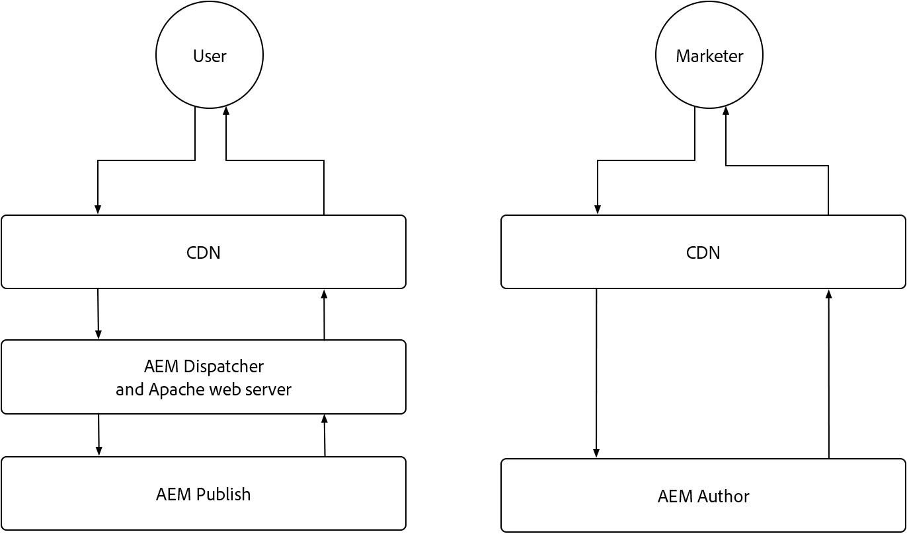

# AEM as a Cloud Service caching

In AEM as a Cloud Service is het begrijpen van caching cruciaal. In cache plaatsen houdt in dat eerder opgehaalde gegevens worden opgeslagen en opnieuw gebruikt om de efficiëntie van het systeem te verbeteren en de laadtijden te verkorten. Dit mechanisme versnelt de levering van inhoud aanzienlijk, verhoogt de prestaties van de website en optimaliseert de gebruikerservaring.

AEM as a Cloud Service heeft meerdere lagen in cache en strategieën die verschillen tussen de services Auteur en Publiceren.

{align="center"}

## AEM caching

AEM as a Cloud Service heeft een robuuste, configureerbare multi-layer in het voorgeheugen onderbrengende strategie, met inbegrip van een CDN, AEM Dispatcher, en naar keuze een klant beheerde CDN. In cache plaatsen over lagen kan worden aangepast om de prestaties te optimaliseren, zodat AEM alleen de beste ervaringen biedt. AEM heeft verschillende problemen met caching voor de services Auteur en Publiceren. Ontdek de caching strategieën voor elke hieronder dienst.

    

    

        

          <figure class="image is-16by9">
            
          </figure>
        

        

          

            
<a href="./publish.md" title="AEM-publicatieservice in cache plaatsen">AEM-publicatieservice in cache plaatsen</a>

            
De AEM-publicatieservice gebruikt een beheerde CDN en AEM Dispatcher om webervaringen voor eindgebruikers te optimaliseren.

            <a href="./publish.md" class="spectrum-Button spectrum-Button--outline spectrum-Button--primary spectrum-Button--sizeM">
               Leren 
            </a>
          

        

      

    

    

        

            

            <figure class="image is-16by9">
                
            </figure>
            

            

            

                
<a href="./author.md" title="AEM Author Service caching">AEM Author Service caching</a>

                
AEM Author-service gebruikt een beheerde CDN om geoptimaliseerde ontwerpervaringen te bieden.

                <a href="./author.md" class="spectrum-Button spectrum-Button--outline spectrum-Button--primary spectrum-Button--sizeM">
                 Leren 
                </a>
            

            

        

    

