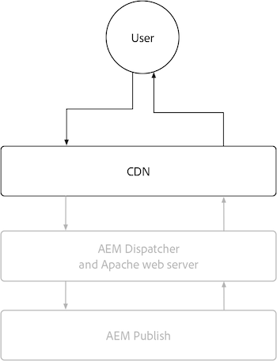

# AEM publiceren

De AEM publicatieservice heeft twee primaire caching lagen, de AEM as a Cloud Service CDN en AEM Dispatcher. Naar keuze kan een klant beheerde CDN vóór AEM as a Cloud Service CDN worden geplaatst. De AEM as a Cloud Service CDN verstrekt randlevering van inhoud, die ervoor zorgt dat de ervaringen met lage latentie aan gebruikers over de hele wereld worden geleverd. AEM Dispatcher zorgt voor caching direct vóór AEM Publish en wordt gebruikt om onnodige belasting op AEM Publish zelf te verlichten.

{align="center"}

## CDN

AEM CDN&#39;s in cache plaatsen wordt beheerd door HTTP-responscachtheekheaders en is bedoeld om inhoud in cache te plaatsen om een balans tussen versheid en prestaties te optimaliseren. De CDN bevindt zich tussen de eindgebruiker en de AEM Dispatcher en wordt gebruikt om inhoud zo dicht mogelijk bij de eindgebruiker in cache te plaatsen, zodat een uitvoerbare ervaring wordt gegarandeerd.

{align="center"}

Het vormen hoe CDN inhoud in het voorgeheugen onderbrengt is beperkt tot het plaatsen van geheim voorgeheugenkopballen op de reacties van HTTP. Deze cachekoppen worden doorgaans ingesteld in AEM Dispatcher-hostconfiguraties met `mod_headers`, maar kan ook worden ingesteld in aangepaste Java™-code die wordt uitgevoerd in AEM Publish zelf.

### Wanneer worden HTTP-aanvragen/reacties in cache geplaatst?

AEM as a Cloud Service CDN plaatst alleen HTTP-reacties in cache en aan alle volgende criteria moet worden voldaan:

+ HTTP-responsstatus is `2xx` of `3xx`
+ HTTP-aanvraagmethode is `GET` of `HEAD`
+ Ten minste een van de volgende HTTP-responsheaders is aanwezig: `Cache-Control`, `Surrogate-Control`, of  `Expires`
+ De HTTP-reactie kan elk inhoudstype zijn, zoals HTML, JSON, CSS, JS en binaire bestanden.

Standaard worden HTTP-reacties niet in de cache geplaatst [AEM Dispatcher](#aem-dispatcher) automatisch om het even welke kopballen van het de reactiecache van HTTP hebben verwijderd om caching bij CDN te vermijden. Dit gedrag kan zorgvuldig worden overschreven met `mod_headers` met de `Header always set ...` , indien nodig.

### Wat is in cache geplaatst?

AEM as a Cloud Service CDN plaatst het volgende in cache:

+ HTTP-responsinstantie
+ HTTP-antwoordheaders

Een HTTP-aanvraag/reactie voor één URL wordt doorgaans als één object in de cache opgeslagen. De CDN kan echter meerdere objecten voor één URL in cache plaatsen, wanneer de `Vary` wordt ingesteld op de HTTP-respons. Vermijd het specificeren `Vary` op kopballen de waarvan waarden geen strak gecontroleerde reeks waarden hebben, aangezien dit in vele geheim voorgeheugenmissen kan resulteren, verminderend geheim voorgeheugenklapverhouding. Ondersteuning van caching van variërende verzoeken bij AEM Dispatcher [Raadpleeg de documentatie over het in cache plaatsen van varianten](https://experienceleague.adobe.com/docs/experience-manager-learn/cloud-service/developing/advanced/variant-caching.html).

### Levensduur cache{#cdn-cache-life}

De AEM CDN publiceren is op TTL (tijd-aan-levende) gebaseerd, betekenend dat het geheim voorgeheugenleven door wordt bepaald `Cache-Control`, `Surrogate-Control`, of `Expires` HTTP-antwoordheaders. Als de HTTP reactie in cache plaatsen kopballen niet door het project worden geplaatst, en [subsidiabiliteitscriteria](#when-are-http-requestsresponses-cached) wordt voldaan, stelt de Adobe een standaardlevensduur van de cache in van 10 minuten (600 seconden).

Hier is hoe de geheim voorgeheugenkopballen het CDN geheim voorgeheugenleven beïnvloeden:

+ [`Cache-Control`](https://developer.fastly.com/reference/http/http-headers/Cache-Control/) De kopbal van de reactie van HTTP instrueert Webbrowser en CDN hoe lang om de reactie in het voorgeheugen onder te brengen. De waarde is in seconden. Bijvoorbeeld: `Cache-Control: max-age=3600` geeft de webbrowser de opdracht de reactie gedurende een uur in cache te plaatsen. Deze waarde wordt genegeerd door de CDN als `Surrogate-Control` De HTTP-responsheader is ook aanwezig.
+ [`Surrogate-Control`](https://developer.fastly.com/reference/http/http-headers/Surrogate-Control/) De kopbal van de reactie van HTTP instrueert de AEM CDN hoe lang om de reactie in het voorgeheugen onder te brengen. De waarde is in seconden. Bijvoorbeeld: `Surrogate-Control: max-age=3600` vertelt CDN om de reactie voor één uur in cache te plaatsen.
+ [`Expires`](https://developer.fastly.com/reference/http/http-headers/Expires/) HTTP-antwoordheader instrueert de AEM CDN (en de webbrowser) hoe lang de reactie in de cache geldig is. De waarde is een datum. Bijvoorbeeld: `Expires: Sat, 16 Sept 2023 09:00:00 EST` instrueert Webbrowser om de reactie tot de gespecificeerde datum en tijd in het voorgeheugen onder te brengen.

Gebruiken `Cache-Control` om het geheim voorgeheugenleven te controleren wanneer het voor zowel browser als CDN het zelfde is. Gebruiken `Surrogate-Control` wanneer de webbrowser de reactie voor een andere duur in cache moet plaatsen dan de CDN.

#### Standaardcache-levensduur

Als een HTTP-reactie in aanmerking komt voor AEM caching van Dispatcher [per bovenstaande kwalificatietekens](#when-are-http-requestsresponses-cached), zijn de volgende standaardwaarden tenzij de douaneconfiguratie aanwezig is.

| Inhoudstype | Standaardlevensduur van CDN-cache |
|:------------ |:---------- |
| [HTML/JSON/XML](https://experienceleague.adobe.com/docs/experience-manager-cloud-service/content/implementing/content-delivery/caching.html#html-text) | 5 minuten |
| [Elementen (afbeeldingen, video&#39;s, documenten, enzovoort)](https://experienceleague.adobe.com/docs/experience-manager-cloud-service/content/implementing/content-delivery/caching.html#images) | 10 minuten |
| [Blijvende query&#39;s (JSON)](https://experienceleague.adobe.com/docs/experience-manager-cloud-service/content/headless/graphql-api/persisted-queries.html?publish-instances) | 2 uur |
| [Clientbibliotheken (JS/CSS)](https://experienceleague.adobe.com/docs/experience-manager-cloud-service/content/implementing/content-delivery/caching.html#client-side-libraries) | dertig dagen |
| [Overige](https://experienceleague.adobe.com/docs/experience-manager-cloud-service/content/implementing/content-delivery/caching.html#other-content) | Niet in cache geplaatst |

### Cacheregels aanpassen

[Vormen hoe CDN inhoud in cache plaatst](https://experienceleague.adobe.com/docs/experience-manager-cloud-service/content/implementing/content-delivery/caching.html#disp) is beperkt tot het instellen van cacheheaders bij HTTP-reacties. Deze cachekoppen worden doorgaans ingesteld in AEM Dispatcher `vhost` configuraties die `mod_headers`, maar kan ook worden ingesteld in aangepaste Java™-code die wordt uitgevoerd in AEM Publish zelf.

## AEM Dispatcher

{align="center"}

### Wanneer worden HTTP-aanvragen/reacties in cache geplaatst?

HTTP-reacties voor corresponderende HTTP-aanvragen worden in de cache geplaatst wanneer aan alle volgende criteria wordt voldaan:

+ HTTP-aanvraagmethode is `GET` of `HEAD`
   + `HEAD` HTTP-aanvragen slaan alleen de HTTP-antwoordheaders in de cache op. Ze hebben geen reactieorganen.
+ HTTP-responsstatus is `200`
+ De reactie van HTTP is NIET voor een binair dossier.
+ Het URL-pad van HTTP-aanvraag eindigt met een extensie, bijvoorbeeld: `.html`, `.json`, `.css`, `.js`, enz.
+ HTTP-aanvraag bevat geen autorisatie en wordt niet door AEM geverifieerd.
   + Nochtans, caching van voor authentiek verklaarde verzoeken [kan globaal worden ingeschakeld](https://experienceleague.adobe.com/docs/experience-manager-dispatcher/using/configuring/dispatcher-configuration.html#caching-when-authentication-is-used) of selectief via [machtigingsgevoelige caching](https://experienceleague.adobe.com/docs/experience-manager-dispatcher/using/configuring/permissions-cache.html).
+ HTTP-aanvraag bevat geen queryparameters.
   + Maar configureren [Genegeerde queryparameters](https://experienceleague.adobe.com/docs/experience-manager-dispatcher/using/configuring/dispatcher-configuration.html?lang=en#ignoring-url-parameters) staat HTTP- verzoeken met de genegeerde vraagparameters toe om van het geheime voorgeheugen worden in het voorgeheugen onder gebracht/worden gediend.
+ Het pad van de HTTP-aanvraag [past een regel van de Verzender toe, en past geen ontkent regel aan](https://experienceleague.adobe.com/docs/experience-manager-dispatcher/using/configuring/dispatcher-configuration.html#specifying-the-documents-to-cache).
+ De HTTP-reactie heeft geen van de volgende HTTP-responsheaders die zijn ingesteld door AEM Publish:

   + `no-cache`
   + `no-store`
   + `must-revalidate`

### Wat is in cache geplaatst?

AEM Dispatcher plaatst het volgende in de cache:

+ HTTP-responsinstantie
+ HTTP-antwoordheaders opgegeven in de Dispatcher&#39;s [cachekoptekstconfiguratie](https://experienceleague.adobe.com/docs/experience-manager-dispatcher/using/configuring/dispatcher-configuration.html#caching-http-response-headers). Zie de standaardconfiguratie die met de [Projectarchetype AEM](https://github.com/adobe/aem-project-archetype/blob/develop/src/main/archetype/dispatcher.cloud/src/conf.dispatcher.d/available_farms/default.farm#L106-L113).
   + `Cache-Control`
   + `Content-Disposition`
   + `Content-Type`
   + `Expires`
   + `Last-Modified`
   + `X-Content-Type-Options`

### Levensduur cache

AEM Dispatcher plaatst HTTP-reacties in de cache met de volgende methoden:

+ Totdat de validatie wordt geactiveerd door mechanismen zoals het publiceren of ongedaan maken van de publicatie van de inhoud.
+ TTL (tijd-aan-levende) wanneer uitdrukkelijk [geconfigureerd in de configuratie Dispatcher](https://experienceleague.adobe.com/docs/experience-manager-dispatcher/using/configuring/dispatcher-configuration.html#configuring-time-based-cache-invalidation-enablettl). Zie de standaardconfiguratie in de [Projectarchetype AEM](https://github.com/adobe/aem-project-archetype/blob/develop/src/main/archetype/dispatcher.cloud/src/conf.dispatcher.d/available_farms/default.farm#L122-L127) door de `enableTTL` configuratie.

#### Standaardcache-levensduur

Als een HTTP-reactie in aanmerking komt voor AEM caching van Dispatcher [per bovenstaande kwalificatietekens](#when-are-http-requestsresponses-cached-1), zijn de volgende standaardwaarden tenzij de douaneconfiguratie aanwezig is.

| Inhoudstype | Standaardlevensduur van CDN-cache |
|:------------ |:---------- |
| [HTML/JSON/XML](https://experienceleague.adobe.com/docs/experience-manager-cloud-service/content/implementing/content-delivery/caching.html#html-text) | Tot ongeldigmaking |
| [Elementen (afbeeldingen, video&#39;s, documenten, enzovoort)](https://experienceleague.adobe.com/docs/experience-manager-cloud-service/content/implementing/content-delivery/caching.html#images) | Nooit |
| [Blijvende query&#39;s (JSON)](https://experienceleague.adobe.com/docs/experience-manager-cloud-service/content/headless/graphql-api/persisted-queries.html?publish-instances) | 1 minuut |
| [Clientbibliotheken (JS/CSS)](https://experienceleague.adobe.com/docs/experience-manager-cloud-service/content/implementing/content-delivery/caching.html#client-side-libraries) | dertig dagen |
| [Overige](https://experienceleague.adobe.com/docs/experience-manager-cloud-service/content/implementing/content-delivery/caching.html#other-content) | Tot ongeldigmaking |

### Cacheregels aanpassen

Het cache van de AEM Dispatcher kan worden geconfigureerd via de [Dispatcher-configuratie](https://experienceleague.adobe.com/docs/experience-manager-dispatcher/using/configuring/dispatcher-configuration.html?lang=en#configuring-the-dispatcher-cache-cache) inclusief:

+ Wat is in cache geplaatst
+ Welke delen van de cache ongeldig worden gemaakt bij publiceren/verwijderen
+ Welke parameters van de HTTP-aanvraagquery worden genegeerd bij de evaluatie van de cache
+ Welke HTTP-antwoordheaders worden in cache geplaatst
+ Het in cache plaatsen van TTL inschakelen of uitschakelen
+ ... en nog veel meer

Gebruiken `mod_headers` om cachekoppen in te stellen voor de `vhost` De configuratie zal niet het caching van de Ontvanger (op TTL-Gebaseerde) beïnvloeden aangezien deze aan de reactie van HTTP worden toegevoegd nadat AEM Dispatcher de reactie verwerkt. Om het cachegeheugen van Dispatcher via HTTP-antwoordheaders te beïnvloeden, is aangepaste Java™-code vereist die wordt uitgevoerd in AEM Publish die de juiste HTTP-antwoordheaders instelt.
