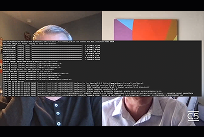
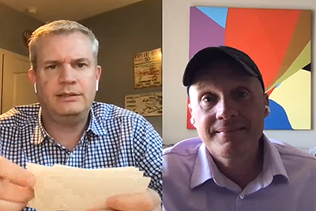

# Wolk 5

## Inleiding

Welkom bij de Cloud 5 Series van AEM Engineering. Een van de belangrijkste problemen in de implementatiefase van een product is het hebben van voldoende codevoorbeelden en/of live demonstraties van deze samples, tools of API&#39;s. Het doel van deze reeks is nuttige informatie over AEM as a Cloud Service in 5 minuten of minder te leveren.

Ga naar [Suggestievak](https://forms.office.com/r/74P5Xz4UH0) voor het indienen van onderwerpideeën.

## Seizoen 1

Elk seizoen varieert in lengte en zal op een vast tijdschema worden vrijgegeven. De onderwerpen van seizoen 1 zijn voornamelijk gebaseerd op eerdere verzoeken die we hebben ontvangen in onze dagelijkse afspraken met klanten en partners. Bezoek deze pagina voor wekelijkse updates of volg ons op het sociale netwerk van uw keuze.

<table>
  <tr>
   <td>
      
      

         <a href="./cloud5-aem-cdn-part1.md"><strong>AEM CDN diep duiken (deel 1)</strong></a>         
          <em>met Darin Kuntze &amp; James Talbot, Senior Cloud Architects</em>
      

      

         
         Deel 1 is een blik bij AEM as a Cloud Service CDN, en hoe te om het in uw implementatie te gebruiken.
      

     </td>   
     <td>
      
      

         <a href="./cloud5-aem-cdn-part2.md"><strong>AEM CDN Diep duiken (deel 2)</strong></a>
          <em>met Darin Kuntze &amp; James Talbot, Senior Cloud Architects</em>
      

      

         
         Deel 2 is een voortzetting van onze blik op AEM as a Cloud Service CDN. We beantwoorden enkele van de meer algemene vragen en mythes over welke functies u krijgt met de nieuwe CDN.
      

   </td>
     <td>
        
      

         <a href="./cloud5-aem-log-files.md"><strong>Logbestanden en logbestanden</strong></a>
          <em>met Darin Kuntze &amp; James Talbot, Senior Cloud Architects</em>
      

      

         
         Dit is een snel onderzoek naar hoe te om tot logboeken toegang te hebben as a Cloud Service, met inbegrip van hoe te om tot hen via de gebruikersinterface evenals van APIs toegang te hebben.
      

   </td> 
  </tr>
  <tr>
   <td>
        
      

        <a href="./cloud5-getting-login-token-integrations.md"><strong>Integreren met Access Tokens</strong></a>        
          <em>met Darin Kuntze &amp; James Talbot, Senior Cloud Architects</em>
      

      

         
         Een snel overzicht en een demo van interactie met aanmeldingstokens voor het uitvoeren van integratiewerk in omgevingen met cloudservices.
      

     </td>   
     <td>
        
      

        <a href="./cloud5-aem-dispatcher-cloud.md"><strong>Dispatcher in de cloud</strong></a>
          <em>met Darin Kuntze &amp; James Talbot, Senior Cloud Architects</em>
      

      

         
        Darin en James bespreken de Dispatcher in de AEM Cloud, inclusief enkele goede werkwijzen en verschillen van AMS/On-Prem. 
      

   </td>
     <td>
        
      

         <a href="./cloud5-aem-content-migration-part-1.md"><strong>Migratie (deel 1)</strong></a>
          <em>met Darin Kuntze &amp; James Talbot, Senior Cloud Architects &amp; Dr Applesmith</em>
      

      

         
         Deel één (van twee) van onze tips en trucs voor het migreren naar de cloud. Onze belangrijkste focus in deel één is de beste praktijken en voorbereidend werk die u klaar maken om te migreren.
      

   </td> 
  </tr>
<tr>
   <td>
        
      

        <a href="./cloud5-aem-content-migration-part-2.md"><strong>Migratie (deel 2)</strong></a>     
          <em>met Darin Kuntze &amp; James Talbot, Senior Cloud Architects</em>
      

      

         
         Deel twee (van twee) van onze tips en trucs voor het migreren naar de cloud. Deel twee gaat voornamelijk over het gebruik van de beschikbare instrumenten voor migratie.
      

     </td>   
     <td>
        
      

         <a href="./cloud5-aem-dispatcher-validator.md"><strong>Validator van verzender</strong></a>
          <em>met Darin Kuntze &amp; James Talbot, Senior Cloud Architects</em>
      

      

         
         Als onderdeel van de eerdere migratiebesprekingen kijken we naar de validator van de verzender en naar enkele taken die deze kan uitvoeren.
      

   </td>
     <td>
        
      

         <a href="./cloud5-aem-search-and-indexing.md"><strong>Tips voor indexeren en zoeken</strong></a>
          <em>met Darin Kuntze &amp; James Talbot, Senior Cloud Architects</em>
      

      

         
         Voor iets zo complex zoals indexeren en onderzoek, toont het team u wat gemakkelijke wins voor het optimaliseren van uw ontwikkelingstijd en het oplossen van dingen alvorens zij problemen worden.
      

   </td> 
  </tr>
    <tr>
        <td>
            
            

                <strong>Adobe App Builder</strong>         
                <em>met Darin Kuntze &amp; James Talbot, Senior Cloud Architects &amp; Special Guest</em>
            

            
 
                Vanaf 6 mei 2022
            

        </td>
        <td></td>
        <td></td>
    </tr>
</table>