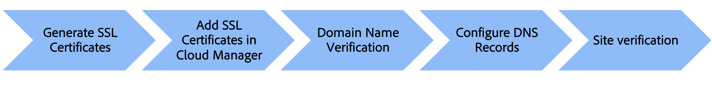

# Aangepaste domeinnaam toevoegen

Leer hoe u een aangepaste domeinnaam aan AEM as a Cloud Service website kunt toevoegen.

In deze zelfstudie wordt de branding van het voorbeeld [AEM WKND](https://github.com/adobe/aem-guides-wknd) site wordt verbeterd door een voor HTTPS adresseerbare aangepaste domeinnaam toe te voegen `wknd.enablementadobe.com` met TLS (Transport Layer Security).

>[!VIDEO](https://video.tv.adobe.com/v/3427817?quality=12&learn=on)

De stappen op hoog niveau zijn:

{width="800" zoomable="yes"}

## Vereisten

- [OpenSSL](https://www.openssl.org/) en [graven](https://www.isc.org/blogs/dns-checker/) zijn geïnstalleerd op uw lokale computer.
- Toegang tot diensten van derden:
   - Certificaatinstantie (CA) - voor het aanvragen van het ondertekende certificaat voor uw sitedomein, zoals [DigitCert](https://www.digicert.com/)
   - De het ontvangen dienst van het Systeem van de Naam van het domein (DNS) - om DNS verslagen voor uw douanedomein, zoals Azure DNS, of Route 53 van AWS toe te voegen.
- Toegang tot [Adobe Cloud Manager](https://my.cloudmanager.adobe.com/) als Business Owner of Deployment Manager.
- Monster [AEM WKND](https://github.com/adobe/aem-guides-wknd) site wordt geïmplementeerd in de AEMCS-omgeving van [productieprogramma](https://experienceleague.adobe.com/docs/experience-manager-cloud-service/content/implementing/using-cloud-manager/programs/introduction-production-programs.html) type.

Als u geen toegang hebt tot services van derden, _samenwerken met uw beveiligings- of hostingteam om de stappen te voltooien_.

## SSL-certificaat genereren

U hebt twee opties:

- Gebruiken `openssl` opdrachtregelprogramma - u kunt een persoonlijke sleutel en een CSR-bestand (Certificate Signing Request) voor uw sitedomein genereren. Om een ondertekend certificaat aan te vragen, dient u de CSR in bij een certificeringsinstantie (CA).

- Uw hostingteam beschikt over de vereiste persoonlijke sleutel en het vereiste ondertekende certificaat voor uw site.

Laten we de stappen voor de eerste optie bekijken.

Als u een persoonlijke sleutel en een CSR wilt genereren, voert u de volgende opdrachten uit en verstrekt u de vereiste informatie wanneer u daarom wordt gevraagd:

```bash
# Generate a private key and a CSR
$ openssl req -newkey rsa:2048 -keyout <YOUR-SITE-NAME>.key -out <YOUR-SITE-NAME>.csr -nodes
```

Om een ondertekend certificaat aan te vragen, verstrek geproduceerde CSR aan CA door hun documentatie te volgen. Zodra CA CSR ondertekent, ontvangt u het ondertekende certificaatdossier.

### Ondertekend certificaat bekijken

U kunt het beste het ondertekende certificaat controleren voordat u het toevoegt aan Cloud Manager. U kunt de certificaatdetails bekijken met de volgende opdracht:

```bash
# Review the certificate details
$ openssl crl2pkcs7 -nocrl -certfile <YOUR-SIGNED-CERT>.crt | openssl pkcs7 -print_certs -noout
```

Het ondertekende certificaat kan de certificaatketen bevatten, die de basis- en tussenliggende certificaten bevat, samen met het certificaat van de eindentiteit.

De Adobe Cloud Manager accepteert het certificaat van de eindentiteit en de certificaatketen _in afzonderlijke formuliervelden_, dus moet u het certificaat van de eindentiteit en de certificaatketen uit het ondertekende certificaat extraheren.

In deze zelfstudie [DigitCert](https://www.digicert.com/) ondertekend certificaat uitgegeven tegen `*.enablementadobe.com` domein wordt als voorbeeld gebruikt. De eindentiteit- en certificaatketen wordt geëxtraheerd door het ondertekende certificaat te openen in een teksteditor en de inhoud te kopiëren tussen de `-----BEGIN CERTIFICATE-----` en `-----END CERTIFICATE-----` markeringen.

## SSL-certificaat toevoegen in Cloud Manager

Ga als volgt te werk om het SSL-certificaat toe te voegen in Cloud Manager [SSL-certificaat toevoegen](https://experienceleague.adobe.com/docs/experience-manager-cloud-service/content/implementing/using-cloud-manager/manage-ssl-certificates/add-ssl-certificate.html) documentatie.

## Domeinnaamverificatie

Voer de volgende stappen uit om de domeinnaam te controleren:

- Domeinnaam toevoegen in Cloud Manager door de instelling [Aangepaste domeinnaam toevoegen](https://experienceleague.adobe.com/docs/experience-manager-cloud-service/content/implementing/using-cloud-manager/custom-domain-names/add-custom-domain-name.html) documentatie.
- Een AEM toevoegen [TXT-record](https://experienceleague.adobe.com/docs/experience-manager-cloud-service/content/implementing/using-cloud-manager/custom-domain-names/add-text-record.html) in uw DNS-hostingservice.
- Verifieer de bovenstaande stappen door de DNS servers te vragen die DNS gebruiken `dig` gebruiken.

```bash
# General syntax, the `_aemverification` is prefix provided by Adobe
$ dig _aemverification.[YOUR-DOMAIN-NAME] -t txt

# This tutorial specific example, as the subdomain `wknd.enablementadobe.com` is used
$ dig _aemverification.wknd.enablementadobe.com -t txt
```

De geslaagde reactie van het voorbeeld ziet er als volgt uit:

```bash
; <<>> DiG 9.10.6 <<>> _aemverification.wknd.enablementadobe.com -t txt
;; global options: +cmd
;; Got answer:
;; ->>HEADER<<- opcode: QUERY, status: NOERROR, id: 8636
;; flags: qr rd ra; QUERY: 1, ANSWER: 1, AUTHORITY: 0, ADDITIONAL: 1

;; OPT PSEUDOSECTION:
; EDNS: version: 0, flags:; udp: 1220
;; QUESTION SECTION:
;_aemverification.wknd.enablementadobe.com. IN TXT

;; ANSWER SECTION:
_aemverification.wknd.enablementadobe.com. 3600    IN TXT "adobe-aem-verification=wknd.enablementadobe.com/105881/991000/bef0e843-9280-4385-9984-357ed9a4217b"

;; Query time: 81 msec
;; SERVER: 153.32.14.247#53(153.32.14.247)
;; WHEN: Tue Mar 12 15:54:25 EDT 2024
;; MSG SIZE  rcvd: 181
```

In dit leerprogramma, wordt Azure DNS gebruikt als voorbeeld. Om het TXT- verslag toe te voegen, moet u de documentatie van uw DNS het ontvangen dienst volgen.

Controleer de [Status domeinnaam controleren](https://experienceleague.adobe.com/docs/experience-manager-cloud-service/content/implementing/using-cloud-manager/custom-domain-names/check-domain-name-status.html) documentatie als er een probleem is.

## DNS-record configureren

Om het DNS verslag voor uw douanedomein te vormen volg deze stappen:

- Bepaal het DNS verslagtype (CNAME of APEX) dat op het domeintype, zoals worteldomein (APEX) of subdomain (CNAME) wordt gebaseerd, en volg [DNS-instellingen configureren](https://experienceleague.adobe.com/docs/experience-manager-cloud-service/content/implementing/using-cloud-manager/custom-domain-names/configure-dns-settings.html) documentatie.
- Voeg het DNS-record toe aan uw DNS-hostingservice.
- Trigger de DNS verslagbevestiging door te volgen [DNS-recordstatus controleren](https://experienceleague.adobe.com/docs/experience-manager-cloud-service/content/implementing/using-cloud-manager/custom-domain-names/check-dns-record-status.html) documentatie.

In deze zelfstudie, als **subdomein** `wknd.enablementadobe.com` wordt gebruikt, het CNAME- verslagtype dat aan richt `cdn.adobeaemcloud.com` wordt toegevoegd.

Als u echter de opdracht **hoofddomein**, moet u APEX-recordtype (ook wel A, ALIAS of ANAME genoemd) toevoegen dat naar de specifieke IP-adressen verwijst die door de Adobe worden opgegeven.

## Site-verificatie

Als u wilt controleren of de site toegankelijk is met de aangepaste domeinnaam, opent u een webbrowser en navigeert u naar de URL van het aangepaste domein. Controleer of de site toegankelijk is en of de browser een veilige verbinding met het hangslotpictogram heeft.


