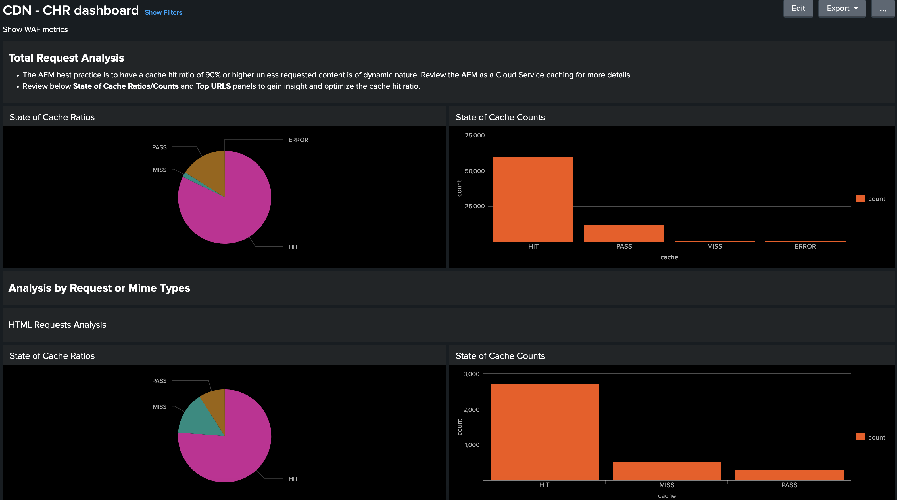

# Gereedschap voor CDN-loganalyse

Meer informatie over de _Analyse van AEM Cloud Service CDN-logboek_ die Adobe verstrekt en hoe het helpt om inzicht in zowel uw prestaties CDN als AEM implementatie te krijgen.
 
>[!VIDEO](https://video.tv.adobe.com/v/3429177?quality=12&learn=on)

## Overzicht

De [AEM as a Cloud Service CDN-logbestandanalyse](https://github.com/adobe/AEMCS-CDN-Log-Analysis-Tooling) biedt vooraf gebouwde dashboards die u met kunt integreren [Splunk](https://www.splunk.com/en_us/products/observability-cloud.html) of de [ELK-stapel](https://www.elastic.co/elastic-stack) voor controle in real time en analyse van uw CDN logboeken.

Met dit gereedschap kunt u real-time controle en proactieve probleemdetectie uitvoeren. Aldus, het verzekeren van geoptimaliseerde inhoudslevering en juiste veiligheidsmaatregelen tegen Ontkenning van de (Dos) en Verdeelde Ontkenning van de (DDoS) aanvallen van de Dienst.

## Belangrijkste kenmerken

- Gestroomlijnde analyse van logbestanden
- Real-time controle
- Naadloze integratie
- Dashboards voor
   - Identificeer potentiële veiligheidsbedreigingen
   - Snellere ervaring voor eindgebruikers

## Overzicht van dashboard

Om de logboekanalyse snel te beginnen, verstrekt de Adobe pre-gebouwde dashboards voor zowel Splunk als de stapel van ELK.

- **Hoogte-breedteverhouding CDN-cache**: biedt inzicht in de totale verhouding van cacherechthoekbelasting en het totale aantal aanvragen door HIT, PASS en MISS-status. Het verstrekt ook hoogste HIT, PASS, en MISS URLs.

  

- **CDN-verkeersdashboard**: biedt inzichten in het verkeer via CDN en de aanvraagsnelheid voor oorsprong, de foutsnelheden 4xx en 5xx en niet-in cache opgeslagen aanvragen. Het verstrekt ook maximum CND en de verzoeken van de Oorsprong per seconde per cliëntIP adres en meer inzichten om de configuraties te optimaliseren CDN.

  

- **WAF-dashboard**: verschaft inzichten via geanalyseerde, gemarkeerde en geblokkeerde aanvragen. Het verstrekt ook hoogste aanvallen door identiteitskaart van de Vlag van WAF, hoogste 100 aanvallers door cliëntIP, land, en gebruikersagent en meer inzichten om de configuraties van WAF te optimaliseren.

  

## Splunk-integratie

Voor organisaties die [Splunk](https://www.splunk.com/en_us/products/observability-cloud.html) en die het logboek van AEMCS door:sturen aan hun instanties van de Splunk hebben toegelaten kunnen prebuilt dashboards snel invoeren. Deze opstelling vergemakkelijkt versnelde logboekanalyse, die actionable inzichten verstrekt om AEM implementaties te optimaliseren en veiligheidsbedreigingen zoals DOS aanvallen te verlichten.

U kunt beginnen met het [Splunk dashboards voor de Analyse van het Logboek van AEMCS CDN](https://github.com/adobe/AEMCS-CDN-Log-Analysis-Tooling/blob/main/Splunk/READEME.md#splunk-dashboards-for-aemcs-cdn-log-analysis) hulplijn.

## ELK-integratie

De [ELK-stapel](https://www.elastic.co/elastic-stack), bestaande uit Elasticsearch, Logstash en Kibana, is een andere krachtige optie voor loganalyse. Het is nuttig voor organisaties die geen toegang tot een opstelling van de Splunk of logboek het door:sturen mogelijkheden hebben. Het lokaal instellen van de ELK-stapel is eenvoudig, dankzij de gereedschapset kunt u snel aan de slag met het bestand Docker Compose. Vervolgens kunt u de vooraf gebouwde dashboards importeren en de CDN-logboeken invoeren die worden gedownload met de Adobe Cloud Manager.

U kunt beginnen met het [ELK Docker-container voor AEMCS CDN-loganalyse](https://github.com/adobe/AEMCS-CDN-Log-Analysis-Tooling/blob/main/ELK/README.md#elk-docker-container-for-aemcs-cdn-log-analysis)

