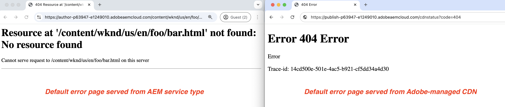

# Aangepaste foutpagina&#39;s

Leer hoe u aangepaste foutpagina&#39;s implementeert voor uw door AEM as a Cloud Service gehoste website.

In deze zelfstudie leert u:

- Standaardfoutpagina&#39;s
- Vanaf waar de foutpagina&#39;s worden weergegeven
   - AEM servicetype - auteur, publiceren, voorvertoning
   - CDN met beheerde Adobe
- Opties om foutpagina&#39;s aan te passen
   - ErrorDocument Apache, instructie
   - ACS AEM Commons - de Handler van de foutenpagina
   - CDN-foutpagina&#39;s

## Standaardfoutpagina&#39;s

Laten we controleren wanneer foutpagina&#39;s worden weergegeven, standaardfoutpagina&#39;s en waar ze vandaan komen.

Foutpagina&#39;s worden weergegeven wanneer:

- pagina bestaat niet (404)
- niet bevoegd om een pagina te openen (403)
- serverfout (500) vanwege codeproblemen of de server is niet bereikbaar.

AEM as a Cloud Service verstrekt _standaardfoutenpagina&#39;s_ voor de bovengenoemde scenario&#39;s. Het is een algemene pagina en komt niet overeen met uw merk.

De standaardfoutenpagina _wordt gediend_ van het _AEM diensttype_ (auteur, publiceert, voorproef) of van _Adobe-geleide CDN_. Zie de onderstaande tabel voor meer informatie.

| Foutpagina aangeboden door | Details |
|---------------------|:-----------------------:|
| AEM servicetype - auteur, publiceren, voorvertoning | Wanneer het paginaverzoek door het AEM de diensttype wordt gediend en om het even welke bovengenoemde foutenscenario&#39;s voorkomen, wordt de foutenpagina gediend van het AEM de diensttype. |
| CDN met beheerde Adobe | Wanneer Adobe-geleide CDN _niet het AEM diensttype_ (oorsprongserver) kan bereiken, wordt de foutenpagina gediend van Adobe-geleide CDN. **het is een onwaarschijnlijke gebeurtenis maar de moeite waard om voor te plannen.** |


Bijvoorbeeld, zijn de standaardfoutenpagina&#39;s die van het de diensttype en Adobe-beheerde CDN worden gediend als volgt:




Nochtans, kunt u _zowel AEM diensttype als Adobe-beheerde_ CDN foutenpagina&#39;s aanpassen om uw merk aan te passen en een betere gebruikerservaring te verstrekken.

## Opties om foutpagina&#39;s aan te passen

De volgende opties zijn beschikbaar om foutpagina&#39;s aan te passen:

| Van toepassing op | Naam van optie | Beschrijving |
|---------------------|:-----------------------:|:-----------------------:|
| AEM servicetypen - publiceren en voorvertonen | ErrorDocument, instructie | Gebruik de [ ErrorDocument ](https://httpd.apache.org/docs/2.4/custom-error.html) richtlijn in het Apache configuratiedossier om de weg aan de pagina van de douanefout te specificeren. Alleen van toepassing op de AEM servicetypen - publiceren en voorvertonen. |
| AEM servicetypen - auteur, publiceren, voorvertoning | ACS AEM Commons-foutpaginahandler | Gebruik [ ACS AEM de Handler van de Pagina van de Fout van Commons 1} om fout over alle AEM de diensttypes aan te passen.](https://adobe-consulting-services.github.io/acs-aem-commons/features/error-handler/index.html) |
| CDN met beheerde Adobe | CDN-foutpagina&#39;s | Gebruik de CDN foutenpagina&#39;s om de foutenpagina&#39;s aan te passen wanneer Adobe-geleide CDN niet het de diensttype van de AEM (oorsprongserver) kan bereiken. |


## Vereisten

In dit leerprogramma, leert u hoe te om foutenpagina&#39;s aan te passen gebruikend de _ErrorDocument_ richtlijn, _ACS AEM de Behandelaar van de Pagina van de Fout van de Commons_ en de _CDN pagina&#39;s van de Fout_ opties. Voor het volgen van deze zelfstudie hebt u het volgende nodig:

- De [ lokale AEM ontwikkelomgeving ](https://experienceleague.adobe.com/en/docs/experience-manager-learn/cloud-service/local-development-environment-set-up/overview) of het milieu van AEM as a Cloud Service. De _CDN optie van de Pagina&#39;s van de Fout_ is toepasselijk op het milieu van AEM as a Cloud Service.

- Het [ AEM project WKND ](https://github.com/adobe/aem-guides-wknd) om foutenpagina&#39;s aan te passen.

## Instellen

- Klonen en het AEM WKND-project implementeren in uw lokale AEM ontwikkelomgeving door de onderstaande stappen uit te voeren:

  ```
  # For local AEM development environment
  $ git clone git@github.com:adobe/aem-guides-wknd.git
  $ cd aem-guides-wknd
  $ mvn clean install -PautoInstallSinglePackage -PautoInstallSinglePackagePublish
  ```

- Voor het milieu van AEM as a Cloud Service, stel het AEM WKND- project door de [ volledig-stapelpijpleiding ](https://experienceleague.adobe.com/en/docs/experience-manager-cloud-service/content/implementing/using-cloud-manager/cicd-pipelines/introduction-ci-cd-pipelines#full-stack-pipeline) in werking te stellen, zie de [ niet-productiepijpleiding ](https://experienceleague.adobe.com/en/docs/experience-manager-learn/cloud-service/cloud-manager/cicd-non-production-pipeline) voorbeeld.

- Controleer of de WKND-sitepagina&#39;s correct worden weergegeven.

## ErrorDocument Apache instructie to customize AEM serving error pages{#errordocument}

Met de Apache-instructie `ErrorDocument` kunt u pagina&#39;s met AEM fouten aanpassen.

In AEM as a Cloud Service is de Apache-instructie-optie `ErrorDocument` alleen van toepassing op de servicetypen Publiceren en Voorvertonen. Het is niet van toepassing op het type van de auteursdienst aangezien Apache + Dispatcher geen deel van de plaatsingsarchitectuur uitmaakt.

Laten wij herzien hoe het [ AEM WKND ](https://github.com/adobe/aem-guides-wknd) project de `ErrorDocument` richtlijn Apache gebruikt om de pagina&#39;s van de douanefout te tonen.

- De `ui.content.sample` module bevat de brandde [ foutenpagina&#39;s ](https://github.com/adobe/aem-guides-wknd/tree/main/ui.content.sample/src/main/content/jcr_root/content/wknd/language-masters/en/errors) @ `/content/wknd/language-masters/en/errors`. Herzie hen in uw [ lokale AEM ](http://localhost:4502/sites.html/content/wknd/language-masters/en/errors) of milieu van AEM as a Cloud Service `https://author-p<ID>-e<ID>.adobeaemcloud.com/ui#/aem/sites.html/content/wknd/language-masters/en/errors`.

- Het bestand `wknd.vhost` van de module `dispatcher` bevat:
   - De [ richtlijn ErrorDocument ](https://github.com/adobe/aem-guides-wknd/blob/main/dispatcher/src/conf.d/available_vhosts/wknd.vhost#L139-L143) die aan de bovengenoemde [ foutenpagina&#39;s ](https://github.com/adobe/aem-guides-wknd/blob/main/dispatcher/src/conf.d/variables/custom.vars#L7-L8) richt.
   - De ](https://github.com/adobe/aem-guides-wknd/blob/main/dispatcher/src/conf.d/available_vhosts/wknd.vhost#L133) waarde 0} DispatcherPassError wordt geplaatst aan 1 zodat Dispatcher laat Apache alle fouten behandelen.[

  ```
  ...
  # ErrorDocument directive in wknd.vhost file
  ErrorDocument 404 ${404_PAGE}
  ErrorDocument 500 ${500_PAGE}
  ErrorDocument 502 ${500_PAGE}
  ErrorDocument 503 ${500_PAGE}
  ErrorDocument 504 ${500_PAGE}
  
  ...
  # DispatcherPassError value in wknd.vhost file
  <IfModule disp_apache2.c>
      ...
      DispatcherPassError        1
  </IfModule>
  
  # Custom error pages path in custom.vars file
  Define 404_PAGE /content/wknd/us/en/errors/404.html
  Define 500_PAGE /content/wknd/us/en/errors/500.html
  ...
  ```

- Herzie de pagina&#39;s van de douanefout van de plaats WKND door een onjuiste paginanaam of een weg in uw milieu in te gaan, bijvoorbeeld [ https://publish-p105881-e991000.adobeaemcloud.com/us/en/foo/bar.html ](https://publish-p105881-e991000.adobeaemcloud.com/us/en/foo/bar.html).

## ACS AEM Commons-Fout de Handler van de Pagina om AEM gediende foutenpagina&#39;s aan te passen{#acs-aem-commons}

Om AEM gediende foutenpagina&#39;s over _aan te passen alle AEM de diensttypes_, kunt u de [ ACS AEM de Handler van de Pagina van de Fout van de Opdrachten van de Opdracht ](https://adobe-consulting-services.github.io/acs-aem-commons/features/error-handler/index.html) optie gebruiken.

. Voor gedetailleerde geleidelijke instructies, zie [ hoe te ](https://adobe-consulting-services.github.io/acs-aem-commons/features/error-handler/index.html#how-to-use) sectie gebruiken.

## CDN-foutpagina&#39;s om door CDN bediende foutpagina&#39;s aan te passen{#cdn-error-pages}

Om foutenpagina&#39;s aan te passen die door Adobe-geleide CDN worden gediend, gebruik de CDN foutenpagina&#39;s optie.

Laten wij CDN foutenpagina&#39;s uitvoeren om foutenpagina&#39;s aan te passen wanneer Adobe-geleide CDN niet het AEM diensttype (oorsprongserver) kan bereiken.

>[!IMPORTANT]
>
> _Adobe-geleide CDN kan niet het AEM diensttype_ (oorsprongserver) bereiken is een **onwaarschijnlijke gebeurtenis** maar de moeite waard van planning voor.

De stappen op hoog niveau voor het implementeren van CDN-foutpagina&#39;s zijn:

- Ontwikkelen van een aangepaste pagina met foutpagina-inhoud als een toepassing voor één pagina (SPA).
- Host de statische dossiers die voor de CDN foutenpagina worden vereist in een openbaar toegankelijke plaats.
- Configureer de CDN-regel (errorPages) en verwijs naar de bovenstaande statische bestanden.
- Stel de gevormde CDN regel aan het milieu van AEM as a Cloud Service op gebruikend de pijpleiding van Cloud Manager.
- Test de CDN-foutpagina&#39;s.


### Overzicht van CDN-foutpagina&#39;s

De CDN foutenpagina wordt uitgevoerd als Enige Toepassing van de Pagina (SPA) door Adobe-geleide CDN. Het SPA document van de HTML dat door Adobe-beheerde CDN wordt geleverd bevat het absolute minimum HTML fragment. De inhoud van de aangepaste foutpagina wordt dynamisch gegenereerd met een JavaScript-bestand. Het JavaScript-bestand moet door de klant worden ontwikkeld en gehost op een openbaar toegankelijke locatie.

Het fragment van HTML dat door Adobe-beheerde CDN wordt geleverd heeft de volgende structuur:

```html
<!DOCTYPE html>
<html lang="en">
  <head>
    
    ...

    <title>{title}</title>
    <link rel="icon" href="{icoUrl}">
    <link rel="stylesheet" href="{cssUrl}">
  </head>
  <body>
    <script src="{jsUrl}"></script>
  </body>
</html>
```

Het HTML-fragment bevat de volgende plaatsaanduidingen:

1. **jsUrl**: De absolute URL van het dossier van JavaScript om de inhoud van de foutenpagina terug te geven door HTML elementen dynamisch te creëren.
1. **cssUrl**: De absolute URL van het CSS dossier om de inhoud van de foutenpagina te stileren.
1. **icoUrl**: Absolute URL van het favicon.


### Een aangepaste foutpagina ontwikkelen

Laten we de inhoud van de WKND-pagina met specifieke foutmeldingen ontwikkelen als een toepassing voor één pagina (SPA).

Voor demodoeleinden, laten wij gebruiken [ Reageren ](https://react.dev/), echter, kunt u om het even welk kader of bibliotheek van JavaScript gebruiken.

- Creeer een nieuw React project door het volgende bevel in werking te stellen:

  ```
  $ npx create-react-app aem-cdn-error-page
  ```

- Open het project in uw favoriete code redacteur en werk de hieronder dossiers bij:

   - `src/App.js`: het is de hoofdcomponent die de inhoud van de foutpagina rendert.

     ```javascript
     import logo from "./wknd-logo.png";
     import "./App.css";
     
     function App() {
       return (
         <>
           <div className="App">
             <div className="container">
             
             </div>
           </div>
           <div className="container">
             <div className="error-code">CDN Error Page</div>
             <h1 className="error-message">Ruh-Roh! Page Not Found</h1>
             <p className="error-description">
               We're sorry, we are unable to fetch this page!
             </p>
           </div>
         </>
       );
     }
     
     export default App;
     ```

   - `src/App.css`: maak de inhoud van de foutpagina op.

     ```css
     .App {
       text-align: left;
     }
     
     .App-logo {
       height: 14vmin;
       pointer-events: none;
     }
     
     
     body {
       margin-top: 0;
       padding: 0;
       font-family: Arial, sans-serif;
       background-color: #fff;
       color: #333;
       display: flex;
       justify-content: center;
       align-items: center;
     }
     
     .container {
       text-align: letf;
       padding-top: 10px;
     }
     
     .error-code {
       font-size: 4rem;
       font-weight: bold;
       color: #ff6b6b;
     }
     
     .error-message {
       font-size: 2.5rem;
       margin-bottom: 10px;
     }
     
     .error-description {
       font-size: 1rem;
       margin-bottom: 20px;
     }
     ```

   - Voeg het bestand `wknd-logo.png` toe aan de map `src` . Kopieer het [ dossier ](https://github.com/adobe/aem-guides-wknd/blob/main/ui.frontend/src/main/webpack/resources/images/favicons/favicon-512.png) als `wknd-logo.png`.

   - Voeg het bestand `favicon.ico` toe aan de map `public` . Kopieer het [ dossier ](https://github.com/adobe/aem-guides-wknd/blob/main/ui.frontend/src/main/webpack/resources/images/favicons/favicon-32.png) als `favicon.ico`.

   - Verifieer de van het brandmerk CDN van WKND de inhoud van de foutenpagina door het project in werking te stellen:

     ```
     $ npm start
     ```

     Open de browser en navigeer naar `http://localhost:3000/` om de inhoud van de CDN-foutpagina te bekijken.

   - Bouw het project om de statische dossiers te produceren:

     ```
     $ npm run build
     ```

     De statische bestanden worden gegenereerd in de map `build` .


Alternatief, kunt u het {](./assets/aem-cdn-error-page.zip) dossier downloaden 0} aem-cdn-error-page.zip dat de bovengenoemde projectdossiers van React bevat.[

Vervolgens host u de bovenstaande statische bestanden op een openbaar toegankelijke locatie.

### Statische bestanden van host vereist voor CDN-foutpagina

Laten we de statische bestanden hosten in Azure Blob Storage. Nochtans, kunt u om het even welk statisch dossier gebruiken die de dienst als [ ontvangen ](https://www.netlify.com/), [ Vercel ](https://vercel.com/), of [ AWS S3 ](https://aws.amazon.com/s3/).

- Volg de officiële [ Azure Blokopslag ](https://learn.microsoft.com/en-us/azure/storage/blobs/storage-quickstart-blobs-portal) documentatie om een container te creëren en de statische dossiers te uploaden.

  >[!IMPORTANT]
  >
  >Als u andere statische diensten van het dossierontvangen gebruikt, volg hun documentatie om de statische dossiers te ontvangen.

- Zorg ervoor dat de statische bestanden openbaar toegankelijk zijn. Mijn WKND-demo-specifieke instellingen voor opslagaccounts zijn als volgt:

   - **de Naam van de Rekening van de Opslag**: `aemcdnerrorpageresources`
   - **Naam van de Container**: `static-files`

  

- In de container boven `static-files` worden de onderstaande bestanden uit de map `build` geüpload:

   - `error.js`: Het `build/static/js/main.<hash>.js` dossier wordt anders genoemd aan `error.js` en [ openbaar toegankelijk ](https://aemcdnerrorpageresources.blob.core.windows.net/static-files/error.js).
   - `error.css`: Het `build/static/css/main.<hash>.css` dossier wordt anders genoemd aan `error.css` en [ openbaar toegankelijk ](https://aemcdnerrorpageresources.blob.core.windows.net/static-files/error.css).
   - `favicon.ico`: Het `build/favicon.ico` dossier wordt geupload zoals is en [ openbaar toegankelijk ](https://aemcdnerrorpageresources.blob.core.windows.net/static-files/favicon.ico).

Vervolgens configureert u de CDN-regel (errorPages) en verwijst u naar de bovenstaande statische bestanden.

### De CDN-regel configureren

Configureer de CDN-regel `errorPages` die de bovenstaande statische bestanden gebruikt om de inhoud van de CDN-foutpagina weer te geven.

1. Open het bestand `cdn.yaml` vanuit de hoofdmap `config` van het AEM project. Bijvoorbeeld, het {](https://github.com/adobe/aem-guides-wknd/blob/main/config/cdn.yaml) dossier 1} van cdn.yaml van het 0} WKND-project.[

1. Voeg de volgende CDN-regel toe aan het `cdn.yaml` -bestand:

   ```yaml
   kind: "CDN"
   version: "1"
   metadata:
     envTypes: ["dev", "stage", "prod"]
   data:
     # The CDN Error Page configuration. 
     # The error page is displayed when the Adobe-managed CDN is unable to reach the origin server.
     # It is implemented as a Single Page Application (SPA) and WKND branded content must be generated dynamically using the JavaScript file 
     errorPages:
       spa:
         title: Adobe AEM CDN Error Page # The title of the error page
         icoUrl: https://aemcdnerrorpageresources.blob.core.windows.net/static-files/favicon.ico # The PUBLIC URL of the favicon
         cssUrl: https://aemcdnerrorpageresources.blob.core.windows.net/static-files/error.css # The PUBLIC URL of the CSS file
         jsUrl: https://aemcdnerrorpageresources.blob.core.windows.net/static-files/error.js # The PUBLIC URL of the JavaScript file
   ```

1. Sla de wijzigingen op, wijs deze toe en duw de wijzigingen naar de Adobe upstream in de opslagplaats.

### De CDN-regel implementeren

Tot slot stel de gevormde CDN regel aan het milieu van AEM as a Cloud Service op gebruikend de pijpleiding van Cloud Manager.

1. In Cloud Manager, navigeer aan de **sectie van de Pijpleidingen**.

1. Creeer een nieuwe pijpleiding of selecteer de bestaande pijpleiding die slechts de **Config** dossiers opstelt. Voor gedetailleerde stappen, zie [ een config pijpleiding ](https://experienceleague.adobe.com/en/docs/experience-manager-learn/cloud-service/security/traffic-filter-and-waf-rules/how-to-setup#deploy-rules-through-cloud-manager) creëren.

1. Klik de **looppas** knoop om de CDN regel op te stellen.

 op

### CDN-foutpagina&#39;s testen

Voer de volgende stappen uit om de CDN-foutpagina&#39;s te testen:

- Open browser en navigeer aan het milieu URL van Publish, voeg `cdnstatus?code=404` aan URL toe, bijvoorbeeld, [ https://publish-p105881-e991000.adobeaemcloud.com/cdnstatus?code=404 ](https://publish-p105881-e991000.adobeaemcloud.com/cdnstatus?code=404) of toegang gebruikend [ douanedomein URL ](https://wknd.enablementadobe.com/cdnstatus?code=404)

  

- De volgende codes worden ondersteund: 403, 404, 406, 500 en 503.

- Controleer het tabblad van het browsernetwerk om te zien hoe de statische bestanden worden geladen van de Azure Blob-opslag. Het document van HTML dat door Adobe-beheerde CDN wordt geleverd bevat de volledige minimuminhoud en het dossier van JavaScript leidt dynamisch tot de branded inhoud van de foutenpagina.

  

## Samenvatting

In deze zelfstudie hebt u meer geleerd over standaardfoutpagina&#39;s, waar de foutpagina&#39;s vandaan komen, en over opties voor het aanpassen van foutpagina&#39;s. U hebt geleerd hoe u aangepaste foutpagina&#39;s kunt implementeren met de opties `ErrorDocument` Apache, `ACS AEM Commons Error Page Handler` en `CDN Error Pages` .

## Aanvullende bronnen

- [ Vormend CDN de Pagina&#39;s van de Fout ](https://experienceleague.adobe.com/en/docs/experience-manager-cloud-service/content/implementing/content-delivery/cdn-error-pages)

- [ Cloud Manager - Config pijpleidingen ](https://experienceleague.adobe.com/en/docs/experience-manager-cloud-service/content/implementing/using-cloud-manager/cicd-pipelines/introduction-ci-cd-pipelines#config-deployment-pipeline)

