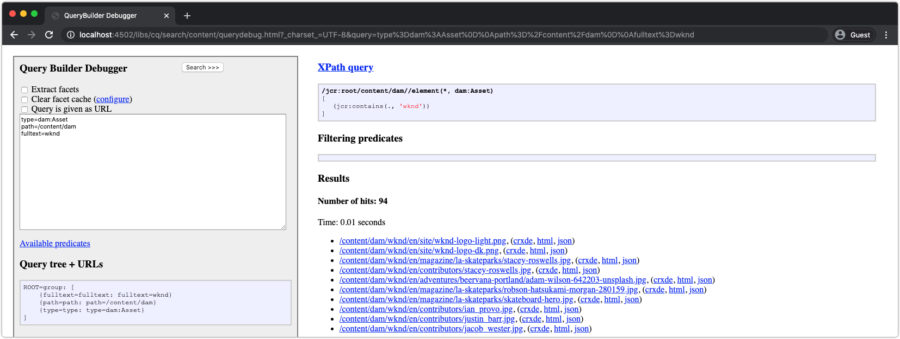

# Andere tools voor foutopsporing AEM SDK

Een verscheidenheid van andere hulpmiddelen kan helpen bij het zuiveren van uw toepassing op de lokale snelle start van AEM SDK.

## CRXDE Lite

CRXDE Lite is een webinterface voor interactie met het JCR, AEM gegevensopslagruimte. CRXDE Lite biedt volledige zichtbaarheid in het JCR, inclusief knooppunten, eigenschappen, eigenschapswaarden en machtigingen.

CRXDE Lite bevindt zich in:

+ Gereedschappen > Algemeen > CRXDE Lite
+ of rechtstreeks om [http://localhost:4502/crx/de/index.jsp](http://localhost:4502/crx/de/index.jsp)

### Fouten opsporen in inhoud

CRXDE Lite biedt directe toegang tot het JCR. De inhoud die zichtbaar is via CRXDE Lite, wordt beperkt door de machtigingen die aan uw gebruiker zijn verleend. Dit houdt in dat u mogelijk niet alles in het JCR kunt zien of wijzigen, afhankelijk van uw toegang.

+ U kunt met het linkernavigatievenster navigeren door de JCR-structuur en deze manipuleren
+ Wanneer u een knooppunt in het navigatievenster aan de linkerkant selecteert, wordt de eigenschap node in het onderste deelvenster beschikbaar gemaakt.
   + Eigenschappen kunnen vanuit het deelvenster worden toegevoegd, verwijderd of gewijzigd
+ Als u dubbelklikt op een bestandsknooppunt in de linkernavigatie, wordt de inhoud van het bestand geopend in het rechterbovenvenster
+ Tik op de knop Alles opslaan linksboven om de wijzigingen te handhaven of op de pijl omlaag naast Alles opslaan om alle niet-opgeslagen wijzigingen te herstellen.

Wijzigingen die rechtstreeks via CRXDE Lite in AEM SDK worden aangebracht, kunnen moeilijk te volgen en te beheren zijn. Zorgt ervoor dat wijzigingen die via CRXDE Lite zijn aangebracht, terugkeren naar de veranderbare inhoudspakketten van het AEM-project (`ui.content`) en zich heeft geëngageerd aan Git. In het ideale geval komen alle wijzigingen in de toepassingsinhoud van de basis van de code en gaan deze via implementaties naar AEM SDK in plaats van rechtstreeks wijzigingen aan te brengen in de AEM SDK via CRXDE Lite.

### Toegangsbesturingselementen voor foutopsporing

CRXDE Lite biedt een manier om toegangsbeheer voor een specifiek knooppunt voor een specifieke gebruiker of groep (ook wel principal genoemd) te testen en te evalueren.

Om tot de console van het Toegangsbeheer van de Test in CRXDE Lite toegang te hebben, navigeer aan:

+ CRXDE Lite > Gereedschappen > Toegangsbeheer testen...

1. Selecteer in het veld Pad een JCR-pad dat u wilt evalueren
1. Selecteer in het veld Hoofd de gebruiker of de groep aan de hand waarvan u het pad wilt beoordelen
1. Tik op de knop Testen

De resultaten worden hieronder weergegeven:

+ __Pad__ herhaalt de ingeslagen weg
+ __Opdrachtgever__ herhaalt de gebruiker of groep waarvoor het pad is geëvalueerd
+ __Principes__ maakt een lijst van alle principes het geselecteerde hoofd deel van is.
   + Dit is nuttig om het overgangsgroepslidmaatschap te begrijpen dat toestemmingen via overerving kan verlenen
+ __Rechten op pad__ Hiermee worden alle JCR-machtigingen weergegeven die de geselecteerde principal op het geëvalueerde pad heeft

## Query uitvoeren

Verklaar het Web-based hulpmiddel van de Vraag in AEM lokale QuickStart van SDK, die zeer belangrijke inzichten in verstrekt hoe AEM en vragen interpreteert uitvoert, en een onschatbaar hulpmiddel om vragen te verzekeren op een prestatieswijze door AEM worden uitgevoerd.

Verklaar de Vraag wordt gevestigd bij:

+ Gereedschappen > Diagnose > Query-prestaties > Het tabblad Query uitvoeren
+ [http://localhost:4502/libs/granite/operations/content/diagnosistools/queryPerformance.html](http://localhost:4502/libs/granite/operations/content/diagnosistools/queryPerformance.html) > Het tabblad Query uitvoeren

## QueryBuilder-foutopsporing

Foutopsporing van QueryBuilder is web-based hulpmiddel dat u helpt onderzoeksvragen zuiveren en begrijpen gebruikend AEM [QueryBuilder](https://experienceleague.adobe.com/docs/experience-manager-65/developing/platform/query-builder/querybuilder-api.html) syntaxis.

Foutopsporing van QueryBuilder bevindt zich in:

+ [http://localhost:4502/libs/cq/search/content/querydebug.html](http://localhost:4502/libs/cq/search/content/querydebug.html)
