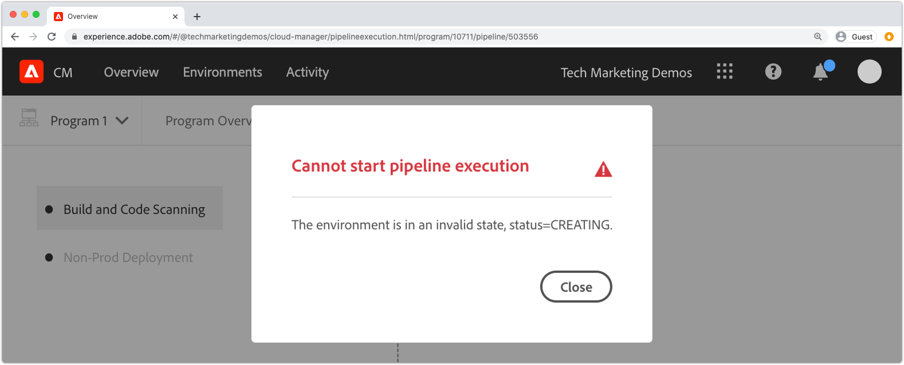
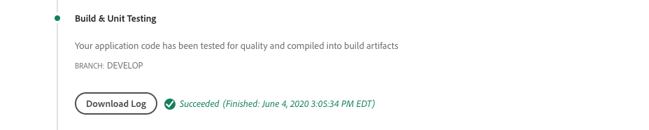
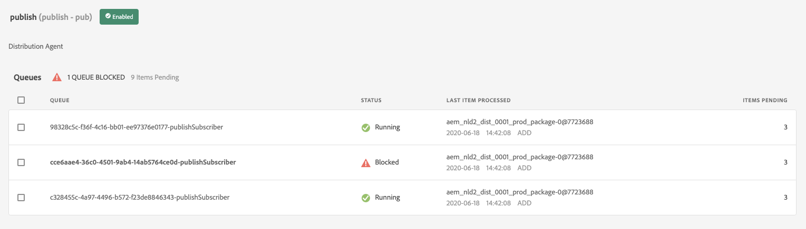

# Fouten opsporen AEM as a Cloud Service build en implementaties

Adobe Cloud Manager vereenvoudigt het samenstellen van code en implementaties tot AEM as a Cloud Service. De mislukkingen kunnen tijdens stappen in het bouwstijlproces voorkomen, die actie vereisen om hen op te lossen. Deze gids loopt door het begrip gemeenschappelijke mislukkingen in de plaatsing, en hoe te om hen het best te benaderen.


## Validatie

De validatiestap zorgt ervoor dat de basisconfiguraties van Cloud Manager geldig zijn. Veelvoorkomende validatiefouten zijn:

### De omgeving heeft een ongeldige status

+ __Foutbericht:__ De omgeving heeft een ongeldige status.
  
+ __Oorzaak:__ De doelomgeving van de pijpleiding bevindt zich in een overgangsfase en kan geen nieuwe gebouwen accepteren.
+ __Resolutie:__ Wacht tot de status is omgezet in een actieve (of beschikbare) status. Als de omgeving wordt verwijderd, maakt u de omgeving opnieuw of kiest u een andere omgeving om aan te maken.

### Het milieu verbonden aan de pijpleiding kan niet worden gevonden

+ __Foutbericht:__ De omgeving is gemarkeerd als verwijderd.
  
+ __Oorzaak:__ Het milieu de pijpleiding wordt gevormd om te gebruiken is geschrapt.
Zelfs als een nieuwe omgeving met dezelfde naam opnieuw wordt gemaakt, zal de Manager van de Wolk niet automatisch de pijpleiding aan dat zelfde-genoemde milieu opnieuw associëren.
+ __Resolutie:__ Bewerk de pijpleidingsconfiguratie en selecteer het milieu om op te stellen.

### De Git-vertakking die aan de pijplijn is gekoppeld, is niet gevonden

+ __Foutbericht:__ Ongeldige pijplijn: XXXXXX. Reason=Branch=xxxx niet gevonden in bewaarplaats.
  
+ __Oorzaak:__ De tak van het Git de pijpleiding wordt gevormd om te gebruiken is geschrapt.
+ __Resolutie:__ Maak de ontbrekende tak van het Git opnieuw gebruikend de nauwkeurige zelfde naam, of vorm de pijpleiding opnieuw om van een verschillende, bestaande tak te bouwen.

## Testen van build en eenheid



De bouwstijl en de het Testen van de Eenheid voert een Maven bouwstijl uit (`mvn clean package`) van het project dat uit de gevormde tak van de Git van de pijpleiding wordt gecontroleerd.

De fouten die in deze fase zijn vastgesteld, moeten de lokale opbouw van het project kunnen heroveren, met de volgende uitzonderingen:

+ Een bepaalde afhankelijkheid is niet beschikbaar op [Maven Central](https://search.maven.org/) wordt gebruikt en de Maven-opslagplaats die de afhankelijkheid bevat, is:
   + Kan niet worden bereikt vanuit Cloud Manager, zoals een interne privéopslagplaats in Maven, of de Maven-opslagplaats vereist verificatie en de onjuiste referenties zijn opgegeven.
   + Niet expliciet geregistreerd in de `pom.xml`. Merk op dat het opnemen van Maven repositories wordt ontmoedigd omdat het de bouwtijden verhoogt.
+ Eenheidstests mislukken vanwege tijdproblemen. Dit kan zich voordoen wanneer eenheidstests timinggevoelig zijn. Een sterke indicator is afhankelijk van `.sleep(..)` in de testcode.
+ Het gebruik van niet-ondersteunde plug-ins.

## Codescannen


Met codescannen wordt een statische codeanalyse uitgevoerd met behulp van een combinatie van Java en AEM-specifieke aanbevolen procedures.

Het aftasten van de code resulteert in een bouwstijlmislukking als de Kritieke kwetsbaarheid van de Veiligheid in de code bestaat. Minder overtredingen kunnen worden overschreven, maar het wordt aanbevolen dat deze worden gecorrigeerd. Het scannen van code is niet perfect en kan resulteren in [valse positieven](https://experienceleague.adobe.com/docs/experience-manager-cloud-service/implementing/using-cloud-manager/test-results/overview-test-results.html#dealing-with-false-positives).

Als u problemen met het scannen van code wilt oplossen, downloadt u het CSV-rapport van Cloud Manager via de **Downloaddetails** en bekijk alle vermeldingen.

Zie documentatie van Cloud Manager voor meer informatie AEM specifieke regels. [aangepaste AEM-specifieke regels voor het scannen van code](https://experienceleague.adobe.com/docs/experience-manager-cloud-manager/using/how-to-use/custom-code-quality-rules.html).

## Afbeeldingen samenstellen


Build image is verantwoordelijk voor het combineren van de ingebouwde code-artefacten die in de stap Build &amp; Unit Testing zijn gemaakt met de AEM Release, om één implementeerbaar artefact te vormen.

Terwijl om het even welke code bouwt en compilatiekwesties tijdens het Testen van de Bouwstijl &amp; van de Eenheid worden gevonden, kunnen er configuratie of structurele kwesties worden geïdentificeerd wanneer het proberen om het douanebouwartefact met de AEM versie te combineren.

### OSGi-configuraties dupliceren

Wanneer de veelvoudige configuraties OSGi via runmode voor het doel AEM milieu oplossen, ontbreekt de stap van het Beeld van de Bouwstijl met de fout:

```
[ERROR] Unable to convert content-package [/tmp/packages/enduser.all-1.0-SNAPSHOT.zip]: 
Configuration 'com.example.ExampleComponent' already defined in Feature Model 'com.example.groupId:example.all:slingosgifeature:xxxxx:X.X', 
set the 'mergeConfigurations' flag to 'true' if you want to merge multiple configurations with same PID
```

#### Oorzaak 1

+ __Oorzaak:__ Het alle pakket van het AEM project, bevat veelvoudige codepakketten, en de zelfde configuratie OSGi wordt verstrekt door meer dan één van de codepakketten, resulterend in een conflict, resulterend de stap van het Beeld van de Bouwstijl niet kon beslissen welke zou moeten worden gebruikt, zo ontbreekt de bouwstijl. Merk op dat dit niet op OSGi fabrieksconfiguraties van toepassing is, zolang zij unieke namen hebben.
+ __Resolutie:__ Herzie alle codepakketten (met inbegrip van om het even welke inbegrepen pakketten van de derdencode) die als deel van de AEM toepassing worden opgesteld, zoekend dubbele configuraties OSGi die, via runmode, aan het doelmilieu oplossen. De instructies van het foutbericht om de markering mergeConfigurations in te stellen op true, zijn niet mogelijk in AEM als Cloud-service en moeten worden genegeerd.

#### Oorzaak 2

+ __Oorzaak:__ Het AEM project omvat verkeerd het zelfde codepakket tweemaal, resulterend in de duplicatie van om het even welke configuratie OSGi in dat pakket.
+ __Resolutie:__ Controleer alle pakketten die in het hele project zijn ingesloten op pom.xml en zorg ervoor dat deze de `filevault-package-maven-plugin` [configuratie](https://experienceleague.adobe.com/docs/experience-manager-cloud-service/implementing/developing/aem-project-content-package-structure.html#cloud-manager-target) instellen op `<cloudManagerTarget>none</cloudManagerTarget>`.

### Onjuist geformuleerd script voor opnieuw aanwijzen

De opnieuw aanwijzen manuscripten bepalen basislijninhoud, gebruikers, ACLs, enz. In AEM as a Cloud Service, worden het opnieuw richten van manuscripten toegepast tijdens het Beeld van de Bouwstijl, nochtans op AEM lokale QuickStart van SDK zij toegepast wanneer OSGi opnieuw richt fabrieksconfiguratie wordt geactiveerd. Hierdoor kunnen scripts voor opnieuw aanwijzen stilletjes mislukken (met registratie) bij AEM lokale QuickStart van SDK en de stap Build Image laten mislukken, waardoor de implementatie wordt gestopt.

+ __Oorzaak:__ Een herpointscript is onjuist geformuleerd. Dit kan ertoe leiden dat de repository onvolledig blijft omdat eventuele opnieuw geplaatste scripts na het falende script niet worden uitgevoerd tegen de repository.
+ __Resolutie:__ Herzie lokale quickstart van AEM SDK wanneer het opnieuw richt manuscript OSGi configuratie wordt opgesteld om te bepalen als en wat de fouten zijn.

### Onbevredigd opnieuw richten inhoudsgebiedsdeel

De opnieuw aanwijzen manuscripten bepalen basislijninhoud, gebruikers, ACLs, enz. In AEM lokale QuickStart van SDK worden opnieuw aanwijsscripts toegepast wanneer de opnieuw aanwijzen van de OSGi-fabrieksconfiguratie wordt geactiveerd, met andere woorden, nadat de opslagplaats actief is en direct of via inhoudspakketten wijzigingen in de inhoud kan hebben ondergaan. In AEM as a Cloud Service, wordt het opnieuw richten van manuscripten toegepast tijdens het Beeld van de Bouwstijl tegen een bewaarplaats die geen inhoud kan bevatten het opnieuw richten manuscript waarvan afhangt.

+ __Oorzaak:__ Een script voor opnieuw aanwijzen is afhankelijk van inhoud die niet bestaat.
+ __Resolutie:__ Controleer of de inhoud waarvan het script voor opnieuw aanwijzen afhankelijk is, bestaat. Dit geeft vaak aan dat er onvoldoende gedefinieerde scripts zijn die verwijzen naar scripts die geen instructies bevatten die deze ontbrekende, maar vereiste inhoudsstructuren definiëren. Dit kan plaatselijk worden gereproduceerd door AEM te schrappen, Jar te decomprimeren en de opnieuw richt configuratie toe te voegen OSGi die het repoinit manuscript aan de installatiemap bevat, en AEM te beginnen. De fout wordt weergegeven in het bestand error.log van de lokale QuickStart-AEM SDK.


### De versie van de Componenten van de Kern van de toepassing is groter dan opgestelde versie

_Dit probleem betreft alleen niet-productieomgevingen die NIET automatisch worden bijgewerkt naar de nieuwste versie AEM._

AEM as a Cloud Service omvat automatisch de nieuwste versie van de Componenten van de Kern in elke AEMVersie, die betekent nadat een AEM as a Cloud Service milieu, automatisch of manueel wordt bijgewerkt, de recentste versie van de Componenten van de Kern aan het wordt opgesteld.

Is mogelijk voor de stap van het Beeld van de Bouwstijl zal ontbreken wanneer:

+ De implementerende toepassing werkt de versie van Core Components (Basiscomponenten) in de `core` (OSGi-bundel) project
+ De implementerende toepassing wordt vervolgens geïmplementeerd in een sandbox (niet-productie) AEM as a Cloud Service omgeving die niet is bijgewerkt voor het gebruik van een AEM die die nieuwe versie van Core Components bevat.

Om deze mislukking te verhinderen, wanneer een Update van het AEM as a Cloud Service milieu beschikbaar is, omvat de update als deel van volgende bouwstijl/opstellen, en zorgt altijd ervoor dat de updates na het verhogen van de versie van de Componenten van de Kern in de basis van toepassingscode inbegrepen zijn.

+ __Symptomen:__
De stap Build Image mislukt met een ERROR-melding dat `com.adobe.cq.wcm.core.components...` pakket(en) met een specifiek versiebereik kon niet worden geïmporteerd door de `core` project.

  ```
  [ERROR] Bundle com.example.core:0.0.3-SNAPSHOT is importing package(s) Package com.adobe.cq.wcm.core.components.models;version=[12.13,13) in start level 20 but no bundle is exporting these for that start level in the required version range.
  [ERROR] Analyser detected errors on feature 'com.adobe.granite:aem-ethos-app-image:slingosgifeature:aem-runtime-application-publish-dev:1.0.0-SNAPSHOT'. See log output for error messages.
  [INFO] ------------------------------------------------------------------------
  [INFO] BUILD FAILURE
  [INFO] ------------------------------------------------------------------------
  ```

+ __Oorzaak:__  De OSGi-bundel van de toepassing (gedefinieerd in de `core` project) voert de klassen van Java van de kernafhankelijkheid van Componenten van de Kern, op een verschillend versieniveau in dan is wat aan AEM as a Cloud Service wordt opgesteld.
+ __Resolutie:__
   + Gebruikend Git, keer terug aan het werk begaat die vóór de verhoging van de versie van de Component van de Kern bestaat. Druk op deze koppeling om naar een Cloud Manager Git-vertakking te gaan en voer een update van de omgeving uit vanuit deze vertakking. Dit zal AEM as a Cloud Service aan de recentste AEMVersie bevorderen, die de recentere versie van de Componenten van de Kern omvat. Zodra de AEM as a Cloud Service aan de recentste AEMVersie wordt bijgewerkt, die de recentste versie van de Componenten van de Kern zal hebben, herstelt oorspronkelijk het ontbreken code.
   + Als u dit probleem lokaal wilt reproduceren, zorgt u ervoor dat de AEM SDK-versie dezelfde AEM releaseversie is als de AEM as a Cloud Service omgeving gebruikt.


### Een Adobe-ondersteuningsgeval maken

Als de bovenstaande oplossingen het probleem niet oplossen, kunt u een Adobe Support-case maken via:

+ [Adobe Admin Console](https://adminconsole.adobe.com) > Tabblad Ondersteuning > Hoofd-kleine letter maken

  _Als u lid van veelvoudige Orgs van de Adobe bent, zorg ervoor de Adobe Org die ontbrekende pijpleiding heeft in de schakelaar van Orgs van de Adobe alvorens het geval te creëren wordt geselecteerd._

## Distribueren naar

Deploy aan stap is verantwoordelijk voor het nemen van het codeartefact dat in het Beeld van de Bouwstijl wordt geproduceerd, begint de nieuwe diensten AEM van de Auteur en van de Publicatie het gebruiken, en op succes, verwijdert om het even welke oude AEMAuteur en de Publish diensten. Ook in deze stap worden mobiele inhoudspakketten en indexen geïnstalleerd en bijgewerkt.

Verken uzelf met [as a Cloud Service logboeken AEM](./logs.md) voorafgaand aan het zuiveren van Deploy aan stap. De `aemerror` Het logboek bevat informatie over het opstarten en afsluiten van pods die relevant kan zijn voor het implementeren van problemen. Merk op dat het logbestand dat beschikbaar is via de knop Logbestand downloaden in de stap Implementeren van Cloud Manager niet het `aemerror` en bevat geen gedetailleerde informatie over het opstarten van uw toepassingen.


De drie primaire redenen waarom Deploy aan stap kan ontbreken:

### De pijplijn in Cloud Manager bevat een oude AEM versie

+ __Oorzaak:__ Een pijpleiding van de Manager van de Wolk houdt een oudere versie van AEM dan wat aan het doelmilieu wordt opgesteld. Dit kan gebeuren wanneer een pijpleiding wordt hergebruikt en op een nieuw milieu gericht dat een recentere versie van AEM in werking stelt. Dit kan door controle worden geïdentificeerd om te zien of is de AEM versie van het milieu groter dan AEM versie van de pijpleiding.
  
+ __Resolutie:__
   + Als het doelmilieu een Beschikbare Update heeft, uitgezochte Update van de acties van het milieu, en dan rerun de bouwstijl.
   + Als de doelomgeving geen Update Beschikbaar heeft, betekent dit dat de meest recente versie van AEM wordt uitgevoerd. Om dit op te lossen, schrap de pijpleiding en creeer het opnieuw.


### Cloud Manager-tijden uit

Code die wordt uitgevoerd tijdens het opstarten van de nieuwe AEM neemt zo lang in beslag dat de tijden van Cloud Manager voordat de implementatie kan worden voltooid. In deze gevallen kan de implementatie uiteindelijk slagen, zelfs als de status van Cloud Manager is mislukt.

+ __Oorzaak:__ Aangepaste code kan bewerkingen uitvoeren, zoals grote query&#39;s of contenttraversals, die vroegtijdig worden gestart in OSGi-bundel- of Component-levenscycli waardoor de opstarttijd van AEM aanzienlijk wordt vertraagd.
+ __Resolutie:__ Herzie de implementatie voor code die vroeg in de levenscyclus van de Bundle OSGi loopt, en herzie `aemerror` logt rond de tijd van de mislukking (logboektijd in GMT) zoals aangetoond door de Manager van de Wolk voor AEM auteur en publiceer de diensten, en kijkt logboekberichten die op om het even welke douane logboek wijzen die processen in werking stellen.

### Niet-compatibele code of configuratie

De meeste code en configuratieschendingen worden gevangen in vroeger in de bouwstijl, nochtans is het mogelijk voor douanecode of configuratie om met as a Cloud Service AEM onverenigbaar te zijn en niet ontdekt te gaan tot het in de container uitvoert.

+ __Oorzaak:__ De code van de douane kan lange verrichtingen, zoals grote vragen of inhoudsreizen, aanhalen die vroeg in OSGi bundel of Component levenscycli in werking worden gesteld beduidend vertragend de opstartietijd van AEM.
+ __Resolutie:__ Controleer de `aemerror` logt rond de tijd (logtijd in GMT) van de fout AEM auteur- en publicatieservices af, zoals wordt weergegeven in Cloud Manager.
   1. Bekijk de logboeken voor om het even welke FOUTEN die door de klassen van Java worden geworpen die door de douanetoepassing worden verstrekt. Als om het even welke kwesties worden gevonden, los op, duw de vaste code, en herbouw de pijpleiding.
   1. Bekijk de logboeken voor om het even welke FOUTEN die door aspecten van AEM worden gemeld dat u zich uitbreidt/met in uw douanetoepassing in wisselwerking staat, en onderzoek die; deze FOUTEN kunnen niet direct aan klassen van Java worden toegeschreven. Als om het even welke kwesties worden gevonden, los op, duw de vaste code, en herbouw de pijpleiding.

### /var opnemen in inhoudspakket

`/var` is veranderbaar die een verscheidenheid van voorbijgaande, runtime inhoud bevat. Inclusief `/var` in een inhoudsverpakking (bijv. `ui.content`) geïmplementeerd via Cloud Manager kan ertoe leiden dat de stap Implementeren mislukt.

Dit probleem is moeilijk te identificeren omdat het niet resulteert in een mislukking op de aanvankelijke plaatsing, slechts op verdere plaatsingen. Tot de symptomen behoren:

+ De aanvankelijke plaatsing slaagt, nochtans nieuwe of veranderde veranderlijke inhoud, die deel van de plaatsing uitmaakt, lijkt niet te bestaan op AEM de Publish dienst.
+ Activering/deactivering van inhoud in AEM auteur wordt geblokkeerd
+ De verdere plaatsingen ontbreken in Deploy aan stap, met Deploy om na ongeveer 60 minuten te ontbreken te stappen.

Om deze kwestie te bevestigen is de oorzaak van het falende gedrag:

1. Vaststellend dat minstens één inhoudspakket dat deel van de plaatsing uitmaakt, schrijft aan `/var`.
1. Verifieer de primaire (bolde) distributierij wordt geblokkeerd bij:
   + AEM Auteur > Extra > Implementatie > Distributie
     
1. Als de volgende implementatie mislukt, downloadt u de logboeken &quot;Distribueren naar&quot; van Cloud Manager met de knop Logbestand downloaden:

   

   ... en controleer of er ongeveer 60 minuten zijn tussen de loginstructies:

   ```
   2020-01-01T01:01:02+0000 Begin deployment in aem-program-x-env-y-dev [CorrelationId: 1234]
   ```

   en ...

   ```
   2020-01-01T02:04:10+0000 Failed deployment in aem-program-x-env-y-dev
   ```

   Merk op dat dit logboek deze indicatoren op de aanvankelijke plaatsingen niet zal bevatten die als succesvol, eerder slechts op verdere mislukkende plaatsingen meldt.

+ __Oorzaak:__ AEM gebruiker van de replicatieservice die wordt gebruikt om inhoudspakketten aan de AEM op te stellen publiceer dienst kan niet schrijven aan `/var` op AEM Publiceren. Dit resulteert in de plaatsing van het inhoudspakket aan de AEM Publish dienst om te ontbreken.
+ __Resolutie:__ De volgende manieren om deze problemen op te lossen worden weergegeven in de volgorde van voorkeur:
   1. Als de `/var` middelen zijn niet nodig om middelen onder `/var` van inhoudspakketten die als deel van uw toepassing worden opgesteld.
   2. Als de `/var` de middelen zijn noodzakelijk, bepalen de knoopstructuren gebruikend [herwijzen](https://experienceleague.adobe.com/docs/experience-manager-cloud-service/implementing/deploying/overview.html#repoinit). Scripts voor opnieuw aanwijzen kunnen worden gericht op AEM auteur, AEM Publiceren of beide via de OSGi-runmodi.
   3. Als de `/var` bronnen alleen vereist zijn voor AEM auteur en redelijkerwijs niet kunnen worden gemodelleerd met [herwijzen](https://experienceleague.adobe.com/docs/experience-manager-cloud-service/implementing/deploying/overview.html#repoinit), verplaatst u deze naar een apart inhoudspakket dat alleen op AEM auteur is geïnstalleerd door [insluiten](https://experienceleague.adobe.com/docs/experience-manager-cloud-service/implementing/developing/aem-project-content-package-structure.html#embeddeds) in de `all` in een AEM-runmode map van Auteur (`<target>/apps/example-packages/content/install.author</target>`).
   4. Verstrek aangewezen ACLs aan `sling-distribution-importer` servicegebruiker, zoals beschreven in dit [Adobe KB](https://helpx.adobe.com/in/experience-manager/kb/cm/cloudmanager-deploy-fails-due-to-sling-distribution-aem.html).

### Een Adobe-ondersteuningsgeval maken

Als de bovenstaande oplossingen het probleem niet oplossen, kunt u een Adobe Support-case maken via:

+ [Adobe Admin Console](https://adminconsole.adobe.com) > Tabblad Ondersteuning > Hoofd-kleine letter maken

  _Als u lid van veelvoudige Orgs van de Adobe bent, zorg ervoor de Adobe Org die ontbrekende pijpleiding heeft in de schakelaar van Orgs van de Adobe alvorens het geval te creëren wordt geselecteerd._
