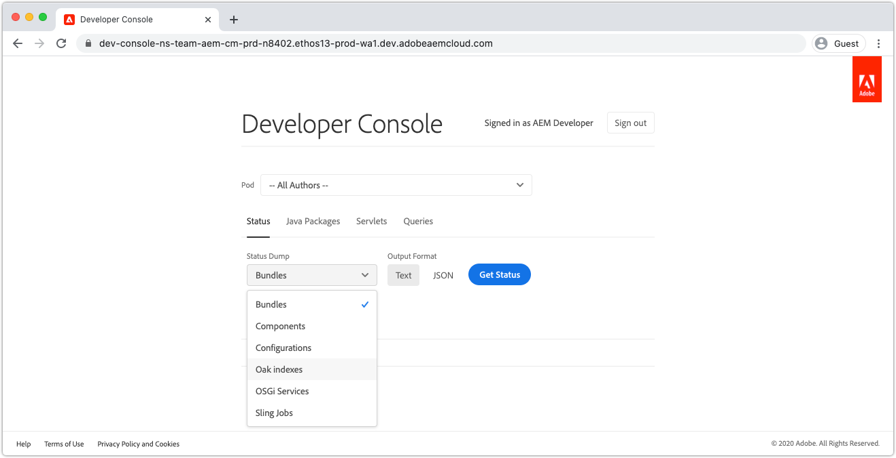

# Foutopsporing AEM as a Cloud Service met de ontwikkelaarsconsole

AEM as a Cloud Service verstrekt een Console van de Ontwikkelaar voor elk milieu dat diverse details van de lopende AEM dienst blootstelt die in het zuiveren nuttig zijn.

Elke AEM as a Cloud Service omgeving heeft een eigen ontwikkelaarsconsole.

## Navigeren naar Developer Console

Developer Console is per AEM as a Cloud Service omgeving toegankelijk via Cloud Manager.

1. Navigeren naar __[Cloud Manager](https://my.cloudmanager.adobe.com/)__
2. Open de __Programma__ die de AEM as a Cloud Service omgeving bevat voor het openen van Developer Console.
3. Zoek de __Omgeving__ en selecteert u de `...`.
4. Selecteren __Ontwerpconsole__ in de vervolgkeuzelijst.

## Toegang tot ontwikkelconsole

Voor toegang tot en gebruik van de Developer Console moeten de volgende machtigingen aan de Adobe ID van de ontwikkelaar worden gegeven via [Admin Console Adobe](https://adminconsole.adobe.com).

1. Zorg ervoor dat de Adobe Org die Cloud Manger en AEM as a Cloud Service producten heeft beïnvloed, actief is in de Adobe Org-switch.
1. De ontwikkelaar moet lid zijn van de [Product van Cloud Manager __Ontwikkelaar - Cloud Service__ Productprofiel](https://experienceleague.adobe.com/docs/experience-manager-cloud-service/content/onboarding/journey/assign-profiles-cloud-manager.html#assign-developer).
   + Als dit lidmaatschap niet bestaat, kan de ontwikkelaar zich niet aanmelden bij de Developer Console.
1. De ontwikkelaar moet lid zijn van de [__AEM__ of __AEM__ Productprofiel op AEM auteur en/of in Publicatie](https://experienceleague.adobe.com/docs/experience-manager-cloud-service/content/onboarding/journey/assign-profiles-aem.html#aem-product-profiles).
   + Als dit lidmaatschap niet bestaat, [status](#status) dumps wordt een time-out met een fout van 401 die niet is geautoriseerd.

### Toegang tot ontwikkelconsole voor probleemoplossing

#### 401 Ongeoorloofde fout bij de status van dumping

Als er een status met 401 niet-geautoriseerde fout wordt geplakt, betekent dit dat de gebruiker nog niet beschikt over de benodigde machtigingen in AEM as a Cloud Service of dat het gebruik van de aanmeldingstokens ongeldig is of is verlopen.

Het 401-probleem met onbevoegden oplossen:

1. Zorg ervoor dat uw gebruiker lid is van het juiste Adobe IMS-productprofiel (AEM beheerders of AEM gebruikers) voor de bijbehorende AEM as a Cloud Service productinstantie van de Developer Console.
   + Houd er rekening mee dat Developer Console toegang heeft tot 2 Adobe IMS-productinstanties; de AEM as a Cloud Service auteur- en publicatieproductinstanties, zodat de juiste productprofielen worden gebruikt, afhankelijk van de servicelaag die toegang via de Developer Console vereist.
1. Meld u aan bij de as a Cloud Service AEM (Auteur of Publiceren) en controleer of de gebruiker en de groepen correct zijn gesynchroniseerd in AEM.
   + De Console van de ontwikkelaar vereist dat uw gebruikersverslag in de overeenkomstige AEM de dienstrij voor het voor authentiek verklaart aan die de dienstrij wordt gecreeerd.
1. Wis uw browservercookies en de status van de toepassing (lokale opslag) en meld u opnieuw aan in de Developer Console. Op deze manier zorgt u ervoor dat het toegangstoken dat de Developer Console gebruikt, correct en niet verlopen is.

## Pod

AEM de as a Cloud Service auteur en de Publish diensten bestaan uit veelvoudige instanties respectievelijk om verkeersvariabiliteit en het rollen updates zonder onderbreking te behandelen. Deze gevallen worden pods genoemd. De selectie van de peul in de Console van de Ontwikkelaar bepaalt het werkingsgebied van gegevens die via de andere controles zullen blootstellen.

+ Een pod is een afzonderlijk exemplaar dat deel uitmaakt van een AEM (Auteur of Publiceren)
+ Pods zijn van voorbijgaande aard, wat betekent dat AEM as a Cloud Service ze naar behoefte maakt en vernietigt
+ Alleen pods die deel uitmaken van de bijbehorende AEM as a Cloud Service omgeving, worden weergegeven in de pod-switch van de ontwikkelaarsconsole.
+ U kunt onder aan de pod-schakeloptie de optie Pods selecteren op basis van het servicetype:
   + Alle auteurs
   + Alle uitgevers
   + Alle instanties

## Status

Status biedt opties voor het uitvoeren van specifieke AEM runtime status in tekst of JSON-uitvoer. De console van de Ontwikkelaar verstrekt gelijkaardige informatie zoals de lokale console van het Web van OSGi van SDK van de AEM lokale QuickStart, met het duidelijke verschil dat de Console van de Ontwikkelaar read-only is.

### Bundels

Bij bundels worden alle OSGi-bundels in AEM weergegeven. Deze functionaliteit is vergelijkbaar met [AEM lokale Quickstart-pakketten voor OSGi van SDK](http://localhost:4502/system/console/bundles) om `/system/console/bundles`.

Bundels helpen bij het opsporen van fouten door:

+ Een lijst maken van alle OSGi-bundels die worden geïmplementeerd als een service AEM
+ Een overzicht geven van de status van elke OSGi-bundel, ook als deze actief is of niet.
+ Het verstrekken van details in onopgeloste gebiedsdelen die OSGi- bundels veroorzaken om actief te worden

### Onderdelen

De componenten maken een lijst van alle componenten OSGi in AEM. Deze functionaliteit is vergelijkbaar met [AEM lokale QuickStart-componenten van OSGi van SDK](http://localhost:4502/system/console/components) om `/system/console/components`.

Componenten helpen bij het opsporen van fouten door:

+ Een lijst maken van alle OSGi-componenten die zijn geïmplementeerd voor AEM as a Cloud Service
+ Het verstrekken van de staat van elke component OSGi; met inbegrip van als zij actief of ontevreden zijn
+ Het verstrekken van details in ontevreden de dienstverwijzingen kan componenten OSGi veroorzaken om actief te worden
+ OSGi-eigenschappen vermelden en hun waarden koppelen aan de OSGi-component.
   + Hiermee worden de werkelijke waarden weergegeven die via [OSGi-omgevingsconfiguratievariabelen](https://experienceleague.adobe.com/docs/experience-manager-cloud-service/content/implementing/deploying/configuring-osgi.html#environment-specific-configuration-values).

### Configuraties

De configuraties maken een lijst van alle configuraties van de component OSGi (eigenschappen OSGi en waarden). Deze functionaliteit is vergelijkbaar met [AEM de lokale Quickstart van SDK&#39;s OSGi Configuration Manager](http://localhost:4502/system/console/configMgr) om `/system/console/configMgr`.

Configuraties helpen bij het opsporen van fouten door:

+ OSGi-eigenschappen en hun waarden per OSGi-component vermelden
   + Hierdoor worden GEEN werkelijke waarden weergegeven die via [OSGi-omgevingsconfiguratievariabelen](https://experienceleague.adobe.com/docs/experience-manager-cloud-service/content/implementing/deploying/configuring-osgi.html#environment-specific-configuration-values). Zie [Componenten](#components) voor de geïnjecteerde waarden.
+ Onjuist geconfigureerde eigenschappen zoeken en identificeren

### eiken indexen

De Indexen van de eiken verstrekken een stortplaats van de hieronder bepaalde knopen `/oak:index`. Onthoud dat hier geen samengevoegde indexen worden weergegeven, die optreden wanneer een AEM index wordt gewijzigd.

De Indexen van het eiken helpen in het zuiveren door:

+ Alle definities in de Oak Index die inzicht verschaffen in de manier waarop zoekopdrachten in AEM worden uitgevoerd. Houd in mening, dat gewijzigd aan AEM indexen niet hier wordt weerspiegeld. Deze weergave is alleen handig voor indexen die alleen worden geleverd door AEM of alleen worden geleverd door de aangepaste code.

### OSGi Services

De componenten maken een lijst van alle diensten OSGi. Deze functionaliteit is vergelijkbaar met [AEM lokale QuickStart-services (OSGi) van SDK](http://localhost:4502/system/console/services) om `/system/console/services`.

De hulp van OSGi Services in het zuiveren door:

+ Een lijst maken van alle OSGi diensten in AEM, samen met zijn leverende bundel OSGi, en alle bundels OSGi die het verbruiken

### Verkooptaken

De het verkopen Banen maakt een lijst van alle het Verschuiven Banen rijen. Deze functionaliteit is vergelijkbaar met [AEM lokale quickstart-taken van SDK](http://localhost:4502/system/console/slingevent) om `/system/console/slingevent`.

Het verkopen van Banen helpt in het zuiveren door:

+ Lijst met taakwachtrijen voor verkopen en hun configuraties
+ Het verstrekken van inzichten in het aantal actieve, een rij gevormde en verwerkte banen van het Verkopen, die voor het zuiveren van kwesties met Werkschema, Voorbijgaande Werkschema en ander werk nuttig is dat door het Verdelen van Banen in AEM wordt uitgevoerd.

## Java-pakketten

Met Java Packages kan worden gecontroleerd of een Java-pakket en -versie beschikbaar zijn voor gebruik in AEM as a Cloud Service. Deze functionaliteit is hetzelfde als [AEM lokale quickstart&#39;s Dependency Finder van SDK](http://localhost:4502/system/console/depfinder) om `/system/console/depfinder`.

Java Packages wordt gebruikt om problemen op te lossen met bundels die niet worden gestart vanwege onopgeloste import of onopgeloste klassen in scripts (HTML, JSP, enz.). Als Java Packages rapporteert dat er geen bundels zijn, wordt een Java-pakket geëxporteerd (of de versie komt niet overeen met de versie die is geïmporteerd door een OSGi-bundel):

+ Zorg ervoor dat de AEM API van uw project in overeenstemming is met de versie van de AEM van de omgeving (en werk indien mogelijk alles bij naar de meest recente versie).
+ Als de extra Geweven gebiedsdelen in het Maven project worden gebruikt
   + Bepaal of in plaats daarvan een alternatieve API kan worden gebruikt die wordt geleverd door de AEM-API-afhankelijkheid.
   + Als de extra afhankelijkheid wordt vereist, zorg ervoor het als bundel OSGi (eerder dan a gewone Jar) verstrekt en het in het codepakket van uw project wordt ingebed, (`ui.apps`), vergelijkbaar met de wijze waarop de kern-OSGi-bundel is ingesloten in de `ui.apps` pakket.

## Servlets

De servers worden gebruikt om inzicht te verstrekken over hoe AEM een URL aan een servlet of manuscript van Java (HTML, JSP) oplost die uiteindelijk het verzoek behandelt. Deze functionaliteit is hetzelfde als [AEM lokale quickstart-oplossing voor Sling Servlet van SDK](http://localhost:4502/system/console/servletresolver) om `/system/console/servletresolver`.

Servlets helpt bij het bepalen van foutopsporing:

+ Hoe een URL in zijn adresseerbare delen (middel, selecteur, uitbreiding) wordt gedecomposeerd.
+ Welk servlet of script een URL oplost, helpt bij het identificeren van onjuist gevormde URL&#39;s of onjuist geregistreerde servlets/scripts.

## Zoekopdrachten

Zoekopdrachten helpen u inzicht te verschaffen in wat en hoe zoekopdrachten worden uitgevoerd op AEM. Deze functionaliteit is hetzelfde als  [AEM lokale quickstart-tools van SDK > Query-prestaties](http://localhost:4502/libs/granite/operations/content/diagnosistools/queryPerformance.html) console.

Zoekopdrachten werken alleen wanneer een specifieke pod is geselecteerd, omdat deze de webconsole van Query Performance van die pod opent, waarbij de ontwikkelaar toegang moet hebben om zich aan te melden bij de AEM.

Zoekopdrachten helpen bij het opsporen van fouten door:

+ Verklarend hoe de vragen door Oak worden geïnterpreteerd, geanalyseerd en uitgevoerd. Dit is zeer belangrijk wanneer het volgen waarom een vraag langzaam is, en het begrijpen hoe het kan worden versneld.
+ De populairste query&#39;s die in AEM worden uitgevoerd, weergeven met de mogelijkheid ze te verklaren.
+ Het opzoeken van de langzaamste vragen die in AEM lopen, met de capaciteit om hen te verklaren.
