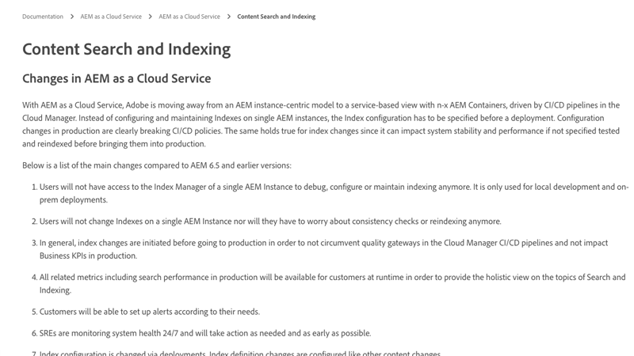

# Traversale waarschuwingen

>[!TIP]
>Bladwijzer maken van deze pagina voor toekomstig gebruik.

_Wat zijn traversale waarschuwingen?_

Traversale waarschuwingen zijn __aemfout__ loginstructies die aangeven dat query&#39;s die slecht worden uitgevoerd, worden uitgevoerd op de AEM-publicatieservice. Traversale waarschuwingen worden gewoonlijk op twee manieren AEM:

1. __Langzame query&#39;s__ die geen indexen gebruiken, wat in langzame reactietijden resulteert.
1. __Ontbrekende query&#39;s__, die een `RuntimeNodeTraversalException`, wat resulteert in een gebroken ervaring.

Door het ongecontroleerd laten van traversale waarschuwingen worden de AEM vertraagd en kunnen de ervaringen voor uw gebruikers worden verbroken.

## Hoe te om traversale waarschuwingen op te lossen

Het verminderen van traversale waarschuwingen kan worden aangepakt gebruikend drie eenvoudige stappen: analyseren, aanpassen en verifiëren. Verwacht verschillende versies van aanpassen en verifiëren voordat u de optimale aanpassingen aanbrengt.

<div class="columns is-multiline">

<!-- Analyze -->
<div class="column is-half-tablet is-half-desktop is-one-third-widescreen" aria-label="Analyze" tabindex="0">
   <div class="x-card">
       <div class="card-image">
           <figure class="image is-16by9">
               <a href="#analyze" title="Analyseren" tabindex="-1">
                   
               </a>
           </figure>
       </div>
       <div class="card-content is-padded-small">
           <div class="content">
                <p class="headline is-size-5 has-text-weight-bold">Het probleem analyseren</p>
               <p class="is-size-6">Identificeer en begrijp welke vragen overlopen.</p>
               <a href="#analyze" class="spectrum-Button spectrum-Button--outline spectrum-Button--primary spectrum-Button--sizeM">
                   <span class="spectrum-Button-label has-no-wrap has-text-weight-bold">Analyseren</span>
               </a>
           </div>
       </div>
   </div>
</div>

<!-- Adjust -->
<div class="column is-half-tablet is-half-desktop is-one-third-widescreen" aria-label="Adjust" tabindex="0">
   <div class="x-card">
       <div class="card-image">
           <figure class="image is-16by9">
               <a href="#adjust" title="Aanpassen" tabindex="-1">
                   
               </a>
           </figure>
       </div>
       <div class="card-content is-padded-small">
           <div class="content">
                <p class="headline is-size-5 has-text-weight-bold">De code of configuratie aanpassen</p>
               <p class="is-size-6">Werk vragen en indexen bij om vraagtraversals te vermijden.</p>
               <a href="#adjust" class="spectrum-Button spectrum-Button--outline spectrum-Button--primary spectrum-Button--sizeM">
                   <span class="spectrum-Button-label has-no-wrap has-text-weight-bold">Aanpassen</span>
               </a>
           </div>
       </div>
   </div>
</div>

<!-- Verify -->
<div class="column is-half-tablet is-half-desktop is-one-third-widescreen" aria-label="Verify" tabindex="0">
   <div class="x-card">
       <div class="card-image">
           <figure class="image is-16by9">
               <a href="#verify" title="Verifiëren" tabindex="-1">
                   
               </a>
           </figure>
       </div>
       <div class="card-content is-padded-small">
           <div class="content">
                <p class="headline is-size-5 has-text-weight-bold">De bewerkte aanpassingen controleren</p>                       
               <p class="is-size-6">Verifieer veranderingen in vragen en indexen verwijderen traversals.</p>
               <a href="#verify" class="spectrum-Button spectrum-Button--outline spectrum-Button--primary spectrum-Button--sizeM">
                   <span class="spectrum-Button-label has-no-wrap has-text-weight-bold">Verifiëren</span>
               </a>
           </div>
       </div>
   </div>
</div>

</div>

## 1. Analyseren{#analyze}

Bepaal eerst welke AEM-publicatieservices doorlopende waarschuwingen tonen. Dit doet u vanuit Cloud Manager: [Publicatieservices downloaden `aemerror` logs](https://experienceleague.adobe.com/docs/experience-manager-learn/cloud-service/debugging/debugging-aem-as-a-cloud-service/logs.html#cloud-manager){target=&quot;_blank&quot;} uit alle omgevingen (Dev, Stage en Production) voor het verleden __drie dagen__.


Open de logbestanden en zoek naar de Java™-klasse `org.apache.jackrabbit.oak.plugins.index.Cursors$TraversingCursor`. Het logboek met traversal waarschuwingen bevat een reeks instructies die er ongeveer als volgt uitzien:

```log
24.05.2022 14:18:46.146 [cm-p123-e456-aem-author-9876-edcba] *WARN* [192.150.10.214 [1653401908419] GET /content/wknd/us/en/example.html HTTP/1.1] 
org.apache.jackrabbit.oak.plugins.index.Cursors$TraversingCursor Traversed 5000 nodes with filter 
Filter(query=select [jcr:path], [jcr:score], * from [nt:base] as a where [xyz] = 'abc' and isdescendantnode(a, '/content') 
/* xpath: /jcr:root/content//element(*, nt:base)[(@xyz = 'abc')] */, path=/content//*, property=[xyz=[abc]]) 
called by apps.wknd.components.search.example__002e__jsp._jspService; 
consider creating an index or changing the query
```

Afhankelijk van de context van de uitvoering van de query, kunnen de logboekverklaringen nuttige informatie over de schepper van de vraag bevatten:

+ HTTP-aanvraag-URL gekoppeld aan queryuitvoering

   + Voorbeeld: `GET /content/wknd/us/en/example.html HTTP/1.1`

+ Zoeksyntaxis voor ongewenste gegevens

   + Voorbeeld: `select [jcr:path], [jcr:score], * from [nt:base] as a where [xyz] = 'abc' and isdescendantnode(a, '/content')`

+ XPath-query

   + Voorbeeld: `/jcr:root/content//element(*, nt:base)[(@xyz = 'abc')] */, path=/content//*, property=[xyz=[abc]])`

+ Code die de query uitvoert

   + Voorbeeld:  `apps.wknd.components.search.example__002e__jsp._jspService` → `/apps/wknd/components/search/example.html`

__Ontbrekende query&#39;s__ worden gevolgd door een `RuntimeNodeTraversalException` instructie, vergelijkbaar met:

```log
24.05.2022 14:18:47.240 [cm-p123-e456-aem-author-9876-edcba] *WARN* [192.150.10.214 [1653401908419] GET /content/wknd/us/en/example.html HTTP/1.1] 
org.apache.jackrabbit.oak.query.FilterIterators The query read or traversed more than 100000 nodes.
org.apache.jackrabbit.oak.query.RuntimeNodeTraversalException: 
    The query read or traversed more than 100000 nodes. To avoid affecting other tasks, processing was stopped.
    ...
```

## 2. Aanpassen{#adjust}

Zodra de beledigende vragen en hun het aanhalen code worden ontdekt, moeten aanpassingen worden aangebracht. Er kunnen twee soorten aanpassingen worden aangebracht om de doorlopende waarschuwingen te beperken:

### De query aanpassen

__De query wijzigen__ om nieuwe vraagbeperkingen toe te voegen die aan bestaande indexbeperkingen oplossen. Wijzig indien mogelijk de query liever in indexen.

+ [Meer informatie over het afstemmen van queryprestaties](https://experienceleague.adobe.com/docs/experience-manager-65/developing/bestpractices/troubleshooting-slow-queries.html#query-performance-tuning){target=&quot;_blank&quot;}

### De index aanpassen

__Een AEM-index wijzigen (of maken)__ zodat de bestaande vraagbeperkingen voor de indexupdates oplosbaar zijn.

+ [Leer hoe u bestaande indexen kunt aanpassen](https://experienceleague.adobe.com/docs/experience-manager-65/developing/bestpractices/troubleshooting-slow-queries.html#query-performance-tuning){target=&quot;_blank&quot;}
+ [Leer hoe u indexen maakt](https://experienceleague.adobe.com/docs/experience-manager-65/developing/bestpractices/troubleshooting-slow-queries.html#create-a-new-index){target=&quot;_blank&quot;}

## 3. Verifiëren{#verify}

Aanpassingen aan de query&#39;s, indexen of beide moeten worden geverifieerd om ervoor te zorgen dat ze de doorlopende waarschuwingen verminderen.


Alleen [aanpassingen van de query](#adjust-the-query) worden gemaakt, kan de query rechtstreeks worden getest op AEM as a Cloud Service via de [Query uitvoeren](https://experienceleague.adobe.com/docs/experience-manager-learn/cloud-service/debugging/debugging-aem-as-a-cloud-service/developer-console.html#queries){target=&quot;_blank&quot;}. Verklaar de looppas van de Vraag tegen de dienst van de Auteur AEM, echter aangezien de indexdefinities het zelfde over de Auteur en de Publish diensten zijn, volstaat het bevestigen van vragen tegen de dienst van de Auteur AEM.

Indien [aanpassingen aan de index](#adjust-the-index) worden gemaakt, moet de index worden opgesteld aan AEM as a Cloud Service. Als de indexaanpassingen zijn geïmplementeerd, worden de [Query uitvoeren](https://experienceleague.adobe.com/docs/experience-manager-learn/cloud-service/debugging/debugging-aem-as-a-cloud-service/developer-console.html#queries){target=&quot;_blank&quot;} kan worden gebruikt om te worden uitgevoerd en de query verder af te stemmen.

Uiteindelijk, worden alle veranderingen (vraag en code) geëngageerd aan Git en aan AEM as a Cloud Service opgesteld gebruikend de Manager van de Wolk. Als u de code eenmaal hebt geïmplementeerd, test u de aan de oorspronkelijke traversale waarschuwingen gekoppelde codepaden opnieuw. Controleer vervolgens of de traversale waarschuwingen niet meer worden weergegeven in het dialoogvenster `aemerror` log.

## Overige middelen

Bekijk deze andere nuttige bronnen voor het begrijpen van AEM indexen, zoekopdrachten en waarschuwingen voor het doorlopen.

<div class="columns is-multiline">

<!-- Cloud 5 - Search &amp; Indexing -->
<div class="column is-half-tablet is-half-desktop is-one-third-widescreen" aria-label="Cloud 5 - Search &amp; Indexing" tabindex="0">
   <div class="card">
       <div class="card-image">
           <figure class="image is-16by9">
               <a href="https://experienceleague.adobe.com/docs/experience-manager-learn/cloud-service/cloud-5/cloud5-aem-search-and-indexing.html" title="Wolk 5 - Zoeken en indexeren" tabindex="-1"></a>
           </figure>
       </div>
       <div class="card-content is-padded-small">
           <div class="content">
               <p class="headline is-size-6 has-text-weight-bold"><a href="https://experienceleague.adobe.com/docs/experience-manager-learn/cloud-service/cloud-5/cloud5-aem-search-and-indexing.html" title="Wolk 5 - Zoeken en indexeren">Wolk 5 - Zoeken en indexeren</a></p>
               <p class="is-size-6">Het team van Cloud 5 laat zien wat de indelingen en uitgangen zijn van de zoekopdracht en indexering op AEM as a Cloud Service.</p>
               <a href="https://experienceleague.adobe.com/docs/experience-manager-learn/cloud-service/cloud-5/cloud5-aem-search-and-indexing.html" class="spectrum-Button spectrum-Button--outline spectrum-Button--primary spectrum-Button--sizeM">
                   <span class="spectrum-Button-label has-no-wrap has-text-weight-bold">Weergave</span>
               </a>
           </div>
       </div>
   </div>
</div>

<!-- Content Search and Indexing -->
<div class="column is-half-tablet is-half-desktop is-one-third-widescreen" aria-label="Content Search and Indexing
" tabindex="0">
   <div class="card">
       <div class="card-image">
           <figure class="image is-16by9">
               <a href="https://experienceleague.adobe.com/docs/experience-manager-cloud-service/content/operations/indexing.html" title="Inhoud zoeken en indexeren" tabindex="-1">
                   
               </a>
           </figure>
       </div>
       <div class="card-content is-padded-small">
           <div class="content">
               <p class="headline is-size-6 has-text-weight-bold"><a href="https://experienceleague.adobe.com/docs/experience-manager-cloud-service/content/operations/indexing.html" title="Inhoud zoeken en indexeren">Documentatie voor zoeken en indexeren van inhoud</a></p>
               <p class="is-size-6">Leer hoe u indexen maakt en beheert in AEM as a Cloud Service.</p>
               <a href="https://experienceleague.adobe.com/docs/experience-manager-cloud-service/content/operations/indexing.html" class="spectrum-Button spectrum-Button--outline spectrum-Button--primary spectrum-Button--sizeM">
                   <span class="spectrum-Button-label has-no-wrap has-text-weight-bold">Weergave</span>
               </a>
           </div>
       </div>
   </div>
</div>

<!-- Modernizing your Oak indexes -->
<div class="column is-half-tablet is-half-desktop is-one-third-widescreen" aria-label="Modernizing your Oak indexes" tabindex="0">
   <div class="card">
       <div class="card-image">
           <figure class="image is-16by9">
               <a href="https://experienceleague.adobe.com/docs/experience-manager-learn/cloud-service/migration/moving-to-aem-as-a-cloud-service/search-and-indexing.html" title="Uw eik-indexen moderniseren" tabindex="-1">
                   
               </a>
           </figure>
       </div>
       <div class="card-content is-padded-small">
           <div class="content">
               <p class="headline is-size-6 has-text-weight-bold"><a href="https://experienceleague.adobe.com/docs/experience-manager-learn/cloud-service/migration/moving-to-aem-as-a-cloud-service/search-and-indexing.html" title="Uw eik-indexen moderniseren">Uw eik-indexen moderniseren</a></p>
               <p class="is-size-6">Leer hoe u AEM 6 eik-indexdefinities omzet om deze as a Cloud Service compatibel te AEM en hoe u de indexen kunt bijhouden.</p>
               <a href="https://experienceleague.adobe.com/docs/experience-manager-learn/cloud-service/migration/moving-to-aem-as-a-cloud-service/search-and-indexing.html" class="spectrum-Button spectrum-Button--outline spectrum-Button--primary spectrum-Button--sizeM">
                   <span class="spectrum-Button-label has-no-wrap has-text-weight-bold">Weergave</span>
               </a>
           </div>
       </div>
   </div>
</div>

<!-- Index definition documentation -->
<div class="column is-half-tablet is-half-desktop is-one-third-widescreen" aria-label="Index definition documentation" tabindex="0">
   <div class="card">
       <div class="card-image">
           <figure class="image is-16by9">
               <a href="https://jackrabbit.apache.org/oak/docs/query/lucene.html" title="Documentatie indexdefinitie" tabindex="-1">
                   
               </a>
           </figure>
       </div>
       <div class="card-content is-padded-small">
           <div class="content">
               <p class="headline is-size-6 has-text-weight-bold"><a href="https://jackrabbit.apache.org/oak/docs/query/lucene.html" title="Documentatie indexdefinitie">Documentatie van de Lucene-index</a></p>
               <p class="has-ellipsis is-size-6">De Apache Oak Jackrabbit Lucene-indexverwijzing die alle ondersteunde Lucene-indexconfiguraties documenteert.</p>
               <a href="https://jackrabbit.apache.org/oak/docs/query/lucene.html" class="spectrum-Button spectrum-Button--outline spectrum-Button--primary spectrum-Button--sizeM">
                   <span class="spectrum-Button-label has-no-wrap has-text-weight-bold">Weergave</span>
               </a>
           </div>
       </div>
   </div>
</div>

</div>
