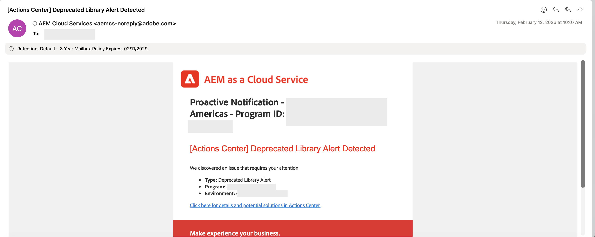
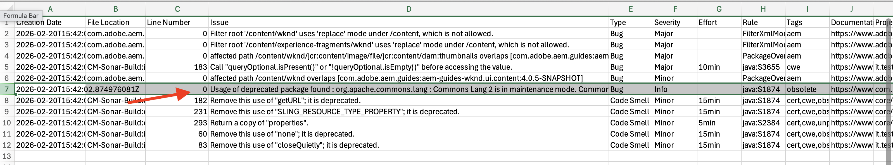

# Verouderde API&#39;s zoeken en verwijderen in AEM as a Cloud Service

Leer hoe u verouderde API&#39;s kunt zoeken en verwijderen in AEM as a Cloud Service.

## Overzicht

Om ervoor te zorgen dat uw toepassing veilig en uitvoerbaar is en dat u code kunt blijven implementeren met behulp van Cloud Manager-pijpleidingen, verwijdert u verouderde API&#39;s uit uw project.

In dit leerprogramma, leert u hoe te om verouderde APIs in uw milieu van AEM as a Cloud Service te vinden en te verwijderen gebruikend de [&#x200B; Analysator Maven Insteekmodule van AEM &#x200B;](https://github.com/adobe/aemanalyser-maven-plugin/blob/main/aemanalyser-maven-plugin/README.md).

## Meldingen over verouderde API&#39;s

Het verouderde gebruik van APIs en de aandacht om het te bevestigen wordt regelmatig gemeld, herzien sommige voorbeelden.

- AEM as a Cloud Service **Centrum van Acties** brengt u over _afgekeurde APIs_ in uw project op de hoogte.
  

- De **Scannen van de Code** stap in de pijpleidingsrapporten van Cloud Manager verouderde APIs in uw project, herzie het **rapport van de Details van de Download** om de volledige lijst van verouderde APIs te zien.
  

- De **stap van de Voorbereiding van het Artefact in de pijpleidingsrapporten van Cloud Manager verouderde APIs in uw project,** Logboek van de Download **en kijkt** waarschuwingen van de Analysator _in het logboekdossier._

  ```
  2026-02-20 15:40:48.376 Analyser warnings have been found 
  2026-02-20 15:40:48.376 The analyser found the following warnings for author and publish : 
  2026-02-20 15:40:48.376 [region-deprecated-api] com.adobe.aem.guides:aem-guides-wknd.core:4.0.5-SNAPSHOT: Usage of deprecated package found : org.apache.commons.lang : Commons Lang 2 is in maintenance mode. Commons Lang 3 should be used instead. Deprecated since 2021-04-30 For removal : 2021-12-31 (com.adobe.aem.guides:aem-guides-wknd.all:4.0.5-SNAPSHOT)
  2026-02-20 15:40:56.458 Convert Merge Analyse finished.
  ```


## Vervangen API&#39;s zoeken

Voer de volgende stappen uit om verouderde API&#39;s te zoeken in uw AEM as a Cloud Service-project.

1. **Gebruik de recentste Insteekmodule van de Analysator van AEM Gemaakt**

   In uw project van AEM, gebruik de recentste versie van de [&#x200B; Gebruikte Insteekmodule van de Analysator van AEM &#x200B;](https://github.com/adobe/aemanalyser-maven-plugin/blob/main/aemanalyser-maven-plugin/README.md).

   - In de hoofdmap `pom.xml` wordt de versie van de plug-in meestal gedeclareerd. Vergelijk uw versie met de recentste [&#x200B; vrijgegeven versie &#x200B;](https://mvnrepository.com/artifact/com.adobe.aem/aemanalyser-maven-plugin).

     ```xml
     ...
     <aemanalyser.version>1.6.16</aemanalyser.version> <!-- Latest released version as of 20-Feb-2026 -->
     ...
     <!-- AEM Analyser Plugin -->
     <plugin>
         <groupId>com.adobe.aem</groupId>
         <artifactId>aemanalyser-maven-plugin</artifactId>
         <version>${aemanalyser.version}</version>
         <extensions>true</extensions>
     </plugin>
     ...
     ```

   - De insteekmodule controleert op de nieuwste beschikbare AEM SDK. Gebruik de nieuwste AEM SDK-versie in het `pom.xml` -bestand van uw project. Het helpt om verouderde APIs als waarschuwingen van winde te behandelen.

     ```xml
     ...
     <aem.sdk.api>2026.2.24464.20260214T050318Z-260100</aem.sdk.api> <!-- Latest available AEM SDK version as of 20-Feb-2026 -->
     ...
     ```

   - Controleer of de plug-in van de module `all` in de `verify` -fase wordt uitgevoerd.

     ```xml
     ...
     <build>
         <plugins>
             ...
             <plugin>
                 <groupId>com.adobe.aem</groupId>
                 <artifactId>aemanalyser-maven-plugin</artifactId>
                 <extensions>true</extensions>
                 <executions>
                     <execution>
                         <id>analyse-project</id>
                         <phase>verify</phase>
                         <goals>
                             <goal>project-analyse</goal>
                         </goals>
                     </execution>
                 </executions>
             </plugin>
             ...
         </plugins>
     </build>
     ...
     ```

2. **stel een bouwstijl in werking en controleer waarschuwingen**

   Wanneer u `mvn clean install` in werking stelt, verouderde de analysator APIs als **[WAARSCHUWING]** berichten in de output. Bijvoorbeeld:

   ```shell
   ...
   [WARNING] The analyser found the following warnings for author and publish :
   [WARNING] [region-deprecated-api] com.adobe.aem.guides:aem-guides-wknd.core:4.0.5-SNAPSHOT: Usage of deprecated package found : org.apache.commons.lang : Commons Lang 2 is in maintenance mode. Commons Lang 3 should be used instead. Deprecated since 2021-04-30 For removal : 2021-12-31 (com.adobe.aem.guides:aem-guides-wknd.all:4.0.5-SNAPSHOT)
   ...
   ```

   Het is gemakkelijk om deze berichten over te zien wanneer het concentreren zich op bouwstijlsucces of mislukking.

3. **krijg een duidelijke lijst van afgekeurde APIs**

   Deze stap bevat ook dezelfde informatie. Nochtans, stel de `verify` fase op de `all` module in werking om alle **[WAARSCHUWENDE]** berichten op één plaats te zien. Bijvoorbeeld:

   ```shell
   $ mvn clean verify -pl all
   ```

   **[WAARSCHUWING]** berichten in de bouwstijloutput maakt een lijst van afgekeurde APIs in uw project.

## Verouderde API&#39;s verwijderen

De Analysator van AEM rapporteert **wat** wordt afgekeurd en verstrekt de **aanbeveling** op hoe te om het te bevestigen. Gebruik echter de onderstaande tabel om de juiste actie te kiezen en volg de gekoppelde documentatie wanneer u meer details nodig hebt.

### Verouderde API-herstelstrategie

| Waarschuwingstype Analyzer | Wat het aangeeft | Aanbevolen actie | Referentie |
| --------------------- | ----------------- | ------------------ | --------- |
| Verouderde AEM API | API moet uit AEM as a Cloud Service worden verwijderd | Gebruik vervangen door de ondersteunde openbare API | [&#x200B; API de Begeleiding van de Verwijdering &#x200B;](https://experienceleague.adobe.com/nl/docs/experience-manager-cloud-service/content/release-notes/deprecated-removed-features#api-removal-guidance) |
| Vervangen AEM-pakket of -klasse | Pakket of klasse wordt niet meer ondersteund | Refactorcode om het aanbevolen alternatief te gebruiken | [&#x200B; Vervangen APIs &#x200B;](https://experienceleague.adobe.com/nl/docs/experience-manager-cloud-service/content/release-notes/deprecated-removed-features#aem-apis) |
| Vervangen bibliotheek van derden | Bibliotheek wordt niet ondersteund in toekomstige SDK&#39;s | Verbetering van het gebruik van afhankelijkheid en refactor | [&#x200B; Algemene Richtlijnen &#x200B;](https://experienceleague.adobe.com/nl/docs/experience-manager-cloud-service/content/release-notes/deprecated-removed-features#api-removal-guidance) |
| Vervangen Sling/OSGi-patronen | Oudere annotaties of API&#39;s gedetecteerd | Migreren naar moderne Sling- en OSGi-API&#39;s | [&#x200B; Verwijdering van de Patronen Sling/OSGi &#x200B;](https://experienceleague.adobe.com/nl/docs/experience-manager-cloud-service/content/release-notes/deprecated-removed-features#api-removal-guidance) |
| Geplande verwijdering (datum in de toekomst) | API werkt nog wel, maar verwijdering wordt later afgedwongen | Opschonen van plannen vóór handhaving van de pijpleiding | [&#x200B; de nota&#39;s van de Versie &#x200B;](https://experienceleague.adobe.com/nl/docs/experience-manager-cloud-service/content/release-notes/home) |

### Praktische aanwijzingen

- Behandel analyseprogrammawaarschuwingen als **toekomstige pijpleidingsmislukkingen**, niet facultatieve berichten.
- Vervangen APIs plaatselijk gebruikend **recentste AEM SDK** verhelpen.
- Houd de uitvoer van de analysator schoon om problemen tijdens toekomstige AEM-upgrades te voorkomen.

Het bevestigen afgekeurde APIs houdt vroeg uw project **verbetering-veilig en plaatsing-klaar**.

## Aanvullende bronnen

- [&#x200B; AEM Analyser Maven Insteekmodule &#x200B;](https://github.com/adobe/aemanalyser-maven-plugin/blob/main/aemanalyser-maven-plugin/README.md)
- [&#x200B; Vervangen en Verwijderde Eigenschappen en APIs &#x200B;](https://experienceleague.adobe.com/nl/docs/experience-manager-cloud-service/content/release-notes/deprecated-removed-features#api-removal-guidance)
