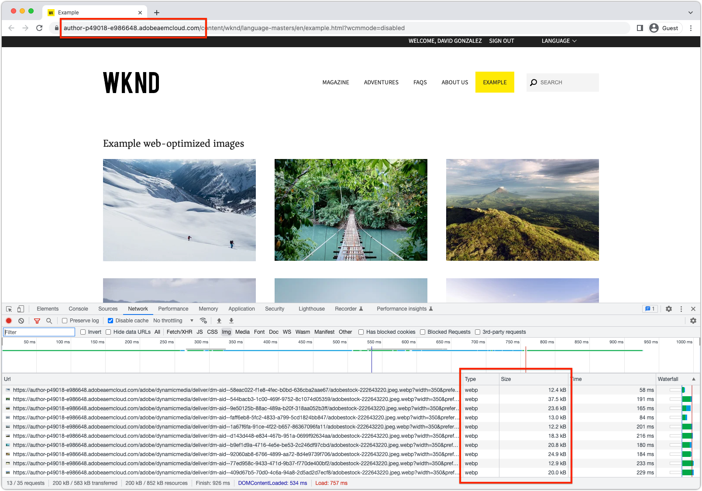

# Java™ API&#39;s voor voor webgeoptimaliseerde afbeeldingslevering

Leer hoe u voor het web geoptimaliseerde Java™ API&#39;s voor het leveren van images kunt gebruiken voor het ontwikkelen van uiterst krachtige webervaringen.

AEM as a Cloud Service steunt [ Web-geoptimaliseerde beeldlevering ](https://experienceleague.adobe.com/docs/experience-manager-core-components/using/developing/web-optimized-image-delivery.html) die automatisch geoptimaliseerde vertoningen van het beeldWeb van activa produceert. Voor webgeoptimaliseerde afbeeldingslevering kunt u drie manieren gebruiken:

1. [ de Componenten van WCM van de Kern van het Gebruik AEM ](https://experienceleague.adobe.com/docs/experience-manager-core-components/using/introduction.html)
2. Creeer douanecomponent die [ de het beeldcomponent van de Component van de Kern van AEM WCM ](https://experienceleague.adobe.com/docs/experience-manager-learn/getting-started-wknd-tutorial-develop/project-archetype/custom-component.html#tackling-the-image-problem) uitbreidt
3. Maak een aangepaste component die de AssetDelivery Java™-API gebruikt om voor het web geoptimaliseerde afbeeldings-URL&#39;s te genereren.

In dit artikel wordt het gebruik van voor het web geoptimaliseerde Java™-API&#39;s voor afbeeldingen in een aangepaste component besproken, op een manier die het mogelijk maakt code te gebruiken op zowel AEM as a Cloud Service als de AEM SDK.

## Java™ API&#39;s

[ AssetDelivery API ](https://javadoc.io/doc/com.adobe.aem/aem-sdk-api/latest/com/adobe/cq/wcm/spi/AssetDelivery.html) is de dienst OSGi die Web-geoptimaliseerde levering URLs voor beeldactiva produceert. `AssetDelivery.getDeliveryURL(...)` toegestane opties worden [ hier gedocumenteerd ](https://experienceleague.adobe.com/docs/experience-manager-core-components/using/developing/web-optimized-image-delivery.html#can-i-use-web-optimized-image-delivery-with-my-own-component%3F).

Aan de `AssetDelivery` OSGi-service wordt alleen voldaan wanneer deze wordt uitgevoerd in AEM as a Cloud Service. In AEM SDK verwijst dit naar het `AssetDelivery` retourneren van de OSGi-service `null` . U kunt het beste de voor het web geoptimaliseerde URL gebruiken als u op AEM as a Cloud Service werkt en een fallback-afbeeldings-URL gebruiken op de AEM SDK. De westratie van het element is doorgaans voldoende fallback.


### API-gebruik in OSGi-service

Markeer de `AssetDelivery` verwijzing als facultatief in de diensten van douane OSGi zodat blijft de douane OSGi Dienst beschikbaar op AEM SDK.

```java
import com.adobe.cq.wcm.spi.AssetDelivery;
...
@Reference(cardinality = ReferenceCardinality.OPTIONAL)
private volatile AssetDelivery assetDelivery;
```

### API-gebruik in Sling Model

Markeer de `AssetDelivery` verwijzing als facultatief in douane het Verkopen Modellen zodat blijft het aangepaste Verkopen Model beschikbaar op AEM SDK.

```java
import com.adobe.cq.wcm.spi.AssetDelivery;
...
@OSGiService(injectionStrategy = InjectionStrategy.OPTIONAL)
private AssetDelivery assetDelivery;
```

### Voorwaardelijk gebruik van API

Retourneer voorwaardelijk de webgeoptimaliseerde afbeeldings-URL of fallback-URL op basis van de beschikbaarheid van de `AssetDelivery` OSGi-service. Bij voorwaardelijk gebruik kan de code functioneren wanneer deze de code op de AEM SDK uitvoert.

```java
if (assetDelivery != null ) {
    // When running on AEM as a Cloud Service use the real web-optimized image URL.
    return assetDelivery.getDeliveryURL(...);
} else {
    // When running on AEM SDK, use some fallback image so the experience does not break.
    // What the fallback is up to you! 
    return getFallbackURL(...);
}
```

## Voorbeeldcode

Met de volgende code wordt een voorbeeldcomponent gemaakt die een lijst met afbeeldingselementen weergeeft met URL&#39;s voor webgeoptimaliseerde afbeeldingen.

Wanneer de code op AEM as a Cloud Service wordt uitgevoerd, worden de webgeoptimaliseerde webafbeeldingsuitvoeringen gebruikt in de aangepaste component.



_AEM as a Cloud Service steunt AssetDelivery API, zodat wordt de Web-geoptimaliseerde webp vertoning gebruikt_

Wanneer de code op AEM SDK wordt uitgevoerd, worden de minder optimale statische webrengingen gebruikt, die voor de component toestaan om tijdens lokale ontwikkeling te functioneren.


_AEM SDK steunt geen AssetDelivery API, zodat wordt de reserve statische Webvertoning (PNG of JPEG) gebruikt_

De implementatie bestaat uit drie logische onderdelen:

1. De `WebOptimizedImage` OSGi-service fungeert als een &quot;slimme proxy&quot; voor de door AEM geleverde `AssetDelivery` OSGi-service die zowel in AEM as a Cloud Service als in AEM SDK wordt uitgevoerd.
2. Het `ExampleWebOptimizedImages` Sling-model biedt bedrijfslogica voor het verzamelen van de lijst met afbeeldingselementen en hun voor het web geoptimaliseerde URL&#39;s die moeten worden weergegeven.
3. De `example-web-optimized-images` AEM-component implementeert de HTML om een lijst met voor het web geoptimaliseerde afbeeldingen weer te geven.

De voorbeeldcode hieronder kan in uw codebasis worden gekopieerd, en zonodig worden bijgewerkt.

### OSGi-service

De `WebOptimizedImage` dienst OSGi is verdeeld in een adresseerbare openbare interface (`WebOptimizedImage`), en een interne implementatie (`WebOptimizedImageImpl`). De `WebOptimizedImageImpl` retourneert een voor het web geoptimaliseerde afbeeldings-URL wanneer deze wordt uitgevoerd op AEM as a Cloud Service, en een statische URL voor webuitvoering op de AEM SDK, zodat de component functioneel blijft op de AEM SDK.

#### Interface

De interface bepaalt het contract van de Dienst OSGi dat andere code zoals het Verdelen Modellen met kan in wisselwerking staan.

```java
package com.adobe.aem.guides.wknd.core.images;

import org.apache.sling.api.resource.ResourceResolver;
import org.osgi.annotation.versioning.ProviderType;

import java.util.Map;

/**
 * OSGi Service that acts as a facade for the AssetDelivery API, such that a fallback can be automatically served on the AEM SDK.
 *
 * This service can be extended to provide additional functionality, such as srcsets, etc.
 */
@ProviderType
public interface WebOptimizedImage {
    /**
     * Returns the Web Optimized Image URL.
     * @param resourceResolver the user's resource resolver
     * @param path the path to the asset
     * @param options the options to pass to the AssetDelivery API
     * @return the Web Optimized Image URL
     */
    String getDeliveryURL(ResourceResolver resourceResolver, String path, Map<String, Object> options);
}
```

#### Implementatie

De OSGi Service-implementatie bevat een optionele verwijzing naar de `AssetDelivery` OSGi-service van AEM en een fallback-logica voor het selecteren van een geschikte afbeeldings-URL wanneer `AssetDelivery` zich `null` op de AEM SDK bevindt. De fallback-logica kan op basis van vereisten worden bijgewerkt.

```java
package com.adobe.aem.guides.wknd.core.images.impl;

import com.adobe.aem.guides.wknd.core.images.WebOptimizedImage;
import com.adobe.cq.wcm.spi.AssetDelivery;
import com.day.cq.dam.api.Asset;
import com.day.cq.dam.api.Rendition;
import com.day.cq.dam.api.RenditionPicker;
import com.day.cq.dam.commons.util.DamUtil;
import org.apache.commons.lang3.StringUtils;
import org.apache.sling.api.resource.Resource;
import org.apache.sling.api.resource.ResourceResolver;
import org.osgi.service.component.annotations.Component;
import org.osgi.service.component.annotations.Reference;
import org.osgi.service.component.annotations.ReferenceCardinality;

import java.util.Map;
@Component
public class WebOptimizedImageImpl implements WebOptimizedImage {
    private static final String DEFAULT_FORMAT = "webp";
    @Reference(cardinality = ReferenceCardinality.OPTIONAL)
    private volatile AssetDelivery assetDelivery;

    /**
     * Returns the Web Optimized Image URL.
     * @param resourceResolver the user's resource resolver
     * @param path the path to the asset
     * @param options the options to pass to the AssetDelivery API
     * @return the Web Optimized Image URL
     */
    @Override
    public String getDeliveryURL(ResourceResolver resourceResolver, String path, Map<String, Object> options) {
        if (assetDelivery != null) {
            return getWebOptimizedUrl(resourceResolver, path, options);
        } else {
            return getFallbackUrl(resourceResolver, path);
        }
    }
    /**
     * Uses the AssetDelivery API to get the Web Optimized Image URL.
     * @param resourceResolver the user's resource resolver
     * @param path the path to the asset
     * @param options the options to pass to the AssetDelivery API
     * @return the Web Optimized Image URL
     */
    private String getWebOptimizedUrl(ResourceResolver resourceResolver, String path, Map<String, Object> options) {
        Resource resource = resourceResolver.getResource(path);
        Asset asset = DamUtil.resolveToAsset(resource);

        // These 3 options are required for the AssetDelivery API to work, else it will return null
        options.put("path", asset.getPath());
        options.put("format", StringUtils.defaultString((String) options.get("format"), DEFAULT_FORMAT));
        options.put("seoname", StringUtils.defaultString((String) options.get("seoname"), asset.getName()));

        // The resource only provides the security context into AEM so the asset's UUID can be looked up for the Web Optimized Image URL
        return assetDelivery.getDeliveryURL(resource, options);
    }

    /**
     * Fallback to the static web rendition if the AssetDelivery API is not available, meaning the code is running on the AEM SDK.
     * @param resourceResolver the user's resource resolver
     * @param path the path to the asset
     * @return the path to the web rendition
     */
    private String getFallbackUrl(ResourceResolver resourceResolver, String path) {
        Resource resource = resourceResolver.getResource(path);
        Asset asset = DamUtil.resolveToAsset(resource);

        return asset.getRendition(WebRenditionPicker).getPath();
    }

    /**
     * Picks the web rendition of the asset.
     */
    private static final RenditionPicker WebRenditionPicker = new RenditionPicker() {
        @Override
        public Rendition getRendition(Asset asset) {
            return asset.getRenditions().stream().filter(rendition -> StringUtils.startsWith(rendition.getName(), "cq5dam.web.")).findFirst().orElse(asset.getOriginal());
        }
    };
}
```

### Verkoopmodel

Het `ExampleWebOptimizedImages` het Verdelen Model is verdeeld in een adresseerbare openbare interface (`ExampleWebOptimizedImages`), en een interne implementatie (`ExampleWebOptimizedImagesImpl`);

Het `ExampleWebOptimizedImagesImpl` Sling Model verzamelt de lijst met afbeeldingselementen die moeten worden weergegeven en roept de aangepaste `WebOptimizedImage` OSGi Service aan om de voor het web geoptimaliseerde afbeeldings-URL te verkrijgen. Aangezien dit Sling-model een AEM-component vertegenwoordigt, heeft het de gebruikelijke methoden zoals `isEmpty()` , `getId()` en `getData()` , maar deze methoden zijn niet rechtstreeks relevant voor het gebruik van webgeoptimaliseerde afbeeldingen.

#### Interface

De interface definieert het Sling Model-contract waarmee andere code, zoals HTML, kan communiceren.

```java
package com.adobe.aem.guides.wknd.core.models;

import com.adobe.cq.wcm.core.components.models.datalayer.ComponentData;
import com.fasterxml.jackson.annotation.JsonProperty;

import java.util.List;

public interface ExampleWebOptimizedImages {

    /**
     * @return a list of web optimized images for the component to display. Each item in the list has necessary information to render the image.
     */
    List getImages();

    /**
     * @return true if this component has no images to display.
     */
    boolean isEmpty();

    /**
     * @return String representing the unique identifier of the ExampleWebOptimizedImages component on a page
     */
    String getId();

    /**
     * @return JSON data to populate the data layer
     */
    @JsonProperty("dataLayer")
    default ComponentData getData() {
        return null;
    }

    /**
     * Describes a web optimized image.
     */
    interface Img {
        /**
         * @return the URL to the web optimized rendition of the image.
         */
        String getSrc();

        /**
         * @return the alt text of the web optimized image.
         */
        String getAlt();

        /**
         * @return the height of the web optimized image.
         */
        String getHeight();
        /**
         * @return the width of the web optimized image.
         */
        String getWidth();
    }
}
```

#### Implementatie

In het Sling-model wordt de aangepaste `WebOptimizeImage` OSGi-service gebruikt voor het verzamelen van voor het web geoptimaliseerde afbeeldings-URL&#39;s voor de afbeeldingselementen die in de component worden weergegeven.

In dit voorbeeld wordt een eenvoudige query gebruikt om afbeeldingselementen te verzamelen.

```java
package com.adobe.aem.guides.wknd.core.models.impl;

import com.adobe.aem.guides.wknd.core.images.WebOptimizedImage;
import com.adobe.aem.guides.wknd.core.models.ExampleWebOptimizedImages;
import com.adobe.cq.wcm.core.components.models.datalayer.ComponentData;
import com.adobe.cq.wcm.core.components.models.datalayer.builder.DataLayerBuilder;
import com.adobe.cq.wcm.core.components.util.ComponentUtils;
import com.day.cq.dam.api.Asset;
import com.day.cq.dam.commons.util.DamUtil;
import com.day.cq.wcm.api.Page;
import com.day.cq.wcm.api.components.ComponentContext;
import org.apache.sling.api.SlingHttpServletRequest;
import org.apache.sling.api.resource.Resource;
import org.apache.sling.models.annotations.DefaultInjectionStrategy;
import org.apache.sling.models.annotations.Model;
import org.apache.sling.models.annotations.Required;
import org.apache.sling.models.annotations.injectorspecific.OSGiService;
import org.apache.sling.models.annotations.injectorspecific.ScriptVariable;
import org.apache.sling.models.annotations.injectorspecific.Self;

import java.util.*;

@Model(
        adaptables = {SlingHttpServletRequest.class},
        adapters = {ExampleWebOptimizedImages.class},
        resourceType = {ExampleWebOptimizedImagesImpl.RESOURCE_TYPE},
        defaultInjectionStrategy = DefaultInjectionStrategy.OPTIONAL
)
public class ExampleWebOptimizedImagesImpl implements ExampleWebOptimizedImages {

    protected static final String RESOURCE_TYPE = "wknd/components/example-web-optimized-images";

    private static final int MAX_RESULTS = 10;

    @Self
    @Required
    private SlingHttpServletRequest request;

    @OSGiService
    private WebOptimizedImage webOptimizedImage;

    @ScriptVariable
    private Page currentPage;

    @ScriptVariable
    protected ComponentContext componentContext;

    private List images;

    // XPath query to find image assets to display
    private static final String XPATH_QUERY = "/jcr:root/content/dam/wknd-shared/en/adventures//element(*, dam:Asset) [ (jcr:contains(jcr:content/metadata/@dc:format, 'image/')) ]";
    @Override
    public List getImages() {

        if (images == null) {
            images = new ArrayList<>();

            // Set the AssetDelivery options to request a web-optimized rendition.
            // These options can be set as required by the implementation (Dialog, pass in from HTL via @RequestAttribute)
            final Map<String, Object> options = new HashMap<>();
            options.put("format", "webp");
            options.put("preferwebp", "true");
            options.put("width", "350");
            options.put("height", "350");

            final Iterator<Resource> results = request.getResourceResolver().findResources(XPATH_QUERY, "xpath");

            while (results.hasNext() && images.size() < MAX_RESULTS) {
                Resource resource = results.next();
                Asset asset = DamUtil.resolveToAsset(resource);

                // Get the image URL; the web-optimized rendition on AEM as a Cloud Service, or the static web rendition fallback on AEM SDK
                final String url = webOptimizedImage.getDeliveryURL(request.getResourceResolver(), resource.getPath(), options);

                // Add the image to the list that is passed to the HTL component to display
                // We'll add some extra attributes so that the HTL can display the image in a performant, SEO-friendly, and accessible way
                // ImgImpl can be extended to add additional attributes, such as srcset, etc.
                images.add(new ImgImpl(url, asset.getName(), (String) options.get("height"), (String) options.get("width")));
            }
        }

        return this.images;
    }

    @Override
    public boolean isEmpty() {
        return getImages().isEmpty();
    }

    @Override
    public String getId() {
        return ComponentUtils.getId(request.getResource(), currentPage, componentContext);
    }

    @Override
    public ComponentData getData() {
        if (ComponentUtils.isDataLayerEnabled(request.getResource())) {
            return DataLayerBuilder.forComponent()
                    .withId(() -> getId())
                    .withType(() -> RESOURCE_TYPE)
                    .build();
        }
        return null;
    }

    class ImgImpl implements Img {
        private final String url;
        private final String alt;
        private final int height;
        private final int width;

        public ImgImpl(String url, String alt, String height, String width) {
            this.url = url;
            this.alt = alt;
            this.height = Integer.parseInt(height);
            this.width = Integer.parseInt(width);
        }

        @Override
        public String getSrc() {
            return url;
        }

        @Override
        public String getAlt() {
            return alt;
        }

        @Override
        public String getHeight() {
            return height + "px";
        }

        @Override
        public String getWidth() {
            return width + "px";
        }
    }
}
```

### AEM-component

Een AEM-component is gebonden aan het Sling-brontype van de implementatie van het `WebOptimizedImagesImpl` Sling Model en is verantwoordelijk voor de weergave van de lijst met afbeeldingen.


De component ontvangt een lijst met `Img` objecten via `getImages()` die de voor het web geoptimaliseerde WEBP-afbeeldingen bevatten wanneer deze op AEM as a Cloud Service worden uitgevoerd. De component ontvangt een lijst met `Img` -objecten via `getImages()` die statische PNG/JPEG-webafbeeldingen bevatten wanneer deze worden uitgevoerd op AEM SDK.

#### HTL

Het HTML-bestand gebruikt het `WebOptimizedImages` Sling-model en rendert de lijst met `Img` -objecten die door `getImages()` worden geretourneerd.

```html
<style>
    .cmp-example-web-optimized-images__list {
        width: 100%;
        list-style: none;
        padding: 0;
        display: flex;
        flex-wrap: wrap;
        justify-content: space-between;
        gap: 2rem;
    }

    .cmp-example-web-optimized-images-list__item {
        margin: 0;
        padding: 0;
    }
</style>

<div data-sly-use.exampleImages="com.adobe.aem.guides.wknd.core.models.ExampleWebOptimizedImages"
     data-sly-use.placeholderTemplate="core/wcm/components/commons/v1/templates.html"
     data-sly-test.hasContent="${!exampleImages.empty}"
     data-cmp-data-layer="${exampleImages.data.json}">

    <h3>Example web-optimized images</h3>

    <ul class="cmp-example-web-optimized-images__list"
        data-sly-list.item="${exampleImages.images}">
        <li class="cmp-example-web-optimized-images-list__item">
            
        </li>
    </ul>
</div>
<sly data-sly-call="${placeholderTemplate.placeholder @ isEmpty=!hasContent, classAppend='cmp-example-web-optimized-images'}"></sly>
```
