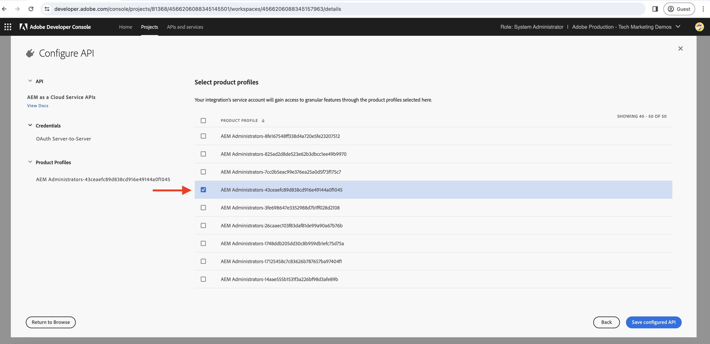

# Token voor servertoegang genereren in App Builder-actie

App Builder-acties moeten mogelijk communiceren met Adobe-API&#39;s die ondersteuning bieden **OAuth Server-to-Server geloofsbrieven** en zijn gekoppeld aan Adobe Developer-consoleprojecten die de App Builder-app wordt geïmplementeerd.

Deze gids verklaart hoe te om een toegangstoken te produceren door te gebruiken _OAuth Server-to-Server geloofsbrieven_ voor gebruik in een App Builder-actie.

>[!IMPORTANT]
>
> De geloofsbrieven van de Rekening van de Dienst (JWT) zijn afgekeurd ten gunste van de geloofsbrieven van de Server-aan-Server OAuth. Nochtans, zijn er nog sommige Adobe APIs die slechts de geloofsbrieven van de Rekening van de Dienst (JWT) en migratie aan OAuth server-aan-Server steunen aan de gang is. Controleer de Adobe API documentatie om te begrijpen welke geloofsbrieven worden gesteund.

## Adobe Developer Console-projectconfiguraties

Tijdens het toevoegen van de gewenste Adobe-API aan het Adobe Developer Console-project, kunt u in het dialoogvenster _API configureren_ stap, selecteert u de **OAuth Server-to-Server** verificatietype.


Selecteer het gewenste productprofiel om het bovenstaande automatisch gemaakte serviceaccount voor integratie toe te wijzen. De machtigingen voor serviceaccounts worden dus via het productprofiel beheerd.



## .env-bestand

In het project App Builder `.env` bestand, voeg aangepaste sleutels toe voor de OAuth Server-to-Server-referenties van het Adobe Developer Console-project. De referentie-waarden van OAuth Server-to-Server kunnen worden verkregen uit het project van de Console van Adobe Developer __Credentials__ > __OAuth Server-to-Server__ voor een bepaalde werkruimte.


```
...
OAUTHS2S_CLIENT_ID=58b23182d80a40fea8b12bc236d71167
OAUTHS2S_CLIENT_SECRET=p8e-EIRF6kY6EHLBSdw2b-pLUWKodDqJqSz3
OAUTHS2S_CECREDENTIALS_METASCOPES=AdobeID,openid,ab.manage,additional_info.projectedProductContext,read_organizations,read_profile,account_cluster.read
```

De waarden voor `OAUTHS2S_CLIENT_ID`, `OAUTHS2S_CLIENT_SECRET`, `OAUTHS2S_CECREDENTIALS_METASCOPES` kan rechtstreeks worden gekopieerd uit het OAuth Server-aan-Server scherm van het project van de Adobe Developer Console.

## Invoer toewijzen

Met de referentie-waarde OAuth Server-to-Server ingesteld in het dialoogvenster `.env` , moeten ze worden toegewezen aan invoer van de AppBuilder-actie, zodat ze in de handeling zelf kunnen worden gelezen. Hiervoor voegt u items toe voor elke variabele in het dialoogvenster `ext.config.yaml` action `inputs` in het formaat: `PARAMS_INPUT_NAME: $ENV_KEY`.

Bijvoorbeeld:

```yaml
operations:
  view:
    - type: web
      impl: index.html
actions: actions
runtimeManifest:
  packages:
    dx-excshell-1:
      license: Apache-2.0
      actions:
        generic:
          function: actions/generic/index.js
          web: 'yes'
          runtime: nodejs:16
          inputs:
            LOG_LEVEL: debug
            OAUTHS2S_CLIENT_ID: $OAUTHS2S_CLIENT_ID
            OAUTHS2S_CLIENT_SECRET: $OAUTHS2S_CLIENT_SECRET
            OAUTHS2S_CECREDENTIALS_METASCOPES: $OAUTHS2S_CECREDENTIALS_METASCOPES
          annotations:
            require-adobe-auth: false
            final: true
```

De toetsen die worden gedefinieerd onder `inputs` zijn beschikbaar op `params` object dat aan de handeling App Builder wordt geleverd.

## OAuth Server-aan-Server geloofsbrieven aan toegangstoken

In de actie van de Bouwer van de App, zijn de OAuth server-aan-Server geloofsbrieven beschikbaar in `params` object. Met deze referenties kan het toegangstoken worden gegenereerd met [OAuth 2.0-bibliotheken](https://oauth.net/code/). U kunt ook de opdracht [Knooppuntzoekbibliotheek](https://www.npmjs.com/package/node-fetch) om een POST aan het symbolische eindpunt van Adobe te vragen IMS om het toegangstoken te krijgen.

In het volgende voorbeeld wordt getoond hoe u de `node-fetch` bibliotheek voor het aanvragen van een POST naar het token-eindpunt van Adobe IMS voor het ophalen van het toegangstoken.

```javascript
const fetch = require("node-fetch");
const { Core } = require("@adobe/aio-sdk");
const { errorResponse, stringParameters, checkMissingRequestInputs } = require("../utils");

async function main(params) {
  const logger = Core.Logger("main", { level: params.LOG_LEVEL || "info" });

  try {
    // Perform any necessary input error checking
    const systemErrorMessage = checkMissingRequestInputs(params, ["OAUTHS2S_CLIENT_ID", "OAUTHS2S_CLIENT_SECRET", "OAUTHS2S_CECREDENTIALS_METASCOPES"], []);

    // The Adobe IMS token endpoint URL
    const adobeIMSV3TokenEndpointURL = 'https://ims-na1.adobelogin.com/ims/token/v3';

    // The POST request options
    const options = {
        method: 'POST',
        headers: {
        'Content-Type': 'application/x-www-form-urlencoded',
        },
        body: `grant_type=client_credentials&client_id=${params.OAUTHS2S_CLIENT_ID}&client_secret=${params.OAUTHS2S_CLIENT_SECRET}&scope=${params.OAUTHS2S_CECREDENTIALS_METASCOPES}`,
    };

    // Make a POST request to the Adobe IMS token endpoint to get the access token
    const tokenResponse = await fetch(adobeIMSV3TokenEndpointURL, options);
    const tokenResponseJSON = await tokenResponse.json();

    // The 24-hour IMS Access Token is used to call the AEM Data Service API
    // Can look at caching this token for 24 hours to reduce calls
    const accessToken = tokenResponseJSON.access_token;

    // Invoke an AEM Data Service API using the access token
    const aemDataResponse = await fetch(`https://api.adobeaemcloud.com/adobe/stats/statistics/contentRequestsQuota?imsOrgId=${IMS_ORG_ID}&current=true`, {
      headers: {
        'X-Adobe-Accept-Experimental': '1',
        'x-gw-ims-org-id': IMS_ORG_ID,
        'X-Api-Key': params.OAUTHS2S_CLIENT_ID,
        Authorization: `Bearer ${access_token}`, // The 24-hour IMS Access Token
      },
      method: "GET",
    });

    if (!aemDataResponse.ok) { throw new Error("Request to API failed with status code " + aemDataResponse.status);}

    // API data
    let data = await aemDataResponse.json();

    const response = {
      statusCode: 200,
      body: data,
    };

    return response;
  } catch (error) {
    logger.error(error);
    return errorResponse(500, "server error", logger);
  }
}

exports.main = main;
```
