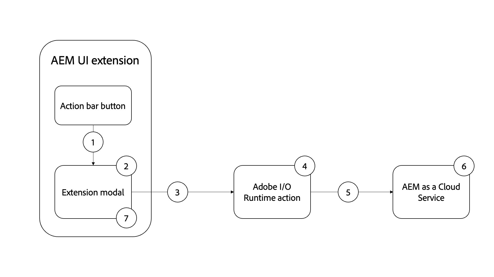

# Afbeeldingselementen AEM genereren met OpenAI

Leer hoe u een afbeelding genereert met OpenAI of DALL・E 2 en deze uploadt naar AEM DAM voor snelheid van inhoud.

>[!VIDEO](https://video.tv.adobe.com/v/3413093?quality=12&learn=on)

Dit voorbeeld AEM de uitbreiding van de Console van het Fragment van de Inhoud is een [ uitbreiding van de actiebar ](https://developer.adobe.com/uix/docs/services/aem-cf-console-admin/api/action-bar/) die digitaal beeld van natuurlijke taalinput gebruikend [ OpenAI API ](https://openai.com/api/) of [ DALL・E 2 ](https://openai.com/dall-e-2/) produceert. De gegenereerde afbeelding wordt geüpload naar de AEM DAM en de afbeeldingseigenschap van het geselecteerde inhoudsfragment wordt bijgewerkt om deze nieuw gegenereerde, geüploade afbeelding van DAM te gebruiken.

In dit voorbeeld leert u:

1. De generatie van het beeld gebruikend [ OpenAI API ](https://beta.openai.com/docs/guides/images/image-generation-beta) of [ DALL・E 2 ](https://openai.com/dall-e-2/)
2. Afbeeldingen uploaden naar AEM
3. Update van eigenschap Content Fragment

De functionele stroom van de voorbeeldextensie is als volgt:

{align="center"}

1. Selecteer het Fragment van de Inhoud en het klikken van de knoop van de uitbreiding `Generate Image` in de [ actiebar ](#extension-registration) opent [ modaal ](#modal).
1. [ modaal ](#modal) toont een vorm van de douanetoevoer die met [ wordt gebouwd Reageer Spectrum ](https://react-spectrum.adobe.com/react-spectrum/).
1. Het voorleggen van de vorm verzendt de gebruiker verstrekte `Image Description` tekst, het geselecteerde Fragment van de Inhoud, en de AEM gastheer aan de [ actie van douaneAdobe I/O Runtime ](#adobe-io-runtime-action).
1. De [ actie van Adobe I/O Runtime ](#adobe-io-runtime-action) bevestigt de input.
1. Daarna roept het de generatie van het Beeld OpenAI [ ](https://beta.openai.com/docs/guides/images/image-generation-beta) API en het gebruikt `Image Description` tekst om te specificeren welk beeld zou moeten worden geproduceerd.
1. Het ](https://beta.openai.com/docs/guides/images/image-generation-beta) eindpunt van de beeldgeneratie van 0} {leidt tot een origineel beeld van grootte _1024x1024_ pixel gebruikend de waarde van de vraagparameter en keert het geproduceerde beeld URL als reactie terug.[
1. De [ actie van Adobe I/O Runtime ](#adobe-io-runtime-action) downloadt het geproduceerde beeld aan runtime van App Builder.
1. Vervolgens wordt het uploaden van de afbeelding vanuit de App Builder-runtime naar AEM DAM gestart onder een vooraf gedefinieerd pad.
1. De AEM as a Cloud Service slaat de afbeelding op naar de DAM en retourneert een geslaagde of mislukte reactie op de Adobe I/O Runtime-actie. De geslaagde upload reactie werkt de geselecteerde de bezitswaarde van het Beeld van het Fragment van de Inhoud bij gebruikend een andere HTTP- verzoek aan AEM van de actie van Adobe I/O Runtime.
1. Het modaal ontvangt de reactie van de actie van Adobe I/O Runtime, en verstrekt AEM verbinding van activa details van het onlangs geproduceerde, geüploade beeld.

## Extensiepunt

In dit voorbeeld wordt het uitbreidingspunt `actionBar` uitgebreid om een aangepaste knop toe te voegen aan de Content Fragment Console.

| AEM UI uitgebreid | Extensiepunt |
| ------------------------ | --------------------- | 
| [ de Console van het Fragment van de Inhoud ](https://developer.adobe.com/uix/docs/services/aem-cf-console-admin/) | [ de Bar van de Actie ](https://developer.adobe.com/uix/docs/services/aem-cf-console-admin/api/action-bar/) |

## Voorbeeldextensie

In het voorbeeld wordt een bestaand Adobe Developer Console-project gebruikt en worden de volgende opties gebruikt bij het initialiseren van de App Builder-toepassing via `aio app init` .

+ Welke sjablonen wilt u zoeken?: `All Extension Points`
+ Kies de sjabloon of sjablonen die u wilt installeren:` @adobe/aem-cf-admin-ui-ext-tpl`
+ Wat wilt u de extensie een naam geven?: `Image generation`
+ Geef een korte beschrijving van de extensie: `An example action bar extension that generates an image using OpenAI and uploads it to AEM DAM.`
+ Met welke versie wilt u beginnen?: `0.0.1`
+ Wat wilt u nu doen?
   + `Add a custom button to Action Bar`
      + Geef een labelnaam op voor de knop: `Generate Image`
      + Moet u een modaal voor de knoop tonen? `y`
   + `Add server-side handler`
      + Met Adobe I/O Runtime kunt u naar wens serverloze code aanroepen. Hoe wilt u deze handeling een naam geven?: `generate-image`

De gegenereerde App Builder-extensie-app wordt bijgewerkt zoals hieronder wordt beschreven.

### Eerste configuratie

1. Teken omhoog voor een vrije [ OpenAI API ](https://openai.com/api/) rekening en creeer een [ API sleutel ](https://beta.openai.com/account/api-keys)
1. Deze sleutel toevoegen aan het `.env` -bestand van uw App Builder-project

   ```
       # Specify your secrets here
       # This file must not be committed to source control
       ## Adobe I/O Runtime credentials
       ...
       AIO_runtime_apihost=https://adobeioruntime.net
       ...
       # OpenAI secret API key
       OPENAI_API_KEY=my-openai-secrete-key-to-generate-images
       ...
   ```

1. Geef `OPENAI_API_KEY` door als param voor de Adobe I/O Runtime-actie, werk de `src/aem-cf-console-admin-1/ext.config.yaml` bij

   ```yaml
       ...
   
       runtimeManifest:
         packages:
           aem-cf-console-admin-1:
             license: Apache-2.0
             actions:
               generate-image:
                 function: actions/generate-image/index.js
                 web: 'yes'
                 runtime: nodejs:16
                 inputs:
                   LOG_LEVEL: debug
                   OPENAI_API_KEY: $OPENAI_API_KEY
       ...
   ```

1. Installeren onder Node.js-bibliotheken
   1. [ De bibliotheek OpenAI Node.js ](https://github.com/openai/openai-node#installation) - om gemakkelijk OpenAI API aan te halen
   1. [ AEM uploaden ](https://github.com/adobe/aem-upload#install) - om beelden aan instanties te uploaden AEM-CS.


>[!TIP]
>
>In de volgende secties leert u meer over de belangrijkste JavaScript-bestanden voor Reageren en Adobe I/O Runtime-actie. Voor uw verwijzing worden de belangrijkste dossiers van `web-src` en `actions` omslag van het project AppBuilder verstrekt, zie [ adobe-appbuilder-cfc-ext-image-generation-code.zip ](./assets/digital-image-generation/adobe-appbuilder-cfc-ext-image-generation-code.zip).


### Toepassingsroutes{#app-routes}

`src/aem-cf-console-admin-1/web-src/src/components/App.js` bevat de [ React router ](https://reactrouter.com/en/main).

Er zijn twee logische reeksen routes:

1. De eerste routekaarten verzoeken aan `index.html`, die de component van het Reageren verantwoordelijk voor de [ uitbreidingsregistratie ](#extension-registration) aanhaalt.

   ```javascript
   <Route index element={<ExtensionRegistration />} />
   ```

1. De tweede reeks routes brengt URLs in kaart om componenten te Reageren die de inhoud van de modaal van de uitbreiding teruggeven. De `:selection` -param vertegenwoordigt een pad met een als scheidingsteken weergegeven inhoudsfragment.

   Als de uitbreiding veelvoudige knopen heeft om discrete acties aan te halen, elke [ uitbreidingsregistratie ](#extension-registration) kaarten aan een hier bepaalde route.

   ```javascript
   <Route
       exact path="content-fragment/:selection/generate-image-modal"
       element={<GenerateImageModal />}
       />
   ```

### Registratie van extensies

`ExtensionRegistration.js` , toegewezen aan de `index.html` -route, is het ingangspunt voor de AEM extensie en definieert:

1. De locatie van de extensieknop wordt weergegeven in de AEM (`actionBar` of `headerMenu`)
1. De definitie van de extensieknop in de functie `getButtons()`
1. De klikhandler voor de knop, in de functie `onClick()`

+ `src/aem-cf-console-admin-1/web-src/src/components/ExtensionRegistration.js`

```javascript
import React from "react";
import { generatePath } from "react-router";
import { Text } from "@adobe/react-spectrum";
import { register } from "@adobe/uix-guest";
import { extensionId } from "./Constants";

function ExtensionRegistration() {
  const init = async () => {
    const guestConnection = await register({
      id: extensionId, // Some unique ID for the extension used to facilitate communication between the extension and Content Fragment Console
      methods: {
        // Configure your Action Bar button here
        actionBar: {
          getButtons() {
            return [{
              'id': 'generate-image',     // Unique ID for the button
              'label': 'Generate Image',  // Button label 
              'icon': 'PublishCheck',      // Button icon; get name from: https://spectrum.adobe.com/page/icons/ (Remove spaces, keep uppercase)
              // Click handler for the extension button
              onClick(selections) {
                // Collect the selected content fragment paths 
                const selectionIds = selections.map(selection => selection.id);

                // Create a URL that maps to the 
                const modalURL = "/index.html#" + generatePath(
                  "/content-fragment/:selection/generate-image-modal",
                  {
                    // Set the :selection React route parameter to an encoded, delimited list of paths of the selected content fragments
                    selection: encodeURIComponent(selectionIds.join('|')),
                  }
                );

                // Open the route in the extension modal using the constructed URL
                guestConnection.host.modal.showUrl({
                  title: "Generate Image",
                  url: modalURL
                })
                },
              },
            ];
          },
        },
      },
    });
  };

  init().catch(console.error);

  return <Text>IFrame for integration with Host (AEM)...</Text>;
}

export default ExtensionRegistration;          
```

### Modal

Elke route van de extensie, zoals gedefinieerd in [`App.js`](#app-routes) , wordt toegewezen aan een component React die wordt weergegeven in het modale gebied van de extensie.

In deze voorbeeld-app is er een modale React-component (`GenerateImageModal.js`) met vier statussen:

1. Laden. De gebruiker moet wachten
1. Het waarschuwingsbericht dat de gebruikers de suggestie geeft slechts één inhoudsfragment tegelijk te selecteren
1. Het formulier Afbeelding genereren waarmee de gebruiker een beschrijving van de afbeelding in de natuurlijke taal kan opgeven.
1. De reactie van de afbeeldingsgeneratiebewerking die de koppeling bevat met de AEM elementdetails van de nieuw gegenereerde, geüploade afbeelding.

Belangrijk, zou om het even welke interactie met AEM van de uitbreiding aan een [ actie van Adobe I/O Runtime AppBuilder ](https://developer.adobe.com/runtime/docs/guides/using/creating_actions/) moeten worden gedelegeerd, die een afzonderlijk serverless proces is dat in [ Adobe I/O Runtime ](https://developer.adobe.com/runtime/docs/) loopt.
Het gebruik van Adobe I/O Runtime-acties om te communiceren met AEM, en is bedoeld om kwesties met betrekking tot de connectiviteit tussen bronnen van verschillende oorsprong (CORS) te voorkomen.

Wanneer _produceer de vorm van het Beeld_ wordt voorgelegd, haalt een douane `onSubmitHandler()` de actie van Adobe I/O Runtime aan, die de beeldbeschrijving, de huidige AEM (domein), en het AEM toegangstoken van de gebruiker overgaat. De actie roept dan OpenAI [ generatie van het Beeld ](https://beta.openai.com/docs/guides/images/image-generation-beta) API om een beeld te produceren gebruikend de voorgelegde beeldbeschrijving. Daarna gebruikend [ AEM uploadt `DirectBinaryUpload` klasse van de 1} knoopmodule {het geüpload geproduceerd beeld aan AEM en gebruikt [ AEM de fragmenten van het Fragment van de Inhoud API ](https://experienceleague.adobe.com/docs/experience-manager-65/assets/extending/assets-api-content-fragments.html) definitief om de inhoudsfragmenten bij te werken.](https://github.com/adobe/aem-upload)

Wanneer de reactie van de Adobe I/O Runtime-actie wordt ontvangen, wordt het modaal bijgewerkt om de resultaten van de afbeeldingsgeneratiebewerking weer te geven.

+ `src/aem-cf-console-admin-1/web-src/src/components/GenerateImageModal.js`

```javascript
export default function GenerateImageModal() {
  // Set up state used by the React component
  const [guestConnection, setGuestConnection] = useState();

  // State hooks to manage the application state
  const [imageDescription, setImageDescription] = useState(null);
  const [validationState, setValidationState] = useState({});

  const [actionInvokeInProgress, setActionInvokeInProgress] = useState(false);
  const [actionResponse, setActionResponse] = useState();

  // Get the selected content fragment paths from the route parameter `:selection`
  const { selection } = useParams();
  const fragmentIds = selection?.split('|') || [];

  console.log('Selected Fragment Ids', fragmentIds);

  if (!fragmentIds || fragmentIds.length === 0) {
    console.error('The Content Fragments are not selected, can NOT generate images');
    return;
  }

  // Asynchronously attach the extension to AEM, we must wait or the guestConnection to be set before doing anything in the modal
  useEffect(() => {
    (async () => {
      const myGuestConnection = await attach({ id: extensionId });

      setGuestConnection(myGuestConnection);
    })();
  }, []);

  // Determine view to display in the modal
  if (!guestConnection) {
    // If the guestConnection is not initialized, display a loading spinner
    return <Spinner />;
  } if (actionInvokeInProgress) {
    // If the 'Generate Image' action has been invoked but not completed, display a loading spinner
    return <Spinner />;
  } if (fragmentIds.length > 1) {
    // If more than one CF selected show warning and suggest to select only one CF
    return renderMoreThanOneCFSelectionError();
  } if (fragmentIds.length === 1 && !actionResponse) {
    // Display the 'Generate Image' modal and ask for image description
    return renderImgGenerationForm();
  } if (actionResponse) {
    // If the 'Generate Image' action has completed, display the response
    return renderActionResponse();
  }

  /**
   * Renders the message suggesting to select only on CF at a time to not lose credits accidentally
   *
   * @returns the suggestion or error message to select one CF at a time
   */
  function renderMoreThanOneCFSelectionError() {
    return (
      <Provider theme={defaultTheme} colorScheme="light">
        <Content width="100%">
          <Text>
            As this operation
            <strong> uses credits from Generative AI services</strong>
            {' '}
            such as DALL·E 2 (or Stable Dufusion), we allow only one Generate Image at a time.
            <p />
            <strong>So please select only one Content Fragment at this moment.</strong>
          </Text>

          <Flex width="100%" justifyContent="end" alignItems="center" marginTop="size-400">
            <ButtonGroup align="end">
              <Button variant="negative" onPress={() => guestConnection.host.modal.close()}>Close</Button>
            </ButtonGroup>
          </Flex>

        </Content>
      </Provider>
    );
  }

  /**
   * Renders the form asking for image description in the natural language and
   * displays message this action uses credits from Generative AI services.
   *
   * @returns the image description input field and credit usage message
   */
  function renderImgGenerationForm() {
    return (

      <Provider theme={defaultTheme} colorScheme="light">
        <Content width="100%">

          <Flex width="100%">
            <Form
              width="100%"
            >
              <TextField
                label="Image Description"
                description="The image description in natural language, for e.g. Alaskan adventure in wilderness, animals, and flowers."
                isRequired
                validationState={validationState?.propertyName}
                onChange={setImageDescription}
                contextualHelp={(
                  <ContextualHelp>
                    <Heading>Need help?</Heading>
                    <Content>
                      <Text>
                        The
                        <strong>description of an image</strong>
                        {' '}
                        you are looking for in the natural language, for e.g. &quot;Family vacation on the beach with blue ocean, dolphins, boats and drink&quot;
                      </Text>
                    </Content>
                  </ContextualHelp>
                  )}
              />

              <Text>
                <p />
                Please note this will use credits from Generative AI services such as OpenAI/DALL·E 2. The AI-generated images are saved to this AEM as a Cloud Service Author service using logged user access (IMS) token.
              </Text>

              <ButtonGroup align="end">
                <Button variant="accent" onPress={onSubmitHandler}>Use Credits</Button>
                <Button variant="accent" onPress={() => guestConnection.host.modal.close()}>Close</Button>
              </ButtonGroup>
            </Form>
          </Flex>

        </Content>
      </Provider>
    );
  }

  function buildAssetDetailsURL(aemImgURL) {
    const urlParts = aemImgURL.split('.com');
    const aemAssetDetailsURL = `${urlParts[0]}.com/ui#/aem/assetdetails.html${urlParts[1]}`;

    return aemAssetDetailsURL;
  }

  /**
   * Displays the action response received from the App Builder
   *
   * @returns Displays App Builder action and details
   */
  function renderActionResponse() {
    return (
      <Provider theme={defaultTheme} colorScheme="light">
        <Content width="100%">

          {actionResponse.status === 'success'
            && (
              <>
                <Heading level="4">
                  Successfully generated an image, uploaded it to this AEM-CS Author service, and associated it to the selected Content Fragment.
                </Heading>

                <Text>
                  {' '}
                  Please see generated image in AEM-CS
                  {' '}
                  <Link>
                    <a href={buildAssetDetailsURL(actionResponse.aemImgURL)} target="_blank" rel="noreferrer">
                      here.
                    </a>
                  </Link>
                </Text>
              </>
            )}

          {actionResponse.status === 'failure'
            && (
            <Heading level="4">
              Failed to generate, upload image, please check App Builder logs.
            </Heading>
            )}

          <Flex width="100%" justifyContent="end" alignItems="center" marginTop="size-400">
            <ButtonGroup align="end">
              <Button variant="negative" onPress={() => guestConnection.host.modal.close()}>Close</Button>
            </ButtonGroup>
          </Flex>

        </Content>
      </Provider>
    );
  }

  /**
   * Handle the Generate Image form submission.
   * This function calls the supporting Adobe I/O Runtime actions such as
   * - Call the Generative AI service (DALL·E) with 'image description' to generate an image
   * - Download the AI generated image to App Builder runtime
   * - Save the downloaded image to AEM DAM and update Content Fragment's image reference property to use this new image
   *
   * When invoking the Adobe I/O Runtime actions, the following parameters are passed as they're used by the action to connect to AEM:
   * - AEM Host to connect to
   * - AEM access token to connect to AEM with
   * - The Content Fragment path to update
   *
   * @returns In case of success the updated content fragment, otherwise failure message
   */
  async function onSubmitHandler() {
    console.log('Started Image Generation orchestration');

    // Validate the form input fields
    if (imageDescription?.length > 1) {
      setValidationState({ imageDescription: 'valid' });
    } else {
      setValidationState({ imageDescription: 'invalid' });
      return;
    }

    // Mark the extension as invoking the action, so the loading spinner is displayed
    setActionInvokeInProgress(true);

    // Set the HTTP headers to access the Adobe I/O runtime action
    const headers = {
      Authorization: `Bearer ${guestConnection.sharedContext.get('auth').imsToken}`,
      'x-gw-ims-org-id': guestConnection.sharedContext.get('auth').imsOrg,
    };

    // Set the parameters to pass to the Adobe I/O Runtime action
    const params = {

      aemHost: `https://${guestConnection.sharedContext.get('aemHost')}`,

      fragmentId: fragmentIds[0],
      imageDescription,
    };

    const generateImageAction = 'generate-image';

    try {
      const generateImageActionResponse = await actionWebInvoke(allActions[generateImageAction], headers, params);

      // Set the response from the Adobe I/O Runtime action
      setActionResponse(generateImageActionResponse);

      console.log(`Response from ${generateImageAction}:`, actionResponse);
    } catch (e) {
      // Log and store any errors
      console.error(e);
    }

    // Set the action as no longer being invoked, so the loading spinner is hidden
    setActionInvokeInProgress(false);
  }
}
```

>[!NOTE]
>
>In de `buildAssetDetailsURL()` functie, veronderstelt de `aemAssetdetailsURL` veranderlijke waarde dat [ Verenigde Shell ](https://experienceleague.adobe.com/docs/experience-manager-cloud-service/content/overview/aem-cloud-service-on-unified-shell.html#overview) wordt toegelaten. Als u Verenigde Shell hebt onbruikbaar gemaakt, moet u `/ui#/aem` uit de veranderlijke waarde verwijderen.


### Adobe I/O Runtime-actie

Een App Builder-app met AEM extensie kan 0 of veel Adobe I/O Runtime-acties definiëren of gebruiken.
De Runtime van de Adobe actie is verantwoordelijk voor het werk dat interactie met AEM of Adobe of derdeWebdiensten vereist.

In deze voorbeeldapp is de `generate-image` Adobe I/O Runtime-actie verantwoordelijk voor:

1. Het produceren van een beeld gebruikend ](https://beta.openai.com/docs/guides/images/image-generation-beta) de dienst van de Generatie van het Beeld OpenAI API[
1. Het uploaden van het geproduceerde beeld in AEM-CS instantie gebruikend [ AEM uploadt ](https://github.com/adobe/aem-upload) bibliotheek
1. Een HTTP-aanvraag indienen bij de AEM Content Fragment-API om de afbeeldingseigenschap van het inhoudsfragment bij te werken.
1. Terugkerend de belangrijkste informatie van successen en mislukking voor vertoning door modal (`GenerateImageModal.js`)


#### Invoerpunt (`index.js`)

`index.js` organiseert meer dan 1 tot 3 taken door de respectieve modules van JavaScript, namelijk `generate-image-using-openai, upload-generated-image-to-aem, update-content-fragement` te gebruiken. Deze modules en bijbehorende code worden beschreven in volgende [ subsections ](#image-generation-module---generate-image-using-openaijs).

+ `src/aem-cf-console-admin-1/actions/generate-image/index.js`

```javascript
/**
 *
 * This action orchestrates an image generation by calling the OpenAI API (DALL·E 2) and saves generated image to AEM.
 *
 * It leverages following modules
 *  - 'generate-image-using-openai' - To generate an image using OpenAI API
 *  - 'upload-generated-image-to-aem' - To upload the generated image into AEM-CS instance
 *  - 'update-content-fragement' - To update the CF image property with generated image's DAM path
 *
 */

const { Core } = require('@adobe/aio-sdk');
const {
  errorResponse, stringParameters, getBearerToken, checkMissingRequestInputs,
} = require('../utils');

const { generateImageUsingOpenAI } = require('./generate-image-using-openai');

const { uploadGeneratedImageToAEM } = require('./upload-generated-image-to-aem');

const { updateContentFragmentToUseGeneratedImg } = require('./update-content-fragement');

// main function that will be executed by Adobe I/O Runtime
async function main(params) {
  // create a Logger
  const logger = Core.Logger('main', { level: params.LOG_LEVEL || 'info' });

  try {
    // 'info' is the default level if not set
    logger.info('Calling the main action');

    // log parameters, only if params.LOG_LEVEL === 'debug'
    logger.debug(stringParameters(params));

    // check for missing request input parameters and headers
    const requiredParams = ['aemHost', 'fragmentId', 'imageDescription'];
    const requiredHeaders = ['Authorization'];
    const errorMessage = checkMissingRequestInputs(params, requiredParams, requiredHeaders);

    if (errorMessage) {
      // return and log client errors
      return errorResponse(400, errorMessage, logger);
    }

    // extract the user Bearer token from the Authorization header
    const token = getBearerToken(params);

    // Call OpenAI (DALL·E 2) API to generate an image using image description
    const generatedImageURL = await generateImageUsingOpenAI(params);
    logger.info(`Generated image using OpenAI API and url is : ${generatedImageURL}`);

    // Upload the generated image to AEM-CS
    const uploadedImagePath = await uploadGeneratedImageToAEM(params, generatedImageURL, token);
    logger.info(`Uploaded image to AEM, path is: ${uploadedImagePath}`);

    // Update Content Fragment with the newly generated image reference
    const updateContentFragmentPath = await updateContentFragmentToUseGeneratedImg(params, uploadedImagePath, token);
    logger.info(`Updated Content Fragment path is: ${updateContentFragmentPath}`);

    let result;
    if (updateContentFragmentPath) {
      result = {
        status: 'success', message: 'Successfully generated and uploaded image to AEM', genTechServiceImageURL: generatedImageURL, aemImgURL: uploadedImagePath, fragmentPath: updateContentFragmentPath,
      };
    } else {
      result = { status: 'failure', message: 'Failed to generated and uploaded image, please check App Builder logs' };
    }

    const response = {
      statusCode: 200,
      body: result,
    };

    logger.info('Adobe I/O Runtime action response', response);

    // Return the response to the caller
    return response;
  } catch (error) {
    // log any server errors
    logger.error(error);
    // return with 500
    return errorResponse(500, 'server error', logger);
  }
}

exports.main = main;
```

#### Afbeelding genereren

Deze module is verantwoordelijk voor het roepen van het 1} eindpunt van de Generatie van het Beeld van OpenAI [ gebruikend [ open ](https://github.com/openai/openai-node) bibliotheek. ](https://beta.openai.com/docs/guides/images/image-generation-beta) Als u de OpenAI API-geheimhoudingssleutel wilt definiëren in het `.env` -bestand, wordt `params.OPENAI_API_KEY` gebruikt.

+ `src/aem-cf-console-admin-1/actions/generate-image/generate-image-using-openai.js`

```javascript
/**
 * This module calls OpenAI API to generate an image based on image description provided to Action
 *
 */

const { Configuration, OpenAIApi } = require('openai');

const { Core } = require('@adobe/aio-sdk');

// Placeholder than actual OpenAI Image
const PLACEHOLDER_IMG_URL = 'https://www.gstatic.com/webp/gallery/2.png';

async function generateImageUsingOpenAI(params) {
  // create a Logger
  const logger = Core.Logger('generateImageUsingOpenAI', { level: params.LOG_LEVEL || 'info' });

  let generatedImageURL = PLACEHOLDER_IMG_URL;

  // create configuration object with the API Key
  const configuration = new Configuration({
    apiKey: params.OPENAI_API_KEY,
  });

  // create OpenAIApi object
  const openai = new OpenAIApi(configuration);

  logger.info(`Generating image for input: ${params.imageDescription}`);

  try {
    // invoke createImage method with details
    const response = await openai.createImage({
      prompt: params.imageDescription,
      n: 1,
      size: '1024x1024',
    });

    generatedImageURL = response.data.data[0].url;

    logger.info(`The OpenAI generate image url is: ${generatedImageURL}`);
  } catch (error) {
    logger.error(`Error while generating image, details are: ${error}`);
  }

  return generatedImageURL;
}

module.exports = {
  generateImageUsingOpenAI,
};
```

#### Uploaden naar AEM

Deze module is de oorzaak van het uploaden van het OpenAI geproduceerde beeld aan AEM gebruikend [ AEM uploadt ](https://github.com/adobe/aem-upload) bibliotheek. Het geproduceerde beeld wordt eerst gedownload aan runtime van App Builder gebruikend de bibliotheek van het Systeem van het Dossier Node.js ](https://nodejs.org/api/fs.html) en zodra uploaden aan AEM wordt voltooid wordt het geschrapt.[

In het onderstaande voorbeeld organiseert de functie `uploadGeneratedImageToAEM` het gedownloade image naar de runtime, uploadt u het bestand naar AEM en verwijdert het uit de runtime. Het beeld wordt geupload aan de `/content/dam/wknd-shared/en/generated` weg, zorg ervoor alle omslagen in DAM bestaan, zijn voorwaarde om [ AEM te gebruiken uploadt ](https://github.com/adobe/aem-upload) bibliotheek.

+ `src/aem-cf-console-admin-1/actions/generate-image/upload-generated-image-to-aem.js`

```javascript
/**
 * This module uploads the generated image to AEM-CS instance using current user's IMS token
 *
 */

const { Core } = require('@adobe/aio-sdk');
const fs = require('fs');

const {
  DirectBinaryUploadErrorCodes,
  DirectBinaryUpload,
  DirectBinaryUploadOptions,
} = require('@adobe/aem-upload');

const codes = DirectBinaryUploadErrorCodes;
const IMG_EXTENSION = '.png';

const GENERATED_IMAGES_DAM_PATH = '/content/dam/wknd-shared/en/generated';

async function downloadImageToRuntime(logger, generatedImageURL) {
  logger.log('Downloading generated image to the runtime');

  // placeholder image name
  let generatedImageName = 'generated.png';

  try {
    // Get the generated image name from the image URL
    const justImgURL = generatedImageURL.substring(0, generatedImageURL.indexOf(IMG_EXTENSION) + 4);
    generatedImageName = justImgURL.substring(justImgURL.lastIndexOf('/') + 1);

    // Read image from URL as the buffer
    const response = await fetch(generatedImageURL);
    const buffer = await response.buffer();

    // Write/download image to the runtime
    fs.writeFileSync(generatedImageName, buffer, (err) => {
      if (err) throw err;
      logger.log('Saved the generated image!');
    });
  } catch (error) {
    logger.error(`Error while downloading image on the runtime, details are: ${error}`);
  }

  return generatedImageName;
}

function setupEventHandlers(binaryUpload, logger) {
  binaryUpload.on('filestart', (data) => {
    const { fileName } = data;

    logger.log(`Started file upload ${fileName}`);
  });

  binaryUpload.on('fileprogress', (data) => {
    const { fileName, transferred } = data;

    logger.log(`Fileupload is in progress ${fileName} & ${transferred}`);
  });

  binaryUpload.on('fileend', (data) => {
    const { fileName } = data;

    logger.log(`Finished file upload ${fileName}`);
  });

  binaryUpload.on('fileerror', (data) => {
    const { fileName, errors } = data;

    logger.log(`Error in file upload ${fileName} and ${errors}`);
  });
}

async function getImageSize(downloadedImgName) {
  const stats = fs.statSync(downloadedImgName);
  return stats.size;
}

async function uploadImageToAEMFromRuntime(logger, aemURL, downloadedImgName, accessToken) {
  let aemImageURL;
  try {
    logger.log('Uploading generated image to AEM from the runtime');

    const binaryUpload = new DirectBinaryUpload();

    // setup event handlers to track the progress, success or error
    setupEventHandlers(binaryUpload, logger);

    // get downloaded image size
    const imageSize = await getImageSize(downloadedImgName);
    logger.info(`The image upload size is: ${imageSize}`);

    // The deatils of the file to be uploaded
    const uploadFiles = [
      {
        fileName: downloadedImgName, // name of the file as it will appear in AEM
        fileSize: imageSize, // total size, in bytes, of the file
        filePath: downloadedImgName, // Full path to the local file
      },
    ];

    // Provide AEM URL and DAM Path where images will be uploaded
    const options = new DirectBinaryUploadOptions()
      .withUrl(`${aemURL}${GENERATED_IMAGES_DAM_PATH}`)
      .withUploadFiles(uploadFiles);

    // Add headers like content type and authorization
    options.withHeaders({
      'content-type': 'image/png',
      Authorization: `Bearer ${accessToken}`,
    });

    // Start the upload to AEM
    await binaryUpload.uploadFiles(options)
      .then((result) => {
        // Handle Error
        result.getErrors().forEach((error) => {
          if (error.getCode() === codes.ALREADY_EXISTS) {
            logger.error('The generated image already exists');
          }
        });

        // Handle Upload result and check for errors
        result.getFileUploadResults().forEach((fileResult) => {
          // log file upload result
          logger.info(`File upload result ${JSON.stringify(fileResult)}`);

          fileResult.getErrors().forEach((fileErr) => {
            if (fileErr.getCode() === codes.ALREADY_EXISTS) {
              const fileName = fileResult.getFileName();
              logger.error(`The generated image already exists ${fileName}`);
            }
          });
        });
      })
      .catch((err) => {
        logger.info(`Failed to uploaded generated image to AEM${err}`);
      });

    logger.info('Successfully uploaded generated image to AEM');

    aemImageURL = `${aemURL + GENERATED_IMAGES_DAM_PATH}/${downloadedImgName}`;
  } catch (error) {
    logger.info(`Error while uploading generated image to AEM, see ${error}`);
  }

  return aemImageURL;
}

async function deleteFileFromRuntime(logger, downloadedImgName) {
  try {
    logger.log('Deleting the generated image from the runtime');

    fs.unlinkSync(downloadedImgName);

    logger.log('Successfully deleted the generated image from the runtime');
  } catch (error) {
    logger.error(`Error while deleting generated image from the runtime, details are: ${error}`);
  }
}

async function uploadGeneratedImageToAEM(params, generatedImageURL, accessToken) {
  // create a Logger
  const logger = Core.Logger('uploadGeneratedImageToAEM', { level: params.LOG_LEVEL || 'info' });

  const aemURL = params.aemHost;

  logger.info(`Uploading generated image from ${generatedImageURL} to AEM ${aemURL} by streaming the bytes.`);

  // download image to the App Builder runtime
  const downloadedImgName = await downloadImageToRuntime(logger, generatedImageURL);

  // Upload image to AEM from the App Builder runtime
  const aemImageURL = await uploadImageToAEMFromRuntime(logger, aemURL, downloadedImgName, accessToken);

  // Delete the downloaded image from the App Builder runtime
  await deleteFileFromRuntime(logger, downloadedImgName);

  return aemImageURL;
}

module.exports = {
  uploadGeneratedImageToAEM,
};
```

#### Inhoudsfragment bijwerken

Deze module is verantwoordelijk voor het bijwerken van de afbeeldingseigenschap van het inhoudsfragment met het DAM-pad van de nieuw geüploade afbeelding met behulp van de API voor AEM inhoudsfragment.

+ `src/aem-cf-console-admin-1/actions/generate-image/update-content-fragement.js`

```javascript
/**
 * This module updates the CF image property with generated image's DAM path
 *
 */
const { Core } = require('@adobe/aio-sdk');

const ADVENTURE_MODEL_IMG_PROPERTY_NAME = 'primaryImage';

const ARTICLE_MODEL_IMG_PROPERTY_NAME = 'featuredImage';

const AUTHOR_MODEL_IMG_PROPERTY_NAME = 'profilePicture';

function findImgPropertyName(fragmenPath) {
  if (fragmenPath && fragmenPath.includes('/adventures')) {
    return ADVENTURE_MODEL_IMG_PROPERTY_NAME;
  } if (fragmenPath && fragmenPath.includes('/magazine')) {
    return ARTICLE_MODEL_IMG_PROPERTY_NAME;
  }
  return AUTHOR_MODEL_IMG_PROPERTY_NAME;
}

async function updateContentFragmentToUseGeneratedImg(params, uploadedImagePath, accessToken) {
  // create a Logger
  const logger = Core.Logger('updateContentFragment', { level: params.LOG_LEVEL || 'info' });

  const fragmenPath = params.fragmentId;
  const imgPropName = findImgPropertyName(fragmenPath);
  const relativeImgPath = uploadedImagePath.substring(uploadedImagePath.indexOf('/content/dam'));

  logger.info(`Update CF ${fragmenPath} to use ${relativeImgPath} image path`);

  const body = {
    properties: {
      elements: {
        [imgPropName]: {
          value: relativeImgPath,
        },
      },
    },
  };

  const res = await fetch(`${params.aemHost}${fragmenPath.replace('/content/dam/', '/api/assets/')}.json`, {
    method: 'put',
    body: JSON.stringify(body),
    headers: {
      Authorization: `Bearer ${accessToken}`,
      'Content-Type': 'application/json',
    },

  });

  if (res.ok) {
    logger.info(`Successfully updated ${fragmenPath}`);
    return fragmenPath;
  }

  logger.info(`Failed to update ${fragmenPath}`);
  return '';
}

module.exports = {
  updateContentFragmentToUseGeneratedImg,
};
```
