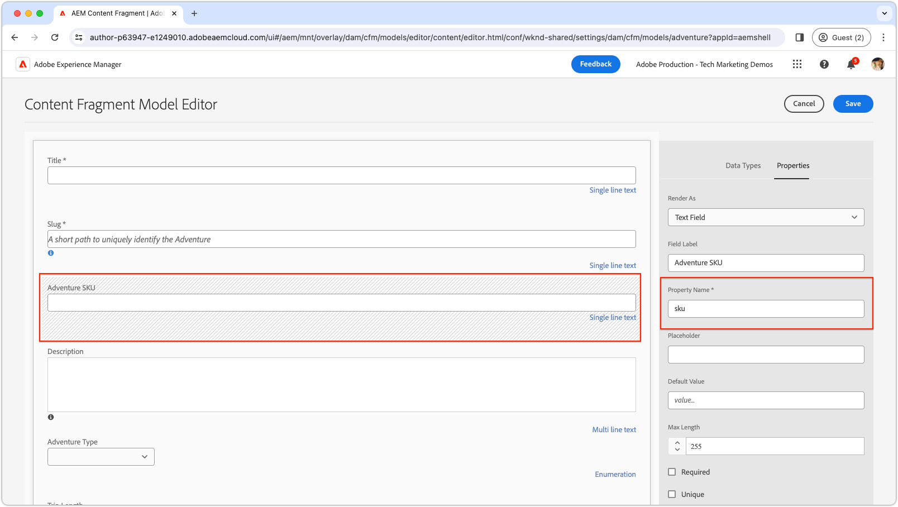

# Aangepaste velden

Leer hoe u aangepaste velden maakt in de AEM Content Fragment Editor.

>[!VIDEO](https://video.tv.adobe.com/v/3427585?learn=on)

AEM UI-extensies moeten worden ontwikkeld met de [Adobe Reageren spectrum](https://react-spectrum.adobe.com/react-spectrum/index.html) -framework, aangezien dit een consistent uiterlijk behoudt met de rest van de AEM, en tevens een uitgebreide bibliotheek van vooraf gebouwde functionaliteit heeft, waardoor de ontwikkelingstijd afneemt.

## Extensiepunt

In dit voorbeeld wordt een bestaand veld in de Inhoudsfragmenteditor vervangen door een aangepaste implementatie.

| AEM UI uitgebreid | Extensiepunt |
| ------------------------ | --------------------- | 
| [Inhoudsfragmenteditor](https://developer.adobe.com/uix/docs/services/aem-cf-editor/) | [Aangepaste rendering van formulierelementen](https://developer.adobe.com/uix/docs/services/aem-cf-editor/api/custom-fields/) |

## Voorbeeldextensie

In dit voorbeeld ziet u hoe u veldwaarden in de Content Fragment Editor beperkt tot een vooraf ingestelde set door het standaardveld te vervangen door een aangepaste vervolgkeuzelijst met vooraf gedefinieerde SKU&#39;s. Auteurs kunnen uit deze specifieke SKU-lijst kiezen. Hoewel SKUs gewoonlijk uit een systeem van het Beheer van de Informatie van het Product (PIM) komt, vereenvoudigt dit voorbeeld door de SKUs statisch op te nemen.

De broncode voor dit voorbeeld is [beschikbaar voor downloaden](./assets/editor-custom-field/content-fragment-editor-custom-field-src.zip).

### Definitie van inhoudsfragmentmodel

In dit voorbeeld wordt een binding tot stand gebracht met een veld voor een inhoudsfragment met de naam `sku` (via een [reguliere expressie overeenkomst](#extension-registration) van `^sku$`) en wordt deze vervangen door een aangepast veld. Het voorbeeld gebruikt het model van het Fragment van de Inhoud van WKND Adventure van de Inhoud dat is bijgewerkt en de definitie is als volgt:



Ondanks het gebied van douaneSKU dat als dropdown wordt getoond, wordt zijn onderliggend model gevormd als tekstgebied. De implementatie van het aangepaste veld hoeft alleen te worden uitgelijnd met de juiste naam en het juiste type eigenschap, waardoor het standaardveld gemakkelijker kan worden vervangen door de aangepaste vervolgkeuzelijst.


### Toepassingsroutes

In de hoofdcomponent React `App.js`, inclusief de `/sku-field` route om terug te geven `SkuField` Reageer component.

`src/aem-cf-editor-1/web-src/src/components/App.js`

```javascript
import React from "react";
import ErrorBoundary from "react-error-boundary";
import { HashRouter as Router, Routes, Route } from "react-router-dom";
import ExtensionRegistration from "./ExtensionRegistration";
import SkuField from "./SkuField"; // Custom component implemented below

function App() {
  return (
    <Router>
      <ErrorBoundary onError={onError} FallbackComponent={fallbackComponent}>
        <Routes>
          <Route index element={<ExtensionRegistration />} />
          <Route
            exact path="index.html"
            element={<ExtensionRegistration />}
          />
          {/* This is the React route that maps to the custom field */}
          <Route
            exact path="/sku-field"
            element={<SkuField />}/>
        </Routes>
      </ErrorBoundary>
    </Router>
  )
  ...
}
...
```

Deze aangepaste route van `/sku-field` worden toegewezen aan `SkuField` component wordt hieronder in de [Registratie van extensies](#extension-registration).

### Registratie van extensies

`ExtensionRegistration.js`, toegewezen aan de route index.html, is het ingangspunt voor de AEM uitbreiding en bepaalt:

+ De widgetdefinitie in `getDefinitions()` functie met `fieldNameExp` en `url` kenmerken. De volledige lijst met beschikbare kenmerken is beschikbaar in het dialoogvenster [Aangepaste API-naslaggids voor het renderen van formulierelementen](https://developer.adobe.com/uix/docs/services/aem-cf-editor/api/custom-fields/#api-reference).
+ De `url` kenmerkwaarde, een relatief URL-pad (`/index.html#/skuField`) om de gebruikersinterface van het veld te laden.

`src/aem-cf-editor-1/web-src/src/components/ExtensionRegistration.js`

```javascript
import { Text } from "@adobe/react-spectrum";
import { register } from "@adobe/uix-guest";
import { extensionId } from "./Constants";

function ExtensionRegistration() {
  const init = async () => {
    const guestConnection = await register({
      id: extensionId,
      methods: {
        field: {
          getDefinitions() {
            return [
              // Multiple fields can be registered here.
              {
                fieldNameExp: '^sku$',  // This is a regular expression that matches the field name in the Content Fragment Model to replace with React component specified in the `url` key.
                url: '/#/sku-field',    // The URL, which is mapped vai the Route in App.js, to the React component that will be used to render the field.
              },
              // Other bindings besides fieldNameExp, other bindings can be used as well as defined here:
              // https://developer.adobe.com/uix/docs/services/aem-cf-editor/api/custom-fields/#api-reference
            ];
          },
        },
      }
    });
  };
  init().catch(console.error);

  return <Text>IFrame for integration with Host (AEM)...</Text>;
}

export default ExtensionRegistration;
```

### Aangepast veld

De `SkuField` De component React werkt de Redacteur van het Fragment van de Inhoud met een douane UI bij, gebruikend Adobe React Spectrum voor zijn kiezersvorm. Tot de hooglichten behoren:

+ Gebruikmaken `useEffect` voor initialisatie en verbinding met AEM Content Fragment Editor, met een laadstatus weergegeven totdat de installatie is voltooid.
+ Als u rendert binnen een iFrame, wordt de hoogte van de iFrame dynamisch aangepast via de `onOpenChange` voor het vervolgkeuzemenu van de Adobe Spectrum Picker reageren.
+ Hiermee geeft u veldselecties weer aan de host via `connection.host.field.onChange(value)` in de `onSelectionChange` ervoor zorgen dat de geselecteerde waarde wordt gevalideerd en automatisch wordt opgeslagen volgens de richtlijnen van het inhoudsfragmentmodel.

Aangepaste velden worden gerenderd binnen een iFrame dat wordt geïnjecteerd in de Content Fragment Editor. Communicatie tussen de aangepaste veldcode en de Content Fragment Editor verloopt uitsluitend via de `connection` door de `attach` van de `@adobe/uix-guest` pakket.

`src/aem-cf-editor-1/web-src/src/components/SkuField.js`

```javascript
import React, { useEffect, useState } from "react";
import { extensionId } from "./Constants";
import { attach } from "@adobe/uix-guest";
import { Provider, View, lightTheme } from "@adobe/react-spectrum";
import { Picker, Item } from "@adobe/react-spectrum";

const SkuField = (props) => {
  const [connection, setConnection] = useState(null);
  const [validationState, setValidationState] = useState(null);
  const [value, setValue] = useState(null);
  const [model, setModel] = useState(null);
  const [items, setItems] = useState(null);

  /**
   * Mock function that gets a list of Adventure SKUs to display.
   * The data could come anywhere, AEM's HTTP APIs, a PIM, or other system.
   * @returns a list of items for the picker
   */
  async function getItems() {
    // Data to drive input field validation can come from anywhere.
    // Fo example this commented code shows how it could be fetched from an HTTP API.
    // fetch(MY_API_URL).then((response) => response.json()).then((data) => { return data; }

    // In this example, for simplicity, we generate a list of 25 SKUs.
    return Array.from({ length: 25 }, (_, i) => ({ 
        name: `WKND-${String(i + 1).padStart(3, '0')}`, 
        id: `WKND-${String(i + 1).padStart(3, '0')}` 
    }));
  }

  /**
   * When the fields changes, update the value in the Content Fragment Editor
   * @param {*} value the selected value in the picker
   */
  const onSelectionChange = async (value) => {
    // This sets the value in the React state of the custom field
    setValue(value);
    // This calls the setValue method on the host (AEM's Content Fragment Editor)
    connection.host.field.onChange(value);
  };

  /**
   * Some widgets, like the Picker, have a variable height.
   * In these cases adjust the Content Fragment Editor's iframe's height so the field doesn't get cut off.     *
   * @param {*} isOpen true if the picker is open, false if it's closed
   */
  const onOpenChange = async (isOpen) => {
    if (isOpen) {
      // Calculate the height of the picker box and its label, and surrounding padding.
      const pickerHeight = Number(document.body.clientHeight.toFixed(0));
      // Calculate the height of the picker options dropdown, and surrounding padding.
      // We do this  by multiplying the number of items by the height of each item (32px) and adding 12px for padding.
      const optionsHeight = items.length * 32 + 12;

      // Set the height of the iframe to the height of the picker + the height of the options, or 400px, whichever is smaller.
      // The options will scroll if they they cannot fit into 400px
      const height = Math.min(pickerHeight + optionsHeight, 400);

      // Set the height of the iframe in the Content Fragment Editor
      await connection.host.field.setHeight(height);
    } else {
      // Set the height of the iframe in the Content Fragment Editor to the height of the closed picker.
      await connection.host.field.setHeight(
        Number(document.body.clientHeight.toFixed(0))
      );
    }
  };

  useEffect(() => {
    const init = async () => {
      // Connect to the host (AEM's Content Fragment Editor)
      const conn = await attach({ id: extensionId });
      setConnection(conn);

      // get the Content Fragment Model
      setModel(await conn.host.field.getModel());

      // Share the validation state back to the client.
      // When conn.host.field.setValue(value) is called, the
      await conn.host.field.onValidationStateChange((state) => {
        // state can be `valid` or `invalid`.
        setValidationState(state);
      });
      // Get default value from the Content Fragment Editor
      // (either the default value set in the model, or a perviously set value)
      setValue(await conn.host.field.getDefaultValue());

      // Get the list of items for the picker; in this case its a list of adventure SKUs 
      // This could come from elsewhere in AEM or from an external system.
      setItems(await getItems());
    };

    init().catch(console.error);
  }, []);

  // If the component is not yet initialized, return a loading state.
  if (!connection || !model || !items) {
    // Put whatever loader you like here...
    return <Provider theme={lightTheme}>Loading custom field...</Provider>;
  }

  // Wrap the Spectrum UI component in a Provider theme, such that it is styled appropriately.
  // Render the picker, and bind to the data and custom event handlers.

  // Set as much of the model as we can, to allow maximum authoring flexibility without developer support.
  return (
    <Provider theme={lightTheme}>
      <View width="100%">
        <Picker
          label={model.fieldLabel}
          isRequired={model.required}
          placeholder={model.emptyText}
          errorMessage={model.customErrorMsg}
          selectedKey={value}
          necessityIndicator="icon"
          shouldFlip={false}
          width={"90%"}
          items={items}
          isInvalid={validationState === "invalid"}
          onSelectionChange={onSelectionChange}
          onOpenChange={onOpenChange}
        >
          {(item) => <Item key={item.value}>{item.name}</Item>}
        </Picker>
      </View>
    </Provider>
  );
};

export default SkuField;
```
