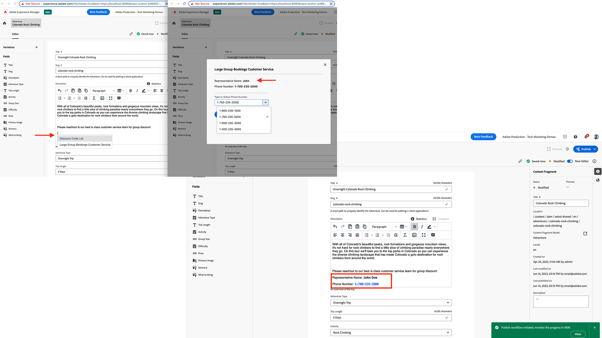

# Badges toevoegen aan Rich Text Editor (RTE)

{align="center"}

[Rich Text Editor-badge](https://developer.adobe.com/uix/docs/services/aem-cf-editor/api/rte-badges/)  zijn extensies die tekst in de Rich Text Editor (RTE) niet-bewerkbaar maken. Dit betekent dat een als zodanig gedeclareerde badge alleen volledig kan worden verwijderd en niet gedeeltelijk kan worden bewerkt. Deze badges bieden ook ondersteuning voor speciale kleuren in de RTE, waarbij de auteur van de inhoud duidelijk wordt aangegeven dat de tekst een badge is en dus niet bewerkbaar. Bovendien geven ze visuele aanwijzingen over de betekenis van de badge-tekst.

Het meest gebruikelijke gebruiksgeval voor RTE-badges is het gebruik ervan in combinatie met [RTE-widgets](https://developer.adobe.com/uix/docs/services/aem-cf-editor/api/rte-widgets/). Hierdoor kan inhoud die door de RTE-widget in de RTE wordt geïnjecteerd, niet-bewerkbaar zijn.

Gewoonlijk worden de badges in combinatie met de widgets gebruikt om de dynamische inhoud toe te voegen die een externe systeemafhankelijkheid heeft, maar _inhoudsauteurs kunnen geen wijzigingen aanbrengen_ de ingevoegde dynamische inhoud om de integriteit te behouden. Ze kunnen alleen als een geheel item worden verwijderd.

De **badges** worden toegevoegd aan de **RTE** in de Inhoudsfragmenteditor met de opdracht `rte` extensiepunt. Gebruiken `rte` extensiepunt `getBadges()` methode één of vele badges worden toegevoegd.

In dit voorbeeld wordt getoond hoe u een widget met de naam _Klantenservice voor grote groepsboekingen_ om de WKND adventure-specifieke details van de klantendienst zoals te vinden, te selecteren en toe te voegen **Naam vertegenwoordiger** en **Telefoonnummer** binnen een RTE-inhoud. Met behulp van de badfunctionaliteit **Telefoonnummer** is gemaakt **niet bewerkbaar** Maar WKND-inhoudsauteurs kunnen de naam van de vertegenwoordiger wel bewerken.

Ook de **Telefoonnummer** wordt anders opgemaakt (blauw). Dit is een extra gebruiksgeval voor de badges-functionaliteit.

In dit voorbeeld wordt het volgende gebruikt om de [Adobe React Spectrum](https://react-spectrum.adobe.com/react-spectrum/index.html) -framework voor het ontwikkelen van de interface van de widget of dialoog en hardgecodeerde WKND-telefoonnummers voor Klantenservice. Als u het niet-bewerken en andere stijlaspecten van de inhoud wilt bepalen, `#` teken wordt gebruikt in het dialoogvenster `prefix` en `suffix` kenmerk van de definitie van badges.

## Extensiepunten

In dit voorbeeld wordt het uitbreidingspunt uitgebreid `rte` om een badge aan RTE in de Redacteur van het Fragment van de Inhoud toe te voegen.

| AEM UI uitgebreid | Extensiepunten |
| ------------------------ | --------------------- | 
| [Inhoudsfragmenteditor](https://developer.adobe.com/uix/docs/services/aem-cf-editor/) | [Badges Rich Text Editor](https://developer.adobe.com/uix/docs/services/aem-cf-editor/api/rte-badges/) en [Widgets Rich Text Editor](https://developer.adobe.com/uix/docs/services/aem-cf-editor/api/rte-widgets/) |

## Voorbeeldextensie

In het volgende voorbeeld wordt een _Klantenservice voor grote groepsboekingen_ widget. Door op de knop `{` sleutel binnen RTE, wordt het RTE widget contextmenu geopend. Als u _Klantenservice voor grote groepsboekingen_ in het contextmenu wordt het aangepaste modaal geopend.

Zodra het gewenste aantal van de klantendienst van modaal wordt toegevoegd, maken de badges _Telefoonnummer niet bewerkbaar_ en maakt deze in blauwe kleur.

### Registratie van extensies

`ExtensionRegistration.js`, toegewezen aan de `index.html` route, is het ingangspunt voor de AEM uitbreiding en bepaalt:

+ De definitie van de badge is gedefinieerd in `getBadges()` het gebruiken van de configuratieattributen `id`, `prefix`, `suffix`, `backgroundColor` en `textColor`.
+ In dit voorbeeld wordt `#` teken wordt gebruikt om de grenzen van deze badge te bepalen - betekenend om het even welke koord in RTE die door wordt omringd `#` wordt behandeld als een geval van deze badge.

Zie ook de belangrijkste details van de RTE-widget:

+ De widgetdefinitie in `getWidgets()` functie met `id`, `label` en `url` kenmerken.
+ De `url` kenmerkwaarde, een relatief URL-pad (`/index.html#/largeBookingsCustomerService`) om het modale object te laden.


`src/aem-cf-editor-1/web-src/src/components/ExtensionRegistration.js`

```javascript
import { Text } from "@adobe/react-spectrum";
import { register } from "@adobe/uix-guest";
import { extensionId } from "./Constants";

// This function is called when the extension is registered with the host and runs in an iframe in the Content Fragment Editor browser window.
function ExtensionRegistration() {

  const init = async () => {
    const guestConnection = await register({
      id: extensionId,
      methods: {
        rte: {

          // RTE Badges
          getBadges: () => [
            {
              id: "phoneNumber",                    // Provide a unique ID for the badge
              prefix: "#",                          // Provide a Badge starting character
              suffix: "#",                          // Provide a Badge ending character
              backgroundColor: "",                  // Provide HEX or text CSS color code for the background
              textColor: "#071DF8"                  // Provide HEX or text CSS color code for the text
            }
          ],

          // RTE Widgets
          getWidgets: () => [
            {
              id: "largegroup-contact-list-widget",       // Provide a unique ID for the widget
              label: "Large Group Bookings Customer Service",          // Provide a label for the widget
              url: "/index.html#/largeBookingsCustomerService",     // Provide the "relative" URL to the widget content. It will be resolved as `/index.html#/largeBookingsCustomerService`
            },
          ],
      }
    });
  };
  
  init().catch(console.error);

  return <Text>IFrame for integration with Host (AEM)...</Text>;
}
```

### Toevoegen `largeBookingsCustomerService` route in `App.js`{#add-widgets-route}

In de hoofdcomponent React `App.js`, voegt u de `largeBookingsCustomerService` route om UI voor de bovengenoemde relatieve weg terug te geven URL.

`src/aem-cf-editor-1/web-src/src/components/App.js`

```javascript
...

<Routes>
  <Route index element={<ExtensionRegistration />} />
  <Route
    exact path="index.html"
    element={<ExtensionRegistration />}
  />

  {/* Content Fragment RTE routes that support the Discount Codes Widget functionality*/}
  <Route path="/largeBookingsCustomerService" element={<LargeBookingsCustomerService />} />
</Routes>
...
```

### Maken `LargeBookingsCustomerService` Reageren, component{#create-widget-react-component}

De widget- of dialoogvenster-UI wordt gemaakt met de [Adobe React Spectrum](https://react-spectrum.adobe.com/react-spectrum/index.html) kader.

De React componentencode wanneer het toevoegen van de details van de klantendienst, omring de variabele van het telefoonaantal met `#` gedeponeerd badges om dit om te zetten in badges, zoals `#${phoneNumber}#`en maakt het dus niet bewerkbaar.

Hier zijn de belangrijkste hooglichten van `LargeBookingsCustomerService` code:

+ UI wordt teruggegeven gebruikend React de componenten van het Spectrum, zoals [ComboBox](https://react-spectrum.adobe.com/react-spectrum/ComboBox.html), [ButtonGroup](https://react-spectrum.adobe.com/react-spectrum/ButtonGroup.html), [Knop](https://react-spectrum.adobe.com/react-spectrum/Button.html)
+ De `largeGroupCustomerServiceList` array heeft hardcoded mapping van representatieve naam en telefoonnummer. In echt scenario, kunnen deze gegevens van Adobe AppBuilder actie of externe systemen of huis worden teruggewonnen uitgegroeid of op wolk leverancier-gebaseerde API gateway.
+ De `guestConnection` is geïnitialiseerd met de `useEffect` [Reagehaak](https://react.dev/reference/react/useEffect) en beheerd als componentstatus. Het wordt gebruikt om met de AEM gastheer te communiceren.
+ De `handleCustomerServiceChange` de functie krijgt representatieve naam en telefoonaantal en werkt de variabelen van de componentenstaat bij.
+ De `addCustomerServiceDetails` functie gebruiken `guestConnection` -object bevat RTE-instructie die moet worden uitgevoerd. In dit geval `insertContent` codefragment voor instructies en HTML.
+ Als u het **telefoonaantal niet bewerkbaar** met badges `#` een speciaal teken wordt toegevoegd voor en na de `phoneNumber` variabele, zoals `...<div><p>Phone Number: #${phoneNumber}#</strong></p></div>`.

`src/aem-cf-editor-1/web-src/src/components/LargeBookingsCustomerService.js`

```javascript
import {
  Button,
  ButtonGroup,
  Text,
  Divider,
  ComboBox,
  Content, Flex, Form,
  Item,
  Provider, defaultTheme
} from '@adobe/react-spectrum';
import { attach } from '@adobe/uix-guest';
import React, { useEffect, useState } from 'react';
import { extensionId } from './Constants';


const LargeBookingsCustomerService = () => {

  // The Large Group Bookings Customer Service
  // In this example its hard coded, however you can call an Adobe AppBuilder Action or even make an AJAX call to load it from 3rd party system
  const largeGroupCustomerServiceList = [
    { id: 1, repName: 'Max', phoneNumber: '1-800-235-1000' },
    { id: 2, repName: 'John', phoneNumber: '1-700-235-2000' },
    { id: 3, repName: 'Leah', phoneNumber: '1-600-235-3000' },
    { id: 4, repName: 'Leno', phoneNumber: '1-500-235-4000' }
  ];

  // Set up state used by the React component
  const [guestConnection, setGuestConnection] = useState();

  // State hooks to manage the component state
  const [repName, setRepName] = useState(null);
  const [phoneNumber, setPhoneNumber] = useState(null);

  // Asynchronously attach the extension to AEM, we must wait or the guestConnection to be set before doing anything in the modal
  useEffect(() => {
    (async () => {
      const myGuestConnection = await attach({ id: extensionId });

      setGuestConnection(myGuestConnection);
    })();
  }, []);

  // Handle the `customerService` Dropdown change
  const handleCustomerServiceChange = (id) => {

    if (id) {
      //Get Customer Service RepName and Phone Number values using selected id

      const rep = largeGroupCustomerServiceList.filter((r) => r.id === id)[0];

      //update the `repName` state
      setRepName(rep?.repName);

      //update the `phoneNumber` state
      setPhoneNumber(rep?.phoneNumber);
    }
  };

  // Add the selected Customer Service details into the RTE
  const addCustomerServiceDetails = () => {

    if (repName && phoneNumber) {
      // Use `guestConnection.host.rte.applyInstructions` method and provide RTE instruction to execute.
      // The instructions are passed as an array of object, that has `type` and `value` keys
      guestConnection.host.rte.applyInstructions([{ type: "insertContent", value: `<div><p>Representative Name: <strong>${repName}</strong></p></div><div><p>Phone Number: #${phoneNumber}#</strong></p></div>` }]);
    }
  };


  // Adobe React Spectrum (HTML code) that renders the Customer Service dropdown list, see https://react-spectrum.adobe.com/react-spectrum/index.html
  return (
    <Provider theme={defaultTheme}>
      <Content width="100%">
        <Flex width="100%">

          <Form width="50%">
            <Text>Representative Name: <strong>{repName}</strong></Text>
            <Text>Phone Number: <strong>{phoneNumber}</strong></Text>

            <p />

            <Divider size="M" />


            <ComboBox
              name="customerService"
              label="Type or Select Phone Number"
              defaultItems={largeGroupCustomerServiceList}
              onSelectionChange={handleCustomerServiceChange}>
              {item => <Item>{item.phoneNumber}</Item>}
            </ComboBox>

            <p />

            <ButtonGroup align="right">
              <Button variant="accent" onPress={addCustomerServiceDetails}>Add</Button>
              <Button variant="secondary" onPress={() => {setPhoneNumber(null); setRepName(null);}}>Clear</Button>
            </ButtonGroup>

          </Form>
        </Flex>
      </Content>
    </Provider>
  );

};

export default LargeBookingsCustomerService;
```
