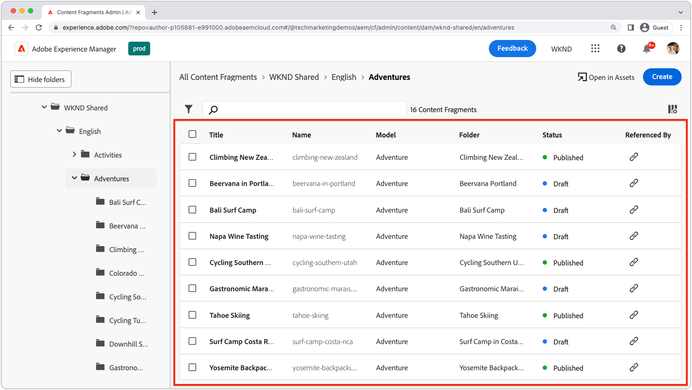
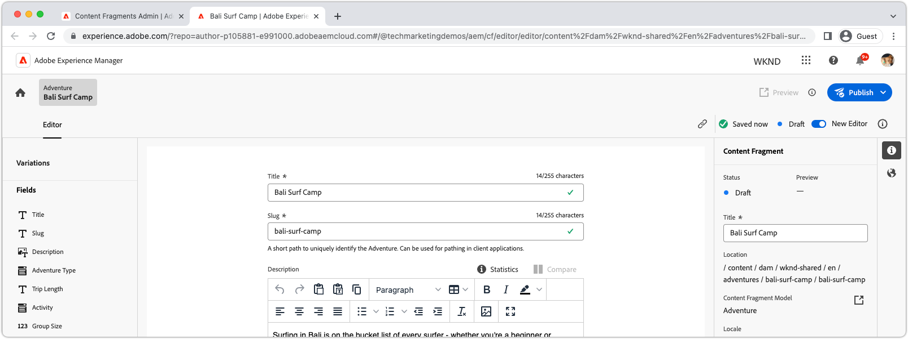
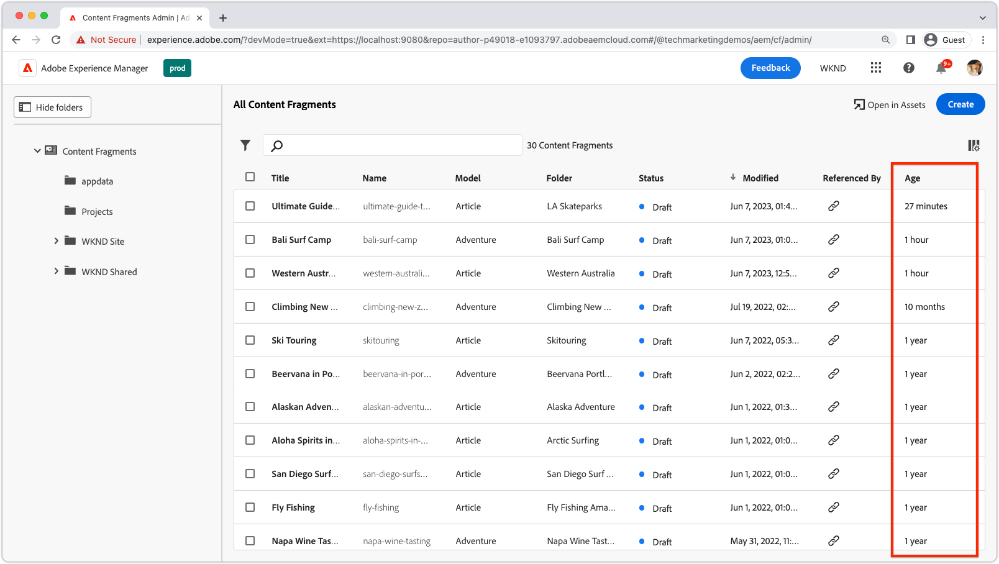

# Uitbreidbaarheid AEM inhoudfragmenten

AEM de UI van de Fragmenten van de Inhoud is een krachtige verlengbare UI voor het beheren van het creëren van, het beheren van, en het uitgeven van de Fragmenten van de Inhoud. Er zijn verschillende extensiepunten beschikbaar waarmee u de interface naar wens kunt aanpassen. Verschillende extensiepunten zijn beschikbaar op basis van de interface die u uitbreidt.

## Extensiepunten van de console van inhoudsfragmenten

De Content Fragment Console in AEM (Adobe Experience Manager) is een gebruikersinterface die een gecentraliseerde locatie biedt voor het beheren en ordenen van inhoudsfragmenten. Het biedt een uitgebreide reeks hulpmiddelen en eigenschappen aan om inhoudsfragmenten tot stand te brengen, uit te geven, te publiceren en te volgen, die gebruikers machtigen om gestructureerde inhoud over diverse kanalen en touchpoints efficiënt te beheren.

[Console AEM inhoudsfragmenten](https://experienceleague.adobe.com/docs/experience-manager-cloud-service/content/sites/administering/content-fragments/content-fragments-console.html) is de uitbreidbare interface voor het weergeven en beheren van inhoudsfragmenten. [AEM extensies van Content Fragment Console worden gemaakt](https://developer.adobe.com/uix/docs/services/aem-cf-console-admin/code-generation) met de `@adobe/aem-cf-admin-ui-ext-tpl` App Builder-sjabloon.

De volgende extensiepunten voor de Content Fragments Console zijn beschikbaar:

      

        

          

            <figure class="image is-16by9">
              
            </figure>
          

          

            

              
<a href="https://developer.adobe.com/uix/docs/services/aem-cf-console-admin/api/action-bar/" title="Actiebalk" target="_blank" rel="referrer">Actiebalk</a>

              
Pas handelingen aan wanneer een of meer inhoudsfragmenten zijn geselecteerd.

              <a href="https://developer.adobe.com/uix/docs/services/aem-cf-console-admin/api/action-bar/" class="spectrum-Button spectrum-Button--outline spectrum-Button--primary spectrum-Button--sizeM" target="_blank" rel="referrer">
                De documenten weergeven
              </a>
            

          

        

      

  

    

      

        <figure class="image is-16by9">
          
        </figure>
      

      

        

          
<a href="https://developer.adobe.com/uix/docs/services/aem-cf-console-admin/api/grid-columns/" title="Rasterkolommen" target="_blank" rel="referrer">Rasterkolommen</a>

          
Pas de gegevens aan die in de lijst Inhoudsfragmenten worden weergegeven.

          <a href="https://developer.adobe.com/uix/docs/services/aem-cf-console-admin/api/grid-columns/" class="spectrum-Button spectrum-Button--outline spectrum-Button--primary spectrum-Button--sizeM" target="_blank" rel="referrer">
            De documenten weergeven
          </a>
        

      

    

  

  

    

      

        <figure class="image is-16by9">
          
        </figure>
      

      

        

          
<a href="https://developer.adobe.com/uix/docs/services/aem-cf-console-admin/api/header-menu/" title="Menu Koptekst" target="_blank" rel="referrer">Menu Koptekst</a>

          
Pas handelingen aan wanneer er geen inhoudsfragmenten zijn geselecteerd.

          <a href="https://developer.adobe.com/uix/docs/services/aem-cf-console-admin/api/header-menu/" class="spectrum-Button spectrum-Button--outline spectrum-Button--primary spectrum-Button--sizeM" target="_blank" rel="referrer">
            De documenten weergeven
          </a>
        

      

    

  
  

## Extensiepunten van de Inhoudsfragmenteditor

De Content Fragment Editor in AEM (Adobe Experience Manager) is een gebruikersinterfacecomponent waarmee gebruikers inhoudsfragmenten kunnen maken, bewerken en beheren. Het biedt een visueel intuïtieve en gebruiksvriendelijke omgeving voor het werken met gestructureerde inhoud, waarmee gebruikers inhoudselementen kunnen definiëren en indelen, sjablonen kunnen toepassen, variaties kunnen beheren en een voorvertoning kunnen weergeven van de inhoud die op verschillende kanalen wordt weergegeven. De Inhoudsfragmenteditor stroomlijnt het proces van het maken van herbruikbare en modulaire inhoud die eenvoudig kan worden gedistribueerd en gepubliceerd over meerdere digitale ervaringen.

AEM de Inhoudsfragmenteditor is de uitbreidbare UI voor het bewerken van inhoudsfragmenten. [AEM extensies van de Content Fragment Editor worden gemaakt](https://developer.adobe.com/uix/docs/services/aem-cf-editor/code-generation/) met de `@adobe/aem-cf-editor-ui-ext-tpl` App Builder-sjabloon.

De volgende extensiepunten van de Content Fragments Editor zijn beschikbaar:

    

      

        

          <figure class="image is-16by9">
            
          </figure>
        

        

          

            
<a href="https://developer.adobe.com/uix/docs/services/aem-cf-editor/api/header-menu/" title="Menu Koptekst" target="_blank" rel="referrer">Menu Koptekst</a>

            
Pas handelingen aan in het koptekstmenu van de Content Fragment Editor.

            <a href="https://developer.adobe.com/uix/docs/services/aem-cf-editor/api/header-menu" class="spectrum-Button spectrum-Button--outline spectrum-Button--primary spectrum-Button--sizeM" target="_blank" rel="referrer">
              De documenten weergeven
            </a>
          

        

      

    

  

    

      

        <figure class="image is-16by9">
          
        </figure>
      

      

        

          
<a href="https://developer.adobe.com/uix/docs/services/aem-cf-editor/api/rte-toolbar/" title="Rich Text Editor, werkbalk"  target="_blank" rel="referrer">Rich Text Editor, werkbalk</a>

          
Voeg een aangepaste knop toe aan de Rich Text Editor (RTE) van de Content Fragment Editor.

          <a href="https://developer.adobe.com/uix/docs/services/aem-cf-editor/api/rte-toolbar/" class="spectrum-Button spectrum-Button--outline spectrum-Button--primary spectrum-Button--sizeM" target="_blank" rel="referrer">
            De documenten weergeven
          </a>
        

      

    

  

    

      

        <figure class="image is-16by9">
          
        </figure>
      

      

        

          
<a href="https://developer.adobe.com/uix/docs/services/aem-cf-editor/api/rte-widgets/" title="Widgets van Rich Text Editor" target="_blank" rel="referrer">Widgets van Rich Text Editor</a>

          
Pas acties in RTE aan die aan aanslagen worden gebonden.

          <a href="https://developer.adobe.com/uix/docs/services/aem-cf-editor/api/rte-widgets/" class="spectrum-Button spectrum-Button--outline spectrum-Button--primary spectrum-Button--sizeM" target="_blank" rel="referrer">
            De documenten weergeven
          </a>
        

      

    

  

  

    

      

        <figure class="image is-16by9">
          
        </figure>
      

      

        

          
<a href="https://developer.adobe.com/uix/docs/services/aem-cf-editor/api/rte-badges/ " title="Badges Rich Text Editor" target="_blank" rel="referrer">Badges Rich Text Editor</a>

          
Pas niet-bewerkbare gestileerde blokken aan in RTE.

          <a href="https://developer.adobe.com/uix/docs/services/aem-cf-editor/api/rte-badges/" class="spectrum-Button spectrum-Button--outline spectrum-Button--primary spectrum-Button--sizeM" target="_blank" rel="referrer">
            De documenten weergeven
          </a>
        

      

    

  

## Voorbeelden van extensies

Welkom bij een verzameling AEM voorbeelden van UI-uitbreidingscodes! Deze bron is ontworpen om u praktische demonstraties en inzichten te bieden bij het uitbreiden van de Adobe Experience Manager-gebruikersinterface (AEM). Of u nu een ontwikkelaar bent die de functionaliteit van AEM wil verbeteren, deze codevoorbeelden dienen als waardevolle referentie.

  

    

      

        <figure class="image is-16by9">
          
        </figure>
      

      

        

          
<a href="./examples/console-bulk-property-update.md" title="Bulkeigenschap bijwerken">Bulk Content Fragment property update</a>

          
Een uitbreiding van de actiebalk van de inhoudsfragmentconsole met modale en Adobe I/O Runtime-actie.

          <a href="./examples/console-bulk-property-update.md" class="spectrum-Button spectrum-Button--outline spectrum-Button--primary spectrum-Button--sizeM">
            Het voorbeeld weergeven
          </a>
        

      

    

  

  

        

            

                <figure class="image is-16by9">
                    
                </figure>
            

            

                

                    
<a href="./examples/console-image-generation-and-image-upload.md" title="Op OpenAI gebaseerde afbeelding genereren en uploaden naar AEM extensie">OpenAPI-afbeelding genereren</a>

                    
Onderzoek een uitbreiding van de voorbeeldactie die een beeld gebruikend OpenAI produceert, uploadt het aan AEM en werkt beeldbezit op het geselecteerde Inhoudsfragment bij.

                    <a href="./examples/console-image-generation-and-image-upload.md" class="spectrum-Button spectrum-Button--outline spectrum-Button--primary spectrum-Button--sizeM">
                        Het voorbeeld weergeven
                    </a>
                

            

        

    
    
  

    

      

        <figure class="image is-16by9">
          
        </figure>
      

      

        

          
<a href="./examples/custom-grid-columns.md" title="Aangepaste kolommen">Aangepaste kolommen</a>

          
Voeg een aangepaste kolom toe aan de Content Fragment Console.

          <a href="./examples/custom-grid-columns.md" class="spectrum-Button spectrum-Button--outline spectrum-Button--primary spectrum-Button--sizeM">
            Het voorbeeld weergeven
          </a>
        

      

    

  
    
  

    

      

        <figure class="image is-16by9">
          
        </figure>
      

      

        

          
<a href="./examples/editor-export-to-xml.md" title="Exporteren naar XML">Exporteren naar XML</a>

          
Exporteer een inhoudsfragment als XML uit de Inhoudsfragmenteditor.

          <a href="./examples/editor-export-to-xml.md" class="spectrum-Button spectrum-Button--outline spectrum-Button--primary spectrum-Button--sizeM">
            Het voorbeeld weergeven
          </a>
        

      

    

  
    
  

    

      

        <figure class="image is-16by9">
          
        </figure>
      

      

        

          
<a href="./examples/editor-rte-toolbar.md" title="Rich Text Editor, werkbalkknop">Rich Text Editor, werkbalkknop</a>

          
Voeg aangepaste werkbalkknoppen toe aan RTE-velden in de Inhoudsfragmenteditor.

          <a href="./examples/editor-rte-toolbar.md" class="spectrum-Button spectrum-Button--outline spectrum-Button--primary spectrum-Button--sizeM">
            Het voorbeeld weergeven
          </a>
        

      

    

  
   

